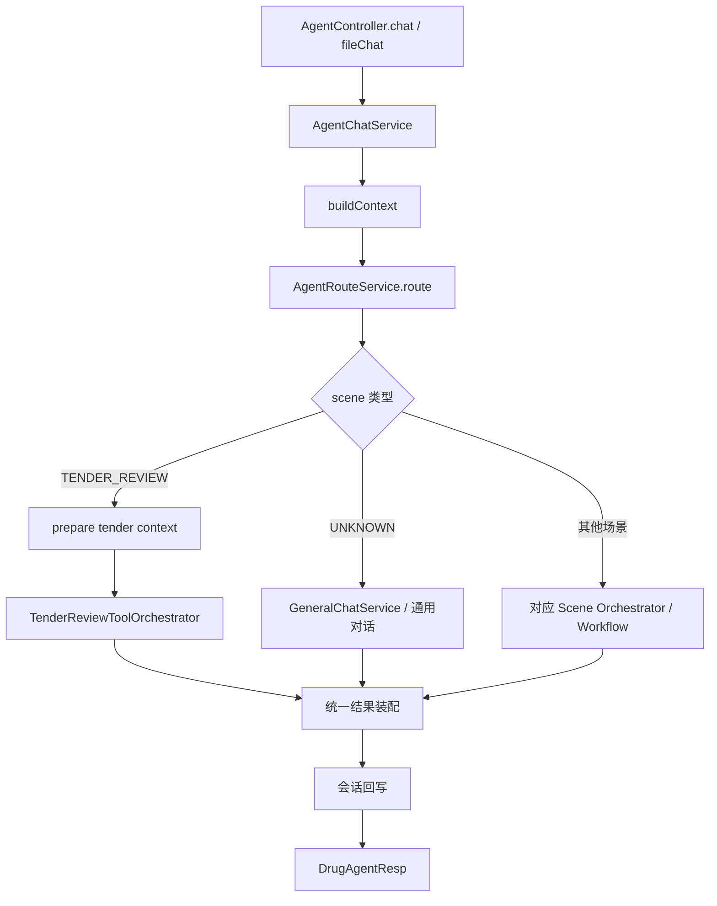
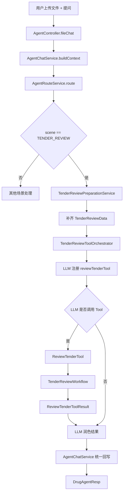

# AgentChatService 重构设计

> 文档版本：v1.0
> 更新时间：2026-03-26
> 适用范围：Drug-Agent 上层通用 Agent、标书审查 Tool 化链路、后续多场景扩展

## 1. 文档目标

本文档用于明确 `AgentChatService` 在上层通用 Agent 中的领域定位、职责边界、标准流程和重构方向，作为后续你开发和收敛代码的直接依据。

本文档基于我们已确认的目标链路：

```text
用户输入“帮我看看这两份标书是否有围标风险”
-> AgentController 接收请求
-> AgentChatService 构建上下文
-> AgentRouteService 判定 scene = TENDER_REVIEW
-> 若有上传文件，先沿用当前上传与解析准备逻辑，补齐 TenderReviewData
-> AgentChatService 不直接 executeWorkflow，而是进入 TenderReviewToolOrchestrator
-> Orchestrator 注册 reviewTenderTool 给 LLM
-> LLM 根据用户问题决定是否调用 reviewTenderTool
-> reviewTenderTool(request) 被调用
-> Tool 内部调用 TenderReviewWorkflow
-> Workflow 执行：
   文档解析 -> 结构化提取 -> 规则命中 -> 豁免处理 -> 风险融合 -> 证据组装 -> 报告生成
-> Tool 返回结构化结果 ReviewTenderToolResult
-> LLM 将结果整理成用户可读回复
-> AgentChatService 将最终 answer + report + evidence 返回给前端
```

---

## 2. 设计结论

### 2.1 核心结论

`AgentChatService` 的定位应当是“上层会话编排服务”，而不是“具体业务执行器”。

它的职责是：

1. 面向前端接住一次对话请求
2. 把请求整理成统一上下文
3. 驱动路由、场景分发、降级和结果回写
4. 将后端复杂执行链路包装成前端可消费的统一响应

它不应该承担：

1. 具体场景规则判断
2. 场景专属数据建模细节
3. 工作流内部执行细节
4. Prompt 与 Tool 的细节实现
5. 大量场景专属前置处理逻辑

### 2.2 一句话定义

`AgentChatService = 前端对话接入 + 上下文构建 + 路由分发 + 执行协调 + 统一回写`

---

## 3. 领域定位与边界

### 3.1 所属层级

`AgentChatService` 属于应用层（Application Layer），位于：

- Controller 之后
- RouteService / Orchestrator / Workflow 之前

它的主要价值不是做“分析”，而是做“编排”。

### 3.2 边界划分

| 模块 | 负责什么 | 不负责什么 |
|---|---|---|
| `AgentController` | 接 HTTP 请求、做基础参数接收、返回结果 | 业务编排、路由、工作流执行 |
| `AgentChatService` | 构建上下文、驱动主流程、统一降级与回写 | 场景规则、Tool 细节、Workflow 细节 |
| `AgentRouteService` | 判断场景、返回路由决策 | 执行工作流、输出最终业务结论 |
| `TenderReviewToolOrchestrator` | 标书场景下的 Tool 调用编排 | HTTP 接入、通用会话管理 |
| `ReviewTenderTool` | 工具执行入口、参数校验、调用 Workflow | 前端响应组装、通用路由 |
| `TenderReviewWorkflow` | 标书审查业务执行主链路 | Controller 接入、会话回写、路由判断 |

### 3.3 设计原则

- 上层只做编排，不做重业务
- 通用能力上收，场景能力下沉
- 一次请求只允许一个主执行入口
- 对前端统一返回 `DrugAgentResp`
- 结果中必须尽量保留 `summary`、`answer`、`report`、`evidence`

---

## 4. AgentChatService 应具备的最小功能集

为避免冗余，`AgentChatService` 应只保留以下五类能力。

### 4.1 请求接入与上下文初始化

输入：

- `AgentChatReq`
- `FileChatReq`

输出：

- `AgentChatContext`

职责：

- 生成 `traceId`
- 统一 `sessionId`
- 统一 `metadata`
- 将前端传入请求转换成内部标准执行上下文

### 4.2 标准主流程编排

标准流程固定为：

`构建上下文 -> 场景路由 -> 场景分发 -> 结果回写 -> 响应返回`

这条主流程必须收敛在 `AgentChatService`，避免 Controller、Workflow、Tool 各自再拼装一条流程。

### 4.3 场景分发协调

`AgentChatService` 只负责判断“这个请求接下来交给谁”：

- 标书审查：交给 `TenderReviewToolOrchestrator`
- 合同预审：交给对应场景编排器或 workflow
- 风险预警：交给对应场景编排器或 workflow
- 通用问答：交给 general chat

注意：

`AgentChatService` 只做分发，不做业务内部实现。

### 4.4 降级与异常处理

它应统一负责：

- 路由失败时的降级
- 场景执行异常时的降级
- 未识别场景时的兜底
- 统一输出可理解的错误响应

### 4.5 前端响应统一装配

它需要对下游执行结果做统一整理，确保前端拿到的是稳定结构：

- `traceId`
- `scene`
- `routeReason`
- `routeSource`
- `confidence`
- `summary`
- `answer`
- `riskLevel`
- `score`
- `report`
- `evidenceList`
- `evidenceGroups`
- `steps`

---

## 5. AgentChatService 不应该具备的功能

以下能力不应长期保留在 `AgentChatService` 中。

### 5.1 场景专属数据装配

例如：

- `hydrateTenderMetadata(...)`
- `TenderReviewData` 的构建
- 文档解析结果聚合

这些应拆到专门的场景 preparation service 中。

### 5.2 Tool 注册与 Tool 调用细节

例如：

- `reviewTenderTool` 的 schema
- LLM tool call 交互细节
- Tool 参数映射

这些应由 `TenderReviewToolOrchestrator` 负责。

### 5.3 Workflow 内部业务逻辑

例如：

- 规则命中
- 豁免处理
- 风险融合
- 报告生成

这些只能留在 `TenderReviewWorkflow` 或其下游领域服务中。

### 5.4 基础设施细节

例如：

- 具体数据库操作
- 文件字节流处理细节
- Spring AI Prompt 细节

这些不应在 `AgentChatService` 中继续扩散。

---

## 6. 目标流程设计

## 6.1 同步对话标准流程



## 6.2 标书审查场景细化流程



---

## 7. 推荐的模块拆分

为了让 `AgentChatService` 不冗余，建议拆成以下协作模块。

### 7.1 `AgentChatService`

保留职责：

- `chat(req)`
- `fileChat(req)`
- `streamChat(req)`
- 构建上下文
- 调用路由
- 根据 scene 调度下游执行器
- 统一回写响应

### 7.2 `AgentSceneDispatcher`

职责：

- 根据 `WorkflowRouteDecision` 选择正确执行器
- 把通用主流程中的“分发逻辑”从 `AgentChatService` 拆出

建议职责：

- `dispatch(context, decision, request)`

### 7.3 `TenderReviewPreparationService`

职责：

- 文件上传场景下构建 `TenderReviewData`
- 创建 case
- 存储文件内容
- 解析文档
- 组织 compare scopes

### 7.4 `TenderReviewToolOrchestrator`

职责：

- 注册 `reviewTenderTool`
- 向 LLM 提供工具调用上下文
- 接受工具执行结果
- 调用 LLM 整理最终回复
- 输出统一结果对象

### 7.5 `AgentResponseAssembler`

职责：

- 将 workflow / orchestrator 输出统一转成 `DrugAgentResp`
- 统一整理：
  - `summary`
  - `answer`
  - `report`
  - `evidence`
  - `steps`

### 7.6 `AgentSessionFacade`

职责：

- 获取或创建 session
- 用户消息落库
- assistant 消息落库
- 会话标题更新

这样可以避免 `AgentChatService` 既做流程编排又直接处理会话细节。

---

## 8. AgentChatService 目标方法设计

建议最终收敛为如下结构：

```java
public class AgentChatService {

    public DrugAgentResp chat(AgentChatReq req);

    public DrugAgentResp fileChat(FileChatReq req);

    public SseEmitter streamChat(AgentChatReq req);

    private AgentChatContext buildContext(AgentChatReq req);

    private WorkflowRouteDecision route(AgentChatReq req, AgentChatContext context);

    private AgentExecutionResult dispatch(
            AgentChatContext context,
            WorkflowRouteDecision decision,
            AgentChatReq req
    );

    private DrugAgentResp finalizeResponse(
            AgentExecutionResult executionResult,
            AgentChatContext context,
            WorkflowRouteDecision decision
    );

    private DrugAgentResp fallback(
            AgentChatReq req,
            AgentChatContext context,
            Exception exception
    );
}
```

说明：

- `chat/fileChat/streamChat` 是入口
- `buildContext/route/dispatch/finalizeResponse/fallback` 是应用层标准动作
- 不再在这个类里直接堆叠场景专属逻辑

---

## 9. 与当前代码的主要差异

当前代码中 `AgentChatService` 仍然存在以下偏重问题：

1. 同时承担通用 chat 和文件上传数据准备
2. 直接包含标书场景的专属数据装配逻辑
3. 文件上传链路中同时负责：
   - 会话管理
   - 文件信息组织
   - metadata 拼装
   - 场景前置处理
   - workflow 执行
   - assistant 消息落库
4. 标书场景尚未切到 `TenderReviewToolOrchestrator`

目标状态应变为：

1. `AgentChatService` 只负责编排
2. 标书场景进入 `TenderReviewToolOrchestrator`
3. Tool 调用链成为标书场景的主执行入口
4. `TenderReviewWorkflow` 作为确定性业务引擎继续复用

---

## 10. 推荐开发顺序

建议按以下顺序落地，风险最低。

### 第一步：稳定 AgentChatService 边界

- 保留 `chat/fileChat/streamChat`
- 把上下文构建、路由、分发、回写的主流程固定下来
- 不再继续向 `AgentChatService` 增加场景专属逻辑

### 第二步：抽出标书准备服务

- 新增 `TenderReviewPreparationService`
- 将当前 `hydrateTenderMetadata(...)` 相关逻辑迁移过去

### 第三步：接入 Tool Orchestrator

- 在 `scene == TENDER_REVIEW` 分支中不再直接进入 workflow
- 改为交给 `TenderReviewToolOrchestrator`

### 第四步：统一响应装配

- 将 `WorkflowResult -> DrugAgentResp`
- `ReviewTenderToolResult -> DrugAgentResp`
- `GeneralChat -> DrugAgentResp`

统一收敛到响应装配器中

### 第五步：为其他场景提供同构编排方式

- 合同预审接入 `ContractPrecheckOrchestrator`
- 风险预警接入 `RiskAlertOrchestrator`

从而让 `AgentChatService` 对所有场景只保留一套主流程。

---

## 11. 最终结论

`AgentChatService` 的正确定位，不是“什么都做的总服务”，而是“前端会话请求的统一应用编排器”。

它应长期只具备五类核心能力：

1. 统一接入
2. 统一上下文构建
3. 统一路由分发
4. 统一降级处理
5. 统一结果回写

凡是只对单一场景成立的能力，都不应继续放在 `AgentChatService` 中。

因此，后续开发建议明确为：

- `AgentChatService` 留在上层，做编排
- `TenderReviewToolOrchestrator` 成为标书场景主入口
- `ReviewTenderTool` 成为工具执行载体
- `TenderReviewWorkflow` 成为确定性业务执行引擎

这才是符合领域边界、流程规范和后续扩展性的设计。
