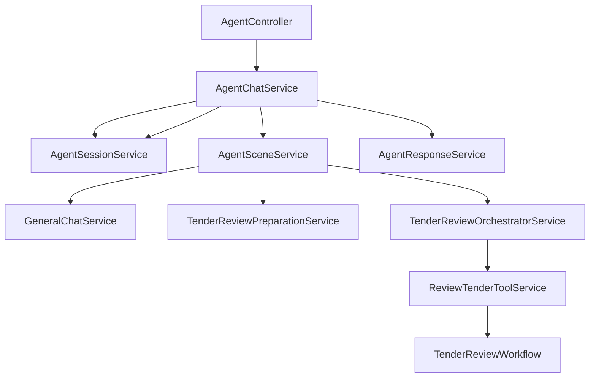

# Agent 层技术设计

> 文档版本：v1.0
> 更新时间：2026-03-26
> 适用范围：Drug-Agent 上层通用 Agent 编排层

## 1. 文档目标

本文档用于明确 Drug-Agent 中“Agent 层”的服务划分、职责边界、命名规范和主流程关系，作为后续重构与开发的统一依据。

本文档只讨论上层 Agent 编排，不展开各具体业务场景内部的规则细节。

---

## 2. 设计原则

### 2.1 服务命名规范

Agent 层服务统一使用 `*Service` 尾缀，不再引入 `Dispatcher`、`Manager` 等并行概念。

例如：

- `AgentChatService`
- `AgentSessionService`
- `AgentSceneService`
- `GeneralChatService`
- `TenderReviewPreparationService`
- `TenderReviewOrchestratorService`

### 2.2 分层原则

- `AgentChatService` 负责总编排
- `AgentSessionService` 负责会话与记忆
- `AgentSceneService` 负责场景判断与分发
- 场景专属 Service 负责单一场景的准备或编排
- Workflow 负责确定性业务执行

### 2.3 非目标

以下内容不应放在 Agent 层：

- 具体场景规则命中逻辑
- 具体文档解析算法
- 具体风险评分逻辑
- 与前端强耦合的展示拼装逻辑

---

## 3. Agent 层目标职责

Agent 层的目标是：

1. 接住一次前端对话请求
2. 读取会话上下文
3. 构建本轮执行上下文
4. 判断当前属于哪个场景
5. 分发给对应场景执行器
6. 汇总执行结果
7. 回写消息、摘要、会话状态
8. 返回统一响应给前端

一句话总结：

`Agent 层 = 对话接入 + 上下文管理 + 场景分发 + 统一回写`

---

## 4. Service 清单

## 4.1 AgentChatService

### 使命

作为上层统一对话编排入口，负责一次完整 Agent 对话请求的主流程协调。

### 核心职责

1. 接收普通对话或文件对话请求
2. 调用 `AgentSessionService` 读取会话上下文
3. 构建本轮 `AgentChatContext`
4. 调用 `AgentSceneService` 识别并处理场景
5. 调用 `AgentResponseService` 装配统一响应
6. 回写本轮消息与会话摘要
7. 统一降级与异常处理

### 不负责

- 具体场景判断规则
- 场景内部执行细节
- Tool schema 设计
- Workflow 具体逻辑

---

## 4.2 AgentSessionService

### 使命

负责会话生命周期管理、多轮消息存储与会话记忆抽象。

### 核心职责

1. 会话 CRUD
2. 消息存储与查询
3. 获取或创建会话
4. 加载会话上下文
5. 保存用户消息、助手消息、系统消息
6. 维护会话摘要 summary
7. 必要时更新会话标题
8. 记录本轮执行元信息

### 关键说明

会话保存的是“全量事实记录”，不是每次都发给模型的完整上下文。

模型上下文应来自：

1. 最近消息窗口
2. 会话摘要
3. 当前请求
4. 当前场景必要结构化数据

### 不负责

- 场景判断
- 工作流执行
- Tool 调用

---

## 4.3 AgentSceneService

### 使命

统一负责“判断当前场景”以及“将请求分发给对应场景执行器”。

### 核心职责

1. 基于 query、sceneHint、文件、上下文判断场景
2. 返回 `WorkflowRouteDecision`
3. 根据 scene 选择对应场景执行器
4. 返回统一 `AgentExecutionResult`

### 为什么要合并

原来的“路由判断”和“场景分发”是同一条职责链的前后两段，分成两个 service 在当前项目规模下收益不高，反而增加理解成本。

合并后的收益：

1. `AgentChatService` 更轻
2. 调用链更短
3. 场景入口更统一

### 不负责

- 最终响应装配
- 消息持久化
- Workflow 内部业务执行

---

## 4.4 AgentResponseService

### 使命

统一将下游执行结果转换为前端可消费的 `AgentChatResp`。

### 核心职责

1. 将 `AgentExecutionResult` 转换为 `AgentChatResp`
2. 填充 `traceId`、`scene`、`routeReason`、`confidence`
3. 整理 `summary`、`answer`、`report`、`evidence`
4. 为失败或降级结果提供统一响应结构

### 不负责

- 路由
- 场景执行
- 会话管理

---

## 4.5 GeneralChatService

### 使命

负责未命中特定业务场景时的通用对话执行。

### 核心职责

1. 接收通用问题
2. 基于模型能力完成普通问答
3. 返回统一 `AgentExecutionResult`

### 不负责

- 业务场景判断
- 会话管理

---

## 4.6 TenderReviewPreparationService

### 使命

负责标书审查场景下的文件接入和结构化数据准备。

### 核心职责

1. 校验文件
2. 创建 case
3. 保存文件内容
4. 调用解析服务
5. 组装 `TenderReviewData`
6. 将结果挂入上下文

### 不负责

- 对外对话编排
- Tool 调用
- Workflow 规则执行

---

## 4.7 TenderReviewOrchestratorService

### 使命

负责标书审查场景下的上层执行编排，承担“LLM + Tool + 结构化结果整理”的职责。

### 核心职责

1. 接收 `TENDER_REVIEW` 场景请求
2. 注册 `reviewTenderTool`
3. 驱动 LLM 判断是否需要调用 Tool
4. 接收 `ReviewTenderToolResult`
5. 调用 LLM 生成用户友好回复
6. 返回统一 `AgentExecutionResult`

### 不负责

- HTTP 接入
- 通用会话管理
- Workflow 内部规则执行

---

## 4.8 ReviewTenderToolService

### 使命

作为 Tool 执行入口，负责承接 LLM 的工具调用请求。

### 核心职责

1. 参数校验
2. 整理工具请求对象
3. 调用 `TenderReviewWorkflow`
4. 返回结构化 `ReviewTenderToolResult`

### 不负责

- 场景路由
- 前端响应装配
- 通用消息回写

---

## 5. Service 之间的关系

## 5.1 主链路



## 5.2 标准同步对话流程

```text
AgentController
-> AgentChatService
-> AgentSessionService.loadSessionContext
-> AgentChatService.buildContext
-> AgentSceneService.decideAndExecute
-> GeneralChatService 或 场景 OrchestratorService
-> AgentChatService 回写消息与摘要
-> AgentResponseService 组装响应
-> 返回 AgentChatResp
```

## 5.3 标书审查场景流程

```text
AgentController
-> AgentChatService
-> AgentSessionService.loadSessionContext
-> AgentChatService.buildContext
-> AgentSceneService
-> scene = TENDER_REVIEW
-> TenderReviewPreparationService
-> TenderReviewOrchestratorService
-> ReviewTenderToolService
-> TenderReviewWorkflow
-> ReviewTenderToolResult
-> TenderReviewOrchestratorService 整理自然语言结果
-> AgentChatService 回写会话
-> AgentResponseService 组装 AgentChatResp
```

---

## 6. 上下文与记忆方案

## 6.1 结论

会话里应该保留全量消息记录，但模型执行时不能每次都携带全量历史。

推荐方案是：

1. 全量历史存数据库
2. 模型侧只使用：
   - 最近消息窗口
   - 会话摘要
   - 当前请求
   - 当前场景必要结构化数据

## 6.2 推荐记忆分层

### A. 会话事实层

由 `AgentSessionService` 管理：

- `ChatSession`
- `ChatMessage`

作用：

- 回放
- 审计
- 排查
- 前端展示

### B. 执行上下文层

由 `AgentChatService` 构建：

- 本轮 query
- 最近消息窗口
- 当前 summary
- metadata
- sceneHint

### C. 模型记忆层

结合 Spring AI 能力使用：

- `MessageChatMemoryAdvisor`
- `PromptChatMemoryAdvisor`
- 需要长期语义召回时可接入向量记忆

注意：

不要让 Spring AI memory 替代业务会话存储。

---

## 7. 推荐方法形态

## 7.1 AgentChatService

建议核心方法：

```java
public interface AgentChatService {
    AgentChatResp chat(AgentChatReq req);
}
```

建议内部流程：

```java
loadSessionContext
-> buildContext
-> sceneService.decideAndExecute
-> persistConversation
-> responseService.buildResponse
```

## 7.2 AgentSessionService

建议核心方法：

```java
ChatSession getOrCreateSession(String sessionId, String userId, SceneEnum scene);
AgentSessionContext loadSessionContext(String sessionId);
void saveUserMessage(String sessionId, String content, String metadata);
void saveAssistantMessage(String sessionId, String content, String metadata, String type);
void updateSessionSummary(String sessionId, String summary);
void updateSessionTitleIfNeeded(String sessionId, String query);
```

## 7.3 AgentSceneService

建议核心方法：

```java
AgentSceneExecution decideAndExecute(AgentChatContext context, AgentChatReq req);
```

其中 `AgentSceneExecution` 建议包含：

- `WorkflowRouteDecision decision`
- `AgentExecutionResult executionResult`

## 7.4 AgentResponseService

建议核心方法：

```java
AgentChatResp buildResponse(
    AgentChatContext context,
    WorkflowRouteDecision decision,
    AgentExecutionResult result
);
```

---

## 8. 当前重构建议

按优先级建议如下：

1. 将 `AgentRouteService` 与 `AgentSceneDispatcher` 合并为 `AgentSceneService`
2. 将 `AgentResponseAssembler` 统一收敛为 `AgentResponseService`
3. 明确 `AgentSessionService` 只负责会话与记忆
4. 标书场景统一进入 `TenderReviewOrchestratorService`
5. `ReviewTenderToolService` 作为 Tool 执行入口

---

## 9. 结论

Agent 层应当围绕以下 4 个核心 Service 建立稳定主链路：

1. `AgentChatService`
2. `AgentSessionService`
3. `AgentSceneService`
4. `AgentResponseService`

其余场景 Service 均作为场景能力扩展挂接在 `AgentSceneService` 之后。

最终结构应达到的目标是：

- 职责清晰
- 会话与场景解耦
- 场景扩展可插拔
- 结果结构统一
- 对话流程稳定
