# RAG 通用知识库 技术设计文档

> 文档版本：V1.0
> 创建日期：2026-04-17
> 状态：草稿
> 基于需求文档：RAG通用知识库_PRD_20260417.md

---

## 1. 技术分析

### 1.1 领域理解

| 领域概念 | 说明 |
|----------|------|
| **知识库** | 存储通用知识（药品名称、法规制度、审查标准、历史案例）的向量数据库 |
| **Chunk** | 文档切分后的最小检索单元，包含文本内容和元数据 |
| **Citation** | 检索返回的引用信息，包含来源、片段和相关性分数 |
| **场景 Workflow** | 业务场景执行引擎，按需调用 RAG 获取知识增强 |

### 1.2 技术选型

| 组件 | 选型 | 理由 |
|------|------|------|
| 向量数据库 | PGVector | 已集成，支持向量检索和过滤 |
| Embedding 服务 | 百炼 text-embedding-v3 | 已集成，支持 1024 维向量 |
| Rerank 服务 | 百炼 DashScopeRerank | 已集成，支持 relevance + diversity 重排 |
| 文件存储 | COS（Tencent） | 已集成，支持 MD/PDF 存储 |
| Markdown 解析 | 自主解析 | 已实现 TextExtractor |
| PDF 解析 | PdfTextExtractor | 后期支持，P2 |

### 1.3 当前架构问题

| 问题编号 | 问题描述 | 严重程度 | 修复方案 |
|----------|----------|----------|----------|
| A1 | AgentSceneService 直接持有 KnowledgeRetrievalTool，越层调用 | 高 | 移除场景层对 RAG 基础设施的直接依赖 |
| A2 | RAG 检索时 scene 参数传 null，全库裸搜 | 高 | Workflow 调用时正确传递 scene 参数 |
| A3 | TenderReviewWorkflow 无 RAG 调用 | 高 | 在 Workflow 内部按需检索法规知识 |
| A4 | EvidenceItem 和 RagCitation 模型重复 | 中 | 统一数据模型 |

---

## 2. 模块设计

### 2.1 模块划分

| 模块名称 | 职责 | 边界 | 依赖模块 |
|----------|------|------|----------|
| **KnowledgeController** | 知识库管理 HTTP 接口 | 只负责接收文件上传/列表/删除请求，不处理业务逻辑 | KnowledgeManagementService |
| **KnowledgeManagementService** | 知识库管理业务逻辑 | 文件导入、解析、入库、删除的编排 | IngestService, RagFileService, CosStorageService |
| **KnowledgeRetrievalTool** | RAG 统一入口 | 供场景 Workflow 按需调用，返回标准化结果 | RagService |
| **RagService** | RAG 核心检索服务 | 向量检索、混合检索、重排、LLM 生成 | VectorStore, EmbeddingService, HybridSearchService, RerankService, LlmService |
| **IngestService** | 文档入库服务 | 文本提取、chunk 切分、embedding 生成、向量存储 | TextExtractor, Chunker, EmbeddingService, VectorStore |
| **TextExtractor** | 文本提取器 | 从 MD/PDF 提取纯文本 | - |
| **Chunker** | Chunk 切分器 | 按章节/段落边界切分文档 | - |
| **EmbeddingService** | 向量化服务 | 调用百炼 API 生成向量 | 百炼 text-embedding-v3 |
| **HybridSearchService** | 混合检索服务 | BM25 + 向量分数融合 | - |
| **RerankService** | 重排服务 | relevance + diversity 重排 | 百炼 DashScopeRerank |

### 2.2 模块关系图

```
┌─────────────────────────────────────────────────────────────────────────────┐
│                          知识库管理侧（新增/修改）                             │
├─────────────────────────────────────────────────────────────────────────────┤
│                                                                              │
│  ┌────────────────────┐         ┌─────────────────────────┐                 │
│  │ KnowledgeController │  ───▶  │ KnowledgeManagementService│                │
│  │  （HTTP接口）       │         │  （业务编排）            │                 │
│  └────────────────────┘         └───────────┬─────────────┘                 │
│                                                │                             │
│                     ┌──────────────────────────┼──────────────────────────┐   │
│                     │                          │                          │   │
│                     ▼                          ▼                          ▼   │
│           ┌─────────────────┐       ┌─────────────────┐      ┌─────────────┐│
│           │  IngestService  │       │  RagFileService  │      │CosStorageSvc││
│           │   （文档入库）   │       │   （文件元数据）  │      │ （文件存储） ││
│           └────────┬────────┘       └────────┬────────┘      └─────────────┘│
│                    │                         │                             │
│                    ▼                         ▼                             │
│           ┌─────────────────┐       ┌─────────────────┐                     │
│           │    VectorStore   │       │   RagFileMapper  │                     │
│           │   （PGVector）   │       │    （MySQL）     │                     │
│           └─────────────────┘       └─────────────────┘                     │
│                                                                              │
└─────────────────────────────────────────────────────────────────────────────┘

┌─────────────────────────────────────────────────────────────────────────────┐
│                          知识检索侧（复用已有）                               │
├─────────────────────────────────────────────────────────────────────────────┤
│                                                                              │
│  ┌────────────────────┐                                                     │
│  │KnowledgeRetrievalTool│  ◀── 场景 Workflow 按需调用                        │
│  │    （RAG统一入口）    │                                                   │
│  └──────────┬──────────┘                                                     │
│             │                                                                │
│             ▼                                                                │
│  ┌─────────────────────────────────────────┐                               │
│  │              RagService                  │                               │
│  │          （RAG 核心检索服务）              │                               │
│  │                                          │                               │
│  │  ┌──────────┐  ┌──────────┐  ┌────────┐ │                               │
│  │  │ Embedding│  │  混合检索 │  │  重排  │ │                               │
│  │  │ Service  │  │ Service  │  │Service │ │                               │
│  │  └──────────┘  └──────────┘  └────────┘ │                               │
│  └──────────────────────┬──────────────────┘                               │
│                         │                                                    │
│                         ▼                                                    │
│               ┌─────────────────┐                                           │
│               │    VectorStore   │                                           │
│               │   （PGVector）   │                                           │
│               └─────────────────┘                                           │
│                                                                              │
└─────────────────────────────────────────────────────────────────────────────┘
```

### 2.3 核心类/接口设计

| 类/接口 | 职责 | 公开方法 |
|---------|------|---------|
| `KnowledgeController` | 知识库管理 HTTP 接口 | `upload()`, `list()`, `delete()` |
| `KnowledgeManagementService` | 知识库管理业务编排 | `importDocument()`, `deleteDocument()`, `listDocuments()` |
| `KnowledgeRetrievalTool` | RAG 统一入口，供 Workflow 调用 | `retrieve()`, `search()` |
| `RagService` | RAG 核心检索服务 | `query()` |
| `IngestService` | 文档入库服务 | `ingest()`, `ingestBatch()`, `deleteBySourceId()` |
| `RagFileService` | RAG 文件元数据管理 | `save()`, `findById()`, `findByOrgId()`, `delete()` |

### 2.4 设计阅读主线

本设计建议按“两条主链路 + 一个接入边界”理解：

| 主线 | 解决的问题 | 核心入口 | 核心产物 |
|------|------------|----------|----------|
| 知识入库链路 | 把法规、审查标准、案例沉淀成可检索知识 | `KnowledgeManagementService.importDocument()` | `rag_file` 元数据 + 向量库 chunks |
| 知识检索链路 | 按场景、机构、文档类型召回证据 | `KnowledgeRetrievalTool.retrieve()` | `RagOutcome` / citations / evidenceChunks |
| Agent 接入边界 | 让场景 Workflow 使用证据，但不耦合检索实现 | 场景 Workflow / Orchestrator | 业务报告中的 evidence / riskReason |

关键边界：

1. `KnowledgeController` 只处理知识库管理 HTTP 协议，不参与 Agent 对话链路。
2. `KnowledgeRetrievalTool` 是场景侧接入 RAG 的统一入口，上层不直接调用 `RagService`。
3. `RagService` 只负责检索和证据组织，不判断标书、合同、风险预警的业务结论。
4. `Workflow` 可以消费 RAG 证据，但确定性规则、风险融合、报告生成仍属于 Workflow 自身职责。

### 2.5 分层调用图（Mermaid）

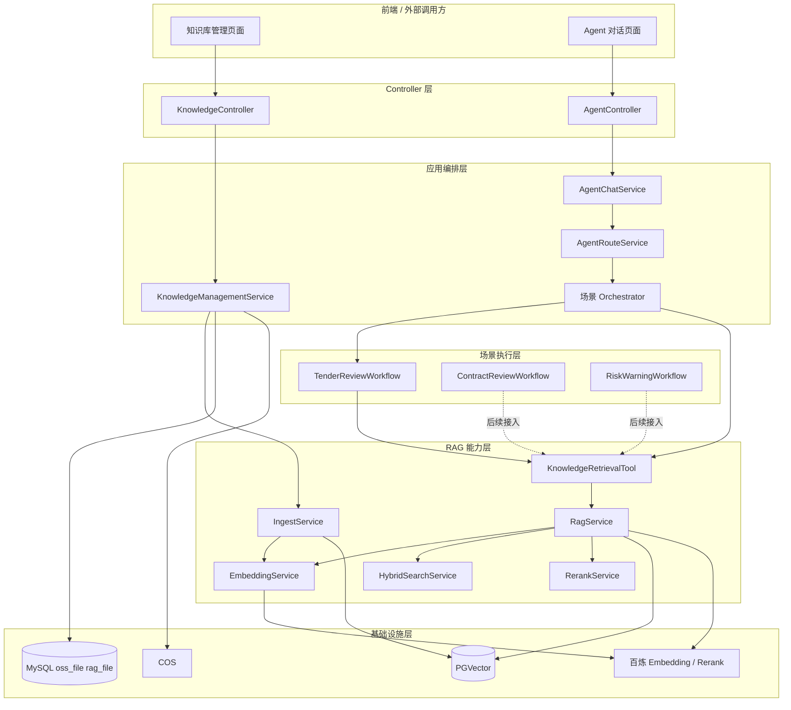

### 2.6 核心设计取舍图

本设计不是把 RAG 做成一个独立问答机器人，而是把它收敛为 Agent 体系中的“证据增强能力”。因此，关键取舍如下：

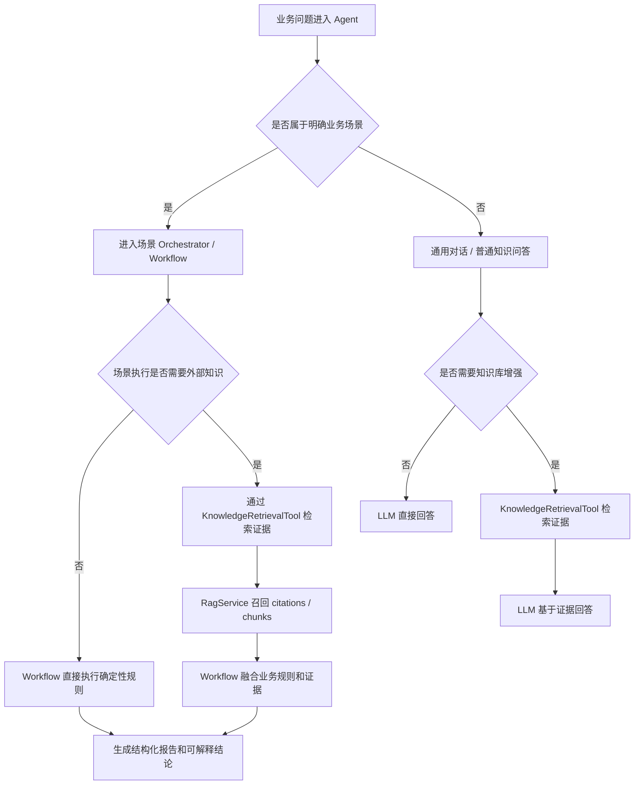

设计结论：

1. 有明确业务场景时，优先让场景链路主导，RAG 只补证据。
2. 没有明确业务场景时，RAG 可以作为通用知识增强能力。
3. 不让 `RagService` 反向理解业务，也不让 `AgentChatService` 直接拼装检索细节。

### 2.7 同步与异步边界

RAG 链路里最容易混淆的是：哪些必须同步返回，哪些可以异步补偿。建议按下面边界理解：

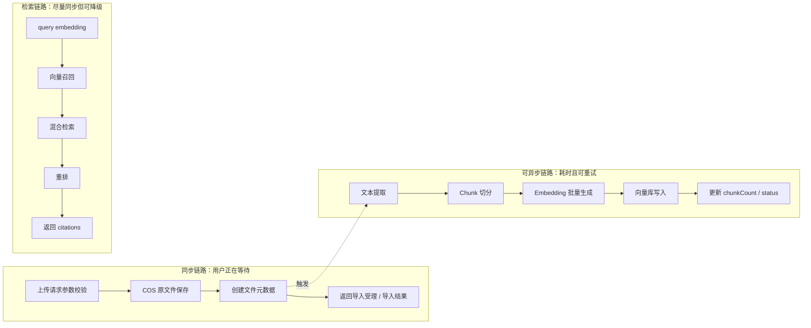

落地建议：

1. MVP 可以先同步完成入库，保证链路简单。
2. 大文件、PDF、批量导入后续应切到异步任务，避免接口超时。
3. 检索链路保持同步返回，但 Embedding、向量库、Rerank 任一失败都要降级为可解释的 `NO_HIT` 或跳过增强步骤。

---

## 3. 接口设计

### 3.1 接口清单

| 接口名称 | 方法 | 路径 | 描述 |
|----------|------|------|------|
| 上传文件 | POST | `/api/knowledge/upload` | 上传 MD/PDF 文件到知识库 |
| 文件列表 | GET | `/api/knowledge/files` | 获取知识库文件列表 |
| 删除文件 | DELETE | `/api/knowledge/files/{fileId}` | 删除知识库文件 |
| 知识检索 | POST | `/api/knowledge/retrieve` | 执行知识检索 |

---

### 3.2 详细接口定义

#### 3.2.1 上传文件

**接口路径**：`POST /api/knowledge/upload`

**请求格式**：`multipart/form-data`

**请求参数**：

| 参数名 | 类型 | 必填 | 说明 |
|--------|------|------|------|
| file | File | 是 | 上传的文件（MD/PDF） |
| orgId | String | 是 | 机构 ID |
| title | String | 否 | 文档标题（默认使用文件名） |
| docType | String | 否 | 文档类型（REGULATION/CONTRACT/CASE/DRUG 等） |
| scene | String | 否 | 业务场景（tender_review/contract_review/risk_warning） |
| subScene | String | 否 | 子场景 |

**请求示例**：
```http
POST /api/knowledge/upload
Content-Type: multipart/form-data

file: (二进制)
orgId: org_001
title: 招标投标法
docType: REGULATION
scene: tender_review
```

**响应（成功）**：
```json
{
  "code": 200,
  "message": "导入成功",
  "data": {
    "fileId": "rag_123456",
    "ossId": "oss_abcdef",
    "fileName": "招标投标法.md",
    "chunkCount": 50,
    "status": "SUCCESS"
  }
}
```

**响应（失败）**：
```json
{
  "code": 40001,
  "message": "文件格式不支持，仅支持 MD、PDF 格式",
  "data": null
}
```

**业务规则**：
- 文件大小限制：单文件不超过 50MB
- 支持格式：MD（前期）、PDF（后期 P2）
- 文件导入成功后，自动解析入库

---

#### 3.2.2 文件列表

**接口路径**：`GET /api/knowledge/files`

**请求参数**：

| 参数名 | 类型 | 必填 | 说明 |
|--------|------|------|------|
| orgId | String | 是 | 机构 ID |
| page | Integer | 否 | 页码（默认 1） |
| pageSize | Integer | 否 | 每页数量（默认 20） |
| keyword | String | 否 | 搜索关键字（匹配文件名） |

**请求示例**：
```http
GET /api/knowledge/files?orgId=org_001&page=1&pageSize=20
```

**响应（成功）**：
```json
{
  "code": 200,
  "message": "success",
  "data": {
    "total": 100,
    "list": [
      {
        "fileId": "rag_123456",
        "fileName": "招标投标法.md",
        "fileType": "MD",
        "docType": "REGULATION",
        "scene": "tender_review",
        "chunkCount": 50,
        "fileSize": 1024000,
        "createdAt": "2026-04-17T10:00:00",
        "status": "SUCCESS"
      }
    ]
  }
}
```

---

#### 3.2.3 删除文件

**接口路径**：`DELETE /api/knowledge/files/{fileId}`

**请求参数**：

| 参数名 | 类型 | 必填 | 说明 |
|--------|------|------|------|
| fileId | String | 是 | 文件 ID（路径参数） |
| orgId | String | 是 | 机构 ID（查询参数） |

**请求示例**：
```http
DELETE /api/knowledge/files/rag_123456?orgId=org_001
```

**响应（成功）**：
```json
{
  "code": 200,
  "message": "删除成功",
  "data": null
}
```

**业务规则**：
- 删除文件时，同步删除向量库中该文档的所有 chunks
- 已删除文件不可恢复

---

#### 3.2.4 知识检索

**接口路径**：`POST /api/knowledge/retrieve`

**请求格式**：`application/json`

**请求参数**：

| 参数名 | 类型 | 必填 | 说明 |
|--------|------|------|------|
| query | String | 是 | 用户问题 |
| orgId | String | 是 | 机构 ID（硬过滤） |
| scene | String | 否 | 业务场景（可选过滤） |
| subScene | String | 否 | 子场景（可选过滤） |
| docType | String | 否 | 文档类型（可选过滤） |
| topK | Integer | 否 | 返回数量（默认 5） |
| needGenerateAnswer | Boolean | 否 | 是否需要生成回答（默认 false，仅返回 citations） |

**请求示例**：
```json
{
  "query": "什么是围标行为？",
  "orgId": "org_001",
  "scene": "tender_review",
  "topK": 5,
  "needGenerateAnswer": false
}
```

**响应（成功）**：
```json
{
  "code": 200,
  "message": "success",
  "data": {
    "decision": "HIT",
    "reason": "HIT",
    "citations": [
      {
        "chunkId": "DOC-ABC12345-0",
        "sourceId": "DOC-ABC12345",
        "sourceTitle": "招标投标法",
        "snippet": "围标是指投标人之间相互串通，损害招标人或者其他投标人的合法权益的行为...",
        "score": 0.95,
        "sectionTitle": "第三章 投标",
        "pageNo": 0
      }
    ],
    "evidenceChunks": [
      {
        "chunkId": "DOC-ABC12345-0",
        "content": "围标是指投标人之间相互串通，损害招标人或者其他投标人的合法权益的行为...",
        "metadata": {
          "sourceTitle": "招标投标法",
          "scene": "tender_review"
        }
      }
    ]
  }
}
```

**响应（无结果）**：
```json
{
  "code": 200,
  "message": "success",
  "data": {
    "decision": "NO_HIT",
    "reason": "NO_CANDIDATE",
    "citations": [],
    "evidenceChunks": []
  }
}
```

---

## 4. 数据库设计

### 4.1 表清单

| 表名 | 说明 | 主键 | 索引 |
|------|------|------|------|
| `oss_file` | OSS 文件元信息 | id | idx_session_id, idx_file_type |
| `rag_file` | RAG 文件关联信息 | id | idx_oss_id, idx_source_id, idx_org_id |

### 4.2 表结构定义

#### 4.2.1 oss_file（OSS 文件表）

| 字段名 | 类型 | 约束 | 说明 |
|--------|------|------|------|
| id | varchar(64) | PK | 文件唯一标识 |
| session_id | varchar(64) | | 会话 ID（RAG 文件可为空） |
| file_name | varchar(255) | NOT NULL | 原始文件名 |
| file_suffix | varchar(20) | | 文件后缀（pdf/md） |
| file_size | bigint | | 文件大小（字节） |
| oss_url | varchar(512) | | OSS 对象路径 |
| file_type | tinyint | NOT NULL, DEFAULT 1 | 文件类型：1-对话附件，2-RAG知识库 |
| upload_status | tinyint | NOT NULL, DEFAULT 0 | 上传状态：0-待上传，1-成功，2-失败，3-已删除 |
| created_at | datetime | NOT NULL | 创建时间 |
| updated_at | datetime | NOT NULL | 更新时间 |

**索引设计**：
- `idx_session_id`: session_id
- `idx_file_type`: file_type

**说明**：RAG 知识库文件使用 `file_type = 2`

---

#### 4.2.2 rag_file（RAG 文件表）

| 字段名 | 类型 | 约束 | 说明 |
|--------|------|------|------|
| id | bigint | PK, AUTO_INCREMENT | 主键 |
| oss_id | varchar(64) | NOT NULL | 关联 oss_file.id |
| source_id | varchar(64) | NOT NULL, UNIQUE | 向量库文档唯一标识（如 DOC-ABC12345） |
| stored_name | varchar(255) | | 存储文件名 |
| original_name | varchar(255) | | 原始文件名 |
| file_type | varchar(20) | | 文件类型（MD/PDF） |
| file_size | decimal(18,2) | | 文件大小（字节） |
| scene | varchar(50) | | 业务场景 |
| chunk_count | int | DEFAULT 0 | chunk 数量 |
| status | tinyint | DEFAULT 1 | 状态：1-有效，0-无效 |
| deleted | tinyint | DEFAULT 0 | 删除标记：0-未删除，1-已删除 |
| created_at | datetime | NOT NULL | 创建时间 |
| updated_at | datetime | NOT NULL | 更新时间 |

**索引设计**：
- `idx_oss_id`: oss_id
- `idx_source_id`: source_id（唯一索引）
- `idx_org_id`: org_id（向量库 metadata 中）

**关联关系**：
- `rag_file.oss_id` → `oss_file.id`（多对一）

---

## 5. 状态流转设计

### 5.1 文件状态流转

#### 5.1.1 上传状态（oss_file.upload_status）

| 当前状态 | 事件/动作 | 目标状态 | 说明 |
|----------|-----------|----------|------|
| 0-待上传 | 上传成功 | 1-成功 | 文件已上传到 COS |
| 0-待上传 | 上传失败 | 2-失败 | 上传失败 |
| 1-成功 | 删除 | 3-已删除 | 软删除 |
| 2-失败 | 重新上传 | 0-待上传 | 重试 |

#### 5.1.2 RAG 文件状态（rag_file.status / deleted）

| 当前状态 | 事件/动作 | 目标状态 | 说明 |
|----------|-----------|----------|------|
| - | 创建 | 1-有效, 0-未删除 | 新文件入库 |
| 1-有效 | 删除文件 | 0-无效, 1-已删除 | 同步删除向量库 |

### 5.2 状态流转图（Mermaid）

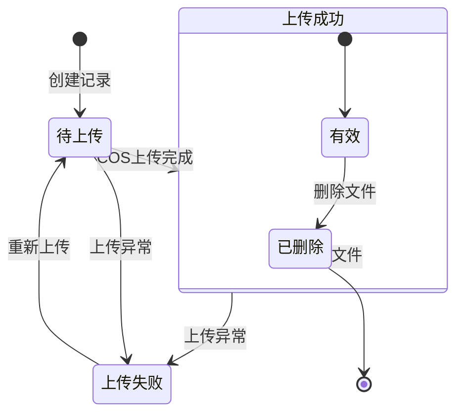

---

## 6. 异常处理设计

### 6.1 异常分类

| 异常类型 | 错误码范围 | 处理策略 | 示例 |
|----------|-----------|----------|------|
| 参数异常 | 40001-40099 | 直接返回错误提示 | 文件格式不支持 |
| 业务异常 | 20001-20099 | 记录日志，返回友好提示 | 机构不存在 |
| 知识库异常 | 30001-30099 | 记录日志，降级返回 | 向量库连接失败 |
| 系统异常 | 50001-50099 | 记录堆栈日志，返回系统繁忙 | 内部错误 |

### 6.2 异常处理原则

1. **异常不外泄**：内部异常不对外暴露，转换为友好提示
2. **日志要完整**：ERROR 级别记录堆栈，WARN 级别记录业务异常
3. **降级要彻底**：外部服务（RAG）失败时，返回空结果而非抛出异常
4. **重试要谨慎**：非幂等操作（删除）不重试

### 6.3 全局异常处理

```java
@ExceptionHandler(BusinessException.class)
public Result<?> handleBusiness(BusinessException e) {
    log.warn("[Knowledge] 业务异常: code={}, message={}", e.getCode(), e.getMessage());
    return Result.fail(e.getCode(), e.getMessage());
}

@ExceptionHandler(FileTypeNotSupportedException.class)
public Result<?> handleFileTypeNotSupported(FileTypeNotSupportedException e) {
    log.warn("[Knowledge] 文件格式不支持: {}", e.getMessage());
    return Result.fail(40001, "文件格式不支持，仅支持 MD、PDF 格式");
}

@ExceptionHandler(Exception.class)
public Result<?> handleSystemException(Exception e) {
    log.error("[Knowledge] 系统异常", e);
    return Result.fail(50001, "系统繁忙，请稍后重试");
}
```

---

## 7. 兼容性设计

### 7.1 向后兼容

- **数据库**：新增字段有默认值，不影响旧逻辑
- **接口**：新增字段不影响旧版本解析
- **向量库 metadata**：新增字段（如 topicTags）不影响已有检索

### 7.2 版本管理

| 类型 | 版本策略 |
|------|----------|
| 接口版本 | 路径版本：`/api/v1/knowledge/*` |
| 向量库 schema | 软加字段，不硬删 |

---

## 8. 风险分析与缓解

| 风险点 | 概率 | 影响 | 缓解措施 |
|--------|------|------|----------|
| R01: PDF 解析质量不佳 | 中 | 高 | 前期只做 MD，PDF 解析 P2 迭代 |
| R02: 向量检索召回不准确 | 中 | 中 | 引入混合检索 + 重排（enableHybridSearch/enableRerank） |
| R03: 大文件入库超时 | 低 | 中 | 文件大小限制 50MB，入库异步化 |
| R04: 场景 Workflow 过度依赖 RAG | 低 | 中 | 明确 RAG 是补充，Workflow 自身逻辑优先 |

### 8.1 监控告警

| 指标 | 告警阈值 |
|------|----------|
| 接口响应时间 P99 | > 3s |
| 入库失败率 | > 1% |
| 检索无结果率 | > 30%（需优化知识库） |

---

## 9. 核心时序图

### 9.1 文件导入时序图

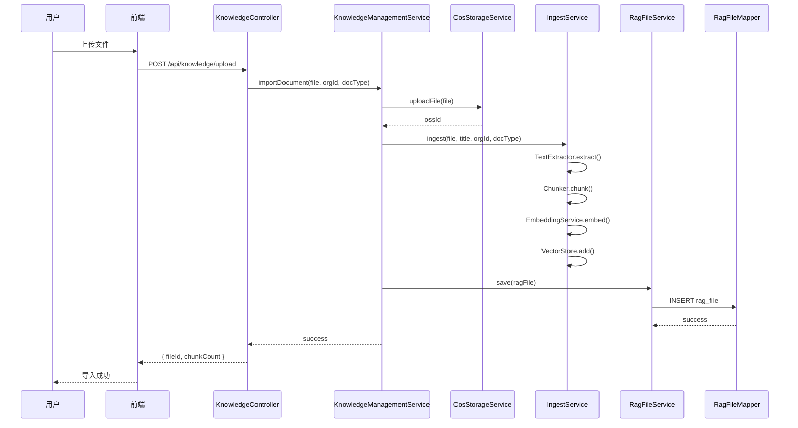

### 9.2 知识检索时序图

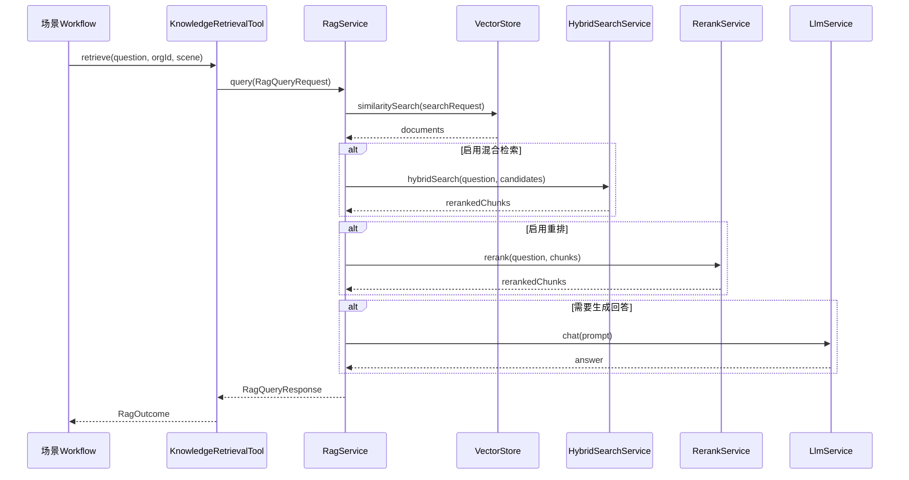

### 9.3 文件删除时序图

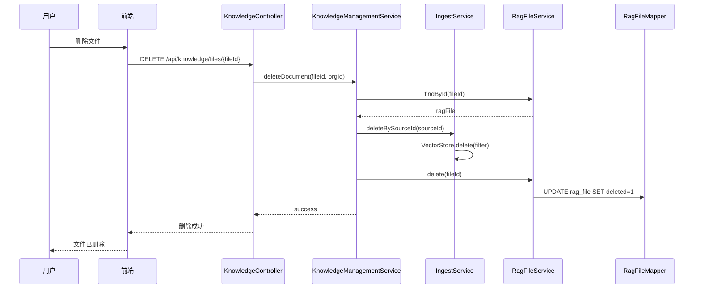

### 9.4 Agent 场景接入 RAG 时序图

该时序图用于说明：RAG 在 Agent 主链路中是“证据增强能力”，不是新的场景执行入口。

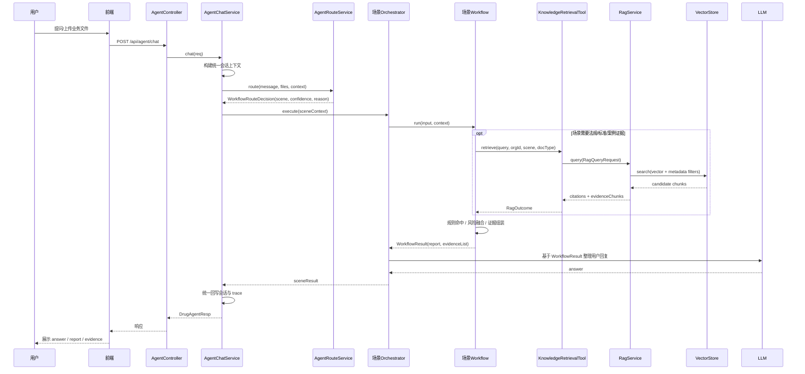

职责理解：

1. `AgentChatService` 只做统一上下文、路由、分发、降级和回写。
2. `Orchestrator` 决定本场景如何组织 LLM、Tool、Workflow。
3. `Workflow` 决定什么时候需要知识证据，以及如何把证据并入业务判断。
4. `KnowledgeRetrievalTool` 屏蔽底层检索细节，向场景侧稳定返回 `RagOutcome`。

### 9.5 检索异常降级时序图

该时序图用于说明：RAG 是增强能力，失败时不能阻断场景主流程。

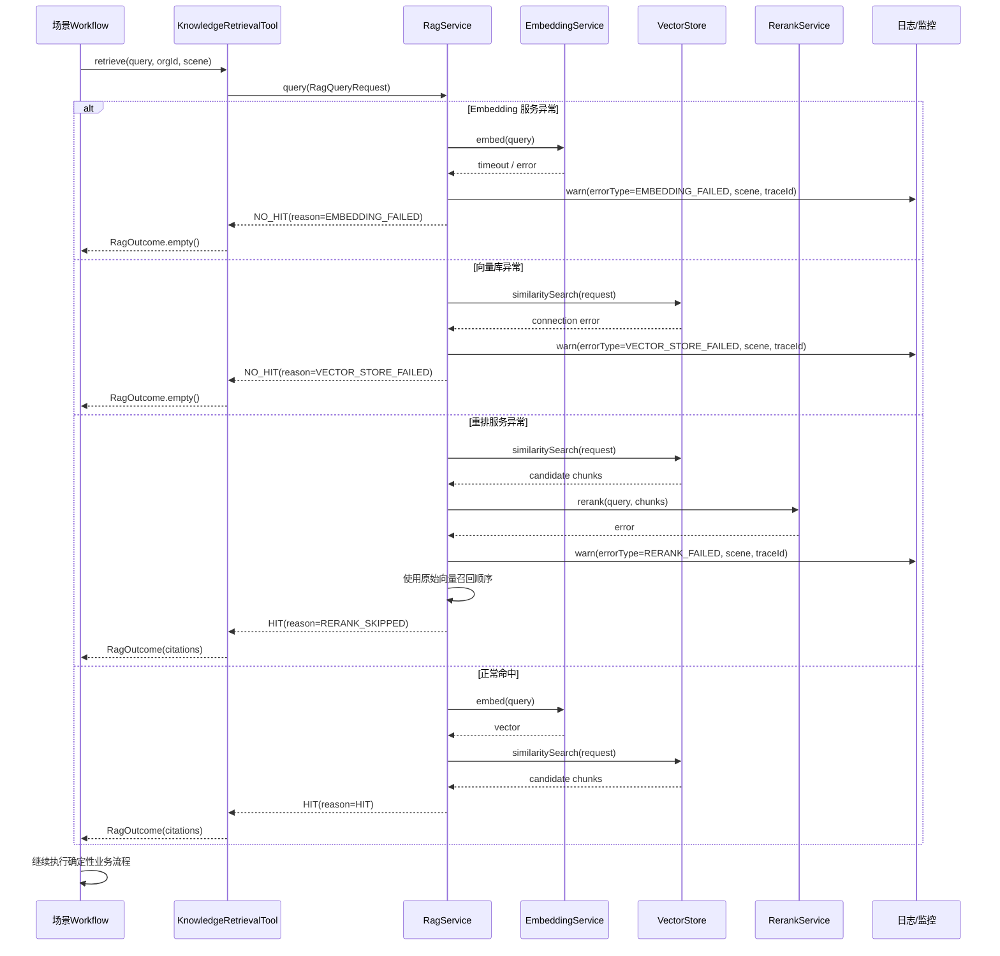

降级原则：

1. Embedding 或向量库不可用时，返回空证据，Workflow 继续按已有规则执行。
2. Rerank 失败时，不丢弃召回结果，退回向量召回排序。
3. 所有降级都要带 `scene`、`traceId`、`reason`，便于后续定位。

### 9.6 标书审查融合 RAG 证据时序图

该时序图用于说明：标书审查不是“先 RAG 后回答”，而是“Workflow 规则审查 + RAG 法规证据补强 + LLM 表达整理”。

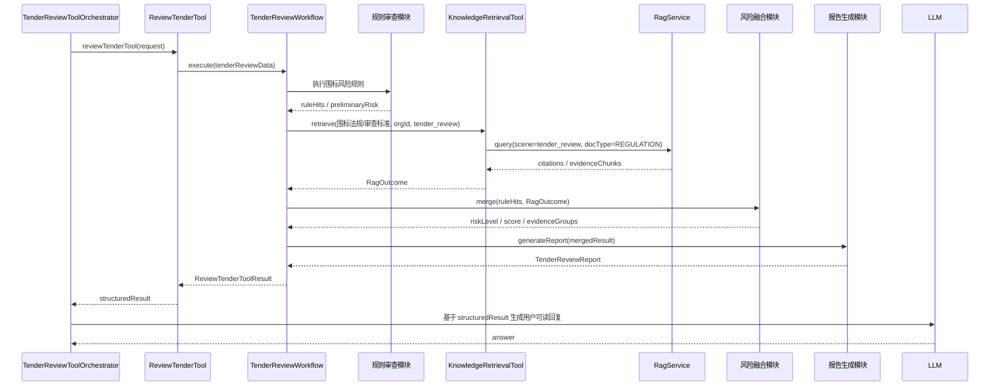

融合原则：

1. 规则命中是业务判断主干，RAG citation 是解释和佐证。
2. RAG 没有命中时，不能把风险结论降为无风险，只能标记“缺少外部法规证据”。
3. citation 应进入 `evidenceList` / `evidenceGroups`，让前端能展示来源、片段、分数。

### 9.7 文件入库失败补偿时序图

该时序图用于说明：知识库文件同时涉及 COS、MySQL、PGVector，失败时要明确状态，不要留下“前端显示成功但不可检索”的灰色数据。

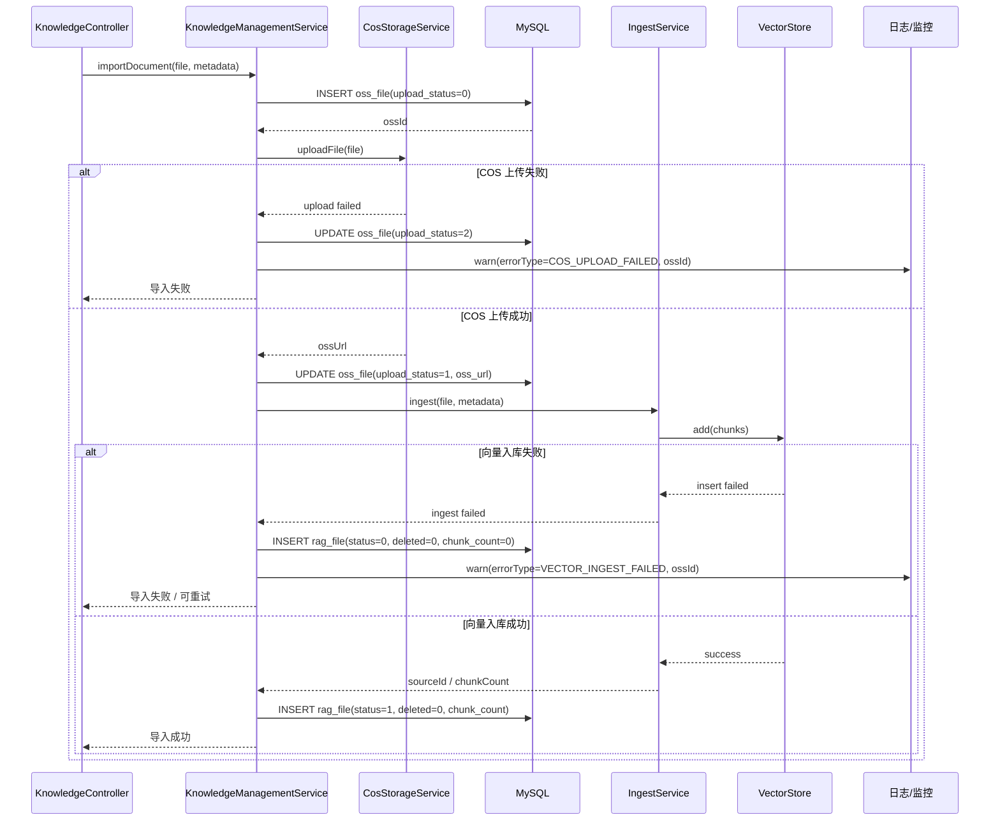

补偿原则：

1. 原文件上传失败：只更新 `oss_file.upload_status=2`，不创建有效 `rag_file`。
2. 原文件上传成功但向量入库失败：保留 `oss_file`，创建或更新失败状态，支持后续重试入库。
3. 向量入库成功后才允许 `rag_file.status=1`，避免文件列表显示为可用但检索不到。

---

## 10. 核心流程图

### 10.1 文件导入流程

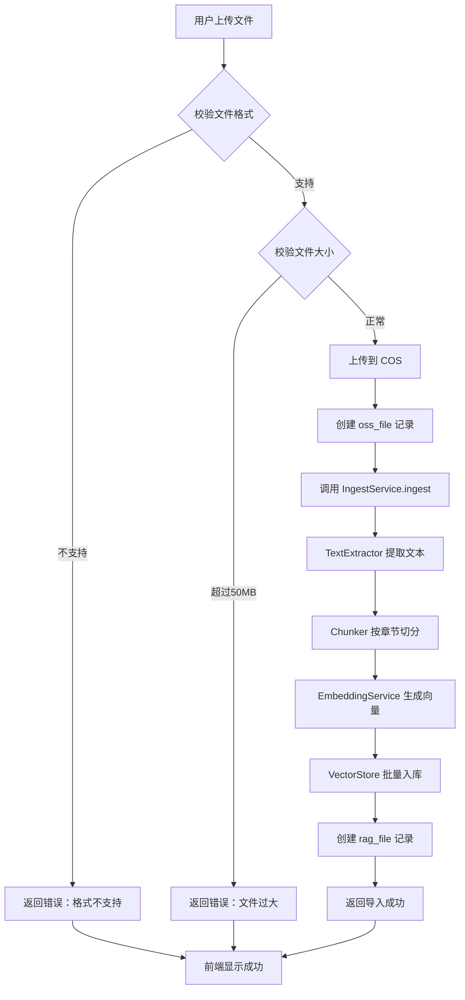

### 10.2 知识检索流程

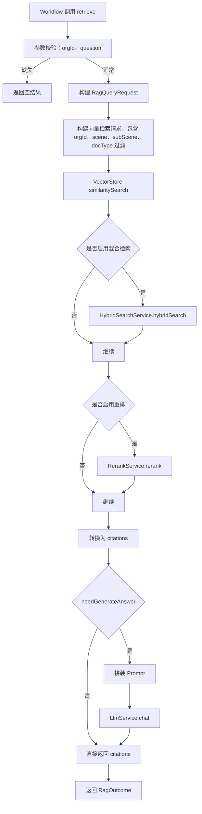

### 10.3 文件删除流程

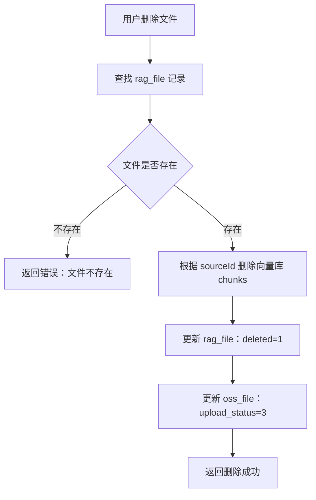

### 10.4 从知识入库到业务使用的端到端流程

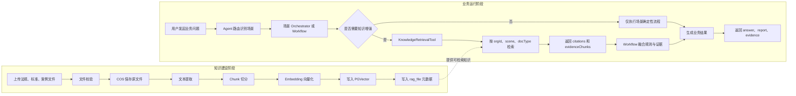

这张图的核心含义：

1. 入库链路只负责把知识变成可检索资产，不参与具体业务判断。
2. 运行链路由 Agent 路由到具体场景，再由场景决定是否使用 RAG。
3. RAG 输出的是证据材料，最终风险判断仍由场景 Workflow 负责。

### 10.5 检索决策流程

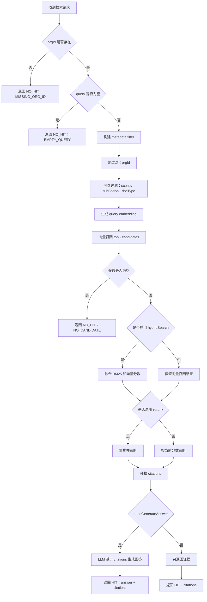

设计要点：

1. `orgId` 是硬过滤，避免跨机构知识污染。
2. `scene`、`subScene`、`docType` 是业务过滤条件，避免全库裸搜。
3. 默认 `needGenerateAnswer=false`，让 Agent 主链路避免 RAG 内部额外生成一次答案。

### 10.6 数据关系图

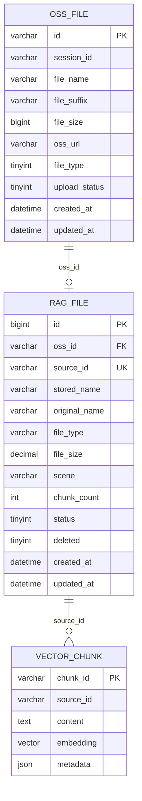

关系说明：

1. `oss_file` 保存原始文件上传信息，可同时服务对话附件和 RAG 知识库文件。
2. `rag_file` 保存知识库维度的文件元数据，与向量库 `source_id` 对齐。
3. `VECTOR_CHUNK` 表示 PGVector 中的逻辑 chunk，不一定是 MySQL 物理表。

### 10.7 落地依赖关系图

这张图用于把前面的设计转换成开发顺序。建议先做数据和入库闭环，再做场景接入，最后做前端体验和评测。

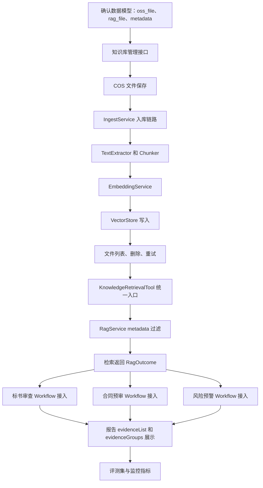

开发顺序建议：

1. 先让单个 MD 文件从上传到可检索跑通。
2. 再把 `orgId`、`scene`、`docType` 过滤补齐，避免全库裸搜。
3. 然后接入标书审查 Workflow，验证 citation 能进入报告证据链。
4. 最后再做混合检索、重排、PDF、批量导入、评测集。

---

## 11. 任务拆解

### 11.1 任务分组

#### 分组 1：知识库管理模块（新增）

| 任务ID | 任务名称 | 类型 | 优先级 | 预估工时 | 依赖任务 | 验收标准 |
|--------|----------|------|--------|----------|----------|----------|
| T-K01 | 创建 KnowledgeController | 接口 | P0 | 0.5天 | - | HTTP 接口可访问，文件上传/列表/删除正常 |
| T-K02 | 创建 KnowledgeManagementService | 业务逻辑 | P0 | 1天 | T-K01 | 文件导入/删除流程正确 |
| T-K03 | 创建/完善 RagFileService | 业务逻辑 | P0 | 0.5天 | - | 文件元数据 CRUD 正确 |
| T-K04 | 集成文件上传到 COS | 集成 | P0 | 0.5天 | T-K01 | 文件正确上传到 COS |

#### 分组 2：文档入库模块（完善已有）

| 任务ID | 任务名称 | 类型 | 优先级 | 预估工时 | 依赖任务 | 验收标准 |
|--------|----------|------|--------|----------|----------|----------|
| T-I01 | 完善 IngestService 入库流程 | 业务逻辑 | P0 | 0.5天 | T-K02 | 文档入库到向量库正常 |
| T-I02 | 完善 Chunker 支持 MD 结构化解析 | 业务逻辑 | P0 | 1天 | - | 按章节/条款边界切分正确 |
| T-I03 | 实现文件删除时清理向量库 | 功能 | P0 | 0.5天 | T-I01 | 删除文件后向量库记录同步清理 |

#### 分组 3：架构修复

| 任务ID | 任务名称 | 类型 | 优先级 | 预估工时 | 依赖任务 | 验收标准 |
|--------|----------|------|--------|----------|----------|----------|
| T-A01 | 移除 AgentSceneService 对 KnowledgeRetrievalTool 的直接持有 | 重构 | P0 | 0.5天 | - | AgentSceneService 不再直接调用 RAG |
| T-A02 | 修复 scene 参数传递 | 重构 | P0 | 0.5天 | T-A01 | Workflow 调用 RAG 时正确传递 scene |
| T-A03 | 统一 EvidenceItem 和 RagCitation 模型 | 重构 | P1 | 1天 | - | 减少模型重复 |

#### 分组 4：场景集成

| 任务ID | 任务名称 | 类型 | 优先级 | 预估工时 | 依赖任务 | 验收标准 |
|--------|----------|------|--------|----------|----------|----------|
| T-W01 | 标书审查 Workflow 集成 RAG | 功能 | P0 | 1天 | T-A02 | 审查时可检索《招标投标法》相关条款 |
| T-W02 | 合同预审 Workflow 集成 RAG | 功能 | P1 | 1天 | T-A02 | 预审时可检索《合同法》相关条款 |
| T-W03 | 风险预警 Workflow 集成 RAG | 功能 | P1 | 1天 | T-A02 | 预警时可检索历史处罚案例 |

#### 分组 5：前端页面

| 任务ID | 任务名称 | 类型 | 优先级 | 预估工时 | 依赖任务 | 验收标准 |
|--------|----------|------|--------|----------|----------|----------|
| T-F01 | 知识库管理页面 | 页面 | P0 | 2天 | T-K01 | 文件上传/列表/删除功能完整 |
| T-F02 | 文件列表搜索功能 | 功能 | P1 | 0.5天 | T-F01 | 支持按文件名搜索 |

---

### 11.2 任务汇总

| 优先级 | 任务数量 | 总工时 |
|--------|----------|--------|
| P0 | 10 | 8天 |
| P1 | 5 | 4.5天 |
| **合计** | **15** | **12.5天** |

---

## 12. 技术依赖

| 依赖项 | 说明 | 优先级 | 状态 |
|--------|------|--------|------|
| 百炼 text-embedding-v3 | 向量化服务 | P0 | 已有 |
| PGVector | 向量数据库 | P0 | 已有 |
| COS 存储 | 文件存储 | P0 | 已有 |
| Markdown 解析 | MD 文件解析 | P0 | 已有 |
| PDF 解析 | PDF 文件解析 | P2 | 待实现 |

---

## 13. 后续步骤

1. **评审技术方案**：确认模块划分、接口设计、数据库设计
2. **确认任务优先级**：确认 P0 任务顺序
3. **进入开发执行阶段**：按任务清单逐步交付
4. **后期迭代**：PDF 解析支持、混合检索优化、重排增强

---

## 附录：当前 RAG 相关文件清单

| 文件路径 | 说明 |
|----------|------|
| `shared/rag/service/RagService.java` | RAG 核心检索服务 |
| `shared/rag/service/IngestService.java` | 文档入库服务 |
| `shared/rag/service/EmbeddingService.java` | 向量化服务 |
| `shared/rag/service/HybridSearchService.java` | 混合检索服务 |
| `shared/rag/service/RerankService.java` | 重排服务 |
| `shared/rag/service/Chunker.java` | Chunk 切分器 |
| `shared/rag/service/TextExtractor.java` | 文本提取器 |
| `shared/tool/KnowledgeRetrievalTool.java` | RAG 统一入口 |
| `shared/rag/controller/RagController.java` | RAG HTTP 接口 |
| `shared/rag/entity/RagFile.java` | RAG 文件实体 |
| `shared/rag/entity/OssFile.java` | OSS 文件实体 |
| `shared/model/RagOutcome.java` | Workflow RAG 结果 |
| `shared/model/EvidenceItem.java` | 证据项 |
