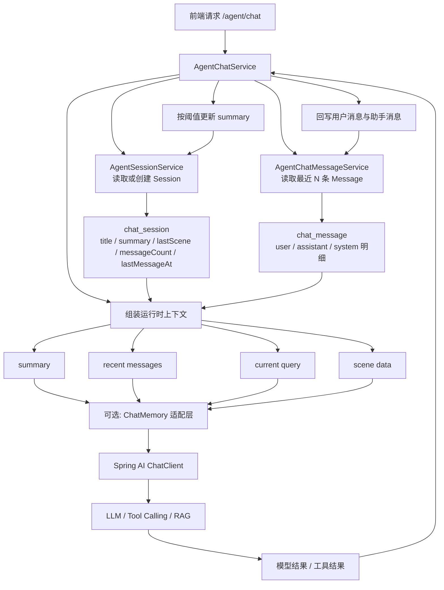
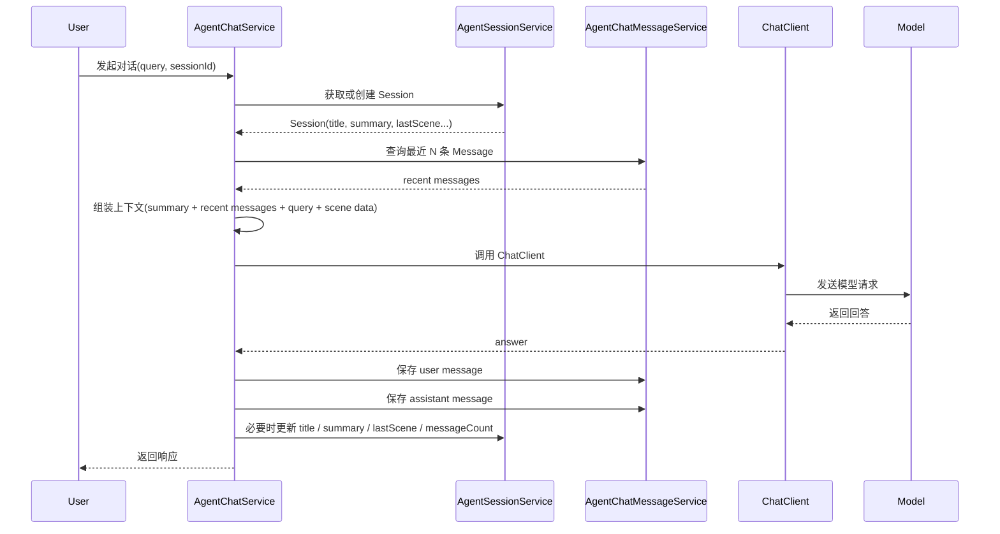

# Agent记忆层设计方案

> 文档版本：v1.0
> 更新时间：2026-03-27
> 适用范围：Drug-Agent 上层通用 Agent 记忆层设计

## 1. 文档目标

本文档用于明确 Drug-Agent 当前阶段的记忆层设计方案，统一以下问题：

1. `Session`、`Message`、`summary` 的职责边界
2. Spring AI `ChatMemory` 在项目中的定位
3. 轻量记忆方案的主调用链路
4. 后续升级为文件记忆、证据记忆时的演进方向

本文档面向当前阶段的轻量落地，不追求一步到位建设重型记忆中台。

---

## 2. 设计背景

当前项目是医药监管方向的上层通用 Agent 系统，核心目标不是做一个普通聊天机器人，而是建设一个：

- 有明确场景路由
- 有稳定工作流
- 有结构化结果
- 有证据链和可解释输出

的业务 Agent 系统。

因此，记忆层不能只理解成“模型帮我们自动记住前文”，而应该理解成：

“系统如何管理会话事实、压缩上下文，并将合适的信息喂给模型”

---

## 3. 设计结论

当前阶段采用轻量记忆方案，核心结论如下：

1. `chat_session / chat_message` 是业务主记忆源
2. `chat_session.summary` 是压缩后的上下文记忆
3. `chat_message` 保存每轮原始消息明细
4. 每次调用模型时，由业务层组装：
   `summary + 最近消息 + 当前问题 + 当前场景数据`
5. Spring AI `ChatMemory` 不作为独立主记忆源，只能作为可选的上下文适配层

一句话总结：

`Session/Message` 负责存业务真相，`summary` 负责压缩上下文，Spring AI 负责消费上下文。

---

## 4. 为什么不把 ChatMemory 作为主记忆源

Spring AI `ChatMemory` 很适合普通多轮聊天，但它更偏“模型上下文管理”，不适合作为业务 Agent 的事实真相层。

本项目如果直接把 `ChatMemory` 当成主记忆源，会带来几个问题：

1. 它天然不擅长表达业务语义，例如 `lastScene`、证据链、文件上下文、Tool 结果等
2. 不利于审计、排障、追溯和回放
3. 容易和数据库中的 `Session/Message` 形成双状态并行
4. 后续扩展文件记忆、证据记忆时边界会越来越混乱

因此，当前阶段更稳妥的做法是：

- 业务真相留在 `chat_session / chat_message`
- 模型调用层只消费业务层组装好的上下文

---

## 5. 记忆层数据模型

### 5.1 chat_session

`chat_session` 用于存储会话聚合信息。

建议重点维护以下字段：

- `id`
- `title`
- `summary`
- `lastScene`
- `messageCount`
- `lastMessageAt`
- `createdAt`
- `updatedAt`

其中：

- `summary` 是压缩后的会话上下文
- `lastScene` 用于记录最近一次命中的场景
- `messageCount` 用于控制摘要压缩策略
- `lastMessageAt` 用于会话排序和活跃度判断

### 5.2 chat_message

`chat_message` 用于存储每一轮原始消息明细。

建议重点维护以下字段：

- `id`
- `sessionId`
- `role`
- `scene`
- `content`
- `metadata`
- `type`
- `createdAt`

其中：

- `role` 区分 `user / assistant / system`
- `scene` 用于标识当前消息关联的场景
- `metadata` 用于保留扩展信息，例如文件 ID、工具结果索引等
- `type` 用于区分普通消息、澄清消息、结果卡片等

### 5.3 一对多关系

数据关系保持为：

- 一个 `Session`
- 对应多条 `Message`

即：

`chat_session 1 ---- n chat_message`

`Session` 是聚合根，`Message` 是事实明细。

---

## 6. summary 的定位

`summary` 是当前轻量方案的关键字段，但必须明确它的语义：

1. 它是压缩记忆，不是事实源
2. 它用于模型消费，不替代原始消息
3. 它不应承担审计与追溯职责
4. 它应服务于“降低上下文长度”和“保留关键语义”

因此，系统中的真实事实应始终以 `chat_message` 为准。

一句话理解：

`Message` 决定“真实发生了什么”，`summary` 决定“下次调用模型时该记住什么”。

---

## 7. 模型上下文组装规则

在轻量方案下，每次调用模型时，建议统一按以下顺序组装运行时上下文：

1. `session.summary`
2. 最近 N 条消息
3. 当前用户请求
4. 当前场景必要结构化数据

即：

`模型上下文 = 压缩摘要 + 最近窗口 + 当前问题 + 场景数据`

这样设计的好处是：

1. 不需要每次把全量消息发送给模型
2. 保留最近对话细节
3. 保留长会话中的关键背景
4. 为后续场景化记忆预留接口

---

## 8. Session / Message / summary / ChatMemory / ChatClient 调用关系图

### 8.1 总体调用关系



### 8.2 一次完整调用时序



---

## 9. Spring AI ChatMemory 在本项目中的定位

### 9.1 ChatMemory 的基本原理

Spring AI `ChatMemory` 本质上是一个“历史消息管理与注入机制”。

它通常通过 `MessageChatMemoryAdvisor` 工作：

1. 根据 `conversationId` 读取历史消息
2. 在调用模型前，把历史消息自动拼进 prompt
3. 在模型返回后，把本轮消息写回记忆存储

因此，`ChatMemory` 更适合解决的问题是：

“模型在多轮对话中如何自动带上前文”

### 9.2 ChatMemory 的常见适用场景

它通常很适合以下场景：

1. 普通聊天机器人
2. 简单客服问答
3. Demo 项目
4. 对上下文可控性要求不高的多轮对话

### 9.3 本项目中的建议定位

在本项目中，Spring AI `ChatMemory` 不应作为主记忆源，而应理解为：

1. 可选的上下文适配层
2. 模型调用时的上下文注入工具
3. 轻量阶段的辅助能力

不建议让它承担：

1. 会话真相层
2. 业务语义中心
3. 证据链主存储
4. 文件记忆主存储

### 9.4 当前阶段的建议

当前阶段建议：

1. 业务层显式组装 `summary + recent messages + current query + scene data`
2. Spring AI `ChatClient` 消费这份上下文
3. 即使保留 `ChatMemory`，也不要让它再独立维护一套主状态

这样可以避免形成两套记忆源并行。

---

## 10. 摘要更新策略

轻量方案下，不建议每轮都更新 `summary`。

建议先采用简单阈值策略：

1. 消息数累计达到阈值后更新一次
2. 最近消息总长度超过阈值后更新一次
3. 场景切换时更新一次

这样做的好处是：

1. 降低模型压缩成本
2. 避免摘要频繁抖动
3. 保持实现简单
4. 便于后续优化

---

## 11. 职责边界建议

### 11.1 AgentSessionService

负责：

1. 会话 CRUD
2. `summary` 维护
3. `title` 维护
4. `lastScene`、`messageCount`、`lastMessageAt` 维护
5. 读取会话级上下文

不负责：

1. 原始消息明细的底层读写
2. 场景判断
3. Workflow 执行

### 11.2 AgentChatMessageService

负责：

1. 用户消息保存
2. 助手消息保存
3. 系统消息保存
4. 最近消息窗口查询
5. 历史消息列表查询

不负责：

1. `summary` 生成
2. 会话标题更新
3. 场景决策

### 11.3 AgentChatService

负责：

1. 读取 `Session`
2. 读取最近消息
3. 组装运行时上下文
4. 调用模型或场景执行器
5. 回写消息与会话聚合状态

不负责：

1. 持久化细节
2. 复杂摘要策略实现细节
3. 底层 Workflow 规则

---

## 12. 当前方案的优点

该轻量方案的优点包括：

1. 设计简单，适合当前项目阶段
2. 主记忆源清晰，不容易形成双状态
3. 易于排障和追溯
4. 容易和现有 `Session/Message` 表结构衔接
5. 后续升级路径自然

---

## 13. 后续升级方向

当前方案不是终态，但具备良好的升级基础。

后续如有需要，可以逐步扩展：

1. 文件记忆
2. 证据记忆
3. Tool 结果记忆
4. 场景化摘要
5. 长期记忆检索

推荐升级顺序：

1. 先把 `summary + recent messages` 跑稳定
2. 再引入文件级上下文
3. 再引入场景级结构化记忆
4. 最后考虑复杂长期记忆体系

---

## 14. 一句话结论

当前阶段，Drug-Agent 最适合采用的记忆层方案是：

`以 chat_session / chat_message 为业务真相层，以 summary 为轻量压缩记忆，由业务层组装上下文，再交给 Spring AI ChatClient 消费。`

---

## 15. 落地到当前代码的改造建议

本节用于回答一个更具体的问题：

“按照当前仓库的类结构，这套记忆层方案应该怎么真正落到代码里？”

目标不是一次性重构成重型架构，而是先把当前实现收敛到和本文设计一致。

### 15.1 当前代码中的主要偏差

结合当前实现，主要存在以下问题：

1. `AgentSessionService` 职责偏重
   - 既管会话，又代理消息保存，又负责运行时上下文拼装
   - 容易继续演化成“大而全的记忆服务”

2. `AgentChatMessageService` 过薄
   - 当前更像一个消息 DAO 包装层
   - 尚未形成稳定的“消息明细服务”边界

3. `summary` 语义存在混乱
   - 当前实现中，更新摘要的方法实际写的是标题
   - 加载上下文时，返回的是 `title` 而不是 `summary`

4. `Session` 与 `Message` 的聚合关系没有完全落地
   - `messageCount`
   - `lastMessageAt`
   - `lastScene`
   这些会话级字段还没有被稳定维护

5. 运行时上下文与 Spring AI `ChatMemory` 的关系不清晰
   - 容易形成“数据库一套、ChatMemory 一套”的双状态并行

### 15.2 当前类的推荐职责收敛

#### AgentSessionService

建议收敛为“会话聚合服务”，只负责会话级状态。

保留职责：

1. 创建会话
2. 获取会话
3. 获取或创建会话
4. 更新标题
5. 更新 `summary`
6. 更新 `lastScene`
7. 更新 `messageCount`
8. 更新 `lastMessageAt`
9. 加载会话级上下文

不再承担：

1. 用户消息保存代理
2. 助手消息保存代理
3. 系统消息保存代理
4. 原始消息明细查询细节

#### AgentChatMessageService

建议收敛为“消息明细服务”。

保留职责：

1. 保存用户消息
2. 保存助手消息
3. 保存系统消息
4. 查询全部历史消息
5. 查询最近 N 条消息

后续可扩展：

1. 按场景查询消息
2. 按类型查询消息
3. 读取最近窗口而不是整表查询后截断

#### AgentChatService

建议保持为上层编排入口，但记忆相关流程要更明确。

建议它固定做以下事情：

1. 获取或创建 `Session`
2. 读取 `session.summary`
3. 读取最近 N 条 `Message`
4. 把 `summary + recent messages + current query + scene data` 放进上下文
5. 调用场景服务或模型服务
6. 回写 user/assistant message
7. 回写 `Session` 聚合字段
8. 必要时更新 `summary`

---

## 16. 建议的方法级改造

### 16.1 AgentSessionService 建议保留的方法

建议保留并强化：

1. `createSession(...)`
2. `getSessionById(...)`
3. `getOrCreateSession(...)`
4. `updateSessionTitle(...)`
5. `updateSessionSummary(...)`
6. `loadSessionContext(...)`

### 16.2 AgentSessionService 建议新增的方法

建议新增以下方法，使会话聚合职责更明确：

```java
public void touchSession(String sessionId, String scene)

public void increaseMessageCount(String sessionId, int delta)

public void updateSessionSummary(String sessionId, String summary)

public void updateSessionState(String sessionId, String scene, LocalDateTime lastMessageAt, Integer messageCount)
```

用途分别是：

1. `touchSession`
   - 更新 `updatedAt`
   - 更新 `lastScene`
   - 更新 `lastMessageAt`

2. `increaseMessageCount`
   - 在消息保存后维护会话消息数

3. `updateSessionSummary`
   - 只写 `summary`
   - 不再误写 `title`

4. `updateSessionState`
   - 为后续一次性维护多个聚合字段预留接口

### 16.3 AgentSessionService 建议移除的代理方法

建议逐步从 `AgentSessionService` 中移出以下消息代理：

```java
saveUserMessage(...)
saveAssistantMessage(...)
saveSystemMessage(...)
```

原因是这些方法应该直接由 `AgentChatMessageService` 承担。

如果出于兼容性暂时不能删除，也建议：

1. 标注为过渡方法
2. 在文档中明确后续会收敛
3. 新代码不再继续依赖这些代理方法

---

## 17. AgentChatMessageService 建议的方法形态

### 17.1 当前阶段建议保留

```java
public ChatMessage saveUserMessage(String sessionId, String content, String metadata)

public ChatMessage saveAssistantMessage(String sessionId, String content, String metadata, String type)

public ChatMessage saveSystemMessage(String sessionId, String content, String metadata)

public List<ChatMessage> getMessagesBySessionId(String sessionId)
```

### 17.2 当前阶段建议新增

```java
public List<ChatMessage> getRecentMessages(String sessionId, int limit)
```

原因是当前实现里由 `AgentSessionService` 先查全量消息，再在内存中截取最近 20 条，这会随着消息增长逐步变差。

更合理的做法是：

1. 底层直接按时间倒序限制条数查询
2. 业务层按需要再调整顺序

### 17.3 建议补充的消息字段使用规范

在当前轻量方案下，建议统一约定：

1. `role`
   - `user`
   - `assistant`
   - `system`

2. `type`
   - `assistant_text`
   - `assistant_clarify`
   - `assistant_result_card`
   - 后续可扩展 `tool_result`

3. `scene`
   - 当前轮命中的业务场景

4. `metadata`
   - 文件 ID
   - 工具结果索引
   - 额外上下文标识

---

## 18. AgentChatService 的推荐落地流程

建议将 `AgentChatService.chat()` 稳定为以下主流程：

```text
1. 读取或创建 Session
2. 读取 session.summary
3. 读取最近 N 条 Message
4. 构建 AgentChatContext
5. 调用 AgentSceneService 决策并执行
6. 保存用户消息
7. 保存助手消息
8. 更新 Session 聚合字段
9. 满足条件时更新 summary
10. 返回统一响应
```

### 18.1 推荐伪代码

```java
public AgentChatResp chat(AgentChatReq req) {
    ChatSession session = agentSessionService.getOrCreateSession(req.getSessionId());
    List<ChatMessage> recentMessages = agentChatMessageService.getRecentMessages(session.getId(), 10);

    AgentChatContext context = AgentChatContext.from(req, session.getId());
    context.setSession(session);
    context.setRecentSummary(session.getSummary());
    context.setHistoryMessages(recentMessages);

    AgentSceneExecution execution = agentSceneService.decideAndExecute(context, req);

    agentChatMessageService.saveUserMessage(session.getId(), req.getQuery(), null);
    agentChatMessageService.saveAssistantMessage(session.getId(), executionAnswer, null, messageType);

    agentSessionService.touchSession(session.getId(), scene);
    agentSessionService.increaseMessageCount(session.getId(), 2);

    if (shouldUpdateSummary(execution, recentMessages)) {
        agentSessionService.updateSessionSummary(session.getId(), newSummary);
    }

    return agentResponseService.buildResponse(...);
}
```

### 18.2 这段流程的关键点

关键点有三个：

1. `sessionId` 必须以真实 `session.id` 为准
2. 运行时上下文必须来自业务库，而不是 Spring AI 内部黑盒状态
3. 消息回写与会话聚合字段维护必须成对出现

---

## 19. 第一阶段建议直接修改的点

如果只做第一阶段收敛，建议先改以下内容：

### 19.1 修正 summary 语义

必须修正：

1. `updateSessionSummary(...)` 只更新 `summary`
2. `loadSessionContext(...)` 返回 `session.getSummary()`

### 19.2 修正 sessionId 主链路

当前应保证：

1. 新建会话后，后续链路统一使用真实 `session.getId()`
2. 不要再让默认 `sessionId` 与真实创建的 `session.id` 脱节

### 19.3 消息保存从 SessionService 下沉

建议开始从：

```java
agentSessionService.saveUserMessage(...)
agentSessionService.saveAssistantMessage(...)
```

过渡到：

```java
agentChatMessageService.saveUserMessage(...)
agentChatMessageService.saveAssistantMessage(...)
```

### 19.4 增加最近消息查询接口

建议在 `AgentChatMessageService` 增加：

```java
getRecentMessages(sessionId, limit)
```

替代当前的“查全量再截断”。

---

## 20. 第二阶段再考虑的增强点

第一阶段收敛完成后，再逐步考虑：

1. `summary` 自动压缩策略
2. 文件级上下文挂载
3. `tool_result` 类型消息
4. 场景化摘要模板
5. 自定义 `ChatMemory` 适配器

注意：

这些能力都应该建立在“主记忆源已唯一化”的前提下推进，而不是在双状态并行的基础上继续叠加复杂度。

---

## 21. 一句话实施建议

落地顺序建议是：

`先修正 summary 和 sessionId 语义，再把消息写入职责下沉到 AgentChatMessageService，最后收敛 AgentChatService 的上下文组装流程。`
