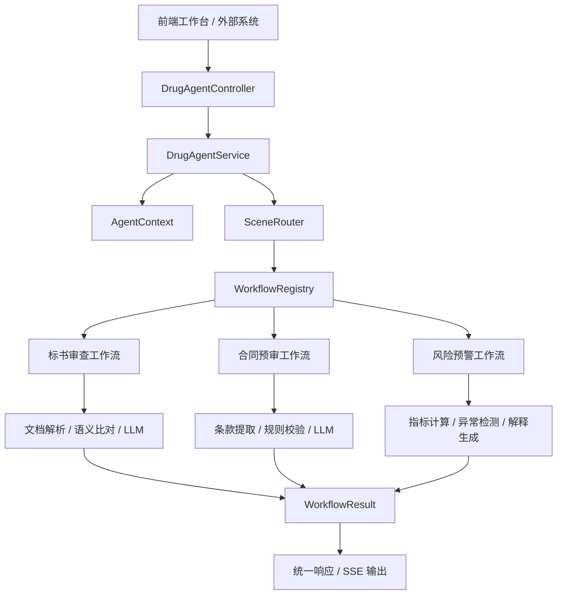

# 上层通用 Agent 总体设计

> 文档版本：v0.1
> 更新时间：2026-03-16
> 适用范围：Drug-Agent 上层通用 Agent 能力层
> 文档目标：为三个核心场景提供统一的技术设计基线，指导后续架构落地、接口扩展与场景接入

---

## 1. 文档背景

根据《三个核心场景产品方向说明》，Drug-Agent 当前重点推进三个方向：

1. 标书雷同与语义查重
2. 合同文件 AI 预审核
3. 医疗耗材与药品合规风险预警

这三个方向的业务对象不同，但在系统层面有明显共性：

- 都需要一个统一入口接收用户请求
- 都需要先判断用户意图或任务类型
- 都需要把不同能力编排成稳定可控的执行链路
- 都需要输出结构化、可解释、可复核的结果

因此，上层需要建设一个“通用 Agent 编排层”，把场景识别、上下文管理、工作流调度、证据汇总、结果输出等共性能力统一抽象出来，避免每个场景都各自实现一套入口和流程。

---

## 2. 设计目标

### 2.1 核心目标

上层通用 Agent 的核心目标是：为不同监管场景提供统一的任务接入与执行框架，让系统能够以“同一入口、不同工作流”的方式稳定扩展。

### 2.2 设计原则

- 统一入口：所有场景从同一 Agent 入口接入，降低前端与外部系统集成成本
- 场景可插拔：新增场景时，尽量通过新增工作流实现，而不是改动主链路
- 结果可解释：系统输出不仅给结论，还要给依据、步骤和风险说明
- 边界清晰：上层负责编排与调度，不承担具体业务规则细节
- 渐进演进：MVP 先采用规则路由和轻量工作流，后续逐步升级为多阶段智能编排

### 2.3 非目标

当前阶段，上层通用 Agent 不承担以下职责：

- 直接输出最终行政处罚、法律意见或医学结论
- 一次性做全自动自治决策
- 替代各个垂直场景中的专业分析引擎
- 承诺覆盖所有类型的医疗监管任务

---

## 3. 系统定位

上层通用 Agent 位于产品技术架构中的“能力编排层”，位置介于前端工作台/外部调用方与底层具体能力模块之间。

其职责可以概括为四件事：

1. 接请求：接收用户问题、附件、场景提示、会话信息
2. 判场景：判断当前请求应进入哪个业务处理链路
3. 调能力：组织对应的工作流、模型、规则、检索或分析模块执行
4. 出结果：输出统一结构的结果对象，供前端展示和后续复核使用

---

## 4. 适用场景映射

### 4.1 场景抽象

从上层视角看，三个核心场景可抽象为三类任务：

| 产品场景 | 上层任务类型 | 主要输入 | 主要输出 |
|---|---|---|---|
| 标书雷同与语义查重 | 文档比对审查型任务 | 两份或多份长文档、对比范围 | 风险摘要、相似片段、判定理由 |
| 合同文件 AI 预审核 | 单文档规则审查型任务 | 合同文件、规则模板、审核要求 | 风险条目、条款提取、修改建议 |
| 医疗耗材与药品合规风险预警 | 数据异常分析型任务 | 统计数据、指标区间、时间窗口 | 预警列表、异常归因、核查建议 |

### 4.2 上层统一抽象的价值

虽然具体场景不同，但三者都可以归入统一执行模型：

`请求接入 -> 场景识别 -> 任务编排 -> 证据汇总 -> 风险输出`

这意味着上层可以沉淀共性能力，而将差异化留给下层场景工作流。

---

## 5. 总体架构设计

### 5.1 架构分层

建议将上层通用 Agent 划分为五层：

1. 接入层
2. 路由层
3. 编排层
4. 能力层
5. 输出层

各层职责如下：

| 层级 | 模块 | 职责 |
|---|---|---|
| 接入层 | API Controller / SSE 接口 / 工作台入口 | 接收请求，管理同步与流式响应 |
| 路由层 | SceneRouter | 判断任务场景，给出路由原因 |
| 编排层 | DrugAgentService / WorkflowRegistry / SceneWorkflow | 组织任务执行顺序，调度对应工作流 |
| 能力层 | LLM、Prompt、规则引擎、RAG、文档解析、数据分析服务 | 提供具体业务处理能力 |
| 输出层 | WorkflowResult / API Response / EvidenceItem | 统一封装风险等级、证据、步骤和最终结果 |

### 5.2 当前代码骨架对应关系

仓库当前已经具备上层通用 Agent 的基础实现雏形：

- `DrugAgentService`：统一调度入口
- `SceneRouter`：场景识别与路由
- `WorkflowRegistry`：工作流注册与查找
- `SceneWorkflow`：场景工作流标准接口
- `AgentContext`：单次调用上下文对象
- `WorkflowResult`：统一结果对象
- `AgentChatService`：基础模型调用与会话记忆封装

这说明“上层通用 Agent”并不是纯概念设计，而是可以在现有骨架上继续演进。

### 5.3 架构示意



---

## 6. 核心对象设计

### 6.1 AgentContext

`AgentContext` 用于贯穿一次完整调用链，承载请求和执行态信息。

建议其长期承担以下内容：

- 请求标识：`traceId`
- 会话标识：`sessionId`
- 用户标识：`userId`
- 用户原始问题：`query`
- 附件引用：`fileIds`
- 命中场景：`sceneType`
- 执行中间态：`attributes`

设计意图：

- 保证链路可追踪
- 便于多阶段工作流传递上下文
- 让上层服务与下层能力以统一方式交换信息

后续建议：

- 将 `attributes` 中频繁出现的字段逐步强类型化
- 为文件解析结果、检索结果、规则匹配结果增加专门对象

### 6.2 SceneType

`SceneType` 是上层的场景枚举，是所有路由、调度与结果输出的主键。

建议中长期统一为以下语义更清晰的枚举值：

- `TENDER_REVIEW`
- `CONTRACT_PRECHECK`
- `RISK_ALERT`
- `GENERAL_QA`
- `UNKNOWN`

说明：

- 当前代码中场景命名与产品文档还未完全对齐
- 后续应以产品语义统一枚举命名，避免 `COMPLIANCE_REVIEW` 一类名称覆盖过宽

### 6.3 SceneWorkflow

`SceneWorkflow` 是场景工作流标准接口，建议保持两个稳定方法：

- `support()`：声明工作流支持的场景
- `execute(context)`：执行业务链路并返回统一结果

这一接口的核心意义是把“新增场景”转化为“新增一个工作流实现”，从而保证主链路稳定。

### 6.4 WorkflowResult

`WorkflowResult` 是通用输出对象，建议保持以下基础字段：

- `scene`
- `answer`
- `riskLevel`
- `evidenceList`
- `steps`

后续可扩展字段：

- `summary`
- `structuredData`
- `recommendations`
- `confidence`
- `reviewActions`

这样既能满足当前工作台展示，也能支持后续报表、导出、复核流转。

---

## 7. 核心执行流程设计

### 7.1 标准同步流程

```text
1. 接入层接收请求
2. 构建 AgentContext
3. SceneRouter 判断场景
4. WorkflowRegistry 获取对应 SceneWorkflow
5. 工作流调用具体能力模块执行
6. 汇总证据、步骤、结论和风险等级
7. 输出统一结构响应
```

### 7.2 流式响应流程

对于需要打字机效果或长结果渐进返回的场景，复用统一流式链路：

```text
1. 返回 meta 事件：traceId、scene、routeReason
2. 持续返回 delta 事件：模型或工作流生成内容
3. 返回 done 事件：风险等级、步骤、证据摘要
```

这种方式适合：

- 通用问答
- 合同预审结果生成
- 大段分析说明输出

不适合直接用于必须等待完整计算结果的重型比对任务，后者可以采用“异步任务 + 轮询结果”模式。

### 7.3 路由策略设计

当前推荐采用三段式路由：

1. 显式场景优先
2. 输入特征规则判断
3. 未命中则进入兜底

具体含义如下：

- 如果前端明确传了场景提示，优先尊重上游系统意图
- 如果带有附件、结构化数据或明显关键词，走规则路由
- 如果仍无法识别，再进入 `UNKNOWN` 或二阶段智能分类

这样做的好处是：

- 路由可解释
- 易于调试
- 适合 MVP 快速上线

后续升级方向：

- 规则路由升级为“规则 + LLM 分类 + 历史行为”混合路由
- 支持多标签任务识别
- 支持复杂请求拆分成多个子任务

---

## 8. 三个场景的工作流建议

### 8.1 场景一：标书雷同与语义查重工作流

建议工作流拆分为：

1. 文件接入与解析
2. 文档分段与标准化清洗
3. 候选片段召回
4. 语义相似度计算
5. 正常引用过滤
6. 高风险片段解释生成
7. 审查报告汇总

上层需要承担的责任：

- 接收任务与附件引用
- 编排执行顺序
- 汇总对照证据与风险结论

下层能力模块负责：

- OCR 或文档抽取
- 向量召回或规则比对
- 语义改写识别

### 8.2 场景二：合同文件 AI 预审核工作流

建议工作流拆分为：

1. 合同文本解析
2. 基础信息抽取
3. 条款切分与归类
4. 规则库比对
5. 风险级别判断
6. 修改建议生成
7. 输出预审意见

上层重点：

- 保持统一输入输出格式
- 支持按合同类型切换规则模板
- 支持结果以条目化结构输出

### 8.3 场景三：医疗耗材与药品合规风险预警工作流

建议工作流拆分为：

1. 指标数据接入
2. 数据质量校验
3. 趋势计算与异常识别
4. 同比、环比、同类对标分析
5. 风险归因生成
6. 核查建议生成
7. 预警结果落库与展示

上层重点：

- 支持周期性监测任务
- 支持结果结构化输出
- 支持复核动作和闭环状态回传

---

## 9. 模块拆分建议

### 9.1 推荐模块结构

建议将上层通用 Agent 抽象为以下模块：

| 模块 | 说明 |
|---|---|
| `controller` | 对外 API 和 SSE 接口 |
| `agent` | 路由、注册表、上下文等通用编排对象 |
| `workflow` | 各场景工作流实现 |
| `service` | 模型调用、任务调度、场景服务编排 |
| `prompt` | Prompt 模板管理 |
| `parser` | 文档解析、字段抽取 |
| `retrieval` | 检索与召回能力 |
| `rule` | 规则匹配与校验引擎 |
| `analysis` | 数据分析、异常识别、评分计算 |
| `domain` | 请求、响应、结果和证据对象 |

### 9.2 通用能力与场景能力的边界

建议明确边界：

- 上层通用 Agent 负责“怎么调度”
- 场景工作流负责“怎么执行”
- 底层能力模块负责“怎么计算”

这样可以避免 `DrugAgentService` 逐步膨胀成“大一统业务类”。

---

## 10. 统一输入输出设计

### 10.1 输入模型建议

统一请求建议至少包含：

| 字段 | 说明 |
|---|---|
| `sessionId` | 会话 ID，用于多轮上下文 |
| `userId` | 用户 ID，用于审计和权限隔离 |
| `query` | 用户文本请求 |
| `sceneHint` | 可选场景提示 |
| `fileIds` | 附件或文档引用 |
| `payload` | 可选扩展数据，如指标、规则模板、任务参数 |

### 10.2 输出模型建议

统一响应建议至少包含：

| 字段 | 说明 |
|---|---|
| `traceId` | 链路追踪 ID |
| `scene` | 命中场景 |
| `routeReason` | 路由原因 |
| `summary` | 结果摘要 |
| `answer` | 主体说明文本 |
| `riskLevel` | 风险等级 |
| `evidenceList` | 证据列表 |
| `steps` | 执行步骤 |
| `recommendations` | 建议动作 |
| `structuredData` | 结构化结果，供 UI 精细展示 |

这样设计可以同时满足：

- 自然语言展示
- 卡片化 UI 渲染
- 结果导出
- 审计追踪

---

## 11. 可解释性与审计设计

医疗监管场景对“为什么这样判断”有很高要求，因此上层通用 Agent 需要内建可解释性机制。

建议至少沉淀以下信息：

- 路由原因：为什么进入该场景
- 执行步骤：经过了哪些阶段
- 证据来源：结论来自哪段文本、哪项指标或哪条规则
- 风险等级依据：为什么是低、中、高风险
- 输出时间与执行链路：便于审计和复盘

对于高风险输出，建议额外保留：

- 规则命中记录
- Prompt 版本
- 模型版本
- 数据快照引用

---

## 12. 稳定性与安全设计

### 12.1 稳定性要求

- 路由失败时必须有兜底工作流
- 能力模块异常时要保证统一错误返回
- 长任务要支持超时控制与异步化
- 流式响应断开时要能安全结束执行

### 12.2 安全要求

- 明确系统仅提供辅助判断，不输出越权结论
- 对会话与文件数据做用户隔离
- 对上传文档和结构化数据做基础校验
- 对模型输出增加安全审查与敏感内容约束

### 12.3 合规要求

- 记录关键操作日志
- 保留必要审计轨迹
- 避免把模型输出直接当作最终结论

---

## 13. 演进路线建议

### 13.1 第一阶段：统一骨架可运行

目标：

- 跑通统一入口、场景路由、工作流注册、统一响应
- 支持最基本的问答和场景分发
- 建立工作台演示闭环

对应当前仓库状态：

- 已基本具备该阶段骨架

### 13.2 第二阶段：接入真实场景能力

目标：

- 标书查重接入文档解析和相似片段识别
- 合同预审接入条款抽取和规则校验
- 风险预警接入指标计算和异常分析

关键变化：

- 上层保留不变
- 下层工作流逐步从“对话式能力”升级为“任务式能力”

### 13.3 第三阶段：智能编排升级

目标：

- 从单工作流执行升级为多节点编排
- 支持复杂任务拆解
- 支持场景内多工具协同

可升级方向：

- 引入 Planner
- 引入工具调用协议
- 支持多 Agent 协作

---

## 14. 当前实现与目标设计的差距

结合现有代码，当前还存在以下典型差距：

### 14.1 场景定义与产品语义尚未完全一致

当前代码中的 `SceneType` 与产品文档中的三大场景还没有一一精确对齐，后续需要统一命名与职责边界。

### 14.2 工作流仍偏“对话代理”

现阶段多个工作流主要还是调用 `AgentChatService` 输出文本，尚未真正接入文档比对、合同规则校验、异常分析等专用能力。

### 14.3 中间态仍较弱类型

`AgentContext.attributes` 适合 MVP，但随着场景复杂度增加，需要逐步沉淀为明确的数据对象。

### 14.4 输出结构还偏轻

当前 `WorkflowResult` 已有基础字段，但距离真正支撑复核、导出、审计还需要更丰富的结构化字段。

---

## 15. 下一步落地建议

建议按以下顺序推进：

1. 先统一 `SceneType` 和三个核心场景的技术命名
2. 在上层通用 Agent 文档基础上，分别拆出三个场景专项设计
3. 为每个场景定义输入数据契约、工作流步骤和输出结构
4. 选择一个场景做最小可运行版本，优先验证整体编排架构
5. 补齐日志、审计、错误码和异步任务机制

---

## 16. 建议产出清单

基于本文档，后续建议继续补齐以下技术文档：

1. `场景一路由与文档比对工作流设计.md`
2. `场景二合同预审核工作流设计.md`
3. `场景三风险预警工作流设计.md`
4. `上层通用Agent接口设计.md`
5. `上层通用Agent数据结构设计.md`
6. `上层通用Agent演进路线与版本规划.md`

---

## 17. 总结

上层通用 Agent 的本质，不是一个单独的大模型对话入口，而是 Drug-Agent 面向多场景监管任务的统一编排底座。

它要解决的核心问题不是“模型怎么回答”，而是：

- 请求如何统一接入
- 场景如何稳定识别
- 能力如何按任务编排
- 结果如何结构化输出
- 风险如何做到可解释、可复核、可追踪

从当前仓库实现看，项目已经具备这套设计的基础雏形。下一步最重要的不是再抽象更多概念，而是围绕三个核心场景，把这套上层骨架逐步接上真实能力模块，形成可验证、可演示、可演进的产品能力。
