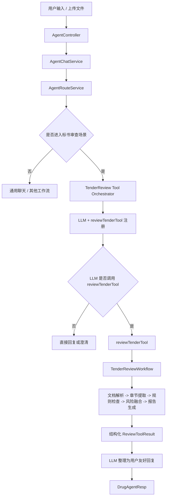

# 标书审查 Tool 化落地技术设计

> 文档版本：v1.0
> 更新时间：2026-03-26
> 适用范围：Drug-Agent 标书审查场景、上层通用 Agent、后续 Spring AI Tool 接入

## 1. 文档目标

本文档用于在不改动现有目录结构与项目总体架构的前提下，给 Drug-Agent 输出一份可直接落地的“标书审查 Tool 化”技术设计。

本文档保留你想要的核心思路：

```text
用户说话
-> LLM 判断：需不需要调用审查标书工具
-> 调用 reviewTenderTool(...)
-> Java Workflow 真正执行：
   文档解析 -> 章节提取 -> 规则检查 -> 风险评分 -> 生成结构化结果
-> LLM 只负责把结果润色成对用户友好的回复
```

但实现上不会推翻你当前项目，而是基于你现有代码进行收敛与衔接。

---

## 2. 设计结论

### 2.1 核心结论

Drug-Agent 当前已经具备标书审查场景的主要业务骨架，缺的不是重新设计一套 workflow，而是增加一个“上层 Tool 调用入口”，把现有的：

- 路由能力
- 会话能力
- 文档解析能力
- 标书审查工作流
- 结构化报告能力

串成一条新的 Agent 执行模式。

### 2.2 本次推荐方案

本项目推荐采用“双层路由、单条审查主链路”的落地方式：

1. 上层仍保留当前 `AgentController -> AgentChatService -> AgentRouteService -> SceneWorkflow` 主链路
2. 在标书审查场景内新增 `reviewTenderTool` 作为 LLM 可调用工具入口
3. `reviewTenderTool` 内部不做业务判断，只负责参数校验、任务准备、调用 `TenderReviewWorkflow`
4. `TenderReviewWorkflow` 继续作为真实审查引擎，保持“确定性执行”
5. LLM 只负责两件事：
   - 判断是否要调用工具
   - 将结构化审查结果整理成用户易读回复

这样做的价值是：

- 用户体验上像 AI 自动理解后完成审查
- 工程实现上继续复用你现有的 Java 工作流
- 结果仍然来自规则引擎与结构化处理，便于审计和复核
- 后续可从单工具平滑演进到多工具

---

## 3. 与当前项目的映射关系

### 3.1 当前已具备的能力

从现有仓库看，以下关键模块已经存在：

#### 上层 Agent 入口

- `src/main/java/com/liang/drugagent/controller/AgentController.java`
- `src/main/java/com/liang/drugagent/agent/chat/AgentChatService.java`

当前已支持：

- 同步对话
- 流式对话
- 上传文件后进入场景工作流
- 会话消息落库

#### 场景路由层

- `src/main/java/com/liang/drugagent/agent/route/AgentRouteService.java`

当前已支持：

- 显式 `sceneHint` 路由
- 基于文件数量、文件名、关键词的规则路由
- LLM 辅助路由
- 最终仲裁决策

#### 标书审查主工作流

- `src/main/java/com/liang/drugagent/scene/tender_review/workflow/TenderReviewWorkflow.java`

当前已支持：

- 读取 `TenderReviewData`
- 执行规则引擎
- 执行免责引擎
- 风险融合
- 证据组装
- 报告生成

#### 标书解析与规则能力

- `src/main/java/com/liang/drugagent/scene/tender_review/service/TenderDocumentParseService.java`
- `src/main/java/com/liang/drugagent/scene/tender_review/support/TenderRuleEngine.java`
- `src/main/java/com/liang/drugagent/scene/tender_review/support/executor/*.java`
- `src/main/java/com/liang/drugagent/scene/tender_review/service/RiskFusionService.java`
- `src/main/java/com/liang/drugagent/scene/tender_review/service/EvidenceAssemblerService.java`
- `src/main/java/com/liang/drugagent/scene/tender_review/service/ReportGenerationService.java`

#### 通用 Tool 基础雏形

- `src/main/java/com/liang/drugagent/tool/executor/ToolExecutor.java`
- `src/main/java/com/liang/drugagent/tool/document/DocumentParseTool.java`

### 3.2 当前缺失的关键能力

要实现你要的那条链路，目前还缺三块：

1. 一个真正暴露给 LLM 的 `reviewTenderTool`
2. 一个专门给 Tool 使用的结构化请求与结构化返回对象
3. 一个“工具结果转用户回复”的轻量编排层

换句话说，当前系统已经有“审查引擎”，现在要补的是“工具化接入层”。

---

## 4. 目标架构

## 4.1 总体架构



## 4.2 分层职责

### A. 接入层

职责：

- 接收用户问题、文件、会话 ID
- 保留当前同步 / SSE / 文件上传接口
- 不承担具体审查判断

对应现有模块：

- `AgentController`

### B. 上层编排层

职责：

- 构建 `AgentChatContext`
- 调用路由服务判断场景
- 对于标书场景，进入 Tool 化编排

对应现有模块：

- `AgentChatService`

### C. 场景路由层

职责：

- 判断当前请求是否属于标书审查
- 决定是否需要澄清
- 不直接输出审查结论

对应现有模块：

- `AgentRouteService`

### D. Tool 编排层

职责：

- 将 `reviewTenderTool` 注册给 LLM
- 提供 Tool 调用上下文
- 接收 Tool 返回结果
- 再次调用 LLM 做自然语言整理

本次建议新增：

- `scene/tender_review/tool/ReviewTenderTool.java`
- `scene/tender_review/tool/ReviewTenderToolRequest.java`
- `scene/tender_review/tool/ReviewTenderToolResult.java`
- `scene/tender_review/service/TenderReviewToolOrchestrator.java`

### E. Workflow 层

职责：

- 真正执行业务链路
- 保持确定性和可追溯

继续复用：

- `TenderReviewWorkflow`

### F. 规则与报告层

职责：

- 风险识别
- 免责判定
- 风险融合
- 证据编排
- 结构化报告生成

继续复用现有 `scene/tender_review` 下服务与引擎。

---

## 5. 关键设计原则

### 5.1 LLM 负责“是否调用”，不负责“怎么裁决”

这里必须明确边界：

- LLM 可以判断“用户是否要做标书审查”
- LLM 可以判断“本次更关注哪类风险”
- LLM 可以根据结构化结果生成更自然的回答

但以下内容不能交给 LLM 自由发挥：

- 文档是否解析成功
- 哪些规则命中
- 风险分如何计算
- 哪些证据构成审查依据
- 最终结构化审查报告

这些必须由 `TenderReviewWorkflow` 和其下游服务负责。

### 5.2 Tool 是受控入口，不是黑盒 AI 审查器

`reviewTenderTool` 必须是稳定边界：

- 入参固定
- 返回固定
- 内部只调用受控 Java 逻辑
- 全链路可落日志

### 5.3 不改目录结构，只做增量扩展

本方案明确不做以下动作：

- 不重构 `agent`、`scene`、`tool` 目录
- 不推翻现有 `SceneWorkflow` 体系
- 不把所有场景一次性改成 Spring AI Tool

本次只在标书审查场景做第一条 Tool 化闭环。

---

## 6. 核心流程设计

## 6.1 普通聊天流程

```text
用户输入普通问题
-> AgentChatService
-> AgentRouteService 判断为 UNKNOWN 或其他非标书场景
-> 走现有通用对话或其他工作流
-> 返回结果
```

## 6.2 标书审查 Tool 化流程

```text
用户输入“帮我看看这两份标书是否有围标风险”
-> AgentController 接收请求
-> AgentChatService 构建上下文
-> AgentRouteService 判定 scene = TENDER_REVIEW
-> 若有上传文件，先沿用当前上传与解析准备逻辑，补齐 TenderReviewData
-> AgentChatService 不直接 executeWorkflow，而是进入 TenderReviewToolOrchestrator
-> Orchestrator 注册 reviewTenderTool 给 LLM
-> LLM 根据用户问题决定是否调用 reviewTenderTool
-> reviewTenderTool(request) 被调用
-> Tool 内部调用 TenderReviewWorkflow
-> Workflow 执行：
   文档解析 -> 结构化提取 -> 规则命中 -> 豁免处理 -> 风险融合 -> 证据组装 -> 报告生成
-> Tool 返回结构化结果 ReviewTenderToolResult
-> LLM 将结果整理成用户可读回复
-> AgentChatService 将最终 answer + report + evidence 返回给前端
```

## 6.3 为什么保留双层路由

你现在已经有 `AgentRouteService`，它的价值很大，不应该废掉。

推荐保留双层判断：

1. 第一层：`AgentRouteService` 判断是否属于标书审查大场景
2. 第二层：进入标书审查场景后，由 LLM 判断这次是否调用 `reviewTenderTool`

这样可以避免两类问题：

- 所有请求都直接丢给 Tool 模式，成本高
- 完全依赖 Tool 调用判断，丢失当前上层场景路由能力

---

## 7. Tool 设计

## 7.1 Tool 设计目标

`reviewTenderTool` 的职责不是“完成一切”，而是：

- 接收 LLM 传来的结构化审查请求
- 找到本次会话对应的文件和任务上下文
- 触发标书审查工作流
- 返回结构化审查结果

## 7.2 推荐入参

```java
public record ReviewTenderToolRequest(
        String sessionId,
        List<String> fileIds,
        String reviewFocus,
        String userInstruction,
        Boolean needStructuredReport
) {
}
```

字段说明：

- `sessionId`：关联聊天记录、审计日志、上下文
- `fileIds`：本次待审查文档 ID 列表，兼容单份或多份
- `reviewFocus`：审查重点，例如“围标风险”“技术方案雷同”“商务条款”
- `userInstruction`：用户额外补充要求
- `needStructuredReport`：是否返回完整结构化报告，默认 `true`

## 7.3 推荐返回结构

```java
public record ReviewTenderToolResult(
        boolean success,
        String caseId,
        String summary,
        String riskLevel,
        Integer score,
        List<String> steps,
        ReviewReport report,
        List<EvidenceItem> evidenceList,
        String message
) {
}
```

字段说明：

- `success`：工具执行是否成功
- `caseId`：标书审查任务 ID，便于审计和复核
- `summary`：给 LLM 用的摘要，不是最终用户话术
- `riskLevel`：风险等级
- `score`：风险分
- `steps`：执行步骤
- `report`：结构化审查报告
- `evidenceList`：证据列表
- `message`：错误或补充说明

## 7.4 Tool 方法形态

建议实现为单职责服务类，不要塞到已有 `ToolExecutor` 里混成一个通用大执行器。

建议形态：

```java
@Component
public class ReviewTenderTool {

    public ReviewTenderToolResult reviewTender(ReviewTenderToolRequest request) {
        // 1. 参数校验
        // 2. 根据 session/fileIds 获取审查上下文
        // 3. 组装 AgentChatContext 或 TenderReviewData
        // 4. 调用 TenderReviewWorkflow
        // 5. 转成 ToolResult 返回
    }
}
```

原因：

- 标书审查是复杂业务 Tool，不适合和通用文档解析 Tool 混在一个执行器里
- 后续合同预审、风险预警也会有自己的 Tool
- 每个 Tool 对应一个明确业务边界，更利于演进

---

## 8. Workflow 落地设计

## 8.1 现有 Workflow 可直接保留

当前 `TenderReviewWorkflow` 已经基本符合目标形态：

```text
读取 TenderReviewData
-> TenderRuleEngine.execute
-> TenderExemptionEngine.apply
-> RiskFusionService.fuse
-> EvidenceAssemblerService.assemble
-> ReportGenerationService.generate
-> WorkflowResult
```

这部分不建议重写。

## 8.2 建议补强的职责边界

为了更适配 Tool 化调用，建议明确三层输入输出边界：

### 第一层：输入准备层

负责：

- 校验文件是否存在
- 根据 `fileIds` 获取文档
- 文档解析
- 构造 `TenderReviewData`

当前可复用：

- `TenderDocumentParseService`
- `TenderReviewDataAssembler`
- `TenderCaseService`

### 第二层：审查执行层

负责：

- 规则命中
- 免责处理
- 风险融合
- 报告生成

当前直接复用：

- `TenderReviewWorkflow`

### 第三层：结果包装层

负责：

- `WorkflowResult -> ReviewTenderToolResult`
- `ReviewTenderToolResult -> DrugAgentResp`

本次建议新增轻量适配逻辑，不要把前端响应逻辑直接写进 workflow。

## 8.3 Workflow 的固定步骤

对于你要的“真实 Java workflow”，建议在文档中明确为以下稳定步骤：

1. 文档读取与格式校验
2. 文档解析
3. 章节树与内容块提取
4. 关键字段抽取与标准化
5. 规则检查
6. 免责处理
7. 风险评分与融合
8. 证据组装
9. 结构化报告生成

其中：

- 第 1 到 4 步属于输入准备
- 第 5 到 8 步属于业务裁决
- 第 9 步属于结果固化

---

## 9. 与当前代码的具体落地点

## 9.1 `AgentChatService` 的改造点

当前 `AgentChatService` 在识别到 `TENDER_REVIEW` 后，会直接执行：

```text
executeWorkflow(context, decision)
```

建议改成：

```text
如果 scene == TENDER_REVIEW:
    进入 TenderReviewToolOrchestrator
否则:
    保持原 executeWorkflow
```

即：

```java
if (decision.getScene() == SceneEnum.TENDER_REVIEW) {
    return tenderReviewToolOrchestrator.handle(context, decision);
}
return executeWorkflow(context, decision);
```

这样不会影响合同预审、风险预警等其他场景。

## 9.2 `handleFileUpload(...)` 的改造点

当前上传文件后已经会做：

- 创建会话
- 保存消息
- 路由
- 标书场景时补齐 metadata

这里建议继续沿用，不需要推翻。

但要增加一个明确约束：

- 文件上传场景下，`TenderReviewToolOrchestrator` 优先读取已经准备好的 `TenderReviewData`
- 如果 metadata 不完整，再兜底走解析与组装

这样可以避免 Tool 里重复解析文档。

## 9.3 `TenderReviewWorkflow` 的改造点

原则上不动主逻辑，只做两个增强：

1. 增加更明确的步骤元信息
2. 如果后续 Tool 化需要，可补一个“纯结构化执行入口”

可选新增方法：

```java
public WorkflowResult execute(TenderReviewData tenderReviewData) {
    return executeRuleFlow(tenderReviewData);
}
```

这样 Tool 层就不一定非得组装完整 `AgentChatContext`。

## 9.4 `WorkflowResult` 的使用约束

当前 `WorkflowResult` 已经是统一中间结果对象，建议继续保留，不直接暴露给 LLM。

推荐关系：

```text
TenderReviewWorkflow -> WorkflowResult -> ReviewTenderToolResult -> DrugAgentResp
```

这样职责更清晰：

- `WorkflowResult`：工作流内部统一结果
- `ReviewTenderToolResult`：给 Tool 编排层用
- `DrugAgentResp`：给前端接口用

---

## 10. LLM 编排设计

## 10.1 LLM 在此方案中的唯一职责

在这个方案里，LLM 只做三件事：

1. 理解用户是否想做标书审查
2. 在标书审查场景中决定是否调用 `reviewTenderTool`
3. 将工具返回的结构化结果改写为用户友好话术

## 10.2 System Prompt 约束原则

标书场景的 system prompt 必须明确告诉模型：

- 你不能自己编造审查结果
- 涉及标书风险判断时，应优先调用 `reviewTenderTool`
- 工具未返回成功前，不要输出确定性结论
- 最终回答必须忠于工具返回的风险等级、分数和证据摘要

推荐约束语义：

```text
当用户要求审查、对比、识别围标/串标/雷同风险时，
你必须优先调用 reviewTenderTool 获取结构化审查结果。
你不能基于自己的常识直接输出审查结论。
工具返回后，你只负责将结果整理成简洁、专业、对用户友好的中文说明。
```

## 10.3 Tool 调用后的回复模板

建议让 LLM 按固定结构组织：

1. 总体判断
2. 风险等级与分数
3. 主要风险点
4. 建议动作
5. 如需，提示查看结构化报告

这样既有自然语言体验，又不会失控。

---

## 11. 数据与审计设计

## 11.1 必须记录的日志

该场景属于高风险业务，建议至少记录以下审计信息：

### 会话级

- `sessionId`
- `traceId`
- 用户原始问题
- 上传文件列表
- 命中场景

### Tool 调用级

- Tool 名称：`reviewTenderTool`
- Tool 入参
- Tool 调用时间
- Tool 是否成功
- Tool 返回摘要

### Workflow 结果级

- `caseId`
- 风险等级
- 风险分
- 命中规则数
- 免责条目数
- 报告版本

## 11.2 为什么不能只记最终回答

如果只存 LLM 最终润色后的自然语言，会有三个问题：

1. 无法审计真实依据
2. 无法复现问题
3. 无法支撑后续人工复核

所以必须把“结构化审查结果”作为真正的业务归档对象。

---

## 12. 异常与降级设计

## 12.1 工具不应静默失败

`reviewTenderTool` 出错时，必须返回结构化失败结果，例如：

```java
new ReviewTenderToolResult(
        false,
        caseId,
        null,
        null,
        null,
        List.of("参数校验", "任务准备"),
        null,
        List.of(),
        "缺少可审查文件，无法执行标书审查"
)
```

## 12.2 推荐异常分层

### A. 用户输入问题

例如：

- 没有文件
- 文件数量不足
- 文件格式不支持

处理策略：

- 直接返回明确提示
- 引导用户补充文件或说明

### B. 解析问题

例如：

- 文档损坏
- 解析器报错
- 内容为空

处理策略：

- Tool 返回失败结构
- LLM 转成用户能理解的话术

### C. Workflow 内部问题

例如：

- 某个规则执行器异常
- 报告生成失败

处理策略：

- 记录日志
- 尽量降级输出部分结果
- 若无法保证结果可信，则中止并提示人工复核

### D. LLM 问题

例如：

- 未按要求调用工具
- 超时
- 结果润色失败

处理策略：

- 对高确定性场景可由后端强制直接调用 Tool
- 兜底返回结构化摘要，不因 LLM 格式问题丢失业务结果

---

## 13. 最小可落地实施方案

## 13.1 第一阶段目标

第一阶段只做一件事：

让“用户对话触发标书审查”从当前“直接执行 workflow”升级为“LLM 调工具 -> workflow 执行 -> LLM 润色”。

## 13.2 最小改造清单

建议最小新增以下类：

```text
src/main/java/com/liang/drugagent/scene/tender_review/tool/ReviewTenderTool.java
src/main/java/com/liang/drugagent/scene/tender_review/tool/ReviewTenderToolRequest.java
src/main/java/com/liang/drugagent/scene/tender_review/tool/ReviewTenderToolResult.java
src/main/java/com/liang/drugagent/scene/tender_review/service/TenderReviewToolOrchestrator.java
src/main/java/com/liang/drugagent/scene/tender_review/support/ReviewTenderToolResultMapper.java
```

建议最小修改以下类：

```text
src/main/java/com/liang/drugagent/agent/chat/AgentChatService.java
src/main/java/com/liang/drugagent/scene/tender_review/workflow/TenderReviewWorkflow.java
```

## 13.3 第一阶段实施步骤

### Step 1

新增 Tool 请求 / 结果对象，先把结构定义稳定下来。

### Step 2

实现 `ReviewTenderTool`，内部先直接复用现有 `TenderReviewWorkflow`。

### Step 3

实现 `TenderReviewToolOrchestrator`，封装：

- Tool 注册
- LLM 调用
- Tool 结果转最终回复

### Step 4

在 `AgentChatService` 中仅对 `TENDER_REVIEW` 场景切到新编排。

### Step 5

补充日志和错误处理，保证至少能审计：

- 用户问了什么
- 是否调用 Tool
- Tool 传了什么参数
- 最终命中了哪些风险

---

## 14. 后续演进路线

## 14.1 第二阶段

在标书审查场景内继续拆分子工具，例如：

- `reviewTenderTool`
- `compareTenderSectionsTool`
- `explainRiskEvidenceTool`

但这一步必须建立在第一阶段 Tool 边界稳定之后。

## 14.2 第三阶段

把合同预审、风险预警也逐步 Tool 化，形成统一模式：

```text
Scene 路由
-> Scene 内 Tool 编排
-> Workflow 执行
-> LLM 润色
```

## 14.3 第四阶段

引入更细粒度 Agent 化能力，例如：

- 多工具协作
- 异步长任务
- 人工复核回流
- 审查策略可配置

但无论怎么演进，都建议保留当前原则：

业务裁决始终由确定性 workflow 主导，而不是完全交给模型。

---

## 15. 最终方案总结

这份方案的核心不是“把标书审查改成 AI 随便回答”，而是把你当前已经做出来的标书审查能力，升级成一条更像 Agent 的调用链路：

```text
用户请求
-> 上层 Agent 判断进入标书审查场景
-> 标书场景内部启用 reviewTenderTool
-> Tool 调用 TenderReviewWorkflow
-> Workflow 输出结构化报告
-> LLM 对结构化结果做友好表达
-> 返回前端与会话系统
```

它满足你最想保留的思路，同时又贴合你当前项目现状，因为：

- 不改目录结构
- 不推翻 `AgentChatService`
- 不推翻 `AgentRouteService`
- 不推翻 `TenderReviewWorkflow`
- 只新增一层 Tool 化编排入口

这是当前项目最稳、最容易推进、也最符合后续扩展方向的落地方式。

