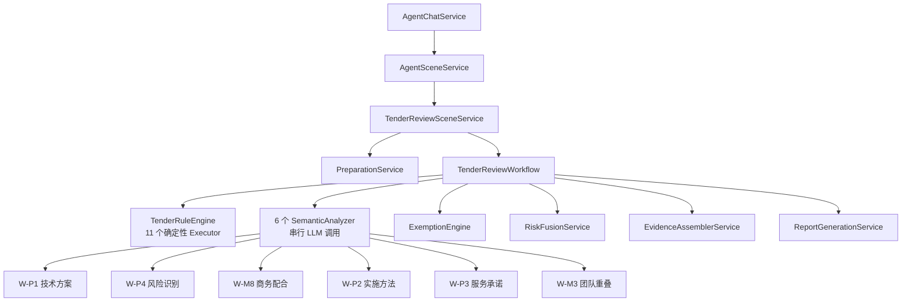

# 标书审查场景优化分析报告

> 基于对完整后端链路（从 [AgentSceneService](file:///c:/Users/Administrator/Desktop/%E8%8D%AF%E5%93%81%E7%9B%91%E7%AE%A1%E9%A1%B9%E7%9B%AE/drugAgent/src/main/java/com/liang/drugagent/agent/chat/AgentSceneService.java#44-488) 到 [ReportGenerationService](file:///c:/Users/Administrator/Desktop/%E8%8D%AF%E5%93%81%E7%9B%91%E7%AE%A1%E9%A1%B9%E7%9B%AE/drugAgent/src/main/java/com/liang/drugagent/scene/tender_review/service/ReportGenerationService.java#34-617)）和前端展示层的代码审阅，结合两份技术设计文档的分析结果。

---

## 当前架构概览



---

## 一、性能瓶颈：6 个语义分析器串行执行

> [!CAUTION]
> 这是当前最严重的性能问题。6 个 LLM 分析器在 [executeSemanticAnalyzers()](file:///c:/Users/Administrator/Desktop/%E8%8D%AF%E5%93%81%E7%9B%91%E7%AE%A1%E9%A1%B9%E7%9B%AE/drugAgent/src/main/java/com/liang/drugagent/scene/tender_review/workflow/TenderReviewWorkflow.java#185-256) 中串行依次调用，每个分析器又可能对多个文档对的多组候选片段发起多次 LLM 请求。

**当前代码** — [TenderReviewWorkflow.java](file:///c:/Users/Administrator/Desktop/药品监管项目/drugAgent/src/main/java/com/liang/drugagent/scene/tender_review/workflow/TenderReviewWorkflow.java#L187-L249)：

```java
// 串行调用 6 个分析器，每个都独立 try-catch
proposalSemanticAnalyzer.analyze(data);           // W-P1
riskIdentificationSemanticAnalyzer.analyze(data); // W-P4
commercialCoordinationSemanticAnalyzer.analyze(data); // W-M8
implementationMethodSemanticAnalyzer.analyze(data);   // W-P2
serviceCommitmentSemanticAnalyzer.analyze(data);      // W-P3
teamOverlapSemanticAnalyzer.analyze(data);            // W-M3
```

**优化建议**：

| 方案 | 做法 | 预期收益 |
|:---|:---|:---|
| **并行执行** | 使用 `CompletableFuture.allOf()` 并行调度 6 个分析器 | 总耗时从 6T 降至 ~T（最慢分析器耗时） |
| **分级执行** | Phase 1 先跑高优 W-P1/W-P4/W-M8，Phase 2 再按需跑剩余 | 减少不必要 LLM 调用，降成本降时延 |
| **超时熔断** | 为每个分析器设置独立超时（如 30s），超时降级而非无限等待 | 避免单个 LLM 慢请求拖垮整条链路 |

---

## 二、文档解析能力不足

> [!WARNING]
> 当前 [TenderDocumentParseService](file:///c:/Users/Administrator/Desktop/%E8%8D%AF%E5%93%81%E7%9B%91%E7%AE%A1%E9%A1%B9%E7%9B%AE/drugAgent/src/main/java/com/liang/drugagent/scene/tender_review/service/TenderDocumentParseService.java#21-59) 仅支持 `.docx`、`.doc`、[.md](file:///C:/Users/Administrator/.gemini/antigravity/brain/35f8af3c-7cd8-4a43-9767-cf71b71424e6/task.md) 三种格式，**不支持 PDF**。但在实际业务中，标书文件以 PDF 格式最为常见。

**当前支持**：
- ✅ `.docx` — TenderDocxParser
- ✅ `.doc` — TenderDocParser
- ✅ [.md](file:///C:/Users/Administrator/.gemini/antigravity/brain/35f8af3c-7cd8-4a43-9767-cf71b71424e6/task.md) — TenderMarkdownParser
- ❌ `.pdf` — 不支持
- ❌ `.xlsx` — 不支持（前端上传区域提示支持但实际后端不处理）

**优化建议**：

1. **优先接入 PDF 解析**：集成 Apache PDFBox 或 iText，提取文本 + 结构化章节
2. **引入 OCR 兜底**：对扫描件 PDF，集成 Tika + Tesseract OCR 做图片文字提取
3. **统一前后端格式声明**：前端上传区域声明的格式与后端实际支持格式保持一致
4. **解析质量评分**：对解析结果做「可信度打分」，解析质量差时提醒用户

---

## 三、Prompt 工程优化

> [!IMPORTANT]
> 当前 [TenderReviewJudgePrompt](file:///c:/Users/Administrator/Desktop/%E8%8D%AF%E5%93%81%E7%9B%91%E7%AE%A1%E9%A1%B9%E7%9B%AE/drugAgent/src/main/java/com/liang/drugagent/agent/prompt/tender_review/judge/TenderReviewJudgePrompt.java#22-241) 的 SYSTEM_PROMPT 和具体语义分析器的 Prompt 存在多个优化空间。

### 3.1 主 Prompt 过长且职责混杂

[TenderReviewJudgePrompt.java](file:///c:/Users/Administrator/Desktop/药品监管项目/drugAgent/src/main/java/com/liang/drugagent/agent/prompt/tender_review/judge/TenderReviewJudgePrompt.java) 的 `SYSTEM_PROMPT` 包含了完整审查系统的角色定义、规则表、Few-shot 示例等，但这个 Prompt 主要用于 L3 场景执行层的局部判断。

**问题**：
- Prompt 既有「全文审查」维度的指导，又有「单规则裁决」的 Schema，定位模糊
- `SEMANTIC_JUDGE_PROMPT` 仅一行 "你是标书审查的语义裁判"，过于简洁，缺少判断标准

**建议**：
- 为每个语义分析器（W-P1/W-P4/W-M8 等）定制独立的 Prompt 模板，包含明确的判定标准、反误报约束和输出 Schema
- 主 Prompt 做通用角色定义，具体规则 Prompt 按规则编码独立管理
- 增加具体业务领域的反误报约束（如行业标准引用、法规条文引用不应判定抄袭）

### 3.2 缺少 Prompt 版本管理

当前 Prompt 硬编码在 Java 常量中，无法做 A/B 测试、回滚。

**建议**：引入 Prompt 配置化，至少支持从配置文件或数据库动态加载，便于快速迭代。

---

## 四、风险融合评分机制偏简单

[RiskFusionService.java](file:///c:/Users/Administrator/Desktop/药品监管项目/drugAgent/src/main/java/com/liang/drugagent/scene/tender_review/service/RiskFusionService.java) 当前的评分逻辑：

```
基础分 = maxWeight(所有 RuleHit)
+ 8 （若有高优硬规则）
+ 7 （若命中 ≥2 类规则）
+ 5 （若命中 ≥3 次）
+ 5 （若跨文档证据）
+ 5 （若证据 ≥4 条）
- min(豁免数 × 3, 12)
```

**问题**：
- 以最高单项权重作为基础分，中等命中的累加效应可能被忽略
- LLM 语义命中和确定性规则的置信度差异未充分体现（LLM 置信度 0.72 和 0.95 的区分度不够）
- 多文档场景（≥3 份标书）的交叉验证逻辑缺失

**建议**：
1. **引入加权 Sigmoid 融合**：用连续函数替代离散阈值
2. **区分 LLM 和确定性规则的置信度映射**：LLM 结果应按置信度做连续加权，而非阶梯式
3. **增加规则间关联加分**：例如 W-M2（联系方式近邻）+ W-M3（团队重叠）同时命中，应给超线性加分
4. **引入衰减机制**：同类型重复命中的边际收益递减

---

## 五、前端体验优化

### 5.1 审查过程无进度反馈

当前发送审查请求后，前端仅显示一个固定的 "智能体调度与推理中..." 动画，用户无法知道当前执行到哪一步。

**建议**：引入 SSE（Server-Sent Events）或 WebSocket 实时推送进度，如：
- "正在解析投标文件 A (1/2)..."
- "正在执行确定性规则检测..."
- "正在进行 LLM 语义深度分析 (3/6)..."
- "正在生成审查报告..."

### 5.2 报告展示可优化

当前报告输出为一段 Markdown 长文本，结构清楚但交互性弱。

**建议**：
- 增加折叠/展开的风险卡片式展示
- 证据链支持「点击定位到原文」
- 风险等级用颜色编码的视觉标识
- 增加报告导出（PDF/Word）能力

### 5.3 多轮追问能力

当前审查是「一问一答」模式，无法追问"W-P1 这条命中具体是哪些段落相似？"这类细化问题。

**建议**：在标书审查完成后，支持用户针对特定风险项发起细化追问，系统能基于已有审查结果做定向回答。

---

## 六、错误处理与降级

### 6.1 Workflow 降级逻辑不合理

[TenderReviewWorkflow.java#L115](file:///c:/Users/Administrator/Desktop/药品监管项目/drugAgent/src/main/java/com/liang/drugagent/scene/tender_review/workflow/TenderReviewWorkflow.java#L115)：当 `tenderReviewData` 为 null 时，直接调用通用对话 LLM 做一次闲聊式回复。

**问题**：用户明确要求标书审查，但因数据缺失降级为闲聊后，LLM 可能会"幻觉"生成一份虚假审查报告。

**建议**：数据不足时应该明确返回结构化的错误信息（"请上传至少 2 份标书文件"），而非交给通用对话。

### 6.2 LLM 分析器异常静默吞掉

当前每个语义分析器的异常在 catch 块中仅打日志，不影响最终结果。这意味着如果所有 6 个 LLM 分析器都失败了，系统会返回一份仅包含确定性规则结果的报告，但用户不知道 LLM 部分全部失败。

**建议**：
- 在报告中增加「分析覆盖度」字段，标注哪些分析器成功执行、哪些降级
- 如果 LLM 分析器失败率超过阈值（如 50%），在报告中给出警告

---

## 七、测试与质量保障

> [!NOTE]
> 目前未发现测试用例。对于标书审查这种高业务影响的场景，测试覆盖率直接影响产品可信度。

**建议**：
1. **准备测试样本集**：选取 3-5 对有已知结论的标书文件（明确围标/正常）
2. **编写 Executor 单元测试**：确保每个规则引擎在已知输入下产出正确的 RuleHit
3. **编写端到端场景测试**：从上传到报告生成的全链路
4. **建立评测基线**：记录每次迭代的命中率、误报率、平均耗时

---

## 八、架构层优化建议

| 关注点 | 现状 | 建议 |
|:---|:---|:---|
| 文档对组合 | 简单取所有 C(n,2) 组合 | 优先按 `compareScopes` 缩窄范围 |
| 候选召回 | `TenderSemanticCandidateService` | 增加向量 Embedding 召回，提升召回精度 |
| 报告生成 | 617 行硬编码字符串拼接 | 考虑引入模板引擎（如 FreeMarker）提升维护性 |
| LLM 选择 | 所有分析器用同一模型 | 按任务复杂度分级：简单规则用小模型、深度语义用大模型 |
| 缓存 | 无 | 对同一文档对的解析结果和规则命中做缓存，避免重复计算 |

---

## 优先级排序

| 优先级 | 优化项 | 预期效果 |
|:---|:---|:---|
| **P0** | LLM 分析器并行化 + 超时熔断 | 总耗时降低 60-80% |
| **P0** | PDF 格式解析 | 覆盖最主要的标书格式 |
| **P1** | SSE 进度推送 | 大幅提升用户体验，减少等待焦虑 |
| **P1** | 语义 Prompt 分规则定制 | 提升命中精度，降低误报 |
| **P1** | Workflow 降级逻辑修正 | 避免闲聊式错误回复 |
| **P2** | 风险融合评分优化 | 提升评分合理性 |
| **P2** | 报告交互优化 | 更好的可读性和操作性 |
| **P3** | 测试覆盖率 | 长期质量保障 |
