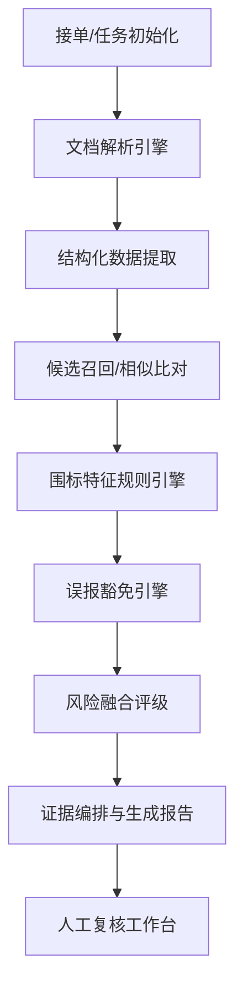

# 标书审查 Agent 技术设计文档 (V1.0)

## 1. 方案核心策略：从“对话型”向“工作流型”演进

**定位**：标书审查不是一个自由发挥的通用对话 Agent，而是一个面向监管、审计、招采复核的**风险筛查工具**。

### 核心目标
*   **识别风险**：识别洗稿、模板同源、围标/陪标特征。
*   **提供证据**：给出的不仅仅是分数，而是可解释、可回溯的证据链，方便人工复核。
*   **特性要求**：高稳定性、可审计、低误报、证据链完整。

---

## 2. 场景 Agent 整体架构

推荐采用 **“上层路由 + 场景编排器 + 专业功能引擎”** 的三层结构。

### 2.1 任务分发链路
1.  **通用 Agent**：接收原始请求，进行意图识别。
2.  **场景路由**：识别为“标书审查”任务，分发给 `TenderReview Agent`。
3.  **TenderReview Agent (编排器)**：驱动固化的审查流水线（DAG）。

### 2.2 流程 DAG 设计

---

## 3. 五大核心引擎设计

### 3.1 文档解析引擎 (Parsing Engine)
解析质量直接决定后期 70% 的效果。
*   **层级化拆解**：不仅抽取正文，需拆解为：文档信息、章节树、段落列表、表格列表、关键字段。
*   **可回溯锚点**：解析结果必须包含页码、章节号、段落索引。**没有锚点，就没有可复核的证据页。**

### 3.2 候选召回层 (Retrieval Layer)
避免长文档两两暴力比对，通过两段式筛选：
1.  **粗召回**：按章节分桶，通过词面（Elasticsearch/Lucene）和语义（Embedding）召回一批候选段落。
2.  **精排**：对召回的 Top-K 候选进行深度相似度计算。

### 3.3 多维比对引擎 (Comparison Engine)
采用四路并行评分机制，不只是“语义相似”：
| 维度 | 目标 | 常用方法 |
| :--- | :--- | :--- |
| **文本层** | 抓“硬抄袭” | N-gram 重合度、编辑距离、高频短语复用 |
| **语义层** | 抓“深层改写” | 段落 Embedding、Cross-Encoder 精排 |
| **结构层** | 抓“同源模板” | 章节顺序、标题层极、表格 Schema 相似度 |
| **业务风险层** | 抓“围标特征” | 联系人重合、团队重复、报价梯度异常、罕见错误共现 |

### 3.4 误报豁免引擎 (Exemption Engine)
这是系统的成败关键，用于平衡“查全率”与“易用性”：
*   **知识库引用**：建立行业通用表述、法律法规、招标模板白名单库。
*   **动态权重**：公司介绍等通用章节设低权；技术方案、服务承诺、报价字段设高权。
*   **组合升权**：同时命中“语义高相似 + 罕见错误共现”时，风险评级强行调整为高。

### 3.5 风险融合层 (Fusion Layer)
*   不输出单一总分，而是输出：**抄袭/洗稿风险**、**围标/陪标风险**、**综合审查风险**。
*   **逻辑**：硬规则（如电话相同）优先于软分数（语义相似度）。

---

## 4. LLM 的应用边界

### 4.1 核心职能 (适合 LLM)
*   **意图分发**：理解用户指令并映射到标书审查任务。
*   **判定理由说明**：解释为什么某两个片段被标记为疑似抄袭（证据解释）。
*   **摘要生成**：总结审计发现，生成初步审查结论。
*   **追问回答**：辅助复核人员针对特定证据点进行多轮深入查询。

### 4.2 严禁职能 (不适合 LLM)
*   **长文档两两比对**：效率极低且存在 Token 限制。
*   **数学运算/比例计算**：LLM 计算并不稳定。
*   **最终执法认定**：LLM 不替代人工法务/审计判断。

---

## 5. 实现路径：LangChain4j + Spring Boot

*   **编排框架**：利用 LangChain4j 的 `AI Services` 实现结构化输出与 Tool 调用。
*   **离线化支持**：核心 Embedding 模型建议 JVM 内离线运行，确保敏感医疗/招采数据安全。
*   **定制 RAG**：不建议使用通用 Easy RAG，需基于标书结构定制索引与召回逻辑。

---

## 6. MVP (V1) 落地路线图

### 6.1 阶段目标
1.  **格式支持**：优先支持 `.docx` 格式。
2.  **比对规模**：支持 2-3 份标书之间的横向比对。
3.  **颗粒度**：覆盖段落级、表格级、关键字段级。
4.  **核心产出**：
    *   风险等级（高/中/低）。
    *   **证据对照页**。
    *   误报过滤逻辑。
    *   可导出的审查简报。

### 6.2 演进建议
*   **V1**：做深“雷同性发现 + 证据可视化”。
*   **V2**：引入跨项目、跨时间维度的“围标关系图谱”。

---

## 7. 结语
标书审查 Agent 的本质是**“证据驱动的审查工作流”**。其设计应坚持：下层业务逻辑固化，上层 LLM 赋能解释。