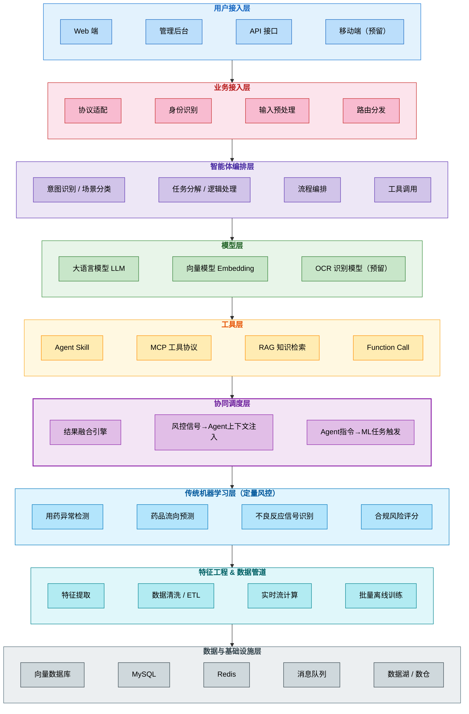
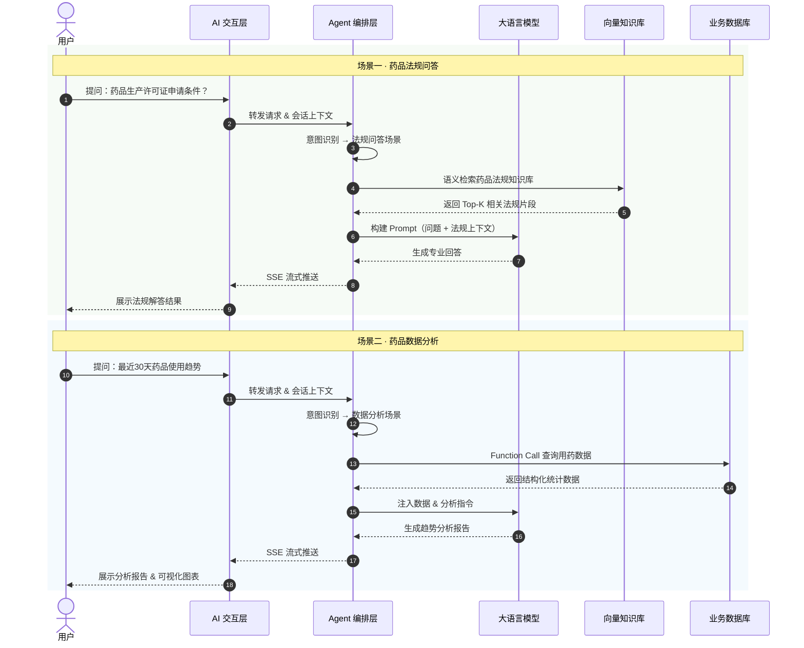

# AI 药品监管智能体整体框架设计方案

## 项目概述

本方案面向药品监管业务场景，设计并实现一套具备**理解、规划、执行、记忆**能力的 AI 智能体系统。系统以 **Spring AI + LangChain4j** 为核心编排框架，结合 **RAG 向量知识库**、**Tool 执行能力**与**多模型推理**，为药品监管人员提供法规问答、数据分析、合规检查等一体化智能服务，旨在降低人工查阅法规的成本，提升监管效率与决策质量。

---

### 图1-1 药品监管AI智能体架构图（双层架构）

> 核心设计理念：**底层传统机器学习做定量风控** + **上层大模型 Agent 做定性解读与调度**，两层通过协同调度层联动，兼顾计算效率与智能决策。



**架构分区说明**

| 区域 | 层级 | 核心职责 |
| --- | --- | --- |
| **上层 · 大模型 Agent** | L1 用户接入层 → L2 业务接入层 → L3 智能体编排层 → L4 模型层 → L5 工具层 | 定性解读与智能调度：意图理解、法规问答、报告生成 |
| **协同调度** | L6 协同调度层 | 双向联动：ML 风控信号注入 Agent 上下文 / Agent 指令触发 ML 任务 |
| **底层 · 传统 ML** | L7 机器学习层 → L8 特征工程 | 定量风控与分析：异常检测、流向预测、风险评分 |
| **共享基础设施** | L9 数据与基础设施层 | 上下两层共享的存储与计算资源 |

### 图1-2 药品监管AI业务流程泳道图



**端到端核心链路**：用户输入 → 协议适配与预处理 → Agent 意图识别与场景路由 → 按需调用 Skill / MCP / RAG 工具 → 检索药品法规知识库或执行监管分析 → LLM 生成专业回答 → SSE 流式推送至前端，呈现对话内容 / 分析报告 / 合规建议。

---

## 1. 应用 / 接入层

**定位**：系统与用户交互的统一入口，屏蔽多端差异，确保各类请求以标准化方式进入智能体处理链路。

**核心职责**

*   **多渠道接入**：同时支持 PC 端管理后台、移动端等多终端访问，保障服务可达性
*   **协议适配**：统一处理 HTTP / WebSocket / SSE 等通信协议，对上层屏蔽底层差异
*   **会话管理**：维护多轮对话上下文与状态，为 Agent 编排层提供完整会话信息
*   **流式响应**：基于 SSE 流式响应实现打字机效果，大幅提升用户交互体验与感知性能，也就是会有动态效果一个个字输出

**技术选型**

*   前端：Vue3 + TypeScript（组件化开发，提升可维护性）
*   通信协议：HTTP / SSE / WebSocket
*   功能模块：药品监管知识管理后台、数据分析看板

---

## 2. 智能体编排层（Agent）

**定位**：智能体的核心调度中枢，负责意图识别、场景路由与多步骤任务编排，是系统智能化程度的关键所在。

### 核心能力

*   **意图识别与场景路由**：基于大模型理解用户语义，自动路由至法规问答、药品分析、合规检查等对应处理场景
*   **多步骤任务编排**：支持将复杂业务任务拆解为多个子步骤，依次调度执行
*   **自主决策**：依据上下文信息动态选择最优处理策略，减少人工干预
*   **状态管理**：持久化任务执行状态，支持多轮推理与断点续接
*   **工具调度**：按需组合调用 RAG、Skill、MCP 等工具，完成完整任务链路

### 业务场景覆盖

| **场景** | **描述** | **触发示例** |
| --- | --- | --- |
| **药品法规问答** | 解答药品监管相关法规、政策、规定 | "药品生产许可证的申请条件是什么？" |
| **药品数据分析** | 对药品使用数据进行统计分析，发现异常 | "分析最近30天的药品使用趋势" |
| **合规性检查** | 检查药品生产/流通是否符合监管规定 | "检查这批药品的存储条件是否合规" |
| **监管政策解读** | 对最新发布的药品监管政策进行权威解读 | "解读最新的药品网络销售管理办法" |
| **药品不良反应分析** | 分析不良反应报告，识别潜在风险信号 | "统计某药品近期的不良反应报告" |

### 技术选型

*   **Spring AI Alibaba**（核心编排框架，深度集成通义千问生态）
*   **LangChain4j**（辅助编排与模型调用，增强工具链灵活性）

---

## 3. 大模型层（决策）

**定位**：系统的推理与生成核心，承担语义理解、逻辑推断与内容生成任务。

> **关键认知**：模型 ≠ 智能体。大模型是智能体的推理引擎，Agent 编排层才是赋予系统「主动规划、工具调用、多步执行」能力的核心逻辑层。

**设计原则**

*   **云端推理**：调用通义千问 API，保障推理能力与服务稳定性，免去自建推理服务的运维成本
*   **多模型协同**：主力模型与推理增强模型分工配合，兼顾通用对话与复杂推断
*   **Prompt 工程**：针对药品监管场景设计专业 System Prompt，严格控制 Token 消耗与输出合规性

### 模型选型对比

#### 1️⃣ 大语言模型（对话 / 推理）

| **模型** | **定位** | **中文理解/生成** | **推理能力** | **适合场景** |
| --- | --- | --- | --- | --- |
| **Qwen2 系列** | 阿里通用中文基础模型 | ⭐⭐⭐⭐ | ⭐⭐⭐⭐ | 通用对话、RAG、法规问答 |
| **Qwen3 系列** | 次世代旗舰全能模型 | ⭐⭐⭐⭐⭐ | ⭐⭐⭐⭐⭐ | Agent 编排、复杂推理、长上下文法规分析 |
| **DeepSeek-R1** | 专注强推理 / 逻辑分析 | ⭐⭐⭐⭐ | ⭐⭐⭐⭐⭐ | 合规性推理、数据分析、因果判断 |

**策略**：以 Qwen3 系列为主力模型，DeepSeek-R1 作为复杂推理场景的补充，按需路由、降本增效。

#### 2️⃣ OCR / 文档识别模型（后续扩展）

用于药品标签识别、处方单解析、检验报告结构化提取等场景，作为系统感知层的重要扩展方向。

---

## 4. 工具层（Tool）

### 4.1 Agent Skill

> **定位**：领域专家能力模块，封装完整的药品监管任务执行逻辑，是 Agent 完成专业任务的核心载体。

**设计理念**

每个 Skill 是一个自包含的能力单元，内置完整的任务流程与领域最佳实践，预置了药品监管专业知识和执行逻辑，支持灵活组合调用，实现复杂监管任务的协同完成。

**已规划 Skill 能力**

*   **药品法规解答 Skill**：覆盖《药品管理法》、GMP/GSP 规范、《药品注册管理办法》等权威法规，提供专业法规顾问能力
*   **数据监控分析 Skill**：支持用药趋势分析、异常波动检测、统计报表自动生成，提供专业数据洞察
*   **合规性审查 Skill**：对药品生产、经营、使用各环节进行合规性检查，出具审查意见
*   **不良反应监测 Skill**：分析 ADR 报告，识别风险信号，触发预警通知机制

### 4.2 MCP（Model Context Protocol）

> **定位**：标准化工具访问协议，统一 Agent 与外部系统的集成方式，相当于 AI 领域的「USB 标准接口」。

**核心价值**

MCP 为 Agent 提供统一的工具调用规范，支持数据库、API、文件系统、第三方服务等多种工具类型。新工具接入无需修改 Agent 核心逻辑，实现真正的即插即用，显著降低集成复杂度与维护成本。

**典型应用**

*   **MySQL-MCP**：药品数据查询与管理，支持结构化数据的精准访问
*   **文件系统 MCP**：法规文档、检验报告的读取与管理
*   **第三方服务 MCP**：对接药监局数据接口、药品追溯平台等外部系统

> **Skill vs MCP 的分工**：Skill 定义「做什么」（业务逻辑与任务目标），MCP 定义「用什么」（工具调用与资源访问）。两者相互配合，共同构成完整的任务执行链路。

### 4.3 Function Call

> **定位**：结构化函数调用机制，让大模型能够以可预测、可验证的方式触发具体业务能力。

**核心特性**

*   基于 JSON Schema 严格定义函数签名与参数，确保调用结果的确定性
*   支持同步/异步调用，返回结构化数据供 Agent 进一步处理
*   与 Skill 和 MCP 协同工作，构成完整的工具调度体系

**药品监管典型 Function**

| **Function** | **功能描述** | **参数示例** |
| --- | --- | --- |
| `analyzeDrugUsage` | 分析药品使用数据 | drugName, dateRange, region |
| `checkCompliance` | 合规性检查 | drugId, checkType |
| `queryRegulation` | 查询药品法规 | keyword, category |
| `generateReport` | 生成分析报告 | reportType, period |
| `detectAnomaly` | 异常检测 | dataSource, threshold |

### 4.4 本地知识库（RAG）

> **定位**：药品监管智能体的知识引擎，通过检索增强生成（RAG）技术，将海量法规文档转化为可被 AI 精准调用的结构化知识，从根本上解决大模型在专业领域的幻觉问题。

**架构流程**

```plaintext
文档输入 → 文本切分 → 向量化 → 向量库存储 → 语义检索 → 相关性重排 → 注入 Prompt
```

**业务流程**

```plaintext
┌────────────────┐
│  药品监管数据源  │  法规文档 / 药品数据 / 检验报告 / 不良反应
└─────┬──────────┘
      │
      ▼
┌────────────┐
│ 知识接入层  │ 文档解析 / PDF提取 / 结构化抽取
└─────┬──────┘
      │
      ▼
┌────────────┐
│ 向量生成层  │ Embedding（通义 / Qwen / 本地模型）
└─────┬──────┘
      │
      ▼
┌────────────────────┐
│   向量知识库        │ 语义召回（主）
└─────┬──────────────┘
      │
      ▼
┌────────────┐
│ 重排 & 过滤 │ 权限 / 时间 / 文档类别 / 置信度
└─────┬──────┘
      │
      ▼
┌────────────┐
│  LLM 推理   │ AI 药品监管助手
└────────────┘
```

**技术选型**

| 环节 | 推荐方案 | 说明 |
| --- | --- | --- |
| 文档解析 | Unstructured / Apache PDFBox / python-docx | 支持 PDF、Word、Excel 等药品法规文档格式 |
| Embedding 模型 | bge-large-zh（中文）/ bge-m3（多语言） | 高质量向量表示，适配中文药品法规场景 |
| 向量数据库 | Milvus / Chroma | 高性能向量检索，支持分布式部署 |
| RAG 框架 | Spring AI + LangChain4j | 提供完整的 Retriever、Reranker 组件 |

**质量优化策略**

*   **语义切分（Semantic Chunking）**：保持法规条款语义完整性，推荐 500–1000 tokens/chunk，避免条款被截断影响理解
*   **混合检索（Hybrid Search）**：向量检索 + BM25 关键词检索双路召回，显著提升专业法规条款的检索召回率
*   **重排序（Reranking）**：引入 bge-reranker-large 对 Top-K 结果精排，提升最终答案的相关性
*   **Prompt 工程**：动态构建 Few-shot 示例与上下文窗口，面向药品监管场景定制化优化

**知识库体系**

*   **药品法规知识库**：《药品管理法》、《药品注册管理办法》、《药品生产监督管理办法》、GMP/GSP 规范等权威法规
*   **药品标准库**：中国药典、药品质量标准、检验检测标准规范
*   **监管政策库**：国家药监局公告、行业通知、政策解读文件（持续动态更新）
*   **操作指南库**：许可证申请流程、药品注册申报指南、不良反应报告规范等实操文档

---

## 5. Memory（记忆系统）

**定位**：赋予智能体跨轮次、跨会话的记忆与学习能力，使其交互体验从「单次问答」升级为「持续感知的专业助手」。

### 记忆类型

| **Memory 类型** | **作用** |
| --- | --- |
| Short-term Memory | 维护当前对话上下文，支持多轮连续法规咨询 |
| Long-term Memory | 记录用户偏好（常关注的药品类别、法规领域等），实现个性化服务 |
| Vector Memory | 持久化历史咨询记录与关键事实，支持跨会话知识积累 |

### 技术实现

*   Spring AI 内置 Memory 管理（短期记忆）
*   Redis（会话缓存，保障高并发下的上下文读写性能）
*   向量数据库（长期记忆存储，支持语义级历史检索）

---

## 6. 调度 & Workflow（复杂任务处理）

**定位**：针对多步骤、有条件分支的复杂监管业务场景，提供结构化的任务编排与流程控制能力。

**典型复杂场景示例**

*   药品合规性审查：法规匹配 → 条款逐项比对 → 生成结构化审查报告
*   不良反应分析：数据采集 → 信号识别 → 风险等级评估 → 触发预警通知
*   多轮推理决策：根据药品类别动态选择检查流程分支（如处方药 vs 非处方药执行不同规则）

### 技术实现

*   LangChain4j Workflow（基于链式调用编排多步任务）
*   DAG Workflow（有向无环图，支持并行任务调度）
*   状态机（管理长流程任务的状态流转与异常恢复）

---

## 7. 安全 & 风控

**定位**：药品监管场景对信息准确性要求极高，系统需在 AI 能力开放的同时，构建完善的安全防护机制，确保输出内容的合规性与可信度。

### 核心安全措施

*   **Prompt Injection 防护**：通过输入过滤与结构化 Prompt 设计，防止恶意注入绕过系统安全边界
*   **敏感信息保护**：对涉密药品信息进行脱敏处理，防止数据泄露
*   **Tool 权限最小化**：严格限制工具调用范围与权限，杜绝越权操作
*   **数据隔离**：不同用户/机构数据严格隔离，满足合规与隐私要求
*   **输出合规性校验**：对模型生成内容进行专业术语与法规引用的准确性验证，药品信息零容忍错误

### 技术实现

*   白名单 Tool 机制（仅允许预定义的安全工具被调用）
*   Role Prompt 角色限定（将模型角色严格限定为「药品监管领域专家」）
*   结果校验器（医药专业术语校验、法规引用准确性二次验证）

---

## 8. 监控 & 评估

**定位**：构建可观测的 AI 系统，持续监控运行质量，驱动模型能力与业务效果的迭代优化。

### 核心监控指标

*   **响应时延**：从用户提问到获得回答的端到端延迟，直接影响用户体验
*   **Token 消耗**：模型调用的 Token 用量监控，支撑成本优化决策
*   **RAG 命中率**：知识库检索的准确率与召回率，反映知识库质量
*   **工具调用失败率**：意图识别失败、工具调用异常等核心错误指标
*   **回答准确率**：药品法规解答准确性的定期抽样评估

### 技术实现

*   全链路日志埋点与追踪（可视化每次请求的完整处理路径）
*   专家人工评审（邀请药品监管专家定期对系统输出质量进行评估）
*   A/B 测试（对比不同 Prompt 策略、模型版本的实际效果，数据驱动优化）

---

## 9. 技术路线

### 设计决策

本项目采用**渐进式演进**策略：当前阶段以 **Java 技术栈**为核心，基于 `Spring Boot + Spring AI Alibaba + LangChain4j` 快速构建可用的轻量级智能体；后续根据业务规模与复杂度决策，按需升级至 Python + LangChain 全功能方案，兼顾工程交付效率与长期架构扩展性。

**当前阶段实现目标**：场景识别 → 任务拆解 → 调用确定性业务能力（法规检索 / 数据分析 / 合规检查）→ 生成并返回专业结果

```plaintext
自然语言输入
   ↓
意图识别（Intent Classification）
   ↓
任务拆解（Task Planning）
   ↓
调用业务能力（法规检索 / 数据分析 / 合规检查）
   ↓
生成并返回专业结果
```

### 当前技术栈

| 层级 | 技术方案 | 版本 |
| --- | --- | --- |
| 后端框架 | Spring Boot | 3.4.4 |
| AI 编排 | Spring AI Alibaba | 1.0.0-M6.1 |
| 模型调用 | LangChain4j-DashScope | 0.36.2 |
| 模型SDK | DashScope SDK | 2.19.1 |
| API 文档 | Knife4j | 4.4.0 |
| 工具库 | Hutool | 5.8.26 |
| Java 版本 | JDK | 21 |
| 前端框架 | Vue3 + TypeScript | — |
