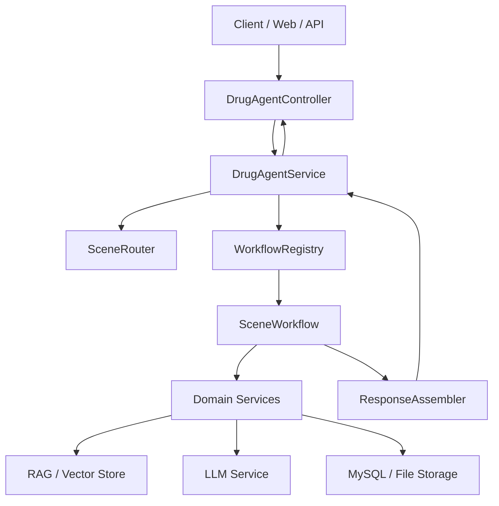

# Drug-Agent 统一 Agent MVP 与技术实现文档

> 版本：v1.0  
> 日期：2026-03-15  
> 面向读者：开发同学、项目负责人、技术设计评审  
> 文档定位：用于指导 Drug-Agent 第一阶段统一 Agent 的 MVP 设计与落地实现

---

## 1. 文档目标

本文档聚焦一个问题：

如何在当前 Drug-Agent 项目中，先搭建一个可扩展的统一 Agent 调度层，作为多个业务场景的统一入口，而不是一开始就把所有场景硬编码到单个 Prompt 或单个 Controller 中。

本文档输出以下内容：

- MVP 目标与边界
- 统一 Agent 的核心职责
- 技术架构与模块拆分
- 接口设计与数据结构建议
- 后端目录结构建议
- 落地步骤与迭代路线
- 风险点与规避方案

---

## 2. 背景与问题定义

### 2.1 当前项目现状

从现有仓库结构看，项目已经具备以下基础能力：

- Spring Boot 后端基础工程
- 基于千问的对话调用能力
- 药品分析与合规对话相关 Controller / Service
- Prompt 管理、Advisor、向量检索等基础设施
- 前端页面与基础交互入口

当前适合进入的下一步，不是继续为每个新场景单独新增一套 Controller + Prompt，而是增加一个统一调度入口，将场景识别、流程编排、能力调用和结果组装抽离出来。

### 2.2 当前潜在问题

如果不做统一 Agent 层，后续容易出现：

- 每个场景都单独接一个接口，外部调用方式不统一
- 场景越多，Prompt 和业务逻辑越分散
- 文件审查、法规检索、风险分析等能力无法复用
- 模型切换、日志审计、权限控制要在多个地方重复实现
- 后续很难从“单点功能”升级到“多场景平台”

### 2.3 本次要解决的问题

本期 MVP 要解决的是：

- 对外提供一个统一入口
- 在内部完成场景路由和固定流程编排
- 将具体业务能力下沉为可复用的 Domain Service
- 为后续新增场景预留标准扩展位

---

## 3. MVP 目标与非目标

### 3.1 MVP 目标

统一 Agent MVP 第一阶段聚焦以下四个目标：

1. 建立统一请求入口，所有 AI 场景优先走同一个接口。
2. 建立场景路由机制，能够识别请求属于哪一类业务处理链路。
3. 建立固定工作流编排机制，支持按场景串联多个步骤执行。
4. 建立标准能力调用协议，为后续新增场景提供统一接入方式。

### 3.2 MVP 非目标

本期不追求以下能力：

- 不做全自主决策型 Agent
- 不做复杂多智能体协作
- 不做通用工作流设计器界面
- 不做所有业务场景一次性接入
- 不做最终行政结论自动判定

### 3.3 推荐的 MVP 范围

虽然当前选择的是“统一框架优先”，但为了验证链路，仍建议保留一个示范场景用于走通全流程。

推荐示范场景：

- 场景名称：法规问答 / 合规审查通用入口
- 原因：对接现有能力最顺手，便于验证路由、检索、生成、结果封装是否打通

---

## 4. 统一 Agent 的产品定位

统一 Agent 不是一个单独的大模型，而是一个中间调度层。

它的定位是：

- 对外：统一的 AI 服务入口
- 对内：场景路由器 + 工作流编排器 + 能力调度器

统一 Agent 不直接承担所有业务细节，而是负责：

- 识别用户请求属于哪个场景
- 根据场景选择对应工作流
- 按步骤调用底层服务
- 汇总结构化结果并返回给调用方

可以将其理解为：

```text
统一 Agent = 总控层
场景能力服务 = 专业处理模块
模型 / RAG / 数据库 = 底层执行引擎
```

---

## 5. MVP 核心能力设计

### 5.1 能力一：统一入口

所有 AI 请求先进入统一接口，例如：

- 用户自然语言问答
- 文件相关合规咨询
- 数据分析类请求
- 后续新增的场景请求

统一入口负责：

- 鉴权
- 请求标准化
- 记录 traceId
- 会话透传
- 调用统一 Agent 主流程

### 5.2 能力二：场景路由

路由层负责判断当前请求属于哪个场景。

MVP 阶段建议采用：

- 规则优先
- LLM 兜底

规则来源包括：

- 用户指定的 `sceneHint`
- 是否上传了文件
- 请求关键词
- 来源页面或入口标识

路由结果可以先定义为枚举：

- `GENERAL_QA`
- `COMPLIANCE_REVIEW`
- `DRUG_ANALYSIS`
- `UNKNOWN`

### 5.3 能力三：固定工作流编排

MVP 阶段不做动态规划，采用固定工作流即可。

例如：

`GENERAL_QA` 工作流：

1. 解析请求
2. 检索法规知识库
3. 调用大模型生成答案
4. 包装响应

`COMPLIANCE_REVIEW` 工作流：

1. 提取文件上下文
2. 检索法规依据
3. 执行合规分析
4. 生成结论与依据

### 5.4 能力四：标准服务调度

统一 Agent 不直接把所有逻辑写在一个类里，而是通过标准接口调用能力模块。

建议首批抽象出以下服务：

- `KnowledgeRetrieveService`
- `FileContextService`
- `ComplianceCheckService`
- `AnalysisService`
- `AnswerComposeService`

### 5.5 能力五：统一响应封装

统一 Agent 输出建议标准化，避免前端和调用方每个场景单独适配。

建议统一返回：

- 本次命中的场景
- 最终回答
- 证据列表
- 风险等级
- 执行步骤摘要
- traceId

---

## 6. 架构设计

### 6.1 总体架构



### 6.2 分层说明

#### 接入层

负责提供统一 HTTP 接口，对外屏蔽内部复杂度。

核心组件：

- `DrugAgentController`

#### 编排层

负责整个 Agent 的控制逻辑。

核心组件：

- `DrugAgentService`
- `SceneRouter`
- `WorkflowRegistry`
- `SceneWorkflow`

#### 能力层

负责完成具体业务动作。

核心组件：

- 文件上下文提取
- 法规知识检索
- 合规审查
- 药品分析
- 答案组装

#### 基础设施层

负责模型、向量库、数据库、日志、配置等基础能力。

---

## 7. 核心模块设计

### 7.1 DrugAgentController

职责：

- 接收统一请求
- 做基础参数校验
- 调用统一 Agent 服务
- 返回标准响应

建议接口：

`POST /api/agent/drug/chat`

### 7.2 DrugAgentService

职责：

- 创建执行上下文
- 调用路由器识别场景
- 获取对应工作流
- 执行工作流
- 统一处理异常

伪代码如下：

```java
public DrugAgentResp handle(DrugAgentReq req) {
    AgentContext context = agentContextFactory.create(req);
    SceneType scene = sceneRouter.route(context);
    SceneWorkflow workflow = workflowRegistry.get(scene);
    WorkflowResult result = workflow.execute(context);
    return responseAssembler.assemble(context, result);
}
```

### 7.3 SceneRouter

职责：

- 基于规则和模型判断场景

建议实现策略：

1. 优先读取 `sceneHint`
2. 判断是否存在文件 ID 或文件内容
3. 匹配关键词
4. 对模糊情况调用一次轻量 LLM 分类
5. 无法识别时返回 `UNKNOWN`

### 7.4 WorkflowRegistry

职责：

- 维护场景和工作流实现类的映射关系

建议形式：

```java
Map<SceneType, SceneWorkflow>
```

### 7.5 SceneWorkflow

建议定义统一接口：

```java
public interface SceneWorkflow {
    SceneType support();
    WorkflowResult execute(AgentContext context);
}
```

MVP 可先实现：

- `GeneralQaWorkflow`
- `ComplianceReviewWorkflow`
- `FallbackWorkflow`

### 7.6 Domain Services

建议每个 Service 只负责一类能力，不承担路由和流程控制职责。

例如：

- `KnowledgeRetrieveService`
  - 输入：问题、过滤条件
  - 输出：法规片段列表

- `FileContextService`
  - 输入：文件 ID 或文件文本
  - 输出：文件摘要、关键片段、元信息

- `ComplianceCheckService`
  - 输入：文件上下文、法规依据、用户问题
  - 输出：合规判断、风险点、证据引用

- `AnalysisService`
  - 输入：结构化药品数据
  - 输出：统计摘要、风险分析结果

### 7.7 ResponseAssembler

职责：

- 将不同工作流输出统一为标准响应结构

避免问题：

- 不同场景返回 JSON 结构完全不同
- 前端要针对每个场景写特判逻辑

---

## 8. 核心数据结构设计

### 8.1 统一请求对象

```json
{
  "sessionId": "s_1001",
  "userId": "u_001",
  "query": "请帮我判断这份材料是否存在合规风险",
  "sceneHint": "COMPLIANCE_REVIEW",
  "fileIds": ["f_001"],
  "metadata": {
    "source": "web"
  }
}
```

Java 建议结构：

```java
public class DrugAgentReq {
    private String sessionId;
    private String userId;
    private String query;
    private String sceneHint;
    private List<String> fileIds;
    private Map<String, Object> metadata;
}
```

### 8.2 执行上下文对象

执行上下文用于串联整条工作流，建议贯穿整个编排层。

```java
public class AgentContext {
    private String traceId;
    private String sessionId;
    private String userId;
    private String query;
    private SceneType sceneType;
    private List<String> fileIds;
    private Map<String, Object> attributes;
}
```

`attributes` 用于存放中间结果，例如：

- 检索法规片段
- 文件摘要
- 风险点列表
- 统计结果

### 8.3 统一响应对象

```json
{
  "traceId": "trace_xxx",
  "scene": "COMPLIANCE_REVIEW",
  "answer": "初步判断该材料存在2项中高风险问题",
  "riskLevel": "MEDIUM",
  "evidenceList": [
    {
      "title": "药品管理法相关条款",
      "content": "......",
      "source": "法规知识库"
    }
  ],
  "steps": [
    "完成场景识别",
    "完成法规检索",
    "完成合规分析"
  ]
}
```

---

## 9. 接口设计建议

### 9.1 统一对话接口

#### 请求路径

`POST /api/agent/drug/chat`

#### 请求说明

用于统一接收各类 AI 请求，内部根据场景进行路由与编排。

#### 请求参数

| 字段 | 类型 | 必填 | 说明 |
| --- | --- | --- | --- |
| `sessionId` | string | 是 | 会话 ID |
| `userId` | string | 否 | 用户 ID |
| `query` | string | 是 | 用户问题 |
| `sceneHint` | string | 否 | 场景提示 |
| `fileIds` | list | 否 | 附件 ID 列表 |
| `metadata` | map | 否 | 扩展信息 |

#### 返回参数

| 字段 | 类型 | 说明 |
| --- | --- | --- |
| `traceId` | string | 请求跟踪 ID |
| `scene` | string | 最终命中的场景 |
| `answer` | string | 最终回答 |
| `riskLevel` | string | 风险等级 |
| `evidenceList` | list | 证据列表 |
| `steps` | list | 执行步骤 |

### 9.2 场景识别调试接口

为了便于开发联调，建议临时保留调试接口：

`POST /api/agent/drug/route-debug`

作用：

- 查看当前请求会被路由到哪个场景
- 输出命中的规则或分类原因

这个接口在生产环境可以关闭。

---

## 10. 目录结构建议

结合当前项目结构，建议新增以下包结构：

```text
src/main/java/com/liang/drugagent/
├── controller/
│   └── DrugAgentController.java
├── agent/
│   ├── context/
│   │   └── AgentContext.java
│   ├── domain/
│   │   ├── SceneType.java
│   │   ├── DrugAgentReq.java
│   │   ├── DrugAgentResp.java
│   │   └── WorkflowResult.java
│   ├── router/
│   │   └── SceneRouter.java
│   ├── workflow/
│   │   ├── SceneWorkflow.java
│   │   ├── WorkflowRegistry.java
│   │   ├── GeneralQaWorkflow.java
│   │   ├── ComplianceReviewWorkflow.java
│   │   └── FallbackWorkflow.java
│   ├── assembler/
│   │   └── ResponseAssembler.java
│   └── service/
│       └── DrugAgentService.java
├── service/
│   ├── KnowledgeRetrieveService.java
│   ├── FileContextService.java
│   ├── ComplianceCheckService.java
│   └── AnalysisService.java
```

说明：

- `agent/` 包只负责统一编排逻辑
- `service/` 保留具体能力服务
- 不建议把所有新逻辑继续塞入已有的 `AgentChatService`

---

## 11. 技术实现方案

### 11.1 技术选型建议

基于当前项目，MVP 阶段建议保持最小改动：

- 后端框架：Spring Boot
- AI 编排：Spring AI
- 模型服务：Qwen / DashScope
- 向量检索：沿用现有 Vector Store 配置
- 数据存储：MySQL
- 文件存储：本地目录，后续可切对象存储

原则：

- 先复用现有能力
- 先跑通主链路
- 先保证结构清晰，再做高级智能化

### 11.2 路由实现建议

MVP 阶段采用三段式路由：

#### 第一段：显式路由

如果请求里带有 `sceneHint`，优先采用。

#### 第二段：规则路由

示例规则：

- 存在 `fileIds`，优先考虑 `COMPLIANCE_REVIEW`
- 包含“法规、依据、条款、是否符合”等关键词，优先考虑 `GENERAL_QA` 或 `COMPLIANCE_REVIEW`
- 包含“趋势、异常、统计、用量”等关键词，优先考虑 `DRUG_ANALYSIS`

#### 第三段：LLM 分类

对难以命中的情况，调用一个轻量分类 Prompt，仅输出场景枚举值。

分类 Prompt 示例：

```text
你是药品监管系统的场景分类器。
请根据用户问题，将请求分类到以下场景之一：
GENERAL_QA, COMPLIANCE_REVIEW, DRUG_ANALYSIS, UNKNOWN
只输出场景枚举值，不要输出其他内容。
```

### 11.3 工作流实现建议

MVP 推荐工作流模式：

- 每个工作流一个类
- 每个类内部按固定顺序执行步骤
- 步骤中间结果写入 `AgentContext`

以 `ComplianceReviewWorkflow` 为例：

```java
public WorkflowResult execute(AgentContext context) {
    FileContext fileContext = fileContextService.load(context.getFileIds());
    context.getAttributes().put("fileContext", fileContext);

    List<KnowledgeChunk> chunks = knowledgeRetrieveService.retrieve(context.getQuery());
    context.getAttributes().put("knowledgeChunks", chunks);

    ComplianceResult result = complianceCheckService.check(
        context.getQuery(), fileContext, chunks
    );

    return WorkflowResult.success(result.getSummary())
        .riskLevel(result.getRiskLevel())
        .evidence(result.getEvidenceList())
        .steps(List.of("文件解析", "法规检索", "合规分析"));
}
```

### 11.4 Domain Service 的实现原则

每个能力服务应满足：

- 输入清晰
- 输出结构化
- 不直接依赖上层路由逻辑
- 尽量可单独测试

不建议：

- 在 Service 内部再做场景判断
- 直接返回一大段不可解析文本
- 把 Prompt、流程和 Controller 耦合在一起

### 11.5 Prompt 管理建议

当前项目已有 Prompt 管理基础，统一 Agent 阶段建议继续强化：

- 路由 Prompt 独立
- 场景工作流 Prompt 独立
- 输出格式模板独立

建议按用途拆分：

- `route-classifier.st`
- `general-qa-answer.st`
- `compliance-review.st`
- `analysis-report.st`

这样后续维护时，不需要改 Java 代码就能调整 Prompt。

### 11.6 日志与可观测性建议

统一 Agent 一定要加可观测性，至少包括：

- `traceId`
- 命中场景
- 执行耗时
- 调用了哪些服务
- 模型调用次数
- 是否成功
- 异常原因

建议日志链路：

```text
请求进入 -> 生成 traceId -> 路由结果 -> 工作流步骤 -> 模型调用 -> 响应输出
```

---

## 12. 开发实施计划

### 12.1 第一阶段：统一入口与骨架搭建

目标：

- 建立统一请求对象与统一响应对象
- 完成 `DrugAgentController`
- 完成 `DrugAgentService`
- 完成 `SceneType` 和 `SceneRouter`

交付标准：

- 能通过统一接口接收请求
- 能返回路由结果和基础占位响应

### 12.2 第二阶段：工作流接入

目标：

- 完成 `WorkflowRegistry`
- 完成 `SceneWorkflow` 接口
- 实现 `GeneralQaWorkflow`
- 实现 `ComplianceReviewWorkflow`

交付标准：

- 至少两个场景可通过统一入口执行不同流程

### 12.3 第三阶段：能力服务抽象

目标：

- 抽离知识检索、文件解析、合规分析服务
- 统一输出结构化结果

交付标准：

- 场景工作流不直接依赖 Controller 或低层实现细节

### 12.4 第四阶段：治理能力补齐

目标：

- 增加 traceId 日志
- 增加异常兜底
- 增加调试接口
- 增加基础单元测试

交付标准：

- 主流程可追踪、可排错、可回归验证

---

## 13. 测试与验收建议

### 13.1 最低测试范围

MVP 至少覆盖以下测试：

- 场景路由测试
- 工作流选择测试
- 工作流执行测试
- 统一响应结构测试
- 异常兜底测试

### 13.2 关键测试用例

#### 用例一：普通法规问答

输入：

- query = “药品经营许可证申请需要满足哪些条件”

期望：

- 路由到 `GENERAL_QA`
- 成功调用法规检索
- 返回法规依据和答案

#### 用例二：带文件的审查请求

输入：

- query = “请审查这份材料是否存在合规问题”
- fileIds = `["f001"]`

期望：

- 路由到 `COMPLIANCE_REVIEW`
- 成功执行文件上下文提取和法规匹配
- 返回风险等级和依据

#### 用例三：不明确请求

输入：

- query = “帮我看看这个”

期望：

- 路由到 `UNKNOWN` 或兜底工作流
- 返回澄清型答复，而不是系统报错

### 13.3 MVP 验收标准

- 外部统一只调用一个 Agent 接口
- 至少支持 2 类场景的差异化流程
- 响应结构统一
- 路由、工作流、能力服务分层清晰
- 主要代码具备可扩展性

---

## 14. 风险与规避策略

### 14.1 风险一：一开始做得过重

问题：

- 引入过多 Agent 框架或复杂自治能力，导致工程失控

建议：

- 先做固定工作流
- 先做强结构化
- 后续再增加动态规划能力

### 14.2 风险二：场景和模型强绑定

问题：

- 每个场景固定依赖某个模型，后续难切换

建议：

- 由能力服务内部决定模型实现
- 上层工作流只依赖抽象接口

### 14.3 风险三：返回结果不统一

问题：

- 前端和外部系统对接复杂度越来越高

建议：

- 统一输出协议
- 增加 `ResponseAssembler`

### 14.4 风险四：中间结果不可追踪

问题：

- 无法排查是路由错了，还是知识检索错了，还是模型输出不稳定

建议：

- 引入 traceId
- 记录路由、工作流、检索、模型调用等关键节点日志

---

## 15. 后续迭代路线

### MVP 之后的 v1.1

- 支持更多场景枚举
- 增加工作流配置化能力
- 增加会话记忆管理
- 增加前端场景展示与步骤回显

### v1.2

- 支持工作流节点级重试
- 支持工具调用统一注册
- 支持更细粒度的权限与审计

### v2.0

- 支持可配置工作流引擎
- 支持多智能体协作
- 支持人工复核节点与审批闭环

---

## 16. 最终建议

对于当前 Drug-Agent 项目，统一 Agent 的最佳 MVP 方案不是做“万能智能体”，而是做一个可扩展的统一调度骨架：

- 上层统一入口
- 中间场景路由
- 下层固定工作流
- 底层复用能力服务

这样做的价值在于：

- 当前能快速落地
- 后续能持续扩场景
- 代码结构不会很快失控
- 更适合医药监管这种高可控、强审计、强可追溯场景

一句话总结：

先把统一 Agent 做成“可控的总控层”，再逐步演进成“更智能的编排层”。

---

## 17. 默认实现假设

本方案基于以下默认假设制定：

- 当前后端主技术栈继续沿用 Spring Boot + Spring AI
- 当前模型能力继续以 Qwen 为主
- 当前重点优先是统一框架与后端可扩展性，而不是一次性完成所有业务场景
- MVP 首期保留法规问答和合规审查作为示范流程

如果后续你要继续推进，我建议下一步直接进入：

1. 统一 Agent Java 包结构创建
2. 统一请求与响应对象定义
3. `SceneRouter` 与 `SceneWorkflow` 接口编码
4. 第一个 `GeneralQaWorkflow` 落地
