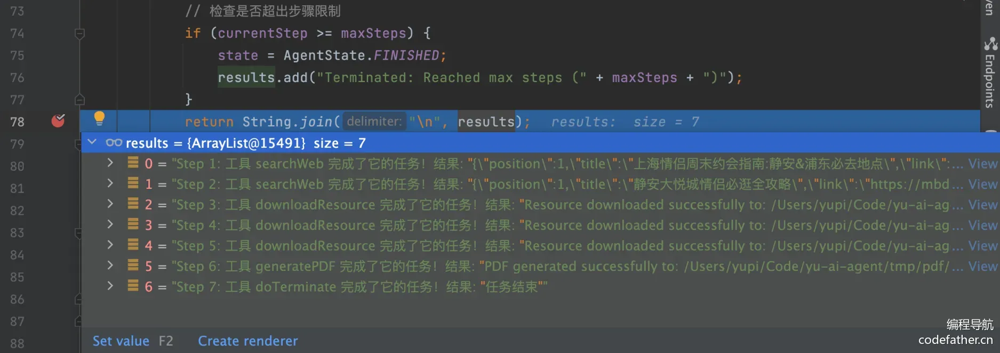
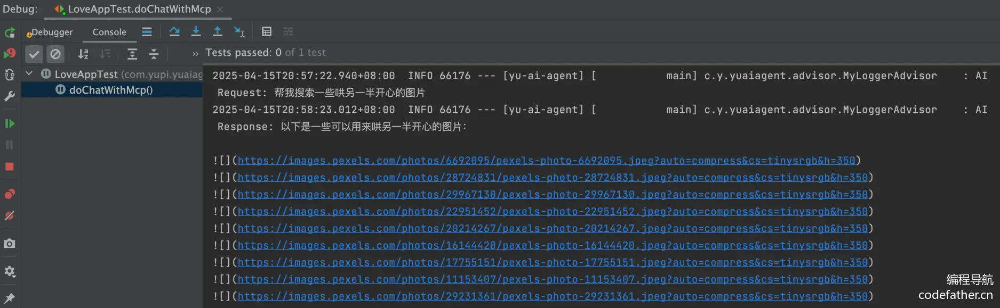
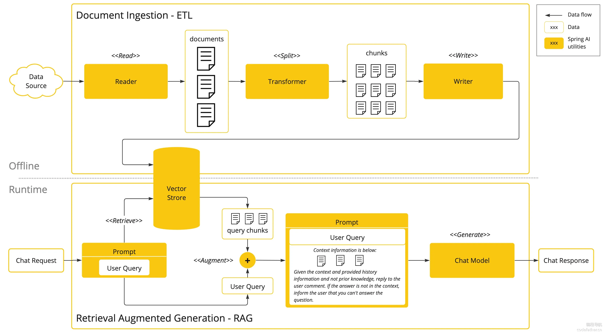
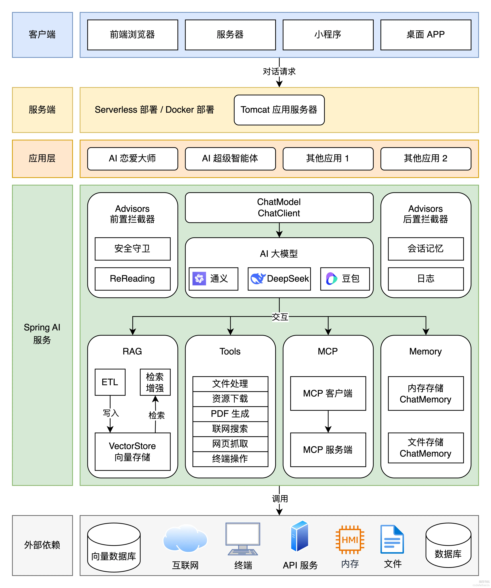

# 1-项目总览-AI智能体框架项目教程

## 一、项目介绍

> 这是一套以 AI 开发实战为核心的项目教程，将通过开发 **AI 用药监管拥有自主规划能力的超级智能体**，带大家掌握新时代程序员必知必会的 AI 核心概念、AI 实用工具和 AI 编程技术！
>
> AI 药品智能监管应用⁠可以依赖 AI 大模型解决用户的药品数据监管等功能，支持多轮对话、基于自定义知​识库进行问答、自主调用工具和 MC‎P 服务完成任务，比如调用地图服务‌获取附近地点并制定监管核查计划。
>

此外，还会手把手⁠带大家完成基于 ReAct 模‌式的自主规划智能体 LiangMan​us，可以利用网页搜索、资源下‎载和 PDF 生成工具，帮用户‌制定完整的监管核查计划并生成文档：

当然，学会⁠这个智能体框架项目后，你不仅能‌开发 AI 药品监管智能体开发各种‎复杂的 AI 应用，‌尽情发挥自己的想象力吧！

## 二、项目优势

### 项目收获

本项目选题新颖、业务⁠真实，用一套实战教程将程序员必知必会的‌ AI 技术一网打尽，帮你成为 AI ​时代企业的香饽饽，给你的简历和求职大幅‎增加竞争力              ‌                  

你将掌握下面的知识：

-   AI 应用平台的使用
-   接入 AI 大模型
-   AI 开发框架（Spring AI + LangChain4j）
-   AI 大模型本地部署
-   Prompt 工程和优化技巧
-   多模态特性
-   Spring AI 核心特性：如自定义拦截器、上下文持久化、结构化输出
-   RAG 知识库和向量数据库
-   Tool Calling ️工具调用
-   MCP 模型上下文协议和服务开发
-   AI 智能体 Manus 原理和自主开发
-   AI 服务化和 Serverless 部署

项目还有其他优势：

-   AI 云平台和编程双端实战，不仅会用 AI 服务，还会自己写！
-   基于官方文档讲解最新的 AI 技术，细致入微，手撕文档和源码！
-   分享大量 AI 扩展知识和编程技巧，掌握最佳实践！

此外，还能⁠学会很多作图、思考‌问题、对比方案的方​法，提升排查问题、‎自主解决 Bug‌ 的能力。KmfMhLEFpVQ1rtIUggxnBWvqrmjanAAGQy4s9ydHXaU=

## 三、项目功能梳理

项目中，我⁠们将开发一个 AI ‌药品智能监管系统、一个拥​有自主规划能力的超级‎智能体，以及一系列工‌具和 MCP 服务。qYh/3EBSfkynby41l2ejc5g8onpjAxSA/i9zrSRUe3Q=

具体需求如下：

-   AI 药品智能监管系统：用户在药品监管流程中难免遇到各种难题，让 AI 为用户提供贴心合规与用药指导。支持多轮对话、对话记忆持久化、RAG 知识库检索、工具调用、MCP 服务调用。
-   AI 超级智能体：可以根据用户的需求，自主推理和行动，直到完成目标。
-   提供给 AI 的工具：包括联网搜索、文件操作、网页抓取、资源下载、终端操作、PDF 生成。
-   AI MCP 服务：可以从特定网站搜索图片。

gLahik3xIWsJzyp+yElHAFFmJiDzeiG0vxuYV677TdQ=

## 四、技术选型

项目以 S⁠pring AI ‌开发框架实战为核心​，涉及到多种主流 ‎AI 客户端和工具‌库的运用。

-   Java 21 + Spring Boot 3 框架
-   ⭐️ Spring AI + LangChain4j
-   ⭐️ RAG 知识库
-   ⭐️ PGvector 向量数据库
-   ⭐ Tool Calling ️工具调用
-   ⭐️ MCP 模型上下文协议
-   ⭐️ ReAct Agent 智能体构建
-   ⭐️ Serverless 计算服务
-   ⭐️ AI 大模型开发平台百炼
-   ⭐️ Cursor AI 代码生成 + MCP
-   第三方接口：如 SearchAPI / Pexels API
-   Ollama 大模型部署
-   Kryo 高性能序列化
-   Jsoup 网页抓取
-   iText PDF 生成
-   Knife4j 接口文档

## 五、架构设计

从客户端发⁠送请求开始，自上而‌下经过一系列处理，​最终得到响应结果。‎架构图如下：

## 六、准备工作

## 七、学习大纲

第 1 期：项目总览

-   项目介绍

-   项目优势

-   项目功能梳理

-   技术选型

-   架构设计

-   AI 学习路线

-   AI 应用平台的使用（Dify）

-   AI 常用工具

-   AI 编程技巧

-   AI 编程技术

-   学习大纲

第 2 期⁠：AI 大模型接入‌         ​         ‎         ‌     ZP700dCCWnljnQGQyECp69L1C7Qwmn2dAGBx1KlraE8=

-   AI 大模型概念
-   接入 AI 大模型（3 种方式）
-   后端项目初始化
-   程序调用 AI 大模型（4 种方式）
-   本地部署 AI 大模型
-   Spring AI 调用本地大模型

第 3 期：AI 应用开发

-   Prompt 工程概念
-   Prompt 优化技巧
-   AI 药品智能监管系统需求分析
-   AI 药品智能监管系统方案设计
-   Spring AI ChatClient / Advisor / ChatMemory 特性
-   多轮对话 AI 应用开发
-   Spring AI 自定义 Advisor
-   Spring AI 结构化输出 - 合规分析报告功能
-   Spring AI 对话记忆持久化
-   Spring AI Prompt 模板特性
-   多模态概念和开发

第 4 期：RAG 知识库基础

-   AI 药品法规知识问答需求分析
-   RAG 概念（重点理解核心步骤）
-   RAG 实战：Spring AI + 本地知识库
-   RAG 实战：Spring AI + 云知识库服务

第 5 期：RAG 知识库进阶 xd9jHb6rw7ih+r8fatdasL6d9Qin/GOMnCyi8Hl7Dq0=

-   RAG 核心特性

-   文档收集和切割（ETL）

-   向量转换和存储（向量数据库）

-   文档过滤和检索（文档检索器）

-   查询增强和关联（上下文查询增强器）

-   RAG 最佳实践和调优

-   检索策略

-   大模型幻觉

第 6 期：工具调用

-   工具概念

-   Spring AI 工具开发

-   主流工具开发

-   文件操作

-   联网搜索

-   网页抓取

-   终端操作

-   资源下载

-   PDF 生成

-   工具进阶知识（原理和高级特性）

第 7 期：MCP

-   MCP 概念
-   使用 MCP（3 种方式）
-   Spring AI MCP 开发模式
-   Spring AI MCP 开发实战 - 图片搜索 MCP
-   MCP 开发最佳实践
-   部署 MCP
-   MCP 安全问题

第 8 期：AI 智能体构建 GHONFdMn/4DDOa2sHOv7AlYfoerQB+msObolo7gSZkY=

-   AI 智能体概念
-   智能体实现关键
-   使用 AI 智能体（2 种方式）
-   自主规划智能体介绍
-   OpenManus 实现原理
-   自主实现 Manus 智能体
-   智能体工作流

第 9 期：AI 服务化

-   AI 应用接口开发（SSE）
-   AI 智能体接口开发
-   AI 生成前端代码
-   AI 服务 Serverless 部署

