# 2 - AI 大模型接入

## 本节重点

从 AI ⁠大模型上手，学会如‌何使用 AI 大模​型以及通过编程调用‎ AI 大模型。

具体内容包括：

-   AI 大模型概念
-   接入 AI 大模型（3 种方式）
-   后端项目初始化
-   程序调用 AI 大模型（4 种方式）
-   本地部署 AI 大模型
-   Spring AI 调用本地大模型

友情提示：由于 AI 的⁠更新速度飞快，随着平台 / 工具 / 技术 /‌ 软件的更新，教程的部分细节可能会失效，所以请​兄弟们重点学习思路和方法，不要因为实操和教程不一‎致就过于担心，而是要学会自己阅读官方文档并查阅‌资料，多锻炼自己解决问题的能力。

## 一、AI 大模型概念

### 什么是 AI 大模型？

AI 大模型是指具⁠有超大规模参数（通常为数十亿到数万‌亿）的深度学习模型，通过对大规模数​据的训练，能够理解、生成人类语言，‎处理图像、音频等多种模态数据，并展‌示出强大的推理和创作能力。

大模型的强大之处在于它的 **涌现能力** —— 随着模型参数量和训练数据量的增加，模型会展现出训练过程中未明确赋予的新能力，比如逻辑推理、代码编写、多步骤问题解决等。

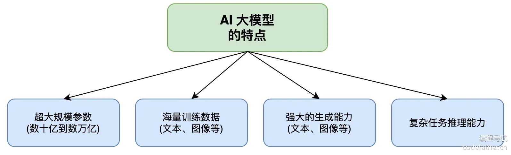

大模型百花齐放，举些例子：

OpenAI

-   GPT-4o（多模态）
-   GPT-4（文本 + 图像）
-   GPT-3.5 Turbo（主要处理文本）

Anthropic

-   Claude 3 系列（Opus, Sonnet, Haiku，由强到弱）

Google

-   Gemini Ultra/Pro/Nano（多模态能力）

Meta

-   Llama 3（开源，70B 和 8B 参数版本）
-   Llama 2（开源，多种参数规模）

国内大模型

-   百度：文心一言
-   阿里：通义千问
-   字节跳动：豆包
-   科大讯飞：星火

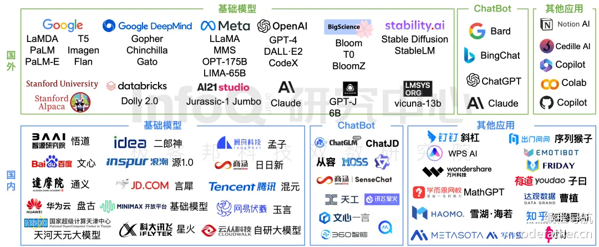

### AI 大模型的分类

了解 AI⁠ 大模型的分类有助‌于我们进行大模型的​技术选型，可以从模‎态、开源性、规模、‌用途等角度进行划分。

#### 1、按模态分类

-   **单模态模型**：仅处理单一类型的数据，如纯文本（早期的 GPT-3）

-   **多模态模型**：能够处理多种类型的信息

-   文本 + 图像：GPT-4V、Gemini、Claude 3

-   文本 + 音频 + 视频：GPT-4o

#### 2、按开源性分类

-   **闭源模型**：不公开模型权重和训练方法

-   代表：GPT-4、Claude、Gemini

-   特点：通常通过 API 访问，付费使用

-   **开源模型**：公开模型权重，允许下载和自行部署

-   代表：Llama 系列、Mistral、Falcon

-   特点：可以本地部署，自由调整，但通常性能略逊于同等规模闭源模型

#### 3、按规模分类

-   **超大规模模型**：参数量在数千亿到数万亿

-   代表：GPT-4 (1.76T 参数)

-   特点：能力强大，但需要大量计算资源

-   **中小规模模型**：参数量在几十亿到几百亿

-   代表：Llama 3 (70B 参数)、Mistral 7B

-   特点：能在较普通的硬件上运行，适合特定任务的精调

#### 4、按用途分类

-   **通用模型**：能处理广泛的任务

-   代表：GPT-4、Claude 3、Gemini

-   **特定领域模型**：针对特定领域优化

-   医疗：Med-PaLM 2

-   代码：CodeLlama、StarCoder

-   科学：Galactica

### 开发者怎么学习 AI 大模型？

作为开发者⁠，不需要深入了解大模‌型的实现原理（如 T​ransformer‎ 架构、注意力机制或‌训练细节），而应该专注于：

1）如何选择适合的 AI 大模型？

-   考虑应用场景需求
-   评估成本与性能平衡
-   考虑数据隐私要求

2）如何有效利用 AI？

-   了解如何接入 AI 大模型？比如 AI 平台和工具
-   如何在程序中调用 AI 大模型？比如 API、SDK 和 AI 开发框架
-   掌握提示工程技巧 Prompt Engineering
-   掌握大模型开发工作流

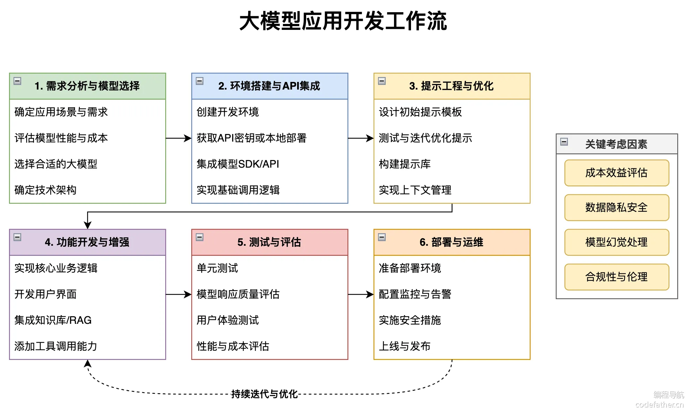

3）了解模型能力边界

-   知道模型能做什么和不能做什么
-   了解模型可能出现的问题（比如幻觉）及处理方法

### 如何对比和选择大模型？

在选择大模⁠型时，可以关注以下‌几个维度，这里提供​给大家一个对比表格‎，无需记忆，要用到‌的时候参考一下即可。

| 维度类别        | 具体评估点                                                 | 说明                                                                                              |
|-----------------|------------------------------------------------------------|---------------------------------------------------------------------------------------------------|
| 功能支持维度    | 多模态能力                                                 | • 纯文本处理 • 图像理解（GPT-4V、Gemini）• 音频 / 视频处理（GPT-4o）• 代码生成与理解（CodeLlama） |
| 工具使用能力    | • 函数调用支持 • 工具集成能力 • 外部 API 连接能力          |                                                                                                   |
| 上下文窗口大小  | • 输入上下文长度（4K 至 128K tokens）• 长文档处理能力      |                                                                                                   |
| 指令遵循能力    | • 复杂指令处理能力 • 多步骤任务执行能力 • 回答格式控制能力 |                                                                                                   |
| 性能指标维⁠度   | 准确性                                                     | ‌ • 知识准确度 •​ 推理能力水平 • ‎幻觉倾向性                                                      |
| 响应质量        | • 输出流畅性与连贯性 • 回答相关性与深度 • 语言表达自然度   |                                                                                                   |
| 知识时效性      | • 知识截止日期 • 更新频率                                  |                                                                                                   |
| 部署与集成⁠维度 | 部署方式‌                                                  | • 云 API​服务 • 本地部署可‎能性 • 私有云部署‌支持                                                 |
| API 接口        | • 接口稳定性与可靠性 • SDK 支持情况 • 开发框架集成         |                                                                                                   |
| 并发处理能力    | • 请求吞吐量 • 并发请求处理能力 • 服务水平协议 (SLA) 保障  |                                                                                                   |
| 商业与合规⁠维度 | 成本效益‌                                                  | • API 调​用价格 • 批量调用‎折扣 • 计算资源成‌本                                                   |
| 数据安全与隐私  | • 数据使用政策 • 是否支持不保存用户数据 • 企业级安全合规   |                                                                                                   |
| 法律合规性      | • 地区可用性 • 版权与知识产权问题 • 内容安全审查机制       |                                                                                                   |
| 生态与支持⁠维度 | 社区支持‌                                                  | • 开发者社​区活跃度 • 问题解‎决资源丰富度 • 第‌三方扩展与工具                                     |
| 文档完善度      | • API 文档质量 • 示例代码丰富度 • 最佳实践指南             |                                                                                                   |
| 技术支持        | • 官方支持渠道 • 响应时间 • 企业级支持选项                 |                                                                                                   |

其中，对大多数开发者来说，更关注的是 **准确度 + 功能支持 + 性能 + 成本**。

作为开发者，⁠我们经常要通过开发框架来‌让程序对接大模型，因此可​以通过一些开发框架的官方‎文档来快速了解和对比不同‌的大模型的功能支持，比如：

-   LangChain4j 支持的大模型对比：<https://docs.langchain4j.dev/integrations/language-models/>
-   Spring AI 大模型对比文档：<https://docs.spring.io/spring-ai/reference/1.0/api/chat/comparison.html>

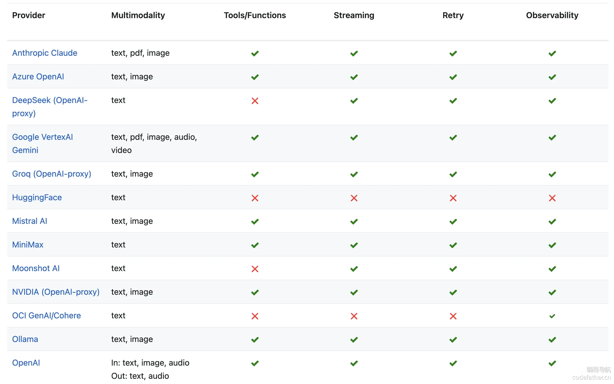

## 二、接入 AI 大模型

### 使用大模型的 2 种途径

在实际开发⁠过程中，我们主要有‌ 2 种途径来使用​ AI 大模型，分‎别是云服务和自部署，‌各有优缺。

#### 1、云服务

直接使用其⁠他云服务商在云端已‌部署好的大模型服务​，无需自己考虑基础‎设施（比如服务器、‌GPU 算力），特点如下：

-   提供纯净的大模型能力和构建应用（智能体）的工具
-   按需付费，无需前期大量基础设施投入
-   随时可用，维护成本低
-   自动更新到最新版本的模型
-   通常具有更完善的安全措施和合规保障

#### 2、自部署

开发者自行在本地或私有云环境部署开源大模型，特点如下：

-   完全控制数据流，更高的数据隐私保障
-   可根据特定需求微调和定制模型
-   无网络延迟，适合对响应速度有严格要求的场景
-   一次性成本较高，需要专业的技术团队维护
-   适合企业级应用和对数据安全有严格要求的场景

对于个人开发⁠者，选用云服务就够了，不‌建议自己本地部署大模型，​资源和维护成本太高了；对‎于特定业务领域的、考虑到‌数据安全性的企业，适合自部署。

### 接入大模型的 3 种方式

#### 1、AI 应用平台接入

通过云服务商提供的 AI 应用平台来使用 AI 大模型。

以 [阿里云百炼](https://bailian.console.aliyun.com/) 为例，这是一站式的大模型开发及应用构建平台，它提供了从模型调用到应用构建的全流程支持。

不论是开发者还⁠是业务人员，都可以通过简单的‌界面操作，在 5 分钟内开发​出一款大模型应用，或在几小时‎内训练出一个专属模型，从而将‌更多精力专注于应用创新。

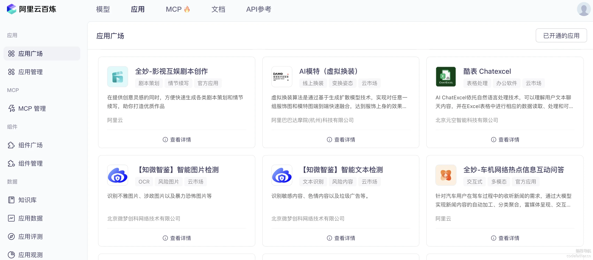

此外，还提⁠供了知识库管理、应‌用评测、应用观测等​功能，能够帮企业快‎速构建智能客服等应‌用。

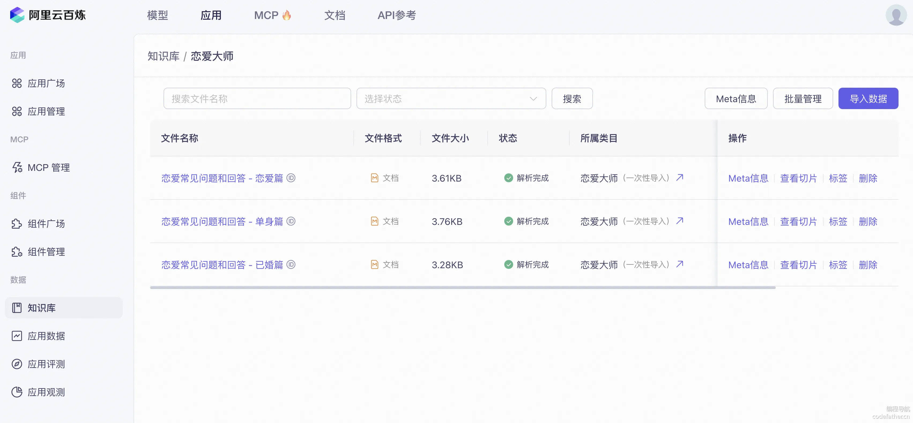

大家在使用阿里云百炼产品时，可能会看到另外一个产品 —— [模型服务灵积](https://www.aliyun.com/product/dashscope)（DashScope），很容易把这两个产品混淆。百炼是一个可视化平台，同时服务于技术和非技术同学，使用更简单，更上层；而灵积旨在通过灵活、易用的 **模型 API 接口**，让开发者能够快速调用丰富的大模型能力，面向技术开发同学，更底层。后续我们通过编程来调用 AI 大模型，更多的是和灵积打交道。

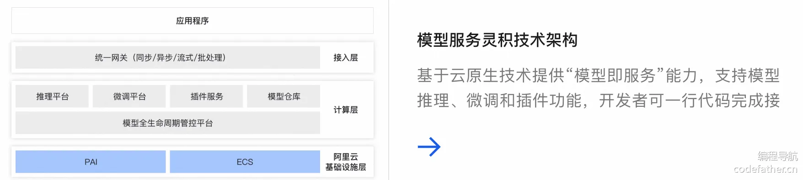

利用阿里云⁠百炼平台，我们可以‌轻松体验 AI 大​模型和构建 AI‎ 应用。

1）[快速体验 AI 大模型](https://bailian.console.aliyun.com/?tab=model#/model-market)：

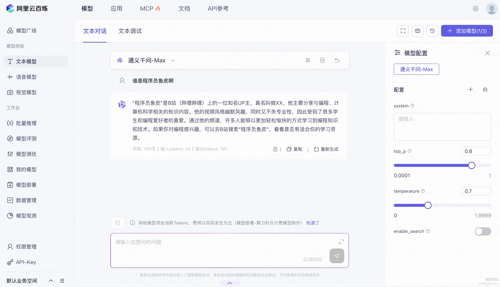

2）[创建自己的 AI 应用](https://bailian.console.aliyun.com/?tab=model#/model-market)，支持智能体、工作流和智能体编排应用。

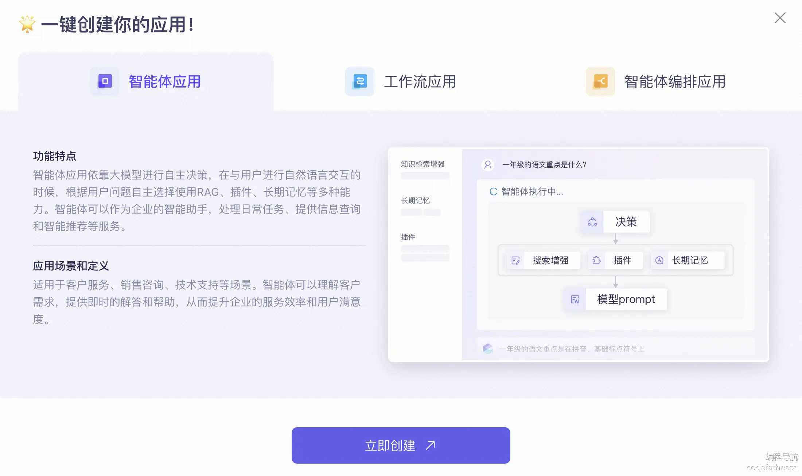

智能体应用：

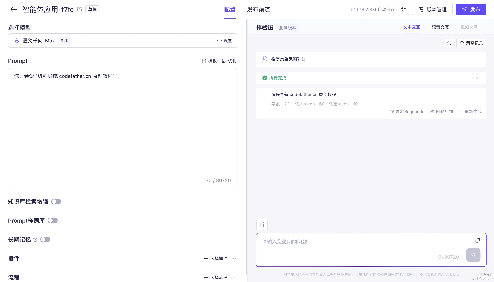

工作流应用，可以自主编排多个工作节点，完成复杂任务。适用于需要结合大模型执行 **高确定性** 的业务逻辑的流程型应用，如可执行不同任务的智能助理工作流、自动化分析会议记录工作流等。

智能体编排应用支持用户通过画布的自定义智能体执行逻辑，**编排主体为智能体**，如智能体节点、智能体组及节点等，可快速实现复杂多智能体协同的逻辑设计和业务效果验证。适用于需要处理大量数据、进行复杂计算或执行多任务处理的场景。

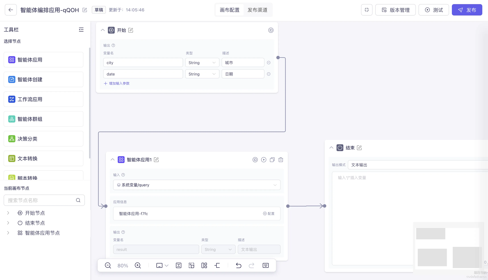

创建好了应用（智能体、工作流或智能体编排）后，可以参考 [应用调用文档](https://help.aliyun.com/zh/model-studio/application-calling-guide)，通过 DashScope SDK 或 HTTP 的方式在自己的项目中集成应用。

#### 2、AI 软件客户端接入

除了平台之⁠外，还可以通过 A‌I 软件客户端来使​用大模型能力，这里‎推荐 2 个梁哥用‌的比较多的：

1）[Cherry Studio](https://www.cherry-ai.com/)：一款集多模型对话、知识库管理、AI 绘画、翻译等功能于一体的全能 AI 助手平台。Cherry Studio 提供高度自定义的设计、强大的扩展能力和友好的用户体验。

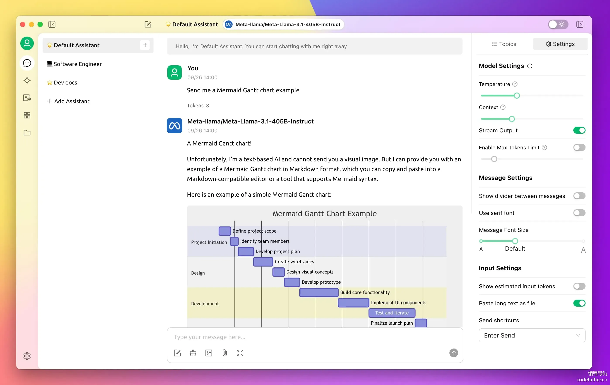

2）[Cursor](https://www.cursor.com/)：以 AI 为核心的编程开发工具，可以快速生成项目代码、理解整个代码库并提供智能建议。

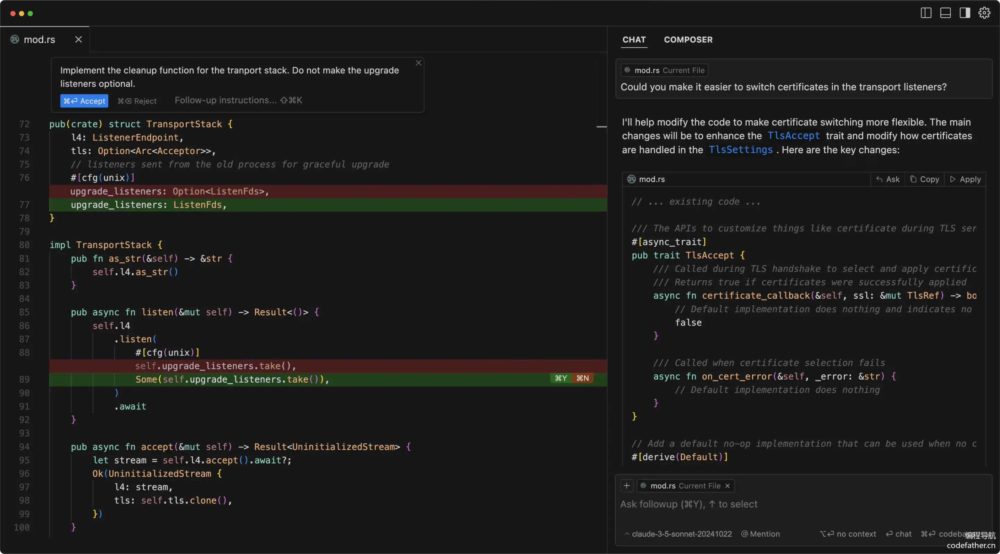

在本项目中，也会使用 Cursor 来生成前端项目代码。

#### 3、程序接入

可以通过编⁠程的方式在自己的项‌目中调用 AI 大​模型，又可以分为 ‎2 种方式：

1.  直接调用 AI 大模型，比如调用 DeepSeek（更原生）
2.  调用 AI 大模型平台创建的应用或智能体（更方便）

对于第 1 种方式，可以使用特定平台提供的 SDK 或 API，参考平台的文档来接入；也可以使用 AI 开发框架，比如 Spring AI、[Spring AI Alibaba](https://java2ai.com/)、LangChain4j 等自主选择大模型进行调用，可以灵活切换使用的大模型而几乎不用修改代码。

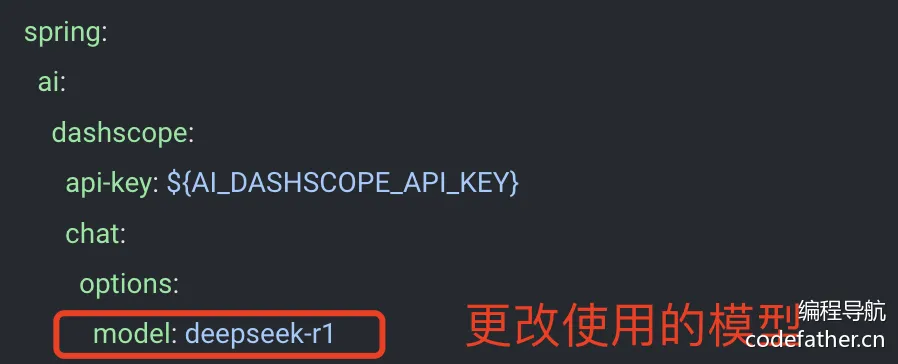

对于第 2 种方式，一般只能使用特定平台提供的 SDK 或 API，参考 [平台的文档](https://help.aliyun.com/zh/model-studio/spring-ai-alibaba-integrate-llm-application) 来接入，每个大模型服务平台的代码都不一样。

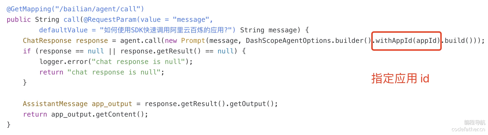

如果是个人小项目，第 ⁠2 种方式可能会更方便，因为把大多数应用构建‌的操作都放到了云端可视化平台而不是通过编程来​实现；但如果是企业级项目，考虑到扩展性，更推‎荐第 1 种方式，直接用 Spring AI‌ 等开发框架调用 AI 大模型。

## 三、后端项目初始化

### 环境准备

安装的 JDK 版本必须是 17 或 21，\*\* 不能选择其他版本！\*\* 因为项目使用最新版本的 Spring Boot 3 和 Spring AI 开发框架。

推荐使用 21 版本，因为支持虚拟线程这个王炸功能。

虚拟线程的作用是大幅度降低线程的成本，让IO变得代价更低，后续在agent的流处理中起到重大作用。

### 新建项目

在 IDEA 中新建项目，选择 Spring Initializr 模板，注意需要确保 Server URL 为 <https://start.spring.io/>。

配置如图，Java 版本选择 21：

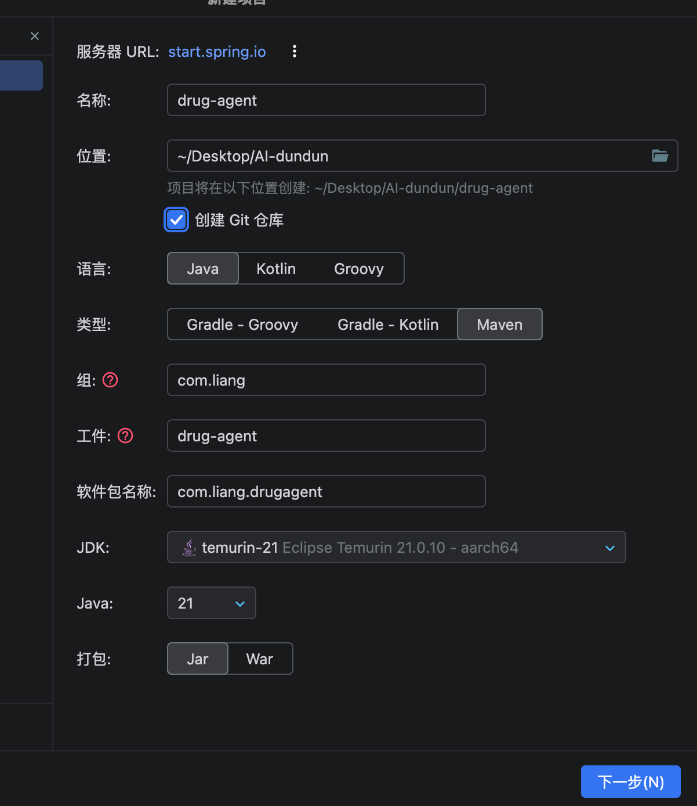

选择 Spr⁠ing Boot 3.‌4.4 版本，可以根据​自己的需要添加一些依赖‎，比如 Spring ‌Web 和 Lombok：

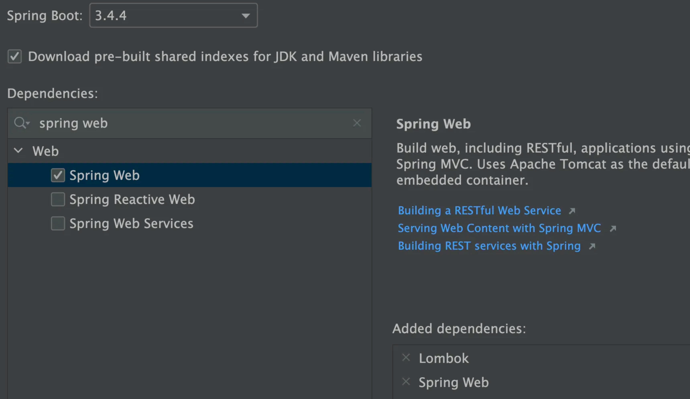

当然，后续通过修改 Maven 配置添加依赖也是可以的。

点击创建，⁠就得到了一个 Sp‌ring Boot​ 项目，需要等待 ‎Maven 为我们‌安装依赖。

💡 小提示，如果 Lombok 依赖报错的话，可以手动指定 Lombok 的版本，pom.xml 代码如下：

    <dependency>
        <groupId>org.projectlombok</groupId>
        <artifactId>lombok</artifactId>
        <version>1.18.36</version>
        <optional>true</optional>
    </dependency>

### 整合依赖

可以根据自⁠己的需要，整合一些开‌发项目常用的依赖。此​处我们整合 Huto‎ol 工具库和 Kn‌ife4j 接口文档即可。

#### 1、Hutool 工具库

Hutool 是主流的 Java 工具类库，集合了丰富的工具类，涵盖字符串处理、日期操作、文件处理、加解密、反射、正则匹配等常见功能。它的轻量化和无侵入性让开发者能够专注于业务逻辑而不必编写重复的工具代码。例如，`DateUtil.formatDate(new Date())` 可以快速将当前日期格式化为字符串。

参考官方文档引入：<https://doc.hutool.cn/pages/index/#%F0%9F%8D%8Amaven>

在 Maven 的 pom.xml 中添加依赖：

    <dependency>
        <groupId>cn.hutool</groupId>
        <artifactId>hutool-all</artifactId>
        <version>5.8.37</version>
    </dependency>

#### 2、Knife4j 接口文档

Knife4j 是基于 S⁠wagger 接口文档的增强工具，提供了更加友好的‌ API 文档界面和功能扩展，例如动态参数调试、分组文​档等。它适合用于 Spring Boot 项目‎中，能够通过简单的配置自动生成接口文档，让开发者和‌前端快速了解和调试接口，提高写作效率。

参考 [官方文档](https://doc.xiaominfo.com/docs/quick-start#spring-boot-3) 引入，注意我们使用的是 Spring Boot 3.x，不要引入错版本了：

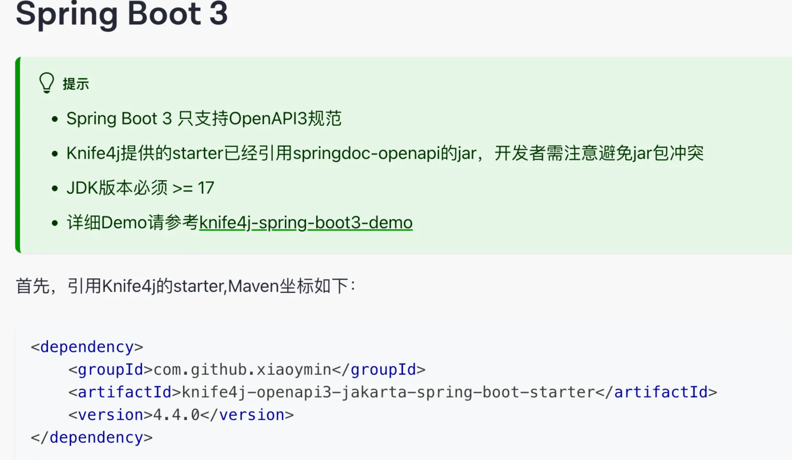

1）在 Maven 的 pom.xml 中添加依赖：

    <dependency>
        <groupId>com.github.xiaoymin</groupId>
        <artifactId>knife4j-openapi3-jakarta-spring-boot-starter</artifactId>
        <version>4.4.0</version>
    </dependency>

2）新建 ⁠controlle‌r 包用于存放 A​PI 接口，编写一‎个健康检查接口用于‌测试接口文档是否正常引入：

    @RestController
    @RequestMapping("/health")
    public class HealthController {
    
        @GetMapping
        public String healthCheck() {
            return "ok";
        }
    }

3）在 application.yml 中追加接口文档配置，扫描 controller 包。这段配置可以从官方文档中复制过来，然后微调即可：

    spring:
      application:
        name: drug-agent
    server:
      port: 8123
      servlet:
        context-path: /api
    
    springdoc:
      swagger-ui:
        path: /swagger-ui.html
        tags-sorter: alpha
        operations-sorter: alpha
      api-docs:
        path: /v3/api-docs
      group-configs:
        - group: 'default'
          paths-to-match: '/**'
          packages-to-scan: com.liang.drugagent.controller
    
    knife4j:
      enable: true
      setting:
        language: zh_cn

4）启动项目，访问 <http://localhost:8123/api/doc.html> 能够看到接口文档，可以测试调用接口：

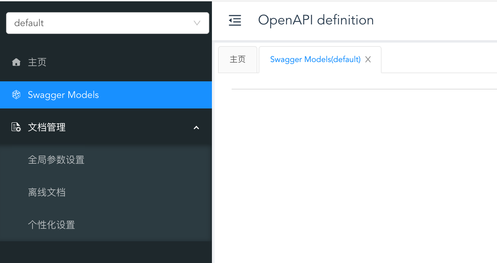

## 四、程序调用 AI 大模型

在实际开发中，有⁠多种方式可以在应用程序中调用 ‌AI 大模型。下面详细介绍 4​ 种主流的接入方式，并通过实例‎代码展示如何在 Java 项目‌中实现与 AI 大模型的交互。

1.  SDK 接入：使用官方提供的软件开发工具包，最直接的集成方式
2.  HTTP 接入：通过 REST API 直接发送 HTTP 请求调用模型
3.  Spring AI：基于 Spring 生态系统的 AI 框架，更方便地接入大模型
4.  LangChain4j：专注于构建 LLM 应用的 Java 框架，提供丰富的 AI 调用组件

本教程选择⁠阿里云百炼平台作为示‌例，因为阿里系大模型​对 Java 开发生‎态支持较好，更容易与‌现有 Java 框架集成。

再次提示：⁠AI 技术领域发展迅‌猛，相关 API 和​技术栈更新非常快速，‎强烈建议在阅读教程时‌，结合最新的官方文档学习。

下面所有的示例代码均放置在项目的 `demo.invoke` 包下，方便统一管理和查阅。

### 1、SDK 接入

SDK（软⁠件开发工具包）是官‌方提供的最直接的集​成方式，通常提供了‎完善的类型支持和错误‌处理机制。

1）首先需要按照官方文档安装 SDK：[安装 SDK 官方指南](https://help.aliyun.com/zh/model-studio/developer-reference/install-sdk/)

在选择 SDK 版本时，建议在 Maven 仓库查看最新的版本号：[Maven 中央仓库版本信息](https://mvnrepository.com/artifact/com.alibaba/dashscope-sdk-java)

在 pom.xml 中引入依赖：

    <dependency>
        <groupId>com.alibaba</groupId>
        <artifactId>dashscope-sdk-java</artifactId>
        <version>2.19.1</version>
    </dependency>

2）先在百炼平台申请一个 API Key，注意不要泄露：

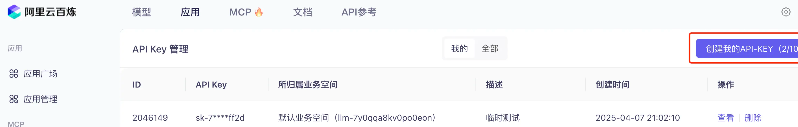

3）项目中新建 `demo.invoke` 包，集中存放调用 AI 大模型的示例代码。

具体的代码示例可参考官方文档 [通过 API 调用通义千问](https://help.aliyun.com/zh/model-studio/use-qwen-by-calling-api#ab9194e9a55dk)，如图：

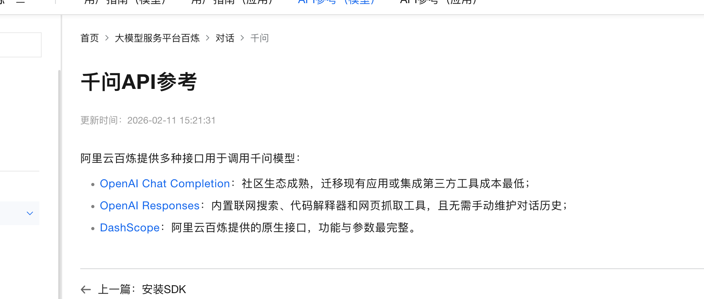

为了安全管⁠理 API 密钥，‌我们创建一个接口类​来存储密钥信息（在‎实际生产环境中，应‌使用配置文件或环境变量）：

    public interface TestApiKey {
    
        String API_KEY = "你的 API Key";
    }

使用 SDK 调用模型的完整示例代码：

    import java.util.Arrays;
    import java.lang.System;
    
    import com.alibaba.dashscope.aigc.generation.Generation;
    import com.alibaba.dashscope.aigc.generation.GenerationParam;
    import com.alibaba.dashscope.aigc.generation.GenerationResult;
    import com.alibaba.dashscope.common.Message;
    import com.alibaba.dashscope.common.Role;
    import com.alibaba.dashscope.exception.ApiException;
    import com.alibaba.dashscope.exception.InputRequiredException;
    import com.alibaba.dashscope.exception.NoApiKeyException;
    import com.alibaba.dashscope.utils.JsonUtils;
    
    public class SdkAiInvoke {
    
        public static GenerationResult callWithMessage() throws ApiException, NoApiKeyException, InputRequiredException {
            Generation gen = new Generation();
            Message systemMsg = Message.builder()
                    .role(Role.SYSTEM.getValue())
                    .content("You are a helpful assistant.")
                    .build();
            Message userMsg = Message.builder()
                    .role(Role.USER.getValue())
                    .content("你是谁？")
                    .build();
            GenerationParam param = GenerationParam.builder()
                    
                    .apiKey(TestApiKey.API_KEY)
                    
                    .model("qwen-plus")
                    .messages(Arrays.asList(systemMsg, userMsg))
                    .resultFormat(GenerationParam.ResultFormat.MESSAGE)
                    .build();
            return gen.call(param);
        }
    
        public static void main(String[] args) {
            try {
                GenerationResult result = callWithMessage();
                System.out.println(JsonUtils.toJson(result));
            } catch (ApiException | NoApiKeyException | InputRequiredException e) {
                
                System.err.println("An error occurred while calling the generation service: " + e.getMessage());
            }
            System.exit(0);
        }
    }

4）运行项目，成功看到 AI 的回复：

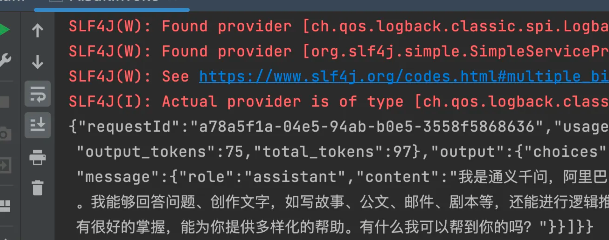

### 2、HTTP 接入

对于 SD⁠K 不支持的编程语言‌或需要更灵活控制的场​景，可以直接使用 H‎TTP 请求调用 A‌I 大模型的 API。

💡 使用建议：一⁠般来说，如果有官方 SDK 支持，优‌先使用 SDK；只有在不支持 SDK​ 的情况下，再考虑直接 HTTP 调用‎                  ‌              

HTTP 调用的详细说明可参考官方文档：[通过 API 调用通义千问](https://help.aliyun.com/zh/model-studio/use-qwen-by-calling-api#9141263b961cc)

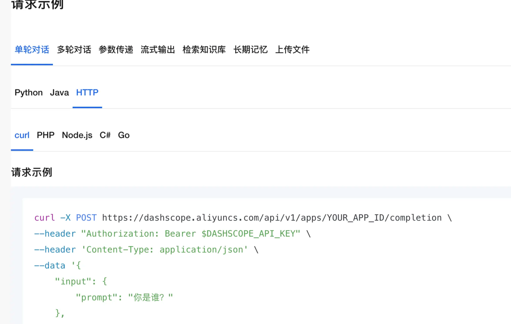

可以利用 ⁠AI 将上述 CUR‌L 代码转换为 Ja​va 的 Hutoo‎l 工具类网络请求代‌码，示例 Prompt：

    将上述请求转换为 hutool 工具类的请求代码

### 3⁠、Spring A‌I        ​         ‎         ‌      

[Spring AI](https://docs.spring.io/spring-ai/reference/) 是 Spring 生态系统的新成员，旨在简化 AI 功能与 Spring 应用的集成。Spring AI 通过提供统一接口、支持集成多种 AI 服务提供商和模型类型、各种 AI 开发常用的特性（比如 RAG 知识库、Tools 工具调用和 MCP 模型上下文协议），简化了 AI 应用开发代码，使开发者能够专注于业务逻辑，提高了开发效率。

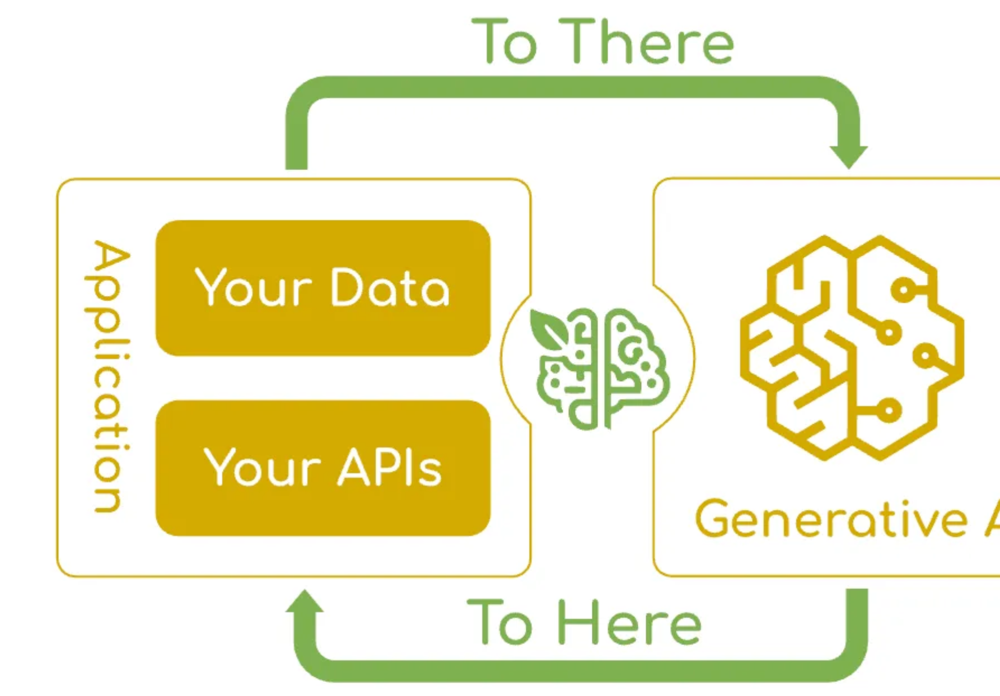

Sprin⁠g AI 的文档写‌得还是比较清晰易懂​的，打破了我对国外‎文档的一贯认知（

Spring AI 的核心特性如下，参考官方文档：

-   跨 AI 供应商的可移植 API 支持：适用于聊天、文本转图像和嵌入模型，同时支持同步和流式 API 选项，并可访问特定于模型的功能。
-   支持所有主流 AI 模型供应商：如 Anthropic、OpenAI、微软、亚马逊、谷歌和 Ollama，支持的模型类型包括：聊天补全、嵌入、文本转图像、音频转录、文本转语音
-   结构化输出：将 AI 模型输出映射到 POJO（普通 Java 对象）。
-   支持所有主流向量数据库：如 Apache Cassandra、Azure Cosmos DB、Azure Vector Search、Chroma、Elasticsearch、GemFire、MariaDB、Milvus、MongoDB Atlas、Neo4j、OpenSearch、Oracle、PostgreSQL/PGVector、PineCone、Qdrant、Redis、SAP Hana、Typesense 和 Weaviate。
-   跨向量存储供应商的可移植 API：包括新颖的类 SQL 元数据过滤 API。
-   工具 / 函数调用：允许模型请求执行客户端工具和函数，从而根据需要访问必要的实时信息并采取行动。
-   可观测性：提供与 AI 相关操作的监控信息。
-   文档 ETL 框架：适用于数据工程场景。
-   AI 模型评估工具：帮助评估生成内容并防范幻觉响应。
-   Spring Boot 自动配置和启动器：适用于 AI 模型和向量存储。
-   ChatClient API：与 AI 聊天模型通信的流式 API，用法类似于 WebClient 和 RestClient API。
-   Advisors API：封装常见的生成式 AI 模式，转换发送至语言模型（LLM）和从语言模型返回的数据，并提供跨各种模型和用例的可移植性。
-   支持聊天对话记忆和检索增强生成（RAG）。

Spring AI 默认没有支持所有的大模型（尤其是国产的），更多的是支持兼容 OpenAI API 的大模型的集成，参考 [官方的模型对比](https://docs.spring.io/spring-ai/reference/api/chat/comparison.html)。因此，我们如果想要调用阿里系大模型（比如通义千问），推荐直接使用阿里自主封装的 [Spring AI Alibaba 框架](https://java2ai.com/)，它不仅能直接继承阿里系大模型，用起来更方便，而且与标准的 Spring AI 保持兼容。

可以参考下列官方文档，来跑通调用大模型的流程：

-   [灵积模型接入指南](https://java2ai.com/docs/1.0.0-M6.1/models/dashScope/)
-   [通义千问接入指南](https://java2ai.com/docs/1.0.0-M6.1/models/qwq/)

1）引入依赖：

    <dependency>
        <groupId>com.alibaba.cloud.ai</groupId>
        <artifactId>spring-ai-alibaba-starter</artifactId>
        <version>1.0.0-M6.1</version>
    </dependency>

官方提醒：由于 spring-ai 相关依赖包还没有发布到中央仓库，如出现 spring-ai-core 等相关依赖解析问题，请在项目的 pom.xml 依赖中加入如下仓库配置。

    <repositories>
      <repository>
        <id>spring-milestones</id>
        <name>Spring Milestones</name>
        <url>https://repo.spring.io/milestone</url>
        <snapshots>
          <enabled>false</enabled>
        </snapshots>
      </repository>
    </repositories>

2）编写配置：

    spring:
      application:
        name: spring-ai-alibaba-qwq-chat-client-example
      ai:
        dashscope:
          api-key: ${AI_DASHSCOPE_API_KEY}
          chat:
            options:
              model: qwen-plus

3）编写示例代码，注意要注入 `dashscopeChatModel`：

    @Component
    public class SpringAiAiInvoke implements CommandLineRunner {
    
        @Resource
        private ChatModel dashscopeChatModel;
    
        @Override
        public void run(String... args) throws Exception {
            AssistantMessage output = dashscopeChatModel.call(new Prompt("你好，我是梁哥"))
                    .getResult()
                    .getOutput();
            System.out.println(output.getText());
        }
    }

上述代码实现了 C⁠ommandLineRunner 接‌口，我们启动 Spring Boot​ 项目时，会自动注入大模型 Chat‎Model 依赖，并且单次执行该类的‌ run 方法，达到测试的效果。

💡 上述代码中我们是通⁠过 ChatModel 对象调用大模型，适合简单‌的对话场景。除了这种方式外，Spring AI ​还提供了 ChatClient 调用方式，提供更‎多高级功能（比如会话记忆），适合复杂场景，在后续‌ AI 应用开发章节中会详细介绍。

### 4、LangChain4j

和 Spring AI ⁠作用一样，LangChain4j 是一个专注于‌构建基于大语言模型（LLM）应用的 Java ​框架，作为知名 AI 框架 LangChain‎ 的 Java 版本，它提供了丰富的工具和抽象‌层，简化了与 LLM 的交互和应用开发。

LangChain 官方是没有支持阿里系大模型的，只能用 [社区版本的整合大模型包](https://github.com/langchain4j/langchain4j-community/tree/main/models)。可以在官方文档中查询支持的模型列表：[LangChain4j 模型集成](https://docs.langchain4j.dev/integrations/language-models/)

要接入阿里云灵积模型，可以参考官方文档：[DashScope 模型集成](https://docs.langchain4j.dev/integrations/language-models/dashscope)，提供了依赖和示例代码。

1）首先引入依赖：

    <dependency>
        <groupId>dev.langchain4j</groupId>
        <artifactId>langchain4j-community-dashscope</artifactId>
        <version>1.0.0-beta2</version>
    </dependency>

值得一提的是，LangChain4j 也提供了 Spring Boot Starter，方便在 Spring 项目中使用，最新版本号可以在 [Maven 中央仓库](https://mvnrepository.com/artifact/dev.langchain4j/langchain4j-community-dashscope) 查询。我们这里由于只是编写 Demo，而且已经引入了 Spring AI 的 Starter，就不再引入 LangChain 的 Starter 了，担心会有冲突。

2）参考 [官方文档](https://docs.langchain4j.dev/get-started) 来编写示例对话代码，创建了一个 ChatModel 并调用，是不是和 Spring AI 很像？

    public class LangChainAiInvoke {
    
        public static void main(String[] args) {
            ChatLanguageModel qwenModel = QwenChatModel.builder()
                    .apiKey(TestApiKey.API_KEY)
                    .modelName("qwen-max")
                    .build();
            String answer = qwenModel.chat("我是程序员梁哥，这是编程导航 codefather.cn 的原创项目教程");
            System.out.println(answer);
        }
    }

最后直接运行 Main 方法进行测试即可。

### 接入方式对比

以下是 4⁠ 种 AI 大模型接‌入方式的优缺点对比：​          ‎          ‌            

| 接入方式    | 优点                                                                                | 缺点                                                            | 适用场景                                            |
|-------------|-------------------------------------------------------------------------------------|-----------------------------------------------------------------|-----------------------------------------------------|
| SDK 接入    | • 类型安全，编译时检查 • 完善的错误处理 • 通常有详细文档 • 性能优化好               | • 依赖特定版本 • 可能增加项目体积 • 语言限制                    | • 需要深度集成 • 单一模型提供商 • 对性能要求高      |
| HTTP 接入   | • 无语言限制 • 不增加额外依赖 • 灵活性高 ⁠                                          | • 需要手动处理错误 • 序列化 / 反序列化复杂 • 代码冗长           | • SDK 不支持的语言 • 简单原型验证 • 临时性集成      |
| Spring‌ AI  | • 统一的抽象接口 • 易于切换模型提供商 • 与 Spring 生态完美融合 • 提供高级功能       | • 增加额外抽象层 • 可能不​支持特定模型的特性 • 版本还在快速迭代 | • Spring 应用 • 需要支持多种模型 • 需要高级 AI 功能 |
| LangChain4j | ‎ • 提供完整的 AI 应用工具链 • 支持复杂工作流 • 丰富的组件和工具 • 适合构建 AI 代理 | • 学习曲线较陡 • 文档相对较少 • 抽‌象可能引入性能开销           | • 构建复杂 AI 应用 • 需要链式操作 • RAG 应用开发    |

个人更推荐选择 Spring⁠ AI，一方面是它属于 Spring 生态，更主流；另‌一方面是它简单易用、资源更多，更利于学习，也能满足我们​绝大多数 AI 项目的开发需求。因此本项目的后续教程，‎也会以 Spring AI 为主。学会一个 AI 开发‌框架后，其他框架学起来都是如鱼得水。

💡 无论⁠选择哪种接入方式，‌都建议先使用简单的​测试案例验证接入是‎否成功，然后再进行‌更复杂的功能开发。

## 五、扩展知识 - 本地部署和接入 AI 大模型

有时，我们希望在本⁠地环境中部署和使用大模型，以获得更好‌的数据隐私控制、更低的延迟以及无需网​络连接的使用体验。下面来讲解如何在本‎地安装和接入 AI 大模型，并通过 ‌Spring AI 框架进行调用。

### 1、本地安装大模型

可以直接使用开源项目 [Ollama](https://ollama.com/) 快速安装大模型，无需自己执行脚本安装、也省去了复杂的环境配置。

Ollama 不仅提供了友好的命令行界面，还支持通过 API 调用，方便与各种应用程序集成，参考 [官方文档](https://github.com/ollama/ollama/blob/main/docs/api.md)。

1）首先下载安装 Ollama，并安装其命令行工具：

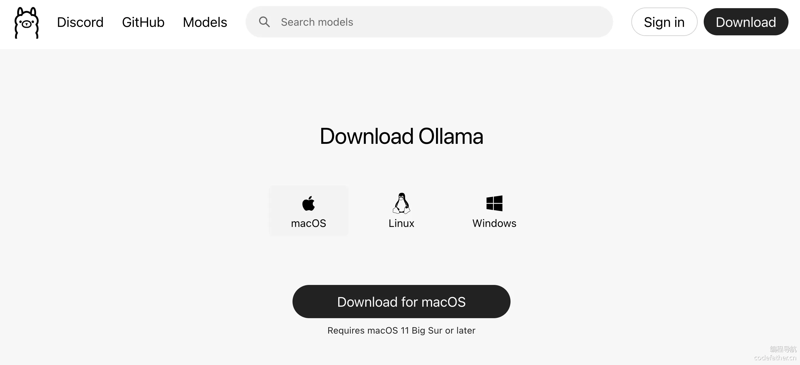

2）安装完成后，打开终端执行 `ollama --help` 可以查看用法：

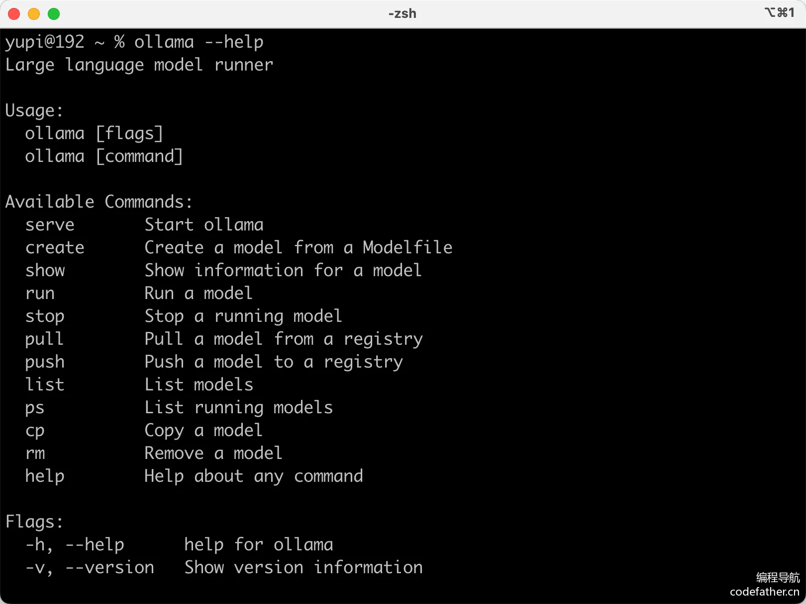

3）进入到 [Ollama 官网的模型广场](https://ollama.com/search) 中，挑选模型：

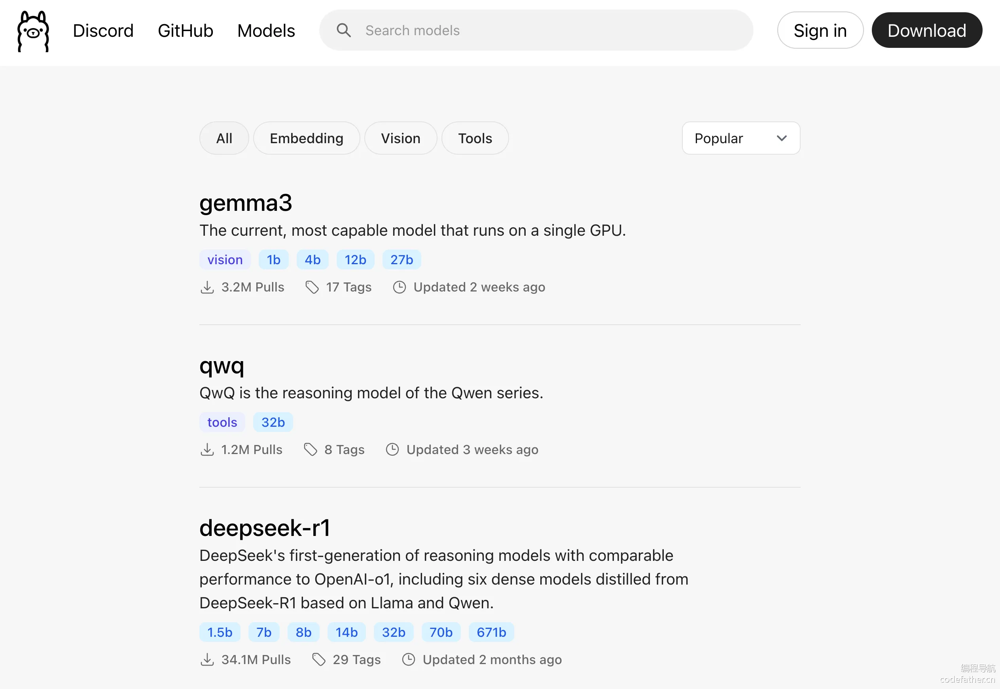

4）选中某⁠个模型后，支持切换‌模型版本，建议刚开​始选择小模型，安装‎速度更快、对硬件的‌要求也更低：

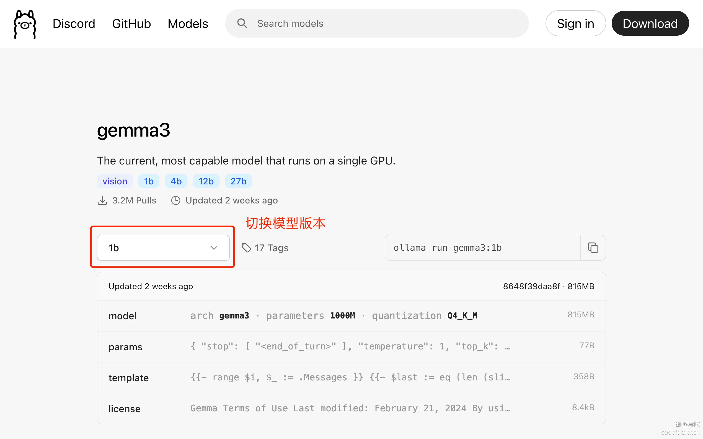

5）执行 ollama 命令来快速安装并运行大模型：

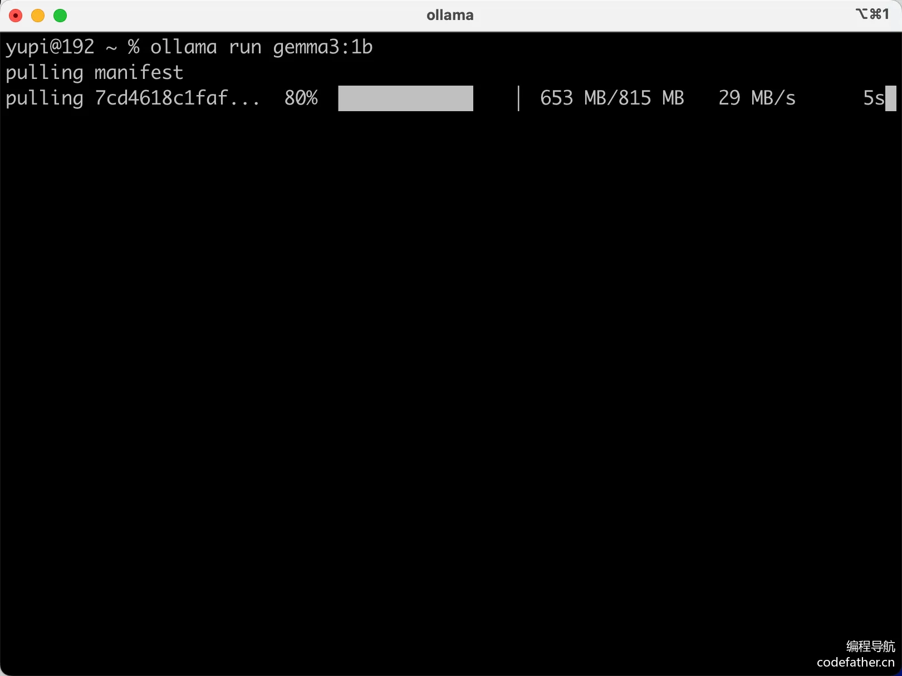

6）安装运行成功后，可以在终端打字和大模型对话：

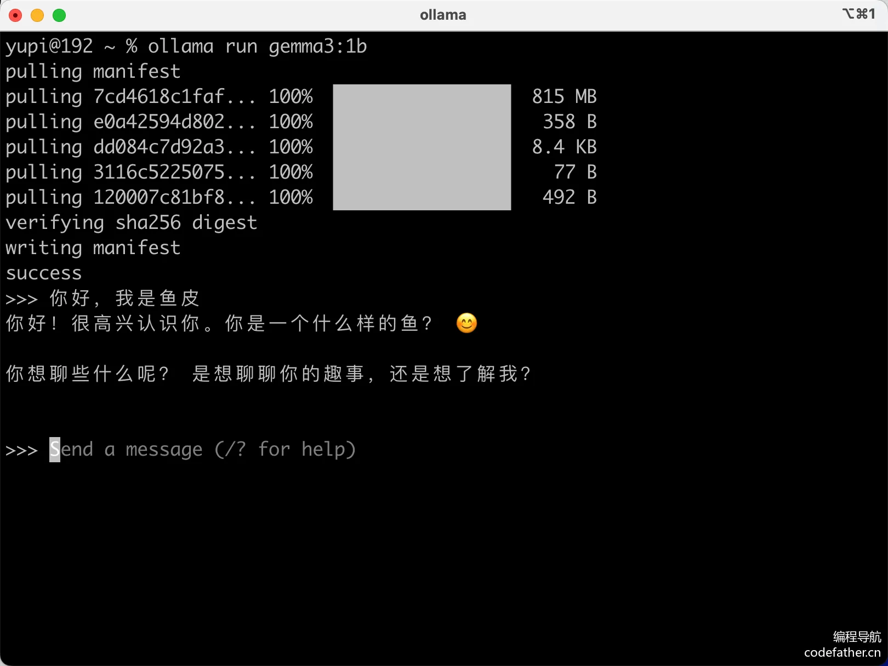

访问 [http://localhost:11434](http://localhost:11434/)，能够看到模型正常运行：

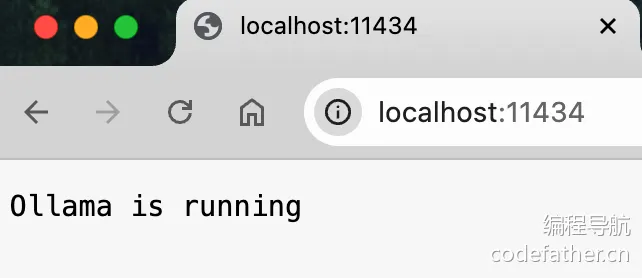

### 2、Spring AI 调用 Ollama 大模型

Spring AI 原生支持调用 Ollama 大模型，直接参考 [官方文档](https://java2ai.com/docs/1.0.0-M6.1/models/ollama) 编写配置和代码即可。

1）需要先引入依赖：

    <dependency>
        <groupId>org.springframework.ai</groupId>
        <artifactId>spring-ai-ollama-spring-boot-starter</artifactId>
        <version>1.0.0-M6</version>
    </dependency>

官方提醒：由于 spring-ai 相关依赖包还没有发布到中央仓库，如出现 spring-ai-core 等相关依赖解析问题，请在项目的 pom.xml 依赖中加入如下仓库配置。

    <repositories>
      <repository>
        <id>spring-milestones</id>
        <name>Spring Milestones</name>
        <url>https://repo.spring.io/milestone</url>
        <snapshots>
          <enabled>false</enabled>
        </snapshots>
      </repository>
    </repositories>

如果安装依赖失败了，需要查看具体的报错信息，比如出现了因为 Lombok 没有指定版本号导致的错误。可以尝试删除本地仓库中与 Lombok 相关的缓存文件，Mac 系统的本地仓库一般位于`~/.m2/repository` ，找到`org/projectlombok/lombok`目录并删除，然后重新构建项目。

2）填写配置，注意模型填写为我们刚刚安装并运行的模型：

    spring:
      ai:
        ollama:
          base-url: http://localhost:11434
          chat:
            model: gemma3:1b

3）在 `demo.invoke` 包中编写一段测试代码：

    public class OllamaAiInvoke implements CommandLineRunner {
    
        @Resource
        private ChatModel ollamaChatModel;
    
        @Override
        public void run(String... args) throws Exception {
            AssistantMessage output = ollamaChatModel.call(new Prompt("你好，我是梁哥"))
                    .getResult()
                    .getOutput();
            System.out.println(output.getText());
        }
    }

4）启动项目，成功运行并查看到 AI 的回答：

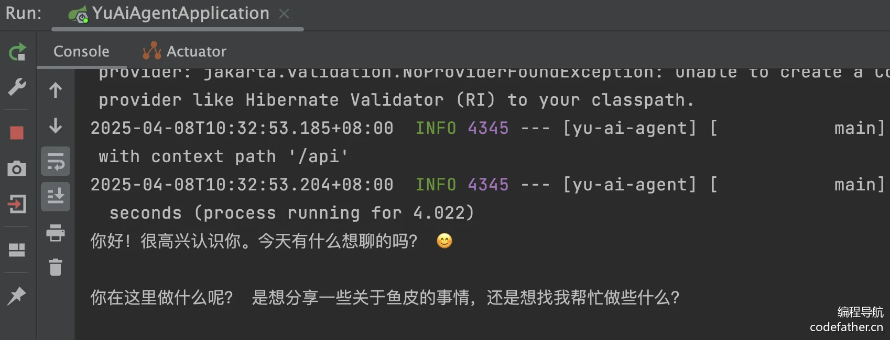

## 六、扩展思路

1）完善后端项目的初始化，补充通用基础代码

2）使用其他 AI 大模型平台，比如 [火山引擎](https://www.volcengine.com/)，并且通过 SDK 接入大模型

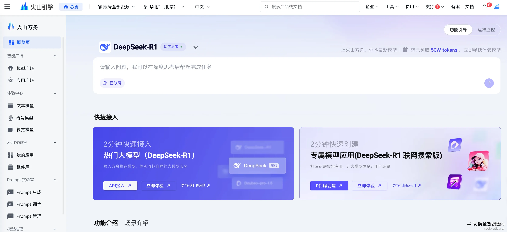
