# 5 - RAG 知识库进阶 - AI 超级智能体项目教程

 本节重点以 Spring AI 框架为例，学习 RAG 知识库应用开发的核心特性和高级知识点，并且掌握 RAG 最佳实践和调优技巧。

## 本节重点

以 Spri⁠ng AI 框架为例，‌学习 RAG 知识库应​用开发的核心特性和高级‎知识点，并且掌握 RA‌G 最佳实践和调优技巧。

具体内容包括：

-   RAG 核心特性

-   文档收集和切割（ETL）

-   向量转换和存储（向量数据库）

-   文档过滤和检索（文档检索器）

-   查询增强和关联（上下文查询增强器）

-   RAG 最佳实践和调优

-   RAG 高级知识

-   检索策略

-   大模型幻觉

-   高级 RAG 架构

友情提示：由于 AI 的⁠更新速度飞快，随着平台 / 工具 / 技术 /‌ 软件的更新，教程的部分细节可能会失效，所以请​大家重点学习思路和方法，不要因为实操和教程不一‎致就过于担心，而是要学会自己阅读官方文档并查阅‌资料，多锻炼自己解决问题的能力。

## 一、RAG 核心特性

这一小节我⁠们更多的是了解 R‌AG 的核心特性，​重理论轻实战，下一‎小节会更注重实战。

还记得上节教程中，我们讲到的 RAG 工作流程么？

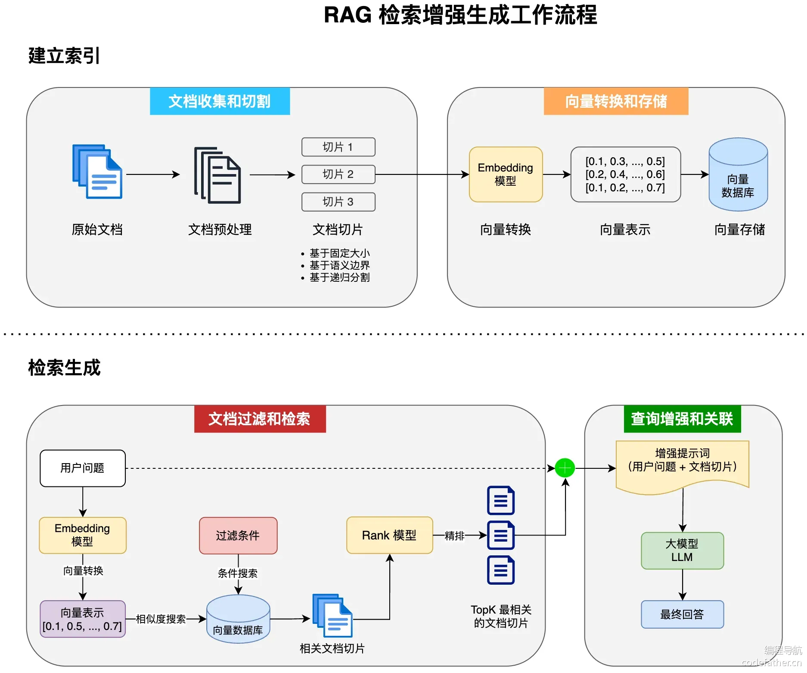

上节教程中我们只是⁠按照这个流程完成了入门级 RAG ‌应用的开发，实际上每个流程都有一些​值得学习的特性，Spring AI‎ 也为这些流程的技术实现提供了支持‌，下面让我们按照流程依次进行讲解。

-   文档收集和切割
-   向量转换和存储
-   文档过滤和检索
-   查询增强和关联

### 文档收集和切割 - ETL

文档收集和切割阶段，我们要对自己准备好的知识库文档进行处理，然后保存到向量数据库中。这个过程俗称 ETL（抽取、转换、加载），Spring AI 提供了对 ETL 的支持，参考 [官方文档](https://docs.spring.io/spring-ai/reference/api/etl-pipeline.html)。

#### 文档

什么是 Spring AI 中的文档呢？

文档不仅仅包含文本，还可以包含一系列元信息和多媒体附件：

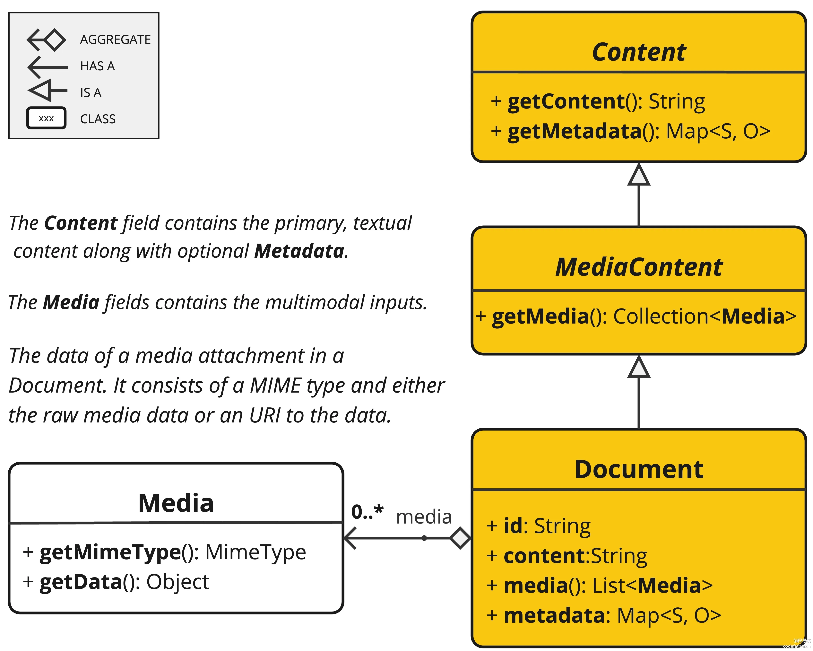

#### ETL

在 Spr⁠ing AI 中，‌对 Documen​t 的处理通常遵循‎以下流程：

1.  读取文档：使用 DocumentReader 组件从数据源（如本地文件、网络资源、数据库等）加载文档。
2.  转换文档：根据需求将文档转换为适合后续处理的格式，比如去除冗余信息、分词、词性标注等，可以使用 DocumentTransformer 组件实现。
3.  写入文档：使用 DocumentWriter 将文档以特定格式保存到存储中，比如将文档以嵌入向量的形式写入到向量数据库，或者以键值对字符串的形式保存到 Redis 等 KV 存储中。

流程如图：

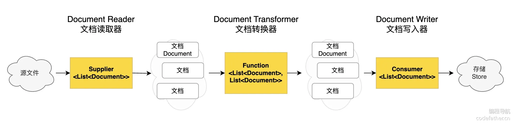

我们利用 Spr⁠ing AI 实现 ETL，核心‌就是要学习 DocumentRe​ader、DocumentTra‎nsformer、Documen‌tWriter 三大组件。

完整的 E⁠TL 类图如下，先‌简单了解一下即可，​下面分别来详细讲解‎这 3 大组件：

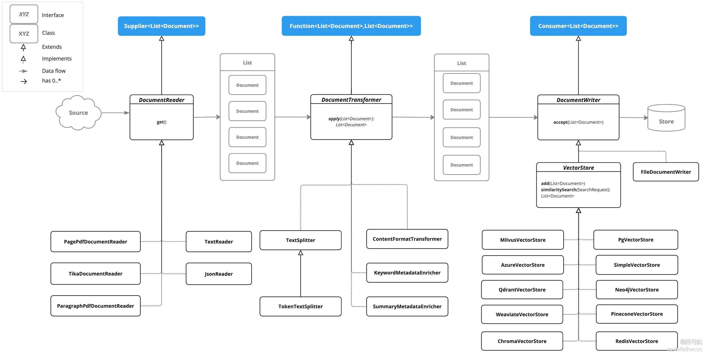

#### 抽取（Extract）

Sprin⁠g AI 通过 D‌ocumentRe​ader 组件实现‎文档抽取，也就是把‌文档加载到内存中。

看下源码，DocumentReader 接口实现了 `Supplier<List<Document>>` 接口，主要负责从各种数据源读取数据并转换为 Document 对象集合。

    public interface DocumentReader extends Supplier<List<Document>> {
        default List<Document> read() {
            return get();
        }
    }

实际开发中，我们可以直接使用 Spring AI 内置的多种 [DocumentReader 实现类](https://docs.spring.io/spring-ai/reference/api/etl-pipeline.html#_documentreaders)，用于处理不同类型的数据源：

1.  JsonReader：读取 JSON 文档
2.  TextReader：读取纯文本文件
3.  MarkdownReader：读取 Markdown 文件
4.  PDFReader：读取 PDF 文档，基于 Apache PdfBox 库实现

-   PagePdfDocumentReader：按照分页读取 PDF
-   ParagraphPdfDocumentReader：按照段落读取 PDF

5.  HtmlReader：读取 HTML 文档，基于 jsoup 库实现
6.  TikaDocumentReader：基于 [Apache Tika](https://tika.apache.org/3.1.0/formats.html) 库处理多种格式的文档，更灵活

以 Json⁠Reader 为例，支‌持 JSON Poin​ters 特性，能够快‎速指定从 JSON 文‌档中提取哪些字段和内容：

     @Component
     class MyJsonReader {
         private final Resource resource;
    
         MyJsonReader(@Value("classpath:products.json") Resource resource) {
             this.resource = resource;
         }

​         
         List<Document> loadBasicJsonDocuments() {
             JsonReader jsonReader = new JsonReader(this.resource);
             return jsonReader.get();
         }

​         
         List<Document> loadJsonWithSpecificFields() {
             JsonReader jsonReader = new JsonReader(this.resource, "description", "features");
             return jsonReader.get();
         }

​         
         List<Document> loadJsonWithPointer() {
             JsonReader jsonReader = new JsonReader(this.resource);
             return jsonReader.get("/items"); 
         }
     }

更多的文档读取器等用到的时候再了解用法即可。

此外，Spring AI Alibaba 官方社区提供了 [更多的文档读取器](https://java2ai.com/docs/1.0.0-M6.1/integrations/documentreader/)，比如加载飞书文档、提取 B 站视频信息和字幕、加载邮件、加载 GitHub 官方文档、加载数据库等等。

------------------------------------------------------------------------

💡 思考⁠：如果让你自己实现‌一个 Docume​ntReader ‎组件，你会怎么实现‌呢？

当然是先看官方 [开源的代码仓库](https://github.com/alibaba/spring-ai-alibaba/tree/main/community/document-readers) ，看看大佬们是怎么实现的：

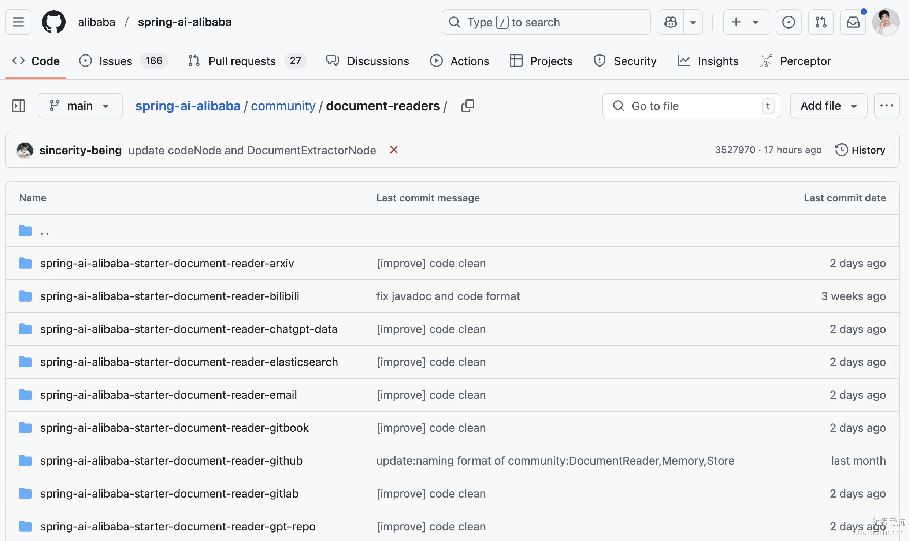

比如一个邮⁠件文档读取器的实现‌其实并不难，核心代​码就是解析邮件文档‎并且转换为 Doc‌ument 列表：

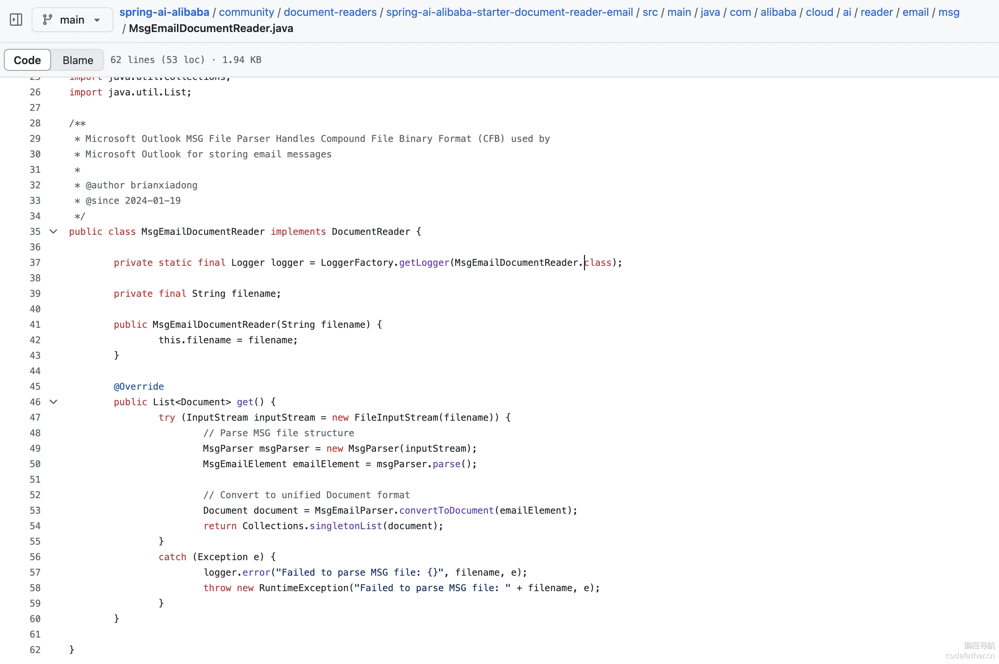

邮件解析器的实现：

    public class MsgEmailParser {
    
        private MsgEmailParser() {
            
        }

​        
        public static Document convertToDocument(MsgEmailElement element) {
            if (element == null) {
                throw new IllegalArgumentException("MsgEmailElement cannot be null");
            }

​            
            Map<String, Object> metadata = new HashMap<>();

​            
            if (StringUtils.hasText(element.getSubject())) {
                metadata.put("subject", element.getSubject());
            }

​        

            String content = StringUtils.hasText(element.getText()) ? element.getText() : "";
            return new Document(content, metadata);
        }
    
    }

#### 转换（Transform）

Sprin⁠g AI 通过 D‌ocumentTr​ansformer‎ 组件实现文档转换‌。

看下源码，DocumentTransformer 接口实现了 `Function<List<Document>, List<Document>>` 接口，负责将一组文档转换为另一组文档。

    public interface DocumentTransformer extends Function<List<Document>, List<Document>> {
        default List<Document> transform(List<Document> documents) {
            return apply(documents);
        }
    }

文档转换是保证 R⁠AG 效果的核心步骤，也就是如何将大‌文档合理拆分为便于检索的知识碎片，S​pring AI 提供了多种 Doc‎umentTransformer 实‌现类，可以简单分为 3 类。

##### 1）TextSplitter 文本分割器

其中 Te⁠xtSplitte‌r 是文本分割器的​基类，提供了分割单‎词的流程方法：

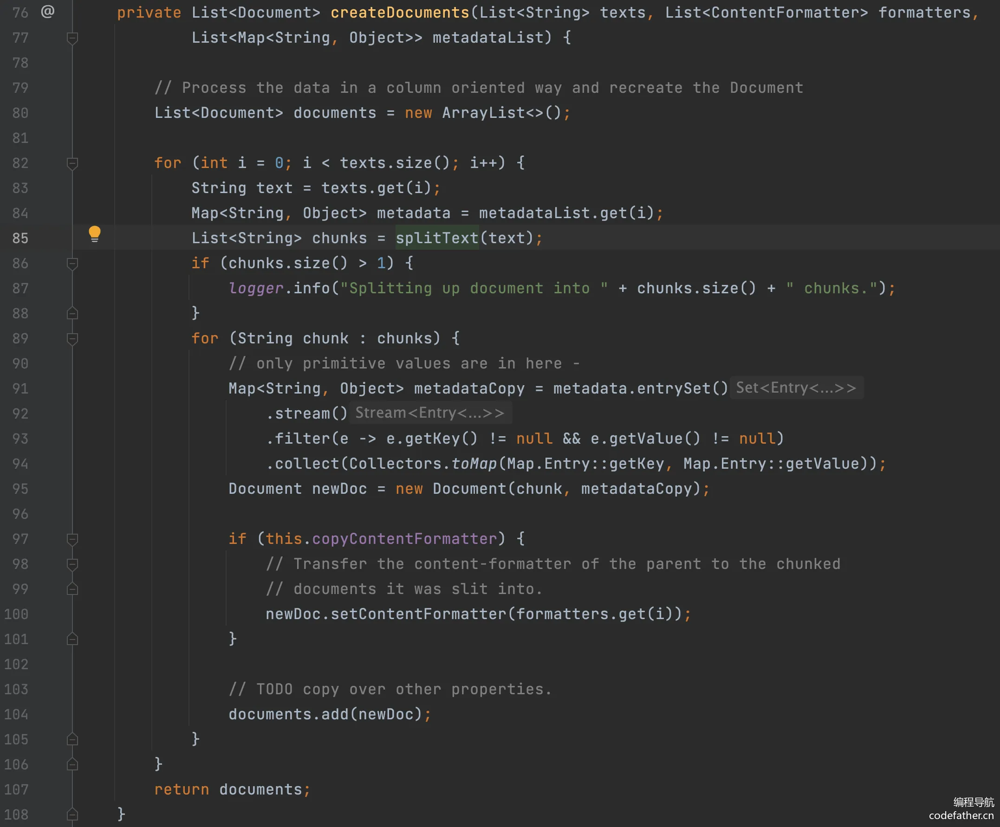

TokenTex⁠tSplitter 是其实现类‌，基于 Token 的文本分​割器。它考虑了语义边界（比如句子‎结尾）来创建有意义的文本段落，‌是成本较低的文本切分方式。

    @Component
    class MyTokenTextSplitter {
    
        public List<Document> splitDocuments(List<Document> documents) {
            TokenTextSplitter splitter = new TokenTextSplitter();
            return splitter.apply(documents);
        }
    
        public List<Document> splitCustomized(List<Document> documents) {
            TokenTextSplitter splitter = new TokenTextSplitter(1000, 400, 10, 5000, true);
            return splitter.apply(documents);
        }
    }

Token⁠TextSplit‌ter 提供了两种​构造函数选项：

1.  `TokenTextSplitter()`：使用默认设置创建分割器。
2.  `TokenTextSplitter(int defaultChunkSize, int minChunkSizeChars, int minChunkLengthToEmbed, int maxNumChunks, boolean keepSeparator)`：使用自定义参数创建分割器，通过调整参数，可以控制分割的粒度和方式，适应不同的应用场景。

参数说明（无需记忆）：

-   defaultChunkSize：每个文本块的目标大小（以 token 为单位，默认值：800）。
-   minChunkSizeChars：每个文本块的最小大小（以字符为单位，默认值：350）。
-   minChunkLengthToEmbed：要被包含的块的最小长度（默认值：5）。
-   maxNumChunks：从文本中生成的最大块数（默认值：10000）。
-   keepSeparator：是否在块中保留分隔符（如换行符）（默认值：true）。

官方文档有⁠对 Token 分‌词器工作原理的详细​解释，可以简单了解‎下：

1.  使用 CL100K\_BASE 编码将输入文本编码为 token。
2.  根据 defaultChunkSize 将编码后的文本分割成块。
3.  对于每个块：

-   将块解码回文本。
-   尝试在 minChunkSizeChars 之后找到合适的断点（句号、问号、感叹号或换行符）。
-   如果找到断点，则在该点截断块。
-   修剪块并根据 keepSeparator 设置选择性地删除换行符。
-   如果生成的块长度大于 minChunkLengthToEmbed，则将其添加到输出中。

4.  这个过程会一直持续到所有 token 都被处理完或达到 maxNumChunks 为止。
5.  如果剩余文本长度大于 minChunkLengthToEmbed，则会作为最后一个块添加。

##### 2）Metada‌taEnriche​r 元数据增强器

元数据增强⁠器的作用是为文档补‌充更多的元信息，便​于后续检索，而不是‎改变文档本身的‌切分规则。包括：

-   KeywordMetadataEnricher：使用 AI 提取关键词并添加到元数据
-   SummaryMetadataEnricher：使用 AI 生成文档摘要并添加到元数据。不仅可以为当前文档生成摘要，还能关联前一个和后一个相邻的文档，让摘要更完整。

示例代码：

    @Component
    class MyDocumentEnricher {
    
        private final ChatModel chatModel;
    
        MyDocumentEnricher(ChatModel chatModel) {
            this.chatModel = chatModel;
        }

​          
        List<Document> enrichDocumentsByKeyword(List<Document> documents) {
            KeywordMetadataEnricher enricher = new KeywordMetadataEnricher(this.chatModel, 5);
            return enricher.apply(documents);
        }

​        
        List<Document> enrichDocumentsBySummary(List<Document> documents) {
            SummaryMetadataEnricher enricher = new SummaryMetadataEnricher(chatModel, 
                List.of(SummaryType.PREVIOUS, SummaryType.CURRENT, SummaryType.NEXT));
            return enricher.apply(documents);
        }
    }

##### 3）Conten‌tFormatte​r 内容格式化工具

用于统一文⁠档内容格式。官方对‌这个的介绍少的可怜​，感觉像是个孤‎儿功能。。。

我们不妨看它的实现类 `DefaultContentFormatter` 的源码来了解他的功能：

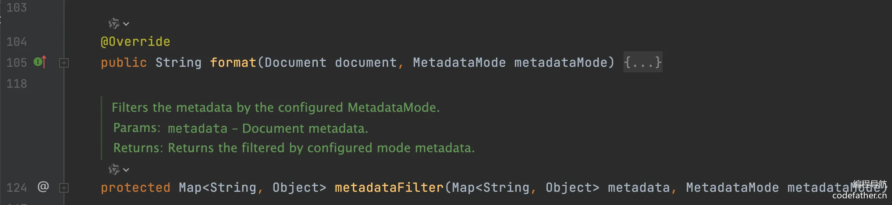

主要提供了 3 类功能：

1.  文档格式化：将文档内容与元数据合并成特定格式的字符串，以便于后续处理。
2.  元数据过滤：根据不同的元数据模式（MetadataMode）筛选需要保留的元数据项：

-   `ALL`：保留所有元数据
-   `NONE`：移除所有元数据
-   `INFERENCE`：用于推理场景，排除指定的推理元数据
-   `EMBED`：用于嵌入场景，排除指定的嵌入元数据

3.  自定义模板：支持自定义以下格式：

-   元数据模板：控制每个元数据项的展示方式
-   元数据分隔符：控制多个元数据项之间的分隔方式
-   文本模板：控制元数据和内容如何结合

该类采用 Builder 模式创建实例，使用示例：

    DefaultContentFormatter formatter = DefaultContentFormatter.builder()
        .withMetadataTemplate("{key}: {value}")
        .withMetadataSeparator("\n")
        .withTextTemplate("{metadata_string}\n\n{content}")
        .withExcludedInferenceMetadataKeys("embedding", "vector_id")
        .withExcludedEmbedMetadataKeys("source_url", "timestamp")
        .build();

    String formattedText = formatter.format(document, MetadataMode.INFERENCE);

在 RAG⁠ 系统中，这个格式‌化器可以有下面的作​用，了解即可：

1.  提供上下文：将元数据（如文档来源、时间、标签等）与内容结合，丰富大语言模型的上下文信息
2.  过滤无关信息：通过排除特定元数据，减少噪音，提高检索和生成质量
3.  场景适配：为不同场景（如推理和嵌入）提供不同的格式化策略
4.  结构化输出：为 AI 模型提供结构化的输入，使其能更好地理解和处理文档内容

#### 加载（Load）

Sprin⁠g AI 通过 D‌ocumentWr​iter 组件实现‎文档加载（写入）。

DocumentWriter 接口实现了 `Consumer<List<Document>>` 接口，负责将处理后的文档写入到目标存储中：

    public interface DocumentWriter extends Consumer<List<Document>> {
        default void write(List<Document> documents) {
            accept(documents);
        }
    }

Sprin⁠g AI 提供了 ‌2 种内置的 Do​cumentWri‎ter 实现：

1）Fil⁠eDocument‌Writer：将文​档写入到文件系统

    @Component
    class MyDocumentWriter {
        public void writeDocuments(List<Document> documents) {
            FileDocumentWriter writer = new FileDocumentWriter("output.txt", true, MetadataMode.ALL, false);
            writer.accept(documents);
        }
    }

2）Vec⁠torStoreW‌riter：将文档​写入到向量数据库

    @Component
    class MyVectorStoreWriter {
        private final VectorStore vectorStore;
        
        MyVectorStoreWriter(VectorStore vectorStore) {
            this.vectorStore = vectorStore;
        }
        
        public void storeDocuments(List<Document> documents) {
            vectorStore.accept(documents);
        }
    }

当然，你也⁠可以同时将文档写入‌多个存储，只需要创​建多个 Write‎r 或者自定义 W‌riter 即可。

#### ETL 流程示例

将上述 3 大组件组合起来，可以实现完整的 ETL 流程：

    PDFReader pdfReader = new PagePdfDocumentReader("knowledge_base.pdf");
    List<Document> documents = pdfReader.read();

    TokenTextSplitter splitter = new TokenTextSplitter(500, 50);
    List<Document> splitDocuments = splitter.apply(documents);
    
    SummaryMetadataEnricher enricher = new SummaryMetadataEnricher(chatModel, 
        List.of(SummaryType.CURRENT));
    List<Document> enrichedDocuments = enricher.apply(splitDocuments);

    vectorStore.write(enrichedDocuments);

    vectorStore.write(enricher.apply(splitter.apply(pdfReader.read())));

通过这种方⁠式，我们完成了从原‌始文档到向量数据库​的整个 ETL 过‎程，为后续的检索增‌强生成提供了基础。

### 向量转换和存储

上一节教程中有介绍过，向量存储是 RAG 应用中的核心组件，它将文档转换为向量（嵌入）并存储起来，以便后续进行高效的相似性搜索。[Spring AI 官方](https://docs.spring.io/spring-ai/reference/api/vectordbs.html) 提供了向量数据库接口 `VectorStore` 和向量存储整合包，帮助开发者快速集成各种第三方向量存储，比如 Milvus、Redis、PGVector、Elasticsearch 等。

#### VectorStore 接口介绍

VectorS⁠tore 是 Spring‌ AI 中用于与向量数据库​交互的核心接口，它继承自 ‎DocumentWrite‌r，主要提供以下功能：

    public interface VectorStore extends DocumentWriter {
    
        default String getName() {
            return this.getClass().getSimpleName();
        }
    
        void add(List<Document> documents);
    
        void delete(List<String> idList);
    
        void delete(Filter.Expression filterExpression);
    
        default void delete(String filterExpression) { ... };
    
        List<Document> similaritySearch(String query);
    
        List<Document> similaritySearch(SearchRequest request);
    
        default <T> Optional<T> getNativeClient() {
            return Optional.empty();
        }
    }

这个接口定⁠义了向量存储的基本‌操作，简单来说就是​ “增删改查”：

-   添加文档到向量库
-   从向量库删除文档
-   基于查询进行相似度搜索
-   获取原生客户端（用于特定实现的高级操作）

#### 搜索请求构建

Sprin⁠g AI 提供了 ‌SearchReq​uest 类，用于‎构建相似度搜索请求‌：

    SearchRequest request = SearchRequest.builder()
        .query("什么是程序员梁哥的编程导航学习网 codefather.cn？")
        .topK(5)                  
        .similarityThreshold(0.7) 
        .filterExpression("category == 'web' AND date > '2025-05-03'")  
        .build();
    
    List<Document> results = vectorStore.similaritySearch(request);

SearchRequest 提供了多种配置选项：

-   query：搜索的查询文本
-   topK：返回的最大结果数，默认为 4
-   similarityThreshold：相似度阈值，低于此值的结果会被过滤掉
-   filterExpression：基于文档元数据的过滤表达式，语法有点类似 SQL 语句，需要用到时查询 [官方文档](https://docs.spring.io/spring-ai/reference/api/vectordbs.html#metadata-filters) 了解语法即可

#### 向量存储的工作原理

在向量数据库⁠中，查询与传统关系型数据‌库有所不同。向量库执行的​是相似性搜索，而非精确匹‎配，具体流程我们在上一节‌教程中有了解，可以再复习下。

1.  嵌入转换：当文档被添加到向量存储时，Spring AI 会使用嵌入模型（如 OpenAI 的 text-embedding-ada-002）将文本转换为向量。
2.  相似度计算：查询时，查询文本同样被转换为向量，然后系统计算此向量与存储中所有向量的相似度。
3.  相似度度量：常用的相似度计算方法包括：

-   余弦相似度：计算两个向量的夹角余弦值，范围在 - 1 到 1 之间
-   欧氏距离：计算两个向量间的直线距离
-   点积：两个向量的点积值

4.  过滤与排序：根据相似度阈值过滤结果，并按相似度排序返回最相关的文档

#### 支持的向量数据库

Spring AI 支持多种向量数据库实现，包括：

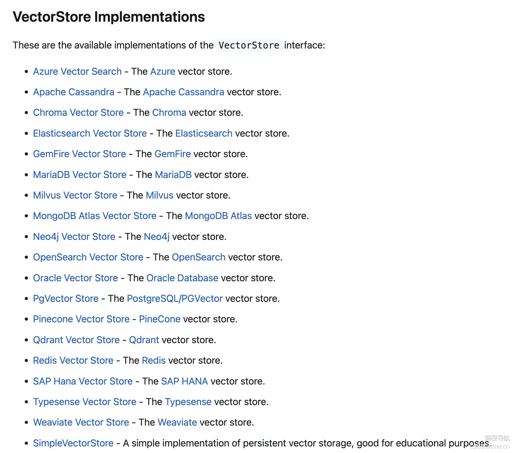

对于每种 Vecto⁠r Store 实现，我们都可以参考对应‌的官方文档进行整合，开发方法基本上一致：​先准备好数据源 =&gt; 引入不同的整合包 ‎=&gt; 编写对应的配置 =&gt; 使用自动注入‌的 VectorStore 即可。

值得一提的是，S⁠pring AI Alibaba‌ 已经集成了阿里云百炼平台，可以​直接使用阿里云百炼平台提供的 V‎ectorStore API，无‌需自己再搭建向量数据库了。

参考 [官方文档](https://java2ai.com/docs/1.0.0-M6.1/tutorials/vectorstore/)，主要是提供了 DashScopeCloudStore 类：

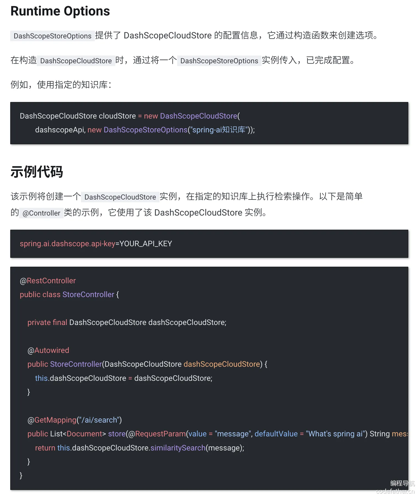

DashSco⁠peCloudStore 类‌实现了 VectorStor​e 接口，通过调用 Dash‎Scope API 来使用阿‌里云提供的远程向量存储：

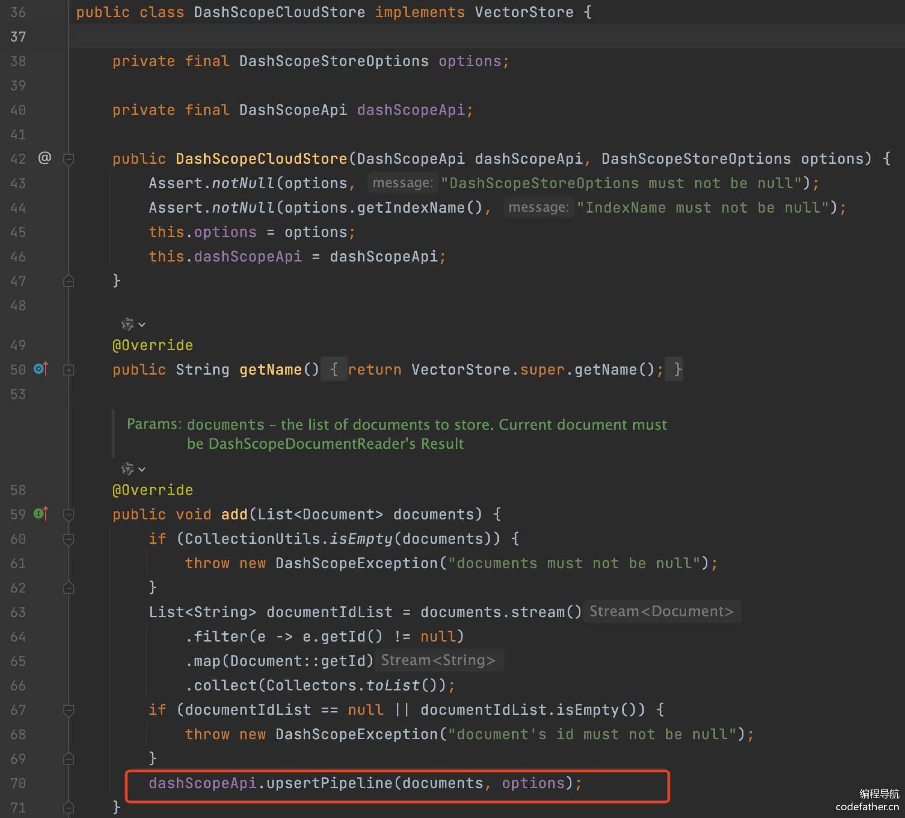

#### 基于 PGVector 实现向量存储

PGVect⁠or 是经典数据库 P‌ostgreSQL 的​扩展，为 Postgr‎eSQL 提供了存储和‌检索高维向量数据的能力。

为什么选择它来实现向量存⁠储呢？因为很多传统业务都会把数据存储在这种关系‌型数据库中，直接给原有的数据库安装扩展就能实现​向量相似度搜索、而不需要额外搞一套向量数据库，‎人力物力成本都很低，所以这种方案很受企业青睐，‌也是目前实现 RAG 的主流方案之一。

首先我们准备⁠ PostgreSQL ‌数据库，并为其添加扩展。​有 2 种方式，第一种是‎在自己的本地或服务器安装‌，可以参考下列文章实现：

-   [Linux 服务器快速安装 PostgreSQL 15 与 pgvector 向量插件实践](https://cloud.baidu.com/article/3229759)
-   [宝塔 PostgreSQL 安装 pgvector 插件实现向量存储](https://blog.csdn.net/qq_29213799/article/details/146277755)

这里由于大⁠家更多的是为了学习‌，我们采用更方便的​方式 —— 使用现‎成的云数据库，下面‌我们来实操下\~

1）首先打开 [阿里云 PostgreSQL 官网](https://www.aliyun.com/product/rds/postgresql)，开通 Serverless 版本，按用量计费，对于学习来说性价比更高：

开通 Serverless 数据库服务，填写配置：

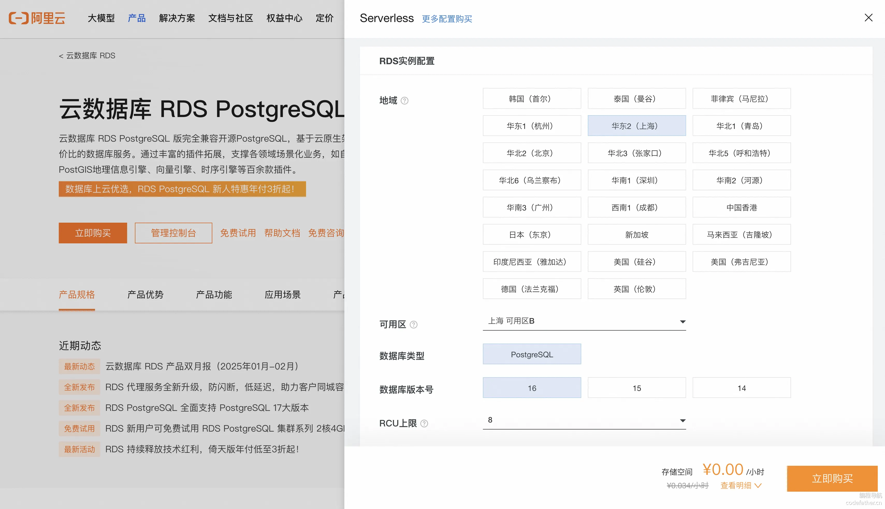

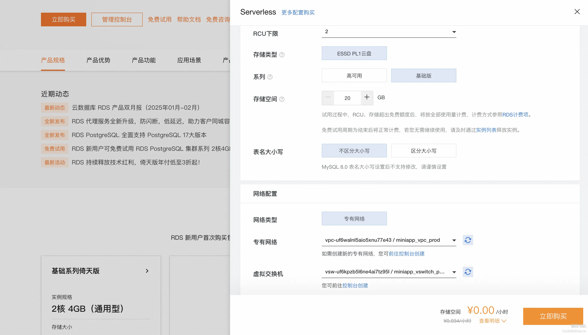

2）开通成功后，进入控制台，先创建账号：

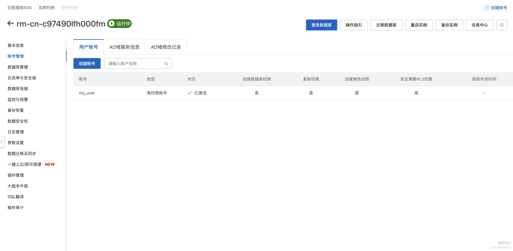

然后创建数据库：

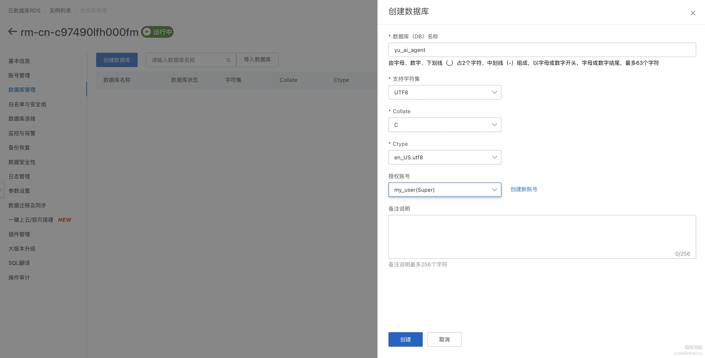

进入插件管理，安装 vector 插件：

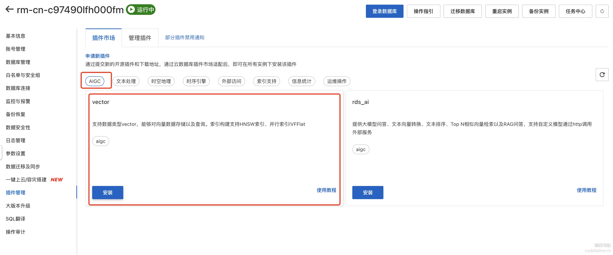

进入数据库连接，开通公网访问地址：

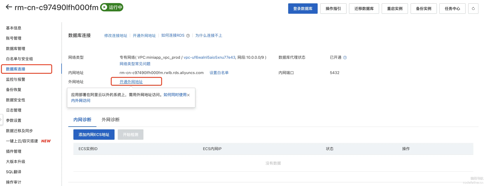

可以在本地⁠使用 IDEA 自‌带的数据库管理工具​，进行连接测试：

如果你的 ⁠IDEA 版本没有‌这个工具，也不用纠​结，直接在云平台查‎看管理数据库即可

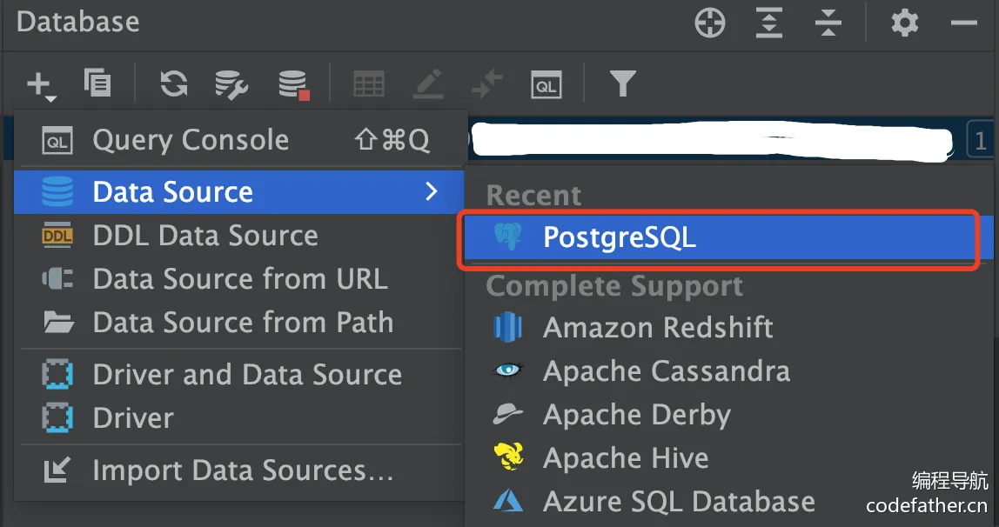

显示连接成功，至此数据库准备完成：

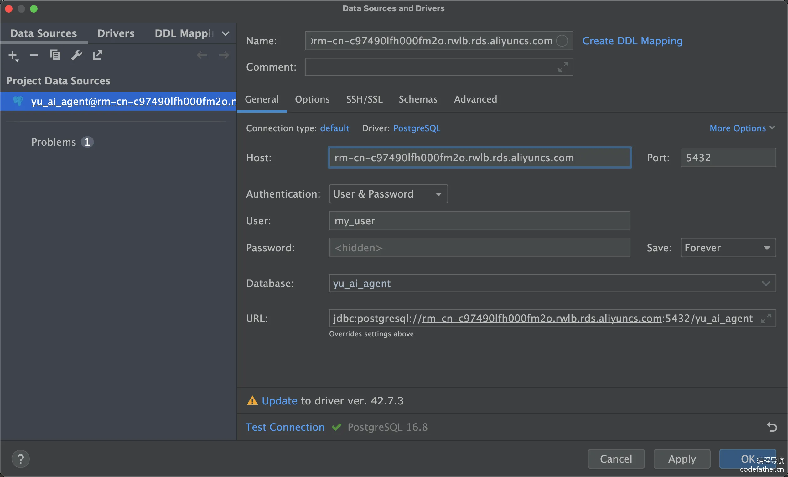

3）参考 [Spring AI 官方文档](https://docs.spring.io/spring-ai/reference/api/vectordbs/pgvector.html) 整合 PGVector，先引入依赖，版本号可以在 [Maven 中央仓库](https://mvnrepository.com/artifact/org.springframework.ai/spring-ai-starter-vector-store-pgvector) 查找：

    <dependency>
        <groupId>org.springframework.ai</groupId>
        <artifactId>spring-ai-starter-vector-store-pgvector</artifactId>
        <version>1.0.0-M7</version>
    </dependency>

编写配置，建立数据库连接：

    spring:
      datasource:
        url: jdbc:postgresql://改为你的公网地址/yu_ai_agent
        username: 改为你的用户名
        password: 改为你的密码
      ai:
        vectorstore:
          pgvector:
            index-type: HNSW
            dimensions: 1536
            distance-type: COSINE_DISTANCE
            max-document-batch-size: 10000 

注意，在不确定向量维度的情况下，⁠建议不要指定 dimensions 配置。如果未明确指定，Pg‌VectorStore 将从提供的 EmbeddingMode​l 中检索维度，维度在表创建时设置为嵌入列。如果更改维度，则必‎须重新创建 Vector\_store 表。不过最好提前明确你要‌使用的嵌入维度值，手动建表，更可靠一些。

正常情况下⁠，接下来就可以使用‌自动注入的 Vec​torStore ‎了，系统会自动创建‌库表：

    @Autowired
    VectorStore vectorStore;

    List<Document> documents = List.of(
        new Document("Spring AI rocks!! Spring AI rocks!! Spring AI rocks!! Spring AI rocks!! Spring AI rocks!!", Map.of("meta1", "meta1")),
        new Document("The World is Big and Salvation Lurks Around the Corner"),
        new Document("You walk forward facing the past and you turn back toward the future.", Map.of("meta2", "meta2")));

    vectorStore.add(documents);

    List<Document> results = this.vectorStore.similaritySearch(SearchRequest.builder().query("Spring").topK(5).build());

但是，这种方式不适合我们现在⁠的项目！因为 VectorStore 依赖 Embedd‌ingModel 对象，咱们之前的学习中同时引入了 Ol​lama 和 阿里云 Dashscope 的依赖，有两个‎ EmbeddingModel 的 Bean，Sprin‌g 不知道注入哪个，就会报下面这种错误：

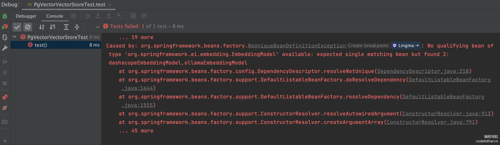

4）所以让⁠我们换一种更灵活的‌方式来初始化 Ve​ctorStore‎。先引入 3 个依‌赖：

    <dependency>
        <groupId>org.springframework.boot</groupId>
        <artifactId>spring-boot-starter-jdbc</artifactId>
    </dependency>
    <dependency>
        <groupId>org.postgresql</groupId>
        <artifactId>postgresql</artifactId>
        <scope>runtime</scope>
    </dependency>
    <dependency>
        <groupId>org.springframework.ai</groupId>
        <artifactId>spring-ai-pgvector-store</artifactId>
        <version>1.0.0-M6</version>
    </dependency>

然后编写配⁠置类自己构造 Pg‌VectorSto​re，不用 Sta‎rter 自动注入‌：

    @Configuration
    public class PgVectorVectorStoreConfig {
    
        @Bean
        public VectorStore pgVectorVectorStore(JdbcTemplate jdbcTemplate, EmbeddingModel dashscopeEmbeddingModel) {
            VectorStore vectorStore = PgVectorStore.builder(jdbcTemplate, dashscopeEmbeddingModel)
                    .dimensions(1536)                    
                    .distanceType(COSINE_DISTANCE)       
                    .indexType(HNSW)                     
                    .initializeSchema(true)              
                    .schemaName("public")                
                    .vectorTableName("vector_store")     
                    .maxDocumentBatchSize(10000)         
                    .build();
            return vectorStore;
        }
    }

并且启动类要排除掉自动加载，否则也会报错：

    @SpringBootApplication(exclude = PgVectorStoreAutoConfiguration.class)
    public class YuAiAgentApplication {
    
        public static void main(String[] args) {
            SpringApplication.run(YuAiAgentApplication.class, args);
        }
    
    }

5）编写单元测试类，验证效果：

    @SpringBootTest
    public class PgVectorVectorStoreConfigTest {
    
        @Resource
        VectorStore pgVectorVectorStore;
    
        @Test
        void test() {
            List<Document> documents = List.of(
                    new Document("Spring AI rocks!! Spring AI rocks!! Spring AI rocks!! Spring AI rocks!! Spring AI rocks!!", Map.of("meta1", "meta1")),
                    new Document("The World is Big and Salvation Lurks Around the Corner"),
                    new Document("You walk forward facing the past and you turn back toward the future.", Map.of("meta2", "meta2")));
            
            pgVectorVectorStore.add(documents);
            
            List<Document> results = pgVectorVectorStore.similaritySearch(SearchRequest.builder().query("Spring").topK(5).build());
            Assertions.assertNotNull(results);
        }
    }

以 Deb⁠ug 模式运行，可‌以看到文档检索成功​，并且给出了相似度‎得分：

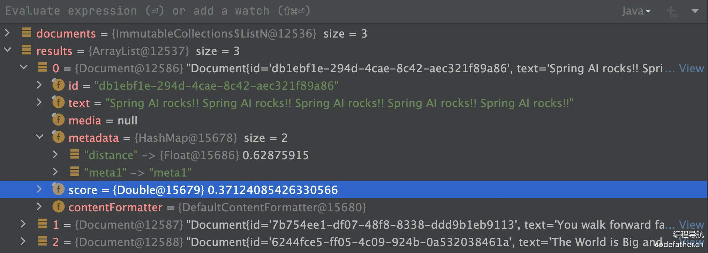

查看此时的数据库表，有 3 条数据：

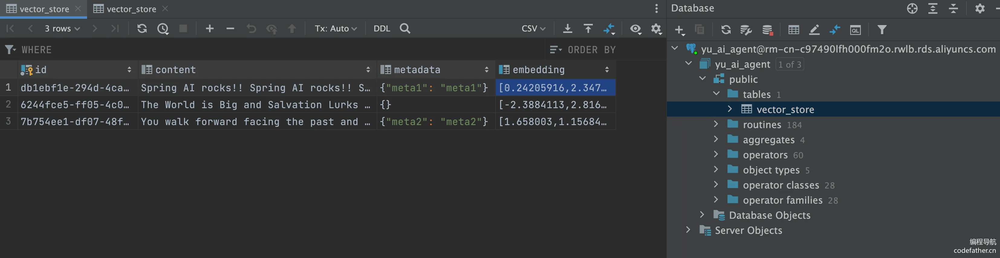

查看自动创⁠建的数据表结构，e‌mbedding ​字段是 vecto‎r 类型：

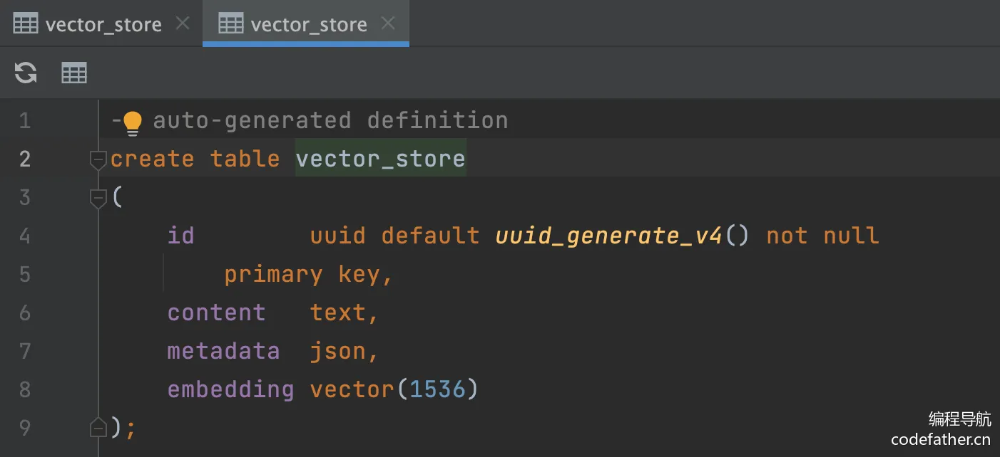

至此，我们的⁠ PGVectorSto‌re 就整合成功了。你可​以用它来替换原本的本地 ‎VectorStore，自行‌测试即可。示例代码如下：

    @Configuration
    public class PgVectorVectorStoreConfig {
    
        @Resource
        private LoveAppDocumentLoader loveAppDocumentLoader;
    
        @Bean
        public VectorStore pgVectorVectorStore(JdbcTemplate jdbcTemplate, EmbeddingModel dashscopeEmbeddingModel) {
            VectorStore vectorStore = PgVectorStore.builder(jdbcTemplate, dashscopeEmbeddingModel)
                    .dimensions(1536)                    
                    .distanceType(COSINE_DISTANCE)       
                    .indexType(HNSW)                     
                    .initializeSchema(true)              
                    .schemaName("public")                
                    .vectorTableName("vector_store")     
                    .maxDocumentBatchSize(10000)         
                    .build();
            
            List<Document> documents = loveAppDocumentLoader.loadMarkdowns();
            vectorStore.add(documents);
            return vectorStore;
        }
    }

梁哥测试下来，效果还是不错的：

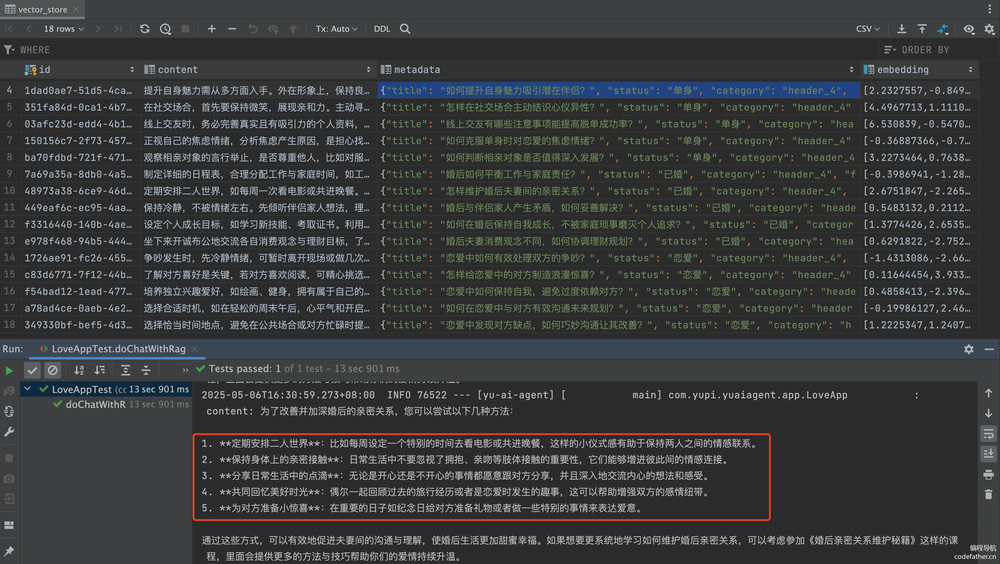

#### 扩展知识 - 批处理策略

在使用向量⁠存储时，可能要嵌入大‌量文档，如果一次性处​理存储大量文档，可能‎会导致性能问题、甚至‌出现错误导致数据不完整。

举个例子，嵌入模型⁠一般有一个最大标记限制，通常称为上下‌文窗口大小（context wind​ow size），限制了单个嵌入请求‎中可以处理的文本量。如果在一次调用中‌转换过多文档可能直接导致报错。

为此，Spring⁠ AI 实现了批处理策略（Batch‌ing Strategy），将大量文​档分解为较小的批次，使其适合嵌入模型‎的最大上下文窗口，还可以提高性能并更‌有效地利用 API 速率限制。

Spring⁠ AI 通过 Batc‌hingStrateg​y 接口提供该功能，该‎接口允许基于文档的标记‌计数并以分批方式处理文档：

    public interface BatchingStrategy {
        List<List<Document>> batch(List<Document> documents);
    }

该接口定义了一个单一方法 `batch`，它接收一个文档列表并返回一个文档批次列表。

Spring AI 提供了一⁠个名为 TokenCountBatchingStrate‌gy 的默认实现。这个策略为每个文档估算 token 数​，将文档分组到不超过最大输入 token 数的批次中，如‎果单个文档超过此限制，则抛出异常。这样就确保了每个批次不‌超过计算出的最大输入 token 数。

可以自定义⁠ TokenCou‌ntBatchin​gStrategy‎，示例代码：

    @Configuration
    public class EmbeddingConfig {
        @Bean
        public BatchingStrategy customTokenCountBatchingStrategy() {
            return new TokenCountBatchingStrategy(
                EncodingType.CL100K_BASE,  
                8000,                      
                0.1                        
            );
        }
    }

当然，除了⁠使用默认策略外，也‌可以自己实现 Ba​tchingStr‎ategy：

    @Configuration
    public class EmbeddingConfig {
        @Bean
        public BatchingStrategy customBatchingStrategy() {
            return new CustomBatchingStrategy();
        }
    }

比如你使用的向⁠量数据库每秒只能插入 1 ‌万条数据，就可以通过自实现​ BatchingStra‎tegy 控制速率，还可以‌进行额外的日志记录和异常处理。

### 文档过滤和检索

Sprin⁠g AI 官方声称‌提供了一个 “模块​化” 的 RAG ‎架构，用于优化大模‌型回复的准确性。

简单来说，⁠就是把整个文档过滤‌检索阶段拆分为：检​索前、检索时、检索‎后，分别针对每个阶‌段提供了可自定义的组件。

-   在预检索阶段，系统接收用户的原始查询，通过查询转换和查询扩展等方法对其进行优化，输出增强的用户查询。
-   在检索阶段，系统使用增强的查询从知识库中搜索相关文档，可能涉及多个检索源的合并，最终输出一组相关文档。
-   在检索后阶段，系统对检索到的文档进行进一步处理，包括排序、选择最相关的子集以及压缩文档内容，输出经过优化的相关文档集。

#### 预检索：优化用户查询

预检索阶段⁠负责处理和优化用户‌的原始查询，以提高​后续检索的质量。S‎pring AI ‌提供了多种查询处理组件。

##### 查询转换 - 查询重写

`RewriteQueryTransformer` 使用大语言模型对用户的原始查询进行改写，使其更加清晰和详细。当用户查询含糊不清或包含无关信息时，这种方法特别有用。

    Query query = new Query("啥是程序员梁哥啊啊啊啊？");
    
    QueryTransformer queryTransformer = RewriteQueryTransformer.builder()
            .chatClientBuilder(chatClientBuilder)
            .build();
    
    Query transformedQuery = queryTransformer.transform(query);

实现原理很简单，从源码中能看到改写查询的提示词：

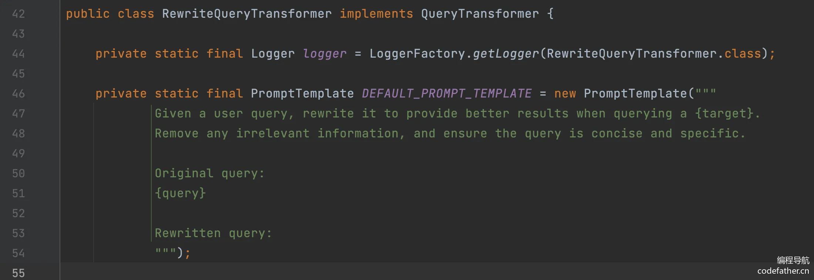

也可以通过构造方法的 `promptTemplate` 参数自定义该组件使用的提示模板。

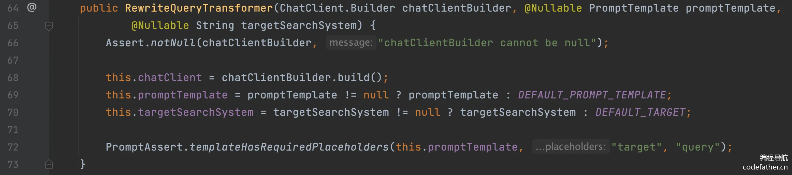

##### 查询转换 - 查询翻译

`TranslationQueryTransformer` 将查询翻译成嵌入模型支持的目标语言。如果查询已经是目标语言，则保持不变。这对于嵌入模型是针对特定语言训练而用户查询使用不同语言的情况非常有用，便于实现国际化应用。

示例代码如下：

    Query query = new Query("hi, who is coder liang? please answer me");
    
    QueryTransformer queryTransformer = TranslationQueryTransformer.builder()
            .chatClientBuilder(chatClientBuilder)
            .targetLanguage("chinese")
            .build();
    
    Query transformedQuery = queryTransformer.transform(query);

语言可以随便⁠指定，因为看源码我们会发‌现，查询翻译器也是通过给​ AI 一段 Promp‎t 来实现翻译，当然也可‌以自定义翻译的 Prompt：

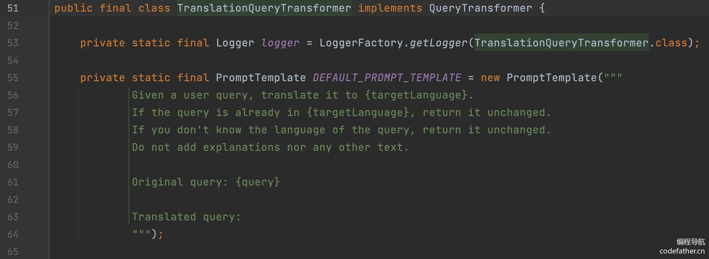

不过梁哥不太建⁠议使用这个查询器，因为调用 ‌AI 的成本远比调用第三方翻​译 API 的成本要高，不如‎自己有样学样定义一个 Que‌ryTransformer。

##### 查询转换 - 查询压缩

`CompressionQueryTransformer` 使用大语言模型将对话历史和后续查询压缩成一个独立的查询，类似于概括总结。适用于对话历史较长且后续查询与对话上下文相关的场景。

示例代码如下：

    Query query = Query.builder()
            .text("编程导航有啥内容？")
            .history(new UserMessage("谁是程序员梁哥？"),
                    new AssistantMessage("编程导航的创始人 codefather.cn"))
            .build();
    
    QueryTransformer queryTransformer = CompressionQueryTransformer.builder()
            .chatClientBuilder(chatClientBuilder)
            .build();
    
    Query transformedQuery = queryTransformer.transform(query);

查看源码，⁠可以看到提示词，同‌样可以定制 Pro​mpt 模版（虽然‎感觉没什么必要）：

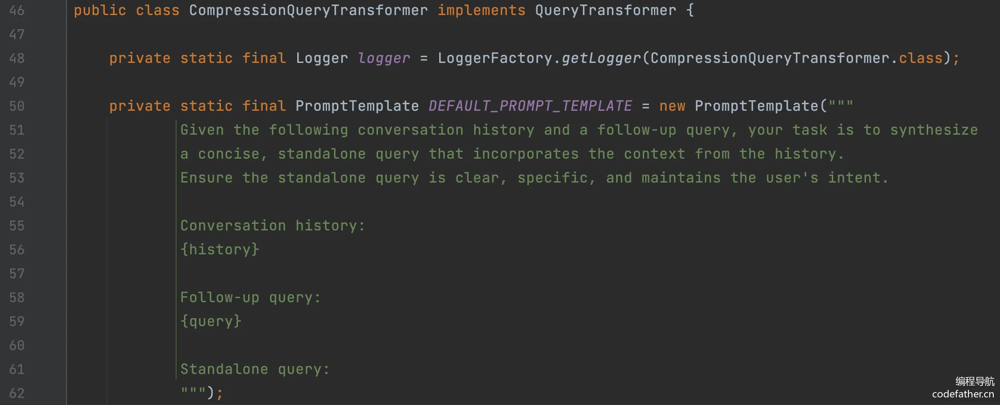

##### 查询扩展 - 多查询扩展

`MultiQueryExpander` 使用大语言模型将一个查询扩展为多个语义上不同的变体，有助于检索额外的上下文信息并增加找到相关结果的机会。就理解为我们在网上搜东西的时候，可能一种关键词搜不到，就会尝试一些不同的关键词。

示例代码如下：

    MultiQueryExpander queryExpander = MultiQueryExpander.builder()
        .chatClientBuilder(chatClientBuilder)
        .numberOfQueries(3)
        .build();
    List<Query> queries = queryExpander.expand(new Query("啥是程序员梁哥？他会啥？"));

上面这个查询可能被扩展为：

-   请介绍程序员梁哥，以及他的专业技能
-   给出程序员梁哥的个人简介，以及他的技能
-   程序员梁哥有什么专业技能，并给出更多介绍

默认情况下，会在扩展查询列表中包含原始查询。可以在构造时通过 `includeOriginal` 方法改变这个行为：

    MultiQueryExpander queryExpander = MultiQueryExpander.builder()
        .chatClientBuilder(chatClientBuilder)
        .includeOriginal(false)
        .build();

查看源码，⁠会先调用 AI 得‌到查询扩展，然后按​照换行符分割：

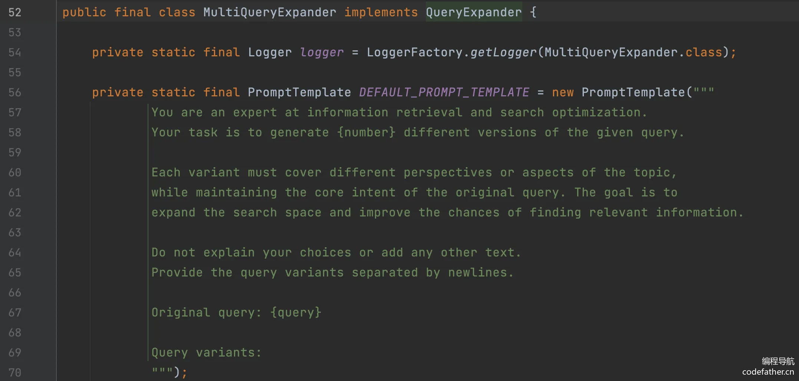

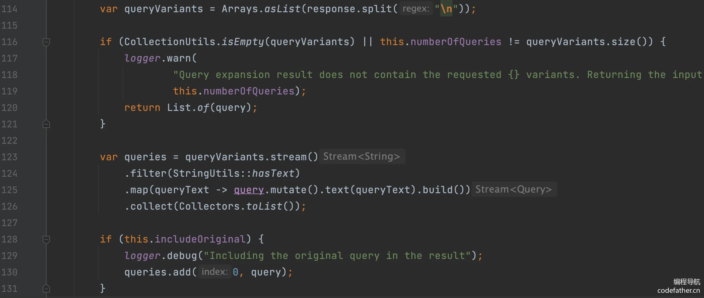

#### 检索：提高查询相关性

检索模块负责从存储中查询检索出最相关的文档。

##### 文档搜索

之前我们有了解过 DocumentRetriever 的概念，这是 Spring AI 提供的文档检索器。每种不同的存储方案都可能有自己的文档检索器实现类，比如 `VectorStoreDocumentRetriever`，从向量存储中检索与输入查询语义相似的文档。它支持基于元数据的过滤、设置相似度阈值、设置返回的结果数。

    DocumentRetriever retriever = VectorStoreDocumentRetriever.builder()
        .vectorStore(vectorStore)
        .similarityThreshold(0.7)
        .topK(5)
        .filterExpression(new FilterExpressionBuilder()
            .eq("type", "web")
            .build())
        .build();
    List<Document> documents = retriever.retrieve(new Query("谁是程序员梁哥"));

上述代码中的 filterExpression 可以灵活地指定过滤条件。当然也可以通过构造 Query 对象的 `FILTER_EXPRESSION` 参数动态指定过滤表达式：

    Query query = Query.builder()
        .text("谁是梁哥？")
        .context(Map.of(VectorStoreDocumentRetriever.FILTER_EXPRESSION, "type == 'boy'"))
        .build();
    List<Document> retrievedDocuments = documentRetriever.retrieve(query);

##### 文档合并

Spring AI 内置了 `ConcatenationDocumentJoiner` 文档合并器，通过连接操作，将基于多个查询和来自多个数据源检索到的文档合并成单个文档集合。在遇到重复文档时，会保留首次出现的文档，每个文档的分数保持不变。

示例代码如下：

    Map<Query, List<List<Document>>> documentsForQuery = ...
    DocumentJoiner documentJoiner = new ConcatenationDocumentJoiner();
    List<Document> documents = documentJoiner.join(documentsForQuery);

看源码发现，这玩意⁠的实现原理很简单，说是 “连接”，‌其实就是把 Map 展开为二维列表​、再把二维列表展开成文档列表，最后进‎行去重。但不得不说，这段 Str‌eam API 的使用真是优雅\~

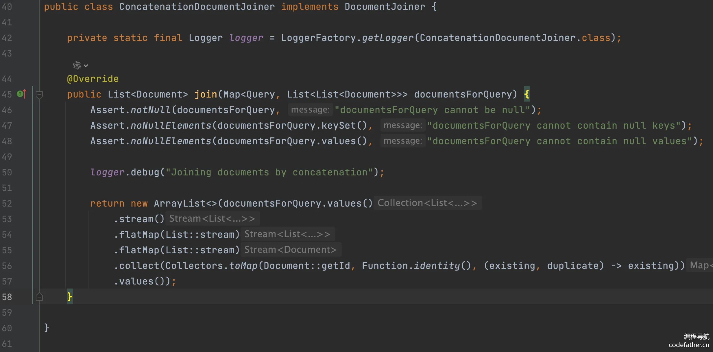

#### 检索后：优化文档处理

检索后模块负责⁠处理检索到的文档，以实现最‌佳生成结果。它们可以解决 ​“丢失在中间” 问题、模型‎上下文长度限制，以及减少检‌索信息中的噪音和冗余。

这些模块可能包括：

-   根据与查询的相关性对文档进行排序
-   删除不相关或冗余的文档
-   压缩每个文档的内容以减少噪音和冗余

不过这个模块官方文⁠档的讲解非常少，而且更新很快，比如‌梁哥在写本节教程时，已经从 M7 ​更新到了 M8，引入了新的 Doc‎umentPostProcesso‌r API 来代替原来的实现。

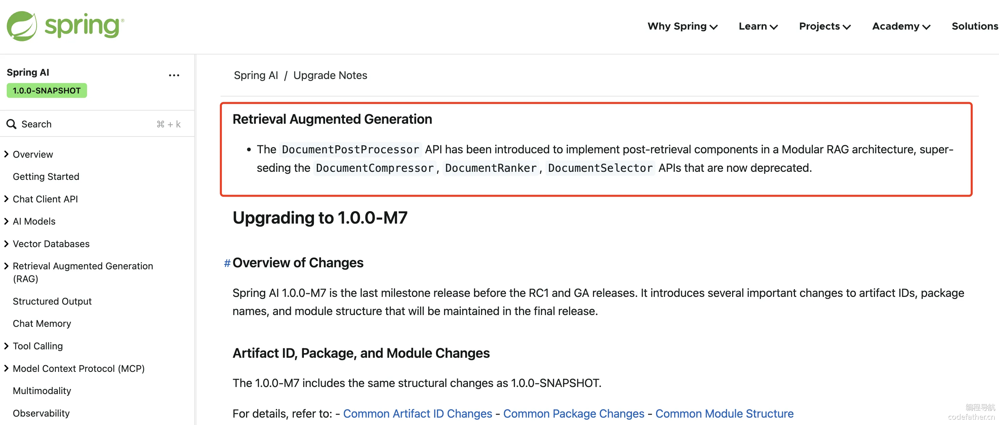

这一部分也⁠不是我们实际开发中‌要优化的重点，感兴​趣的同学可以自‎行研究。

### 查询增强和关联

生成阶段是 ⁠RAG 流程的最终环节，‌负责将检索到的文档与用户​查询结合起来，为 AI ‎提供必要的上下文，从而生‌成更准确、更相关的回答。

之前我们已经了解了 Spring AI 提供的 2 种实现 RAG 查询增强的 Advisor，分别是 `QuestionAnswerAdvisor` 和 `RetrievalAugmentationAdvisor`。

#### ⁠QuestionA‌nswerAdvi​sor 查询增强

当用户问题发⁠送到 AI 模型时，Ad‌visor 会查询向量数​据库来获取与用户问题相关‎的文档，并将这些文档作为‌上下文附加到用户查询中。

基本使用方式如下：

    ChatResponse response = ChatClient.builder(chatModel)
            .build().prompt()
            .advisors(new QuestionAnswerAdvisor(vectorStore))
            .user(userText)
            .call()
            .chatResponse();

我们可以通过建造者模式配置更精细的参数，比如文档过滤条件：

    var qaAdvisor = QuestionAnswerAdvisor.builder(vectorStore)
                  
            .searchRequest(SearchRequest.builder().similarityThreshold(0.8d).topK(6).build())
            .build();

此外，`QuestionAnswerAdvisor` 还支持动态过滤表达式，可以在运行时根据需要调整过滤条件：

    ChatClient chatClient = ChatClient.builder(chatModel)
        .defaultAdvisors(QuestionAnswerAdvisor.builder(vectorStore)
            .searchRequest(SearchRequest.builder().build())
            .build())
        .build();

    String content = this.chatClient.prompt()
        .user("看着我的眼睛，回答我！")
        .advisors(a -> a.param(QuestionAnswerAdvisor.FILTER_EXPRESSION, "type == 'web'"))
        .call()
        .content();

`QuestionAnswerAdvisor` 的实现原理很简单，把用户提示词和检索到的文档等上下文信息拼成一个新的 Prompt，再调用 AI：

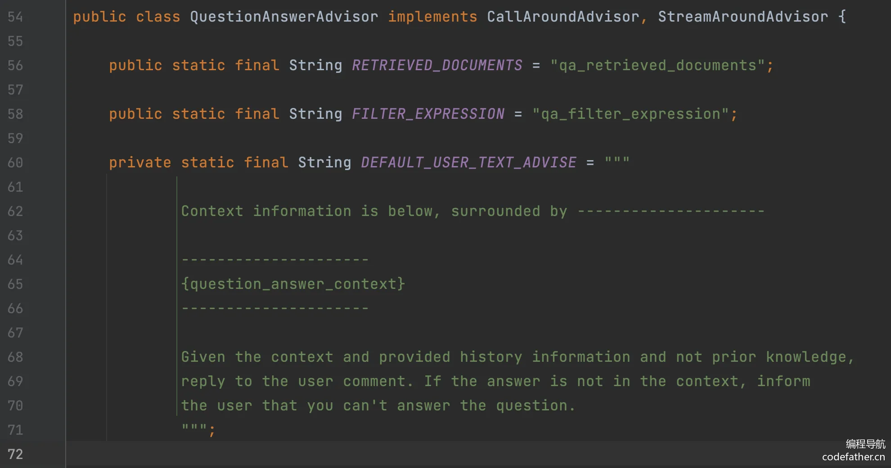

当然，我们⁠也可以自定义提示词‌模板，控制如何将检​索到的文档与用户查‎询结合：

    QuestionAnswerAdvisor qaAdvisor = QuestionAnswerAdvisor.builder(vectorStore)
        .promptTemplate(customPromptTemplate)
        .build();

#### ⁠Retrieval‌Augmentat​ionAdviso‎r 查询增强

Sprin⁠g AI 提供的另一‌种 RAG 实现方式​，它基于 RAG 模‎块化架构，提供了更多‌的灵活性和定制选项。

最简单的 RAG 流程可以通过以下方式实现：

    Advisor retrievalAugmentationAdvisor = RetrievalAugmentationAdvisor.builder()
            .documentRetriever(VectorStoreDocumentRetriever.builder()
                    .similarityThreshold(0.50)
                    .vectorStore(vectorStore)
                    .build())
            .build();
    
    String answer = chatClient.prompt()
            .advisors(retrievalAugmentationAdvisor)
            .user(question)
            .call()
            .content();

上述代码中，我们配置了 `VectorStoreDocumentRetriever` 文档检索器，用于从向量存储中检索文档。然后将这个 Advisor 添加到 ChatClient 的请求中，让它处理用户的问题。

`RetrievalAugmentationAdvisor` 还支持更高级的 RAG 流程，比如结合查询转换器：

    Advisor retrievalAugmentationAdvisor = RetrievalAugmentationAdvisor.builder()
            .queryTransformers(RewriteQueryTransformer.builder()
                    .chatClientBuilder(chatClientBuilder.build().mutate())
                    .build())
            .documentRetriever(VectorStoreDocumentRetriever.builder()
                    .similarityThreshold(0.50)
                    .vectorStore(vectorStore)
                    .build())
            .build();

上述代码中，我们添加了一个 `RewriteQueryTransformer`，它会在检索之前重写用户的原始查询，使其更加明确和详细，从而显著提高检索的质量（因为大多数用户的原始查询是含糊不清、或者不够具体的）。

#### ⁠Contextua‌lQueryAug​menter 空上‎下文处理

默认情况下，`RetrievalAugmentationAdvisor` 不允许检索的上下文为空。当没有找到相关文档时，它会指示模型不要回答用户查询。这是一种保守的策略，可以防止模型在没有足够信息的情况下生成不准确的回答。

但在某些场景下，我们可能希望即使在没有相关文档的情况下也能为用户提供回答，比如即使没有特定知识库支持也能回答的通用问题。可以通过配置 `ContextualQueryAugmenter` 上下文查询增强器来实现。

示例代码如下：

    Advisor retrievalAugmentationAdvisor = RetrievalAugmentationAdvisor.builder()
            .documentRetriever(VectorStoreDocumentRetriever.builder()
                    .similarityThreshold(0.50)
                    .vectorStore(vectorStore)
                    .build())
            .queryAugmenter(ContextualQueryAugmenter.builder()
                    .allowEmptyContext(true)
                    .build())
            .build();

通过设置 `allowEmptyContext(true)`，允许模型在没有找到相关文档的情况下也生成回答。

查看源码，⁠发现有 2 处 Pr‌ompt 的定义，分​别为正常情况下对用户‎提示词的增强、以及上‌下文为空时使用的提示词：

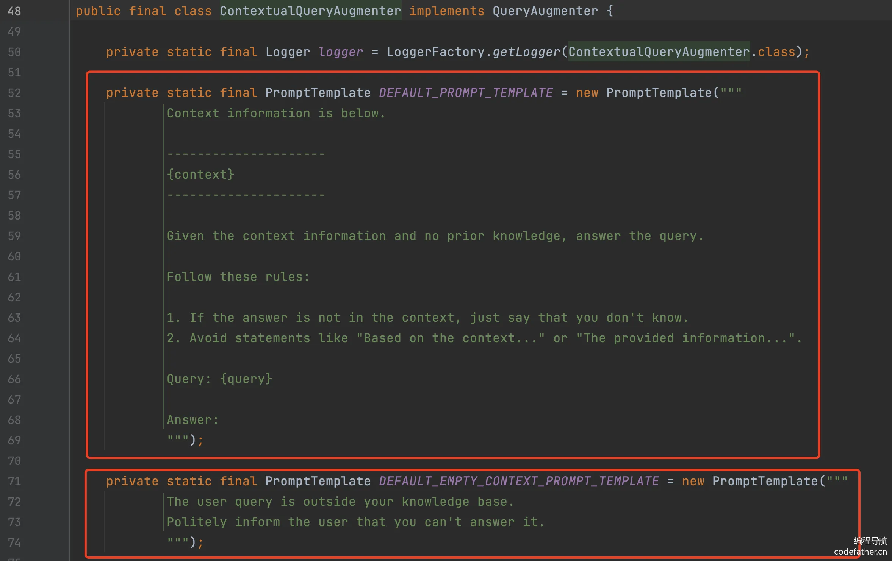

为了提供更友好的错误处理机制，`ContextualQueryAugmenter`允许我们自定义提示模板，包括正常情况下使用的提示模板和上下文为空时使用的提示模板：

    QueryAugmenter queryAugmenter = ContextualQueryAugmenter.builder()
            .promptTemplate(customPromptTemplate)
            .emptyContextPromptTemplate(emptyContextPromptTemplate)
            .build();

通过定制 empt⁠yContextPromptTem‌plate，我们可以指导模型在没有​找到相关文档时如何回应用户，比如礼‎貌地解释无法回答的原因，并可能引导‌用户尝试其他问题或提供更多信息。

## 二、RAG 最佳实践和调优

下面我们还⁠是从实现 RAG ‌的 4 大核心步骤​，来实战 RAG ‎开发的最佳实践和‌优化技巧。

### 文档收集和切割

文档的质量⁠决定了 AI 回答‌能力的上限，其他优​化策略只是让 AI‎ 回答能力不断‌接近上限。

因此，文档处理是 RAG 系统中最基础也最重要的环节。

#### 1、优化原始文档

**知识完备性** 是文档质量的首要条件。如果知识库缺失相关内容，大模型将无法准确回答对应问题。我们需要通过收集用户反馈或统计知识库检索命中率，不断完善和优化知识库内容。

在知识完整的前提下，我们要注意 3 个方面：

1）内容结构化：

-   原始文档应保持排版清晰、结构合理，如案例编号、项目概述、设计要点等
-   文档的各级标题层次分明，各标题下的内容表达清晰
-   列表中间的某一条之下尽量不要再分级，减少层级嵌套

2）内容规范化：

-   语言统一：确保文档语言与用户提示词一致（比如英语场景采用英文文档），专业术语可进行多语言标注
-   表述统一：同一概念应使用统一表达方式（比如 ML、Machine Learning 规范为 “机器学习”），可通过大模型分段处理长文档辅助完成
-   减少噪音：尽量避免水印、表格和图片等可能影响解析的元素

3）格式标准化：

-   优先使用 Markdown、DOC/DOCX 等文本格式（PDF 解析效果可能不佳），可以通过百炼 DashScopeParse 工具将 PDF 转为 Markdown，再借助大模型整理格式
-   如果文档包含图片，需链接化处理，确保回答中能正常展示文档中的插图，可以通过在文档中插入可公网访问的 URL 链接实现

这里梁哥提出了⁠ “AI 原生文档” 的概‌念，也就是专门为 AI 知​识库创作的文档。我们可以将‎上述规则输入给 AI 大模‌型，让它对已有文档进行优化。

#### 2、文档切片

合适的文档切片大小和方式对检索效果至关重要。

文档切片尺⁠寸需要根据具体情况灵‌活调整，避免两个极端​：切片过短导致语义缺‎失，切片过长引入‌无关信息。具体需结合以下因素：

-   文档类型：对于专业类文献，增加长度通常有助于保留更多上下文信息；而对于用户短问答，缩短长度则能更准确地捕捉语义
-   提示词复杂度：如果用户的提示词较复杂且具体，则可能需要增加切片长度；反之，缩短长度会更为合适

不当的切片方式可能导致以下问题：

1）文本切片过短：出现语义缺失，导致检索时无法匹配。

2）文本切片过长：包含不相关主题，导致召回时返回无关信息。

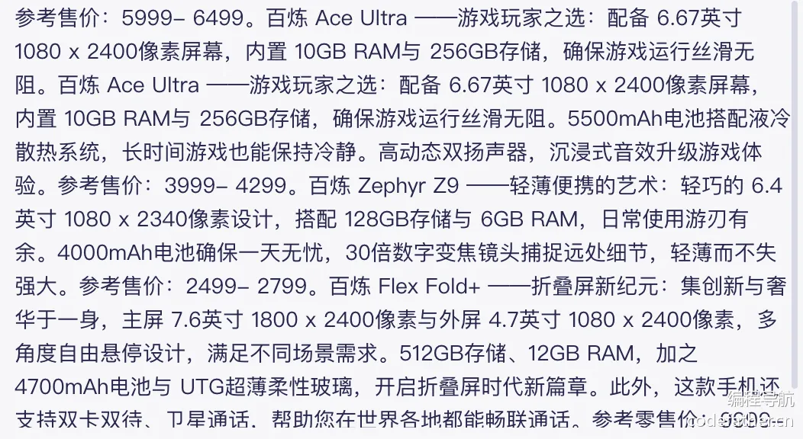

3）明显的⁠语义截断：文本切片‌出现了强制性的语义​截断，导致召回时缺‎失内容。

最佳文档切片策略是 **结合智能分块算法和人工二次校验**。智能分块算法基于分句标识符先划分为段落，再根据语义相关性动态选择切片点，避免固定长度切分导致的语义断裂。在实际应用中，应尽量让文本切片包含完整信息，同时避免包含过多干扰信息。

在编程实现上，可以通过 Spring AI 的 [ETL Pipeline](https://docs.spring.io/spring-ai/reference/api/etl-pipeline.html#_tokentextsplitter) 提供的 DocumentTransformer 来调整切分规则，代码如下：

    @Component
    class MyTokenTextSplitter {
        public List<Document> splitDocuments(List<Document> documents) {
            TokenTextSplitter splitter = new TokenTextSplitter();
            return splitter.apply(documents);
        }
    
        public List<Document> splitCustomized(List<Document> documents) {
            TokenTextSplitter splitter = new TokenTextSplitter(200, 100, 10, 5000, true);
            return splitter.apply(documents);
        }
    }

使用切分器：

    @Resource
    private MyTokenTextSplitter myTokenTextSplitter;
    
    @Bean
    VectorStore loveAppVectorStore(EmbeddingModel dashscopeEmbeddingModel) {
        SimpleVectorStore simpleVectorStore = SimpleVectorStore.builder(dashscopeEmbeddingModel)
                .build();
        
        List<Document> documents = loveAppDocumentLoader.loadMarkdowns();
        
        List<Document> splitDocuments = myTokenTextSplitter.splitCustomized(documents);
        simpleVectorStore.add(splitDocuments);
        return simpleVectorStore;
    }

然而，手动调整⁠切分参数很难把握合适值，容‌易破坏语义完整性。如下图所​示，每个 Markdown‎ 内的问题被强制拆分成了 ‌2 块，破坏了语义完整性：

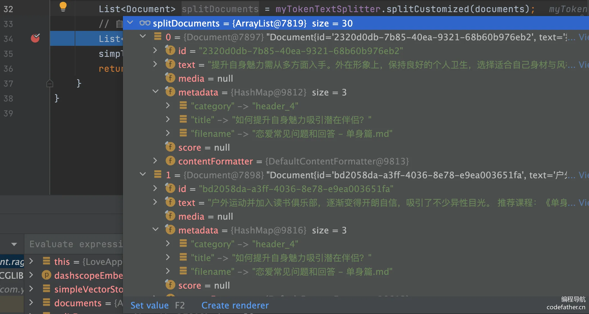

如果使用云服务，如阿里云百炼，推荐在创建知识库时选择 **智能切分**，这是百炼经过大量评估后总结出的推荐策略：

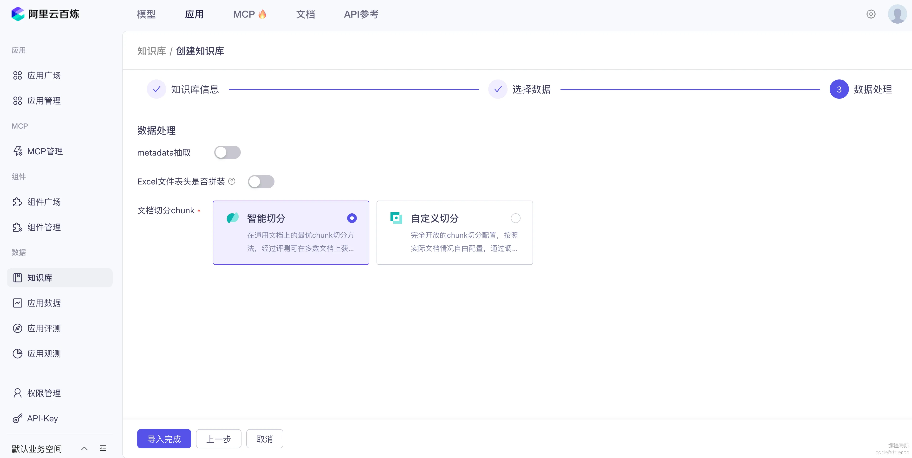

采用智能切分策略时，知识库会：

1.  首先利用系统内置的分句标识符将文档划分为若干段落
2.  基于划分的段落，根据语义相关性自适应地选择切片点进行切分，而非根据固定长度切分

这种方法能⁠更好地保障文档语义完‌整性，避免不必要的​断裂。这一策略将应用于‎知识库中的所有文档（‌包括后续导入的文档）。

此外，建议在文⁠档导入知识库后进行一次人工‌检查，确认文本切片内容的语​义完整性和正确性。如果发现‎切分不当或解析错误，可以直‌接编辑文本切片进行修正：

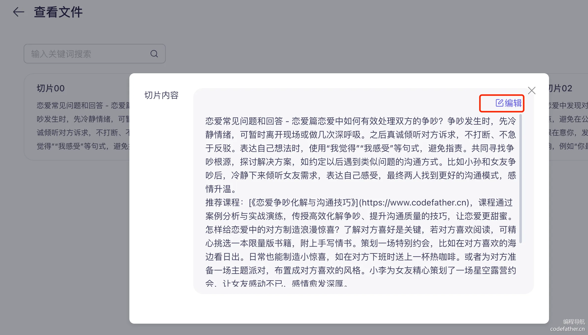

需要注意，⁠这里修改的只是知识库‌中的文本切片，而非原始​文档。因此，后续再‎次导入知识库时，仍需‌进行人工检查和修正。

#### 3、元数据标注

可以为文档⁠添加丰富的结构化信‌息，俗称元信息，形​成多维索引，便于后‎续向量化处理和‌精准检索。

在编程实现中，可以通过多种方式为文档添加元数据：

1）手动添加元信息（单个文档）：

    documents.add(new Document(
        "案例编号：LR-2023-001\n" +
        "项目概述：180平米大平层现代简约风格客厅改造\n" +
        "设计要点：\n" +
        "1. 采用5.2米挑高的落地窗，最大化自然采光\n" +
        "2. 主色调：云雾白(哑光，NCS S0500-N)配合莫兰迪灰\n" +
        "3. 家具选择：意大利B&B品牌真皮沙发，北欧白橡木茶几\n" +
        "空间效果：通透大气，适合商务接待和家庭日常起居",
        Map.of(
            "type", "interior",    
            "year", "2025",        
            "month", "05",         
            "style", "modern",      
        )));

2）利用 DocumentReader 批量添加元信息

比如我们可⁠以在 loadMa‌rkdown 时为​每篇文章添加特定标‎签，例如 "药品监管状态‌"：

    String status = fileName.substring(fileName.length() - 6, fileName.length() - 4);
    MarkdownDocumentReaderConfig config = MarkdownDocumentReaderConfig.builder()
            .withHorizontalRuleCreateDocument(true)
            .withIncludeCodeBlock(false)
            .withIncludeBlockquote(false)
            .withAdditionalMetadata("filename", fileName)
            .withAdditionalMetadata("status", status)
            .build();

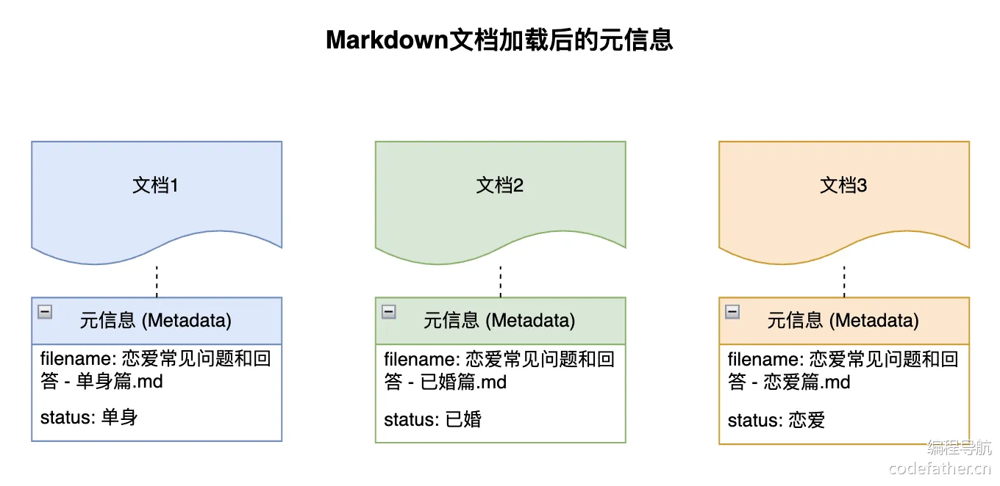

效果如图，文档成功添加了元信息：

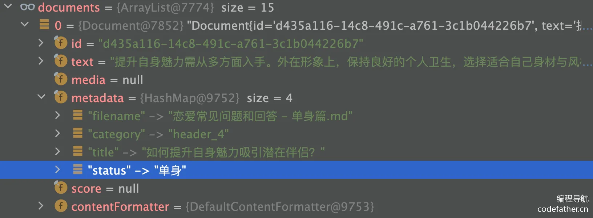

3）自动添加元信息：Spring AI 提供了生成元信息的 [Transformer 组件](https://docs.spring.io/spring-ai/reference/api/etl-pipeline.html#_keywordmetadataenricher)，可以基于 AI 自动解析关键词并添加到元信息中。代码如下：

    @Component
    class MyKeywordEnricher {
        @Resource
        private ChatModel dashscopeChatModel;
    
        List<Document> enrichDocuments(List<Document> documents) {
            KeywordMetadataEnricher enricher = new KeywordMetadataEnricher(this.dashscopeChatModel, 5);
            return enricher.apply(documents);
        }
    }
    
    @Bean
    VectorStore loveAppVectorStore(EmbeddingModel dashscopeEmbeddingModel) {
        SimpleVectorStore simpleVectorStore = SimpleVectorStore.builder(dashscopeEmbeddingModel)
                .build();
        
        List<Document> documents = loveAppDocumentLoader.loadMarkdowns();
        
        List<Document> enrichedDocuments = myKeywordEnricher.enrichDocuments(documents);
        simpleVectorStore.add(enrichedDocuments);
        return simpleVectorStore;
    }

如图，系统自动补充了相关标签：

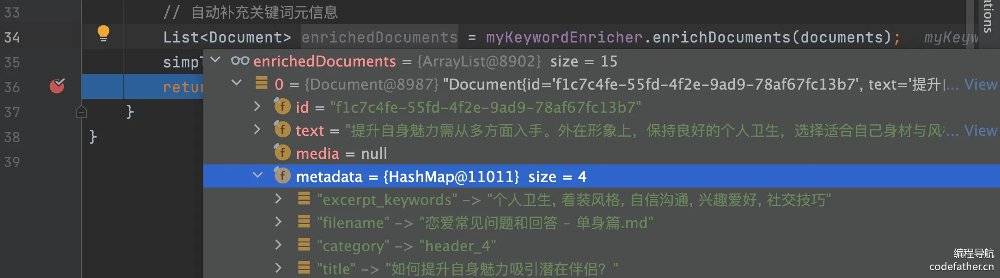

在云服务平台⁠中，如阿里云百炼，同样‌支持元数据和标签功能。​可以通过平台 API ‎或界面设置标签、以及通‌过标签实现快速过滤：

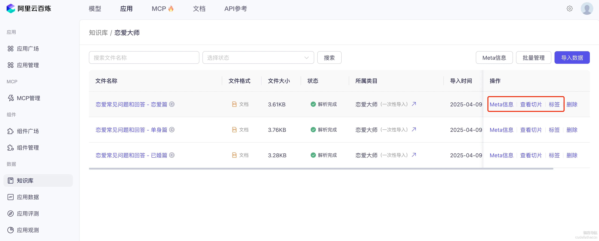

1）为某个文档设置标签：

2）在创建知⁠识库并导入数据时，可以‌配置自动 metada​ta 抽取（需注意，创‎建后将无法再配置抽取规‌则或更新已有元信息）：

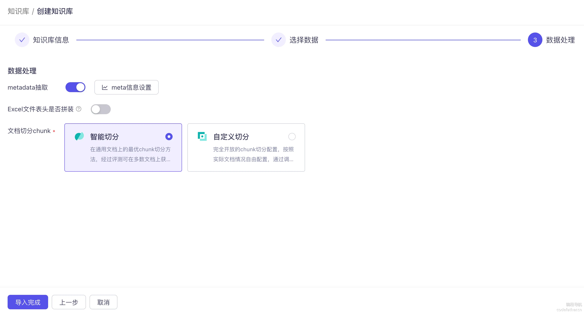

元数据抽取支持 [多种规则](https://help.aliyun.com/zh/model-studio/rag-knowledge-base/#c0fa1080aerzp)，如下图：

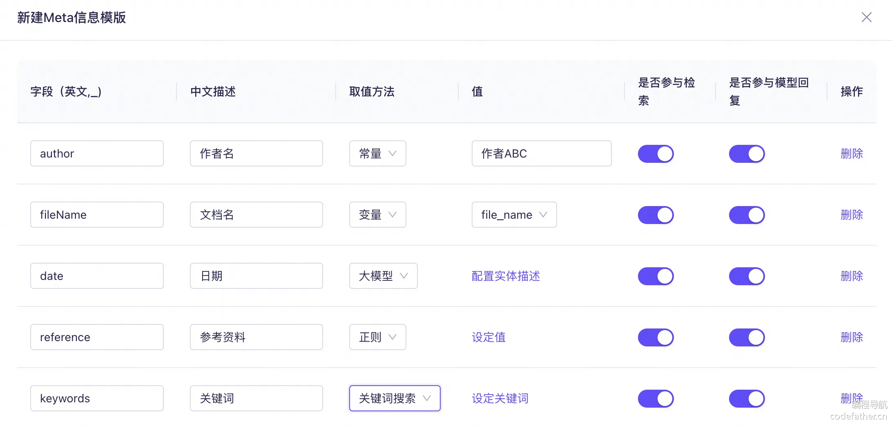

比如我们可⁠以使用 AI 大模‌型自动从文档中提取​元信息，需要编写一‎段 Prompt：

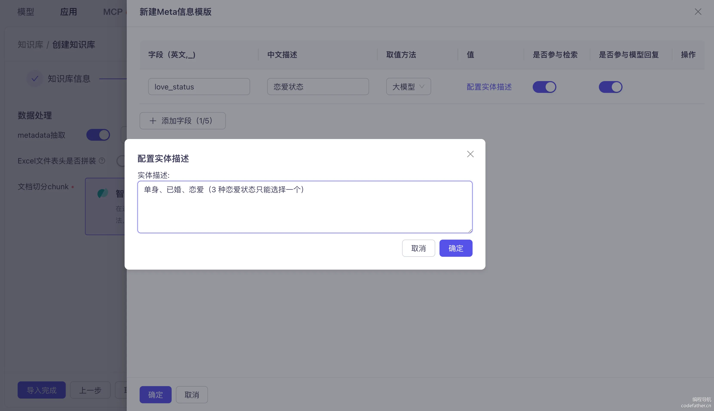

抽取效果如⁠图：       ‌         ​         ‎       

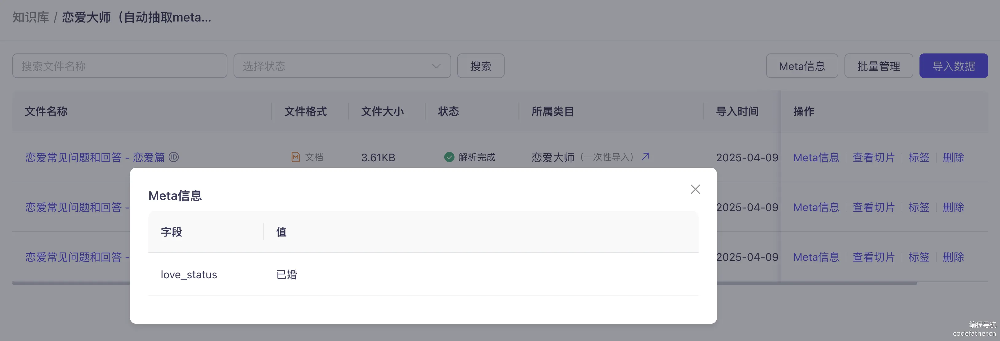

### 向量转换和存储

向量转换和⁠存储是 RAG 系‌统的核心环节，直接​影响检索的效率和‎准确性。

#### 向量存储配置

需要根据费⁠用成本、数据规模、‌性能、开发成本来选​择向量存储方案，比‎如内存 / Red‌is / MongoDB。

在编程实现中，可以通过以下方式配置向量存储：

    SimpleVectorStore vectorStore = SimpleVectorStore.builder(embeddingModel)
    .build();

在云平台中⁠，通常提供多种存储‌选项，比如内置的向​量存储或者云数据库‎：

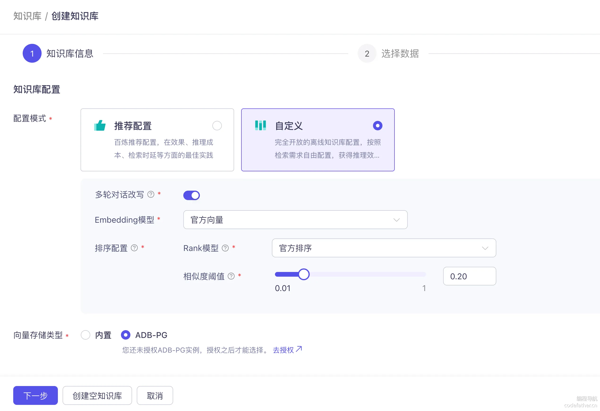

#### 选择合适的嵌入模型

嵌入模型负⁠责将文本转换为向量‌，其质量直接影响相​似度计算和检索‎准确性。可以在代码中修‌改：

    SimpleVectorStore vectorStore = SimpleVectorStore.builder(embeddingModel)
        .build();

云平台通常提供多种嵌入模型选项：

### 文档过滤和检索

这个环节是⁠我们开发者最能大显‌身手的地方，在技术​已经确定的情况下，‎优化这个环节可以显‌著提升系统整体效果。

#### 多查询扩展

在多轮会话场⁠景中，用户输入的提示词‌有时可能不够完整，或者存在​歧义。多查询扩展技‎术可以扩大检索范围，提‌高相关文档的召回率。

使用多查询扩展时，要注意：

-   设置合适的查询数量（建议 3 - 5 个），过多会影响性能、增大成本
-   保留原始查询的核心语义

在编程实现中，可以通过以下代码实现多查询扩展：

    MultiQueryExpander queryExpander = MultiQueryExpander.builder()
        .chatClientBuilder(chatClientBuilder)
        .numberOfQueries(3)
        .build();
    List<Query> queries = queryExpander.expand(new Query("谁是程序员梁哥啊？"));

获得扩展查⁠询后，可以直接用于‌检索文档、或者提取​查询文本来改写提示‎词：

    DocumentRetriever retriever = VectorStoreDocumentRetriever.builder()
        .vectorStore(vectorStore)
        .similarityThreshold(0.73)
        .topK(5)
        .filterExpression(new FilterExpressionBuilder()
            .eq("genre", "fairytale")
            .build())
        .build();
    
    List<Document> retrievedDocuments = documentRetriever.retrieve(query);
    
    System.out.println(query.text());

多查询扩展的完整使用流程可以包括三个步骤：

1.  使用扩展后的查询召回文档：遍历扩展后的查询列表，对每个查询使用 `DocumentRetriever` 来召回相关文档。
2.  整合召回的文档：将每个查询召回的文档进行整合，形成一个包含所有相关信息的文档集合。（也可以使用 [文档合并器](https://java2ai.com/docs/1.0.0-M6.1/tutorials/rag/?#35-%E6%96%87%E6%A1%A3%E5%90%88%E5%B9%B6%E5%99%A8documentjoiner) 去重）
3.  使用召回的文档改写 Prompt：将整合后的文档内容添加到原始 Prompt 中，为大语言模型提供更丰富的上下文信息。

💡 需要⁠注意，多查询扩展会‌增加查询次数和计算​成本，效果也不易量‎化评估，所以个人建‌议慎用这种优化方式。

#### 查询重写和翻译

查询重写和⁠翻译可以使查询更加‌精确和专业，但是要​注意保持查询的语义‎完整性。

主要应用包括：

-   使用 `RewriteQueryTransformer` 优化查询结构
-   配置 `TranslationQueryTransformer` 支持多语言

参考 [官方文档](https://java2ai.com/docs/1.0.0-M6.1/tutorials/rag/#32-query-rewrite-%E6%9F%A5%E8%AF%A2%E9%87%8D%E5%86%99) 实现查询重写：

    @Component
    public class QueryRewriter {
    
        private final QueryTransformer queryTransformer;
    
        public QueryRewriter(ChatModel dashscopeChatModel) {
            ChatClient.Builder builder = ChatClient.builder(dashscopeChatModel);
            
            queryTransformer = RewriteQueryTransformer.builder()
                    .chatClientBuilder(builder)
                    .build();
        }
    
        public String doQueryRewrite(String prompt) {
            Query query = new Query(prompt);
            
            Query transformedQuery = queryTransformer.transform(query);
            
            return transformedQuery.text();
        }
    }

应用查询重写器：

    @Resource
      private QueryRewriter queryRewriter;
    
      public String doChatWithRag(String message, String chatId) {
          
          String rewrittenMessage = queryRewriter.doQueryRewrite(message);
          ChatResponse chatResponse = chatClient
                  .prompt()
                  .user(rewrittenMessage)
                  .call()
                  .chatResponse();
          String content = chatResponse.getResult().getOutput().getText();
          return content;
      }

运行效果如图，显然问题变得更加专业：

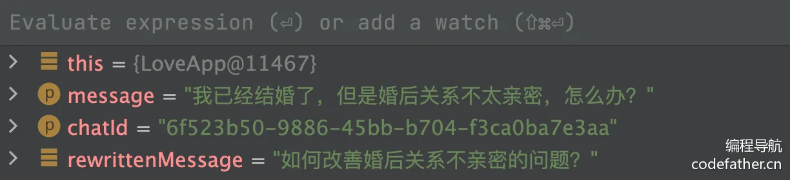

在云服务中，可以开启 [多轮会话改写](https://help.aliyun.com/zh/model-studio/rag-optimization#b7031e2ad6cji) 功能，自动将用户的提示词转换为更完整的形式：

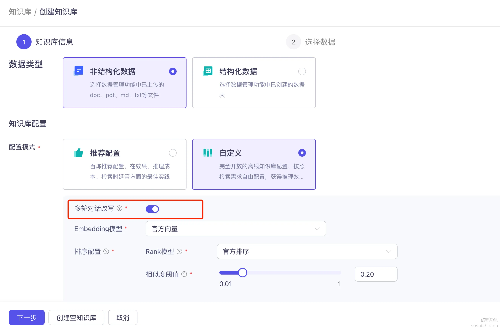

#### 检索器配置

检索器配置⁠是影响检索质量的关‌键因素，主要包括三​个方面：相似度阈值‎、返回文档数量和‌过滤规则。

**1）设置合理的相似度阈值**

相似度阈值控制文档被召回的标准，需根据具体问题调整：

| 问题                                               | 解决方案                                                             |
|----------------------------------------------------|----------------------------------------------------------------------|
| 知识库的召回结果不完整，没有包含全部相关的文本切片 | 建议降低 相似度阈值，提高 召回片段数，以召回一些原本应被检索到的信息 |
| 知识库的召⁠回结果中包含大量无‌关的文本切片         | ​建议提高相似度阈值‎，以排除与用户提示‌词相似度低的信息              |

在编程实现中，可以通过文档检索器配置：

    DocumentRetriever documentRetriever = VectorStoreDocumentRetriever.builder()
            .vectorStore(loveAppVectorStore)
            .similarityThreshold(0.5) 
            .build();

云平台提供了更便捷的配置界面，[参考文档](https://help.aliyun.com/zh/model-studio/rag-optimization#861895e8993co)：

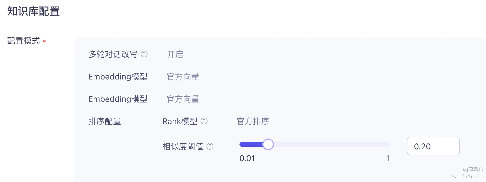

**2）控制返回文档数量（召回片段数）**

控制返回给⁠模型的文档数量，平‌衡信息完整性和噪音​水平。在编程实现中‎，可以通过文档检索‌器配置：

    DocumentRetriever documentRetriever = VectorStoreDocumentRetriever.builder()
            .vectorStore(loveAppVectorStore)
            .similarityThreshold(0.5) 
            .topK(3) 
            .build();

使用云平台，可以在编辑百炼应用时调整召回片段数，参考文档的 [提高召回片段数](https://help.aliyun.com/zh/model-studio/use-cases/rag-optimization#a0086e42d9n12) 部分：

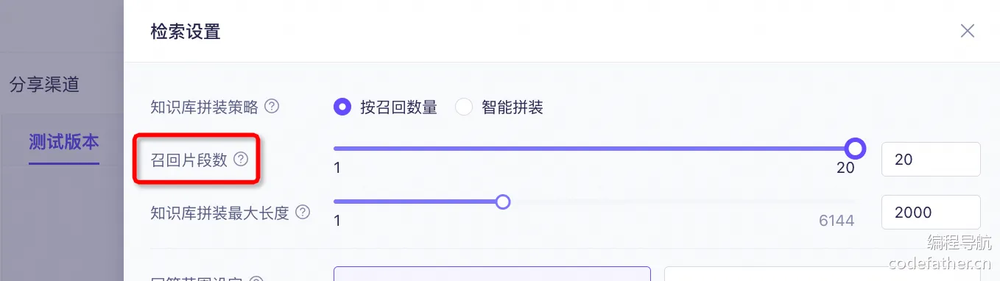

召回片段数即多⁠路召回策略中的 K 值。系统‌最终会选取相似度分数最高的 ​K 个文本切片。不合适的 K‎ 值可能导致 RAG 漏掉正‌确的文本切片，影响回答质量。

在多路召回场⁠景下，如果应用关联了多个‌知识库，系统会从这些库中​检索相关文本切片，然后通‎过重排序，选出最相关的前‌ K 条提供给大模型参考。

**3）配置文档过滤规则**

通过文档过⁠滤规则可以控制查询‌范围，提高检索精度和​效率。主要应用场‎景：

| 场景                                         | 解决方案                                                          |
|----------------------------------------------|-------------------------------------------------------------------|
| 知识库中包含多个类别的文档，希望限定检索范围 | 建议为文档 添加标签，知识库检索时会先根据标签筛选相关文档         |
| 知识库中有⁠多篇结构相似的文档，‌希望精确定位 | 提​取元数据，知识库会先‎使用元数据进行结构化‌搜索，再进行向量检索 |

在编程实现中，运用 Spring 内置的文档检索器提供的 [filterExpression](https://docs.spring.io/spring-ai/reference/api/retrieval-augmented-generation.html#_vectorstoredocumentretriever) 配置过滤规则。

写一个工厂类⁠ LoveAppRag‌CustomAdvis​orFactory，根‎据用户查询需求生成对应‌的 advisor：

    @Slf4j
    public class LoveAppRagCustomAdvisorFactory {
        public static Advisor createLoveAppRagCustomAdvisor(VectorStore vectorStore, String status) {
            Filter.Expression expression = new FilterExpressionBuilder()
                    .eq("status", status)
                    .build();
            DocumentRetriever documentRetriever = VectorStoreDocumentRetriever.builder()
                    .vectorStore(vectorStore)
                    .filterExpression(expression) 
                    .similarityThreshold(0.5) 
                    .topK(3) 
                    .build();
            return RetrievalAugmentationAdvisor.builder()
                    .documentRetriever(documentRetriever)
                    .build();
        }
    }

给药品智能监管系统⁠应用 LoveAp‌p 的 ChatC​lient 对象应‎用这个 Advis‌or：

    chatClient.advisors(
        LoveAppRagCustomAdvisorFactory.createLoveAppRagCustomAdvisor(
            loveAppVectorStore, "已婚"
        )
    )

实际过滤效果如图：

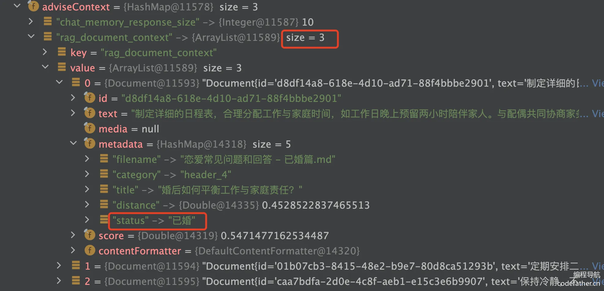

不过阿里云⁠ DashScop‌e 文档检索器好像​暂时不支持直接关联‎筛选表达式，梁哥查‌了很久文档都没查到（

使用云平台，目前百炼支持以下两种方式使用标签来实现过滤：

1.  [通过 API 调用百炼应用](https://help.aliyun.com/zh/model-studio/user-guide/application-calling/#4100253b7chc3) 时，可以在请求参数 `tags` 中指定标签。
2.  在控制台编辑应用时设置标签（但本方式仅适用于 [智能体应用](https://help.aliyun.com/zh/model-studio/user-guide/single-agent-application/)）。

请注意，此⁠处的设置将应用于该‌智能体应用后续的所​有用户问答。如图：

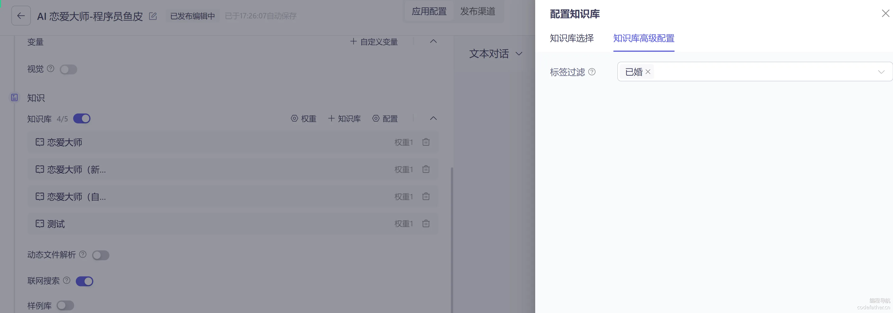

云百炼还支⁠持元数据过滤，开启‌后，知识库会在向量​检索前增加一层结构‎化搜索，完整过程如‌下：

1.  从提示词中提取元数据 {"key": "name", "value": "程序员梁哥"}
2.  根据提取的元数据，找到所有包含该元数据的文本切片
3.  再进行向量（语义）检索，找到最相关的文本切片

通过 API 调用应用时，可以在请求参数 `metadata_filter` 中指定 metadata。应用在检索知识库时，会先根据 metadata 筛选相关文档，实现精准过滤，[参考官方文档](https://help.aliyun.com/zh/model-studio/application-calling-guide#6bd8094de7e1e)。

最后，无论采用何种配置，都应 **多进行命中测试**，验证检索效果：

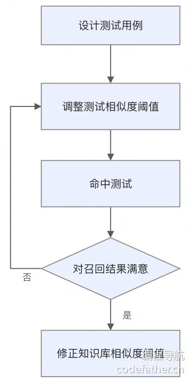

### 查询增强和关联

经过前面的文档检⁠索，系统已经获取了与用户查询相‌关的文档。此时，大模型需要根据​用户提示词和检索内容生成最‎终回答。然而，返回结果可能仍未达到‌预期效果，需要进一步优化。

#### 错误处理机制

在实际应用⁠中，可能出现多种异常‌情况，如找不到相关文​档、相似度过低、查询‎超时等。良好的错误处‌理机制可以提升用户体验。

异常处理主要包括：

-   允许空上下文查询（即处理边界情况）
-   提供友好的错误提示
-   引导用户提供必要信息

边界情况处⁠理可以使用 Spri‌ng AI 的 Co​ntextualQu‎eryAugment‌er 上下文查询增强器：

    RetrievalAugmentationAdvisor.builder()
        .queryAugmenter(
            ContextualQueryAugmenter.builder()
                .allowEmptyContext(false)
                .build()
        )

如果不使用自⁠定义处理器，或者未启用‌ “允许空上下文” 选​项，系统在找不到相关文‎档时会默认改写用户查询‌ userText：

    The user query is outside your knowledge base.
    Politely inform the user that you can't answer it.

效果如图：

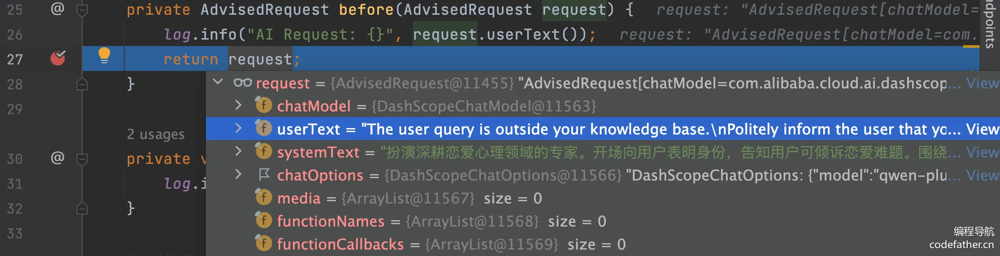

如果启用 ⁠“允许空上下文”，‌系统会自动处理空 ​Prompt 情况‎，不会改写用户输入‌，而是使用原本的查询。

我们也可以⁠自定义错误处理逻辑，‌来运用工厂模式创建一​个自定义的 Cont‎extualQuer‌yAugmenter：

    public class LoveAppContextualQueryAugmenterFactory {
        public static ContextualQueryAugmenter createInstance() {
            PromptTemplate emptyContextPromptTemplate = new PromptTemplate("""
                    你应该输出下面的内容：
                    抱歉，我只能回答药品监管相关的问题，别的没办法帮到您哦，
                    有问题可以联系编程导航客服 https://codefather.cn
                    """);
            return ContextualQueryAugmenter.builder()
                    .allowEmptyContext(false)
                    .emptyContextPromptTemplate(emptyContextPromptTemplate)
                    .build();
        }
    }

给检索增强⁠生成 Adviso‌r 应用自定义的 ​Contextua‎lQueryAug‌menter：

    RetrievalAugmentationAdvisor.builder()
                  .documentRetriever(documentRetriever)
                  .queryAugmenter(LoveAppContextualQueryAugmenterFactory.createInstance())
                  .build();

当系统无法找到相关文档时，会返回我们自定义的友好提示：

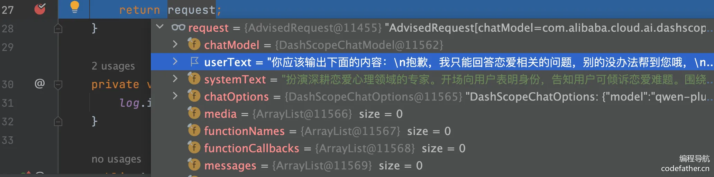

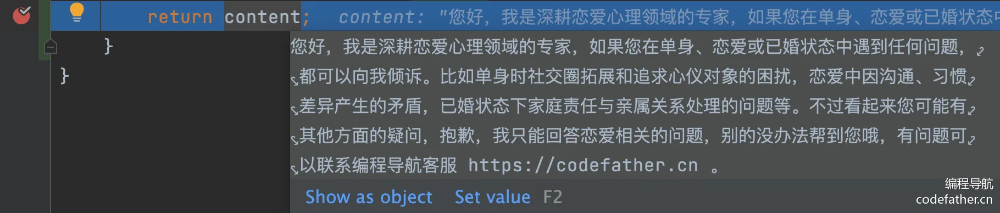

#### 其他建议

除了上述优化策略外，还可以考虑以下方面的改进：

| 问题类型                                               | 改进策略                                           |
|--------------------------------------------------------|----------------------------------------------------|
| 大模型并未理解知识和用户提示词之间的关系，答案生硬拼凑 | 建议 选择合适的大模型，提升语义理解能力            |
| 返回的结果没有按照要求，或⁠者不够全面                  | 建议 优化提示词模板，引导模型生成更‌符合要求的回答 |
| 返回结果不够准确，混入了模型自身的通​用知识            | 建议 开启拒识 功能，限制模型只基于知识‎库回答      |
| 相似提示词，希望控制回答的一致性或多样性               | ‌ 建议 调整大模型参数，如温度值等                  |

如果有必要的话，还可以考虑更高级的优化方向，比如：

1.  分离检索阶段和生成阶段的知识块
2.  针对不同阶段使用不同粒度的文档，进一步提升系统性能和回答质量
3.  针对查询重写、关键词元信息增强等用到 AI 大模型的场景，可以选择相对轻量的大模型，不一定整个项目只引入一种大模型

## 三、扩展知识 - RAG 高级知识

### 混⁠合检索策略    ‌         ​         ‎         ‌ 

在 RAG 系统中，检索质量直接决定了最终回答的好坏。

而不同的检索方法各有优⁠缺点：向量检索虽然能理解语义，捕捉文本间的‌概念关联，但对关键词敏感度不够。比如，当你​搜索 “2025 年怎么学编程” 时，向量‎检索可能会返回与编程相关的术语解释，而不是‌准确锁定 2025 年编程学习路线。

相反，基于倒排索引的全⁠文检索在精确匹配关键词方面表现出色，但它不理‌解语义，难以处理同义词或概念性查询。就像你问​ “编程导航的创始人是谁”，全文检索可能不会‎返回只提到 “程序员梁哥创办了很多网站” 而‌没有明确提到 “编程导航” 的文档。

结构化检索支⁠持精确过滤和复杂条件组‌合，但依赖良好的元​数据。而知识图谱检索能发现‎实体间隐含关系，适合回‌答复杂问题，但构建成本高。

主要检索方法比较表：

| 检索方法      | 原理                       | 优势                         | 劣势                           |
|---------------|----------------------------|------------------------------|--------------------------------|
| 向量检索      | 基于嵌入向量相似度搜索     | 理解语义关联，适合概念性查询 | 对关键词不敏感，召回可能不准确 |
| 全文检索      | 基于倒排索引，匹配⁠关键词  | 精确匹配关键词，高召回率     | 不理解语义，同义词难‌以匹配    |
| 结构化检索    | 基于元数据或结构化字段查询 | 精确过​滤，支持复杂条件组合  | 依赖良好的元数据，灵活性有限   |
| 知识图‎谱检索 | 利用实体间关系进行图遍历   | 发现隐含关系，回答复‌杂问题  | 构建成本高，需要专业知识       |

其中，全文检索是后端开发同学要掌握的技能，对应的主流技术实现是 Elasticsearch，编程导航的 [聚合搜索平台项目](https://www.codefather.cn/course/1790979621621641217) 和 [面试刷题平台项目](https://www.codefather.cn/course/1826803928691945473) 都有 Elasticsearch 的实战讲解，感兴趣的同学可自行学习。

那么到底该选择哪种检索方法呢？

其实，就像我们查资料时会尝试不同的方法一样，单一的检索方法往往难以满足复杂的需求，那么就采取 **混合检索策略**。

混合检索策⁠略的实现方式多种多‌样，主流的模式有下​面 3 种，当然你‎也可以按需选择‌新的策略。

#### 1、并行混合检索

同时使用多⁠种检索方法获取结果‌，然后使用重排模型​融合多来源结果。

像是同时派出多位专家寻找答案，然后整合他们的发现：

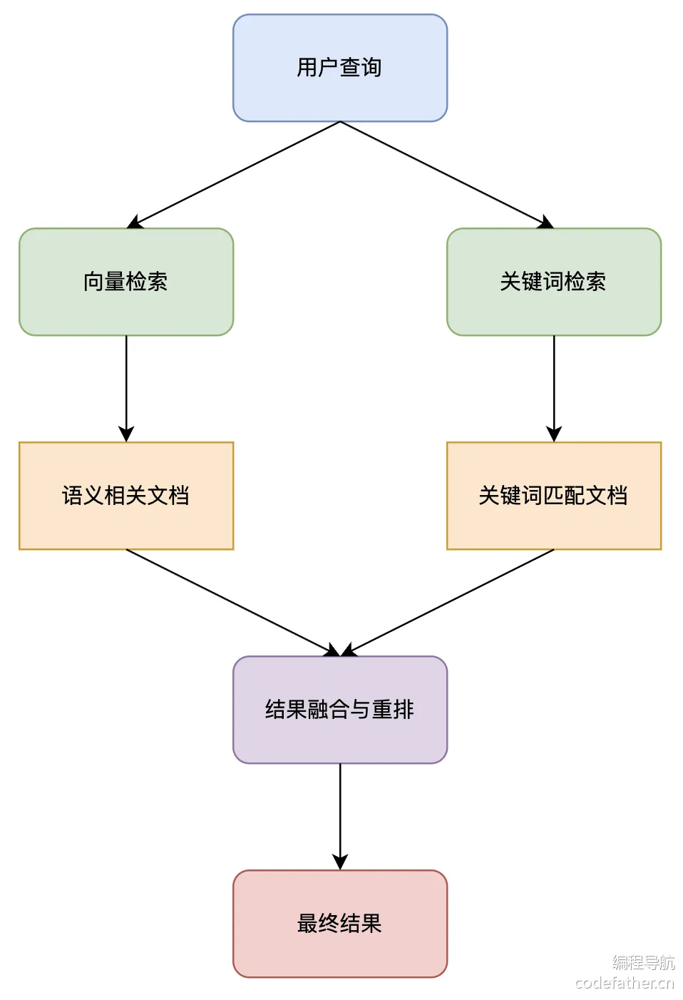

#### 2、级联混合检索

层层筛选，⁠先使用一种方法进行‌广泛召回，再用另一​种方法精确过滤。

比如先用向⁠量检索获取语义相似‌文档，再用关键词过​滤，最后用元数据进‎一步筛选，逐步‌缩小范围。

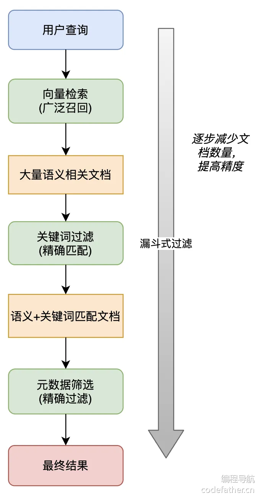

#### 3、动态混合检索

通过一个 ⁠“路由器”，根据查‌询类型自动选择最合​适的检索方法，更‎加智能。

举个例子，对于 “谁⁠是梁哥” 这样的人物查询，可能偏向使用‌知识图谱；而处理 “如何编写 Java​ 项目” 这类教程问题，可能更适合向量‎检索配合全文搜索。这种方法让系统能像人‌类一样智能地选择最佳信息获取途径。

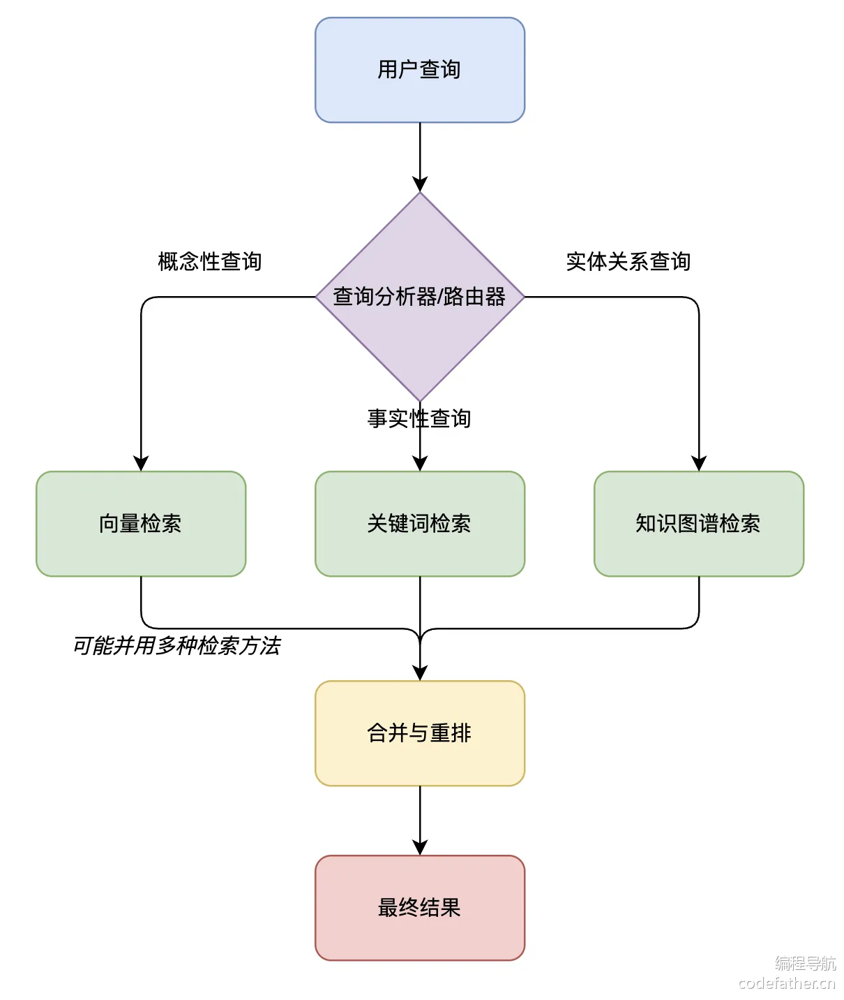

比如在 AI 大⁠模型开发平台 Dify 中，就为‌用户提供了 “基于全文检索的关键​词搜索 + 基于向量检索的语义检‎索” 的混合检索策略，用户还可以‌自己设置不同检索方式的权重。

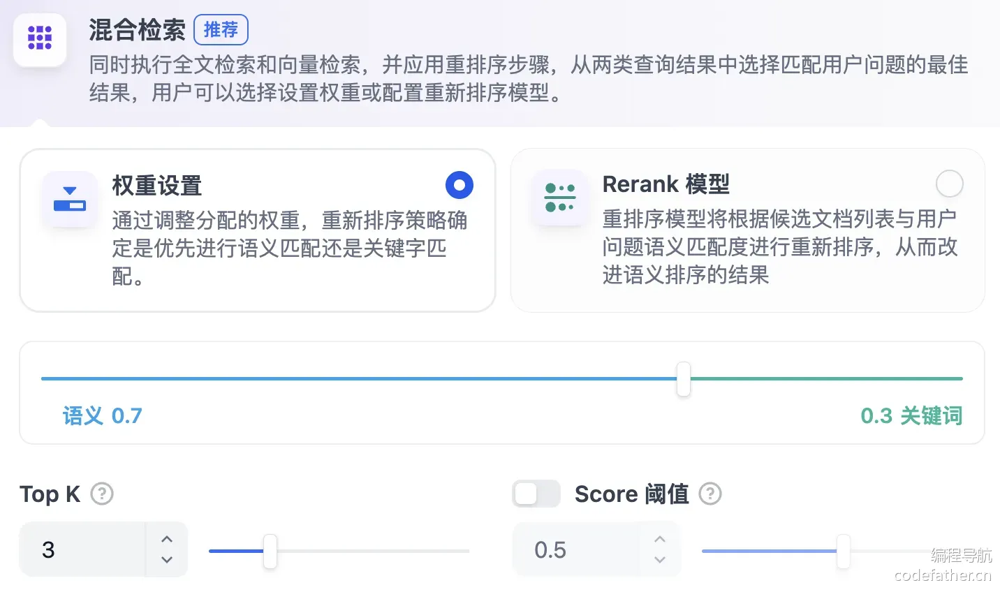

### 大模型幻觉

大模型有时⁠会 “自信满满地胡‌说八道”，这就是大​模型的经典问题 ——‎ 幻觉。

比如下面这个例子，梁哥的真名可不是 “李逸轩”！

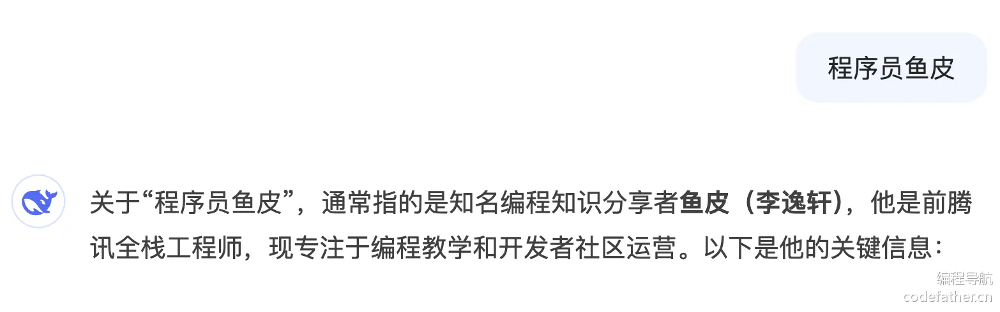

大模型幻觉指的⁠是模型生成看似合理但实际上‌不准确或完全虚构的内容。就​像一个信心十足的学生回答了‎一个自己并不真正了解的问题‌。这些幻觉主要有三种表现形式：

1.  事实性幻觉：生成与事实不符的内容（如错误的日期、人物关系等）。比如 “梁哥发明了计算器”
2.  逻辑性幻觉：推理过程存在逻辑错误，得出不合理的结论。比如 “1 + 1 = 3”
3.  自洽性幻觉：生成内容自身存在矛盾。比如 “我很年轻，才 80 岁”

为什么会出现幻觉呢？原因其实很复杂。一方面，模型的训练数据中可能包含错误或过时的信息；另一方面，大语言模型本质上是 **预测下一个词的概率** 模型，它们倾向于生成流畅而未必准确的内容。更重要的是，模型并不真正 “知道” 什么，它只是学会了文本的统计模式。

想象一下，当你⁠问一个从来没去过月球的人关‌于月球表面的情况，他可能会​基于看过的电影或书籍给出看‎似合理但不准确的描述。大模‌型的幻觉本质上与此类似。

那么，如何减少这种幻觉呢？

首先就是我们重⁠点学习的 RAG，通过引入‌外部知识源，我们可以让模型​不再完全依赖其参数中存储的‎信息，而是基于检索到的最新‌、准确的信息来回答问题。

有效的 RAG 实现通⁠常会引入 “引用标注” 机制，让模型明确指出‌信息来源于哪个文档的哪个部分。当模型不确定时​，我们也应该鼓励它诚实地表达不确定性，而不是猜‎测答案。这就像一个好的学者会明确引用来源，‌并在不确定时坦诚承认知识的局限性。

此外，还有其他减轻幻⁠觉的方法，比如提示工程优化，可以采用 “‌思维链” 提高推理透明度，通过引导模型一​步步思考，我们能够更好地观察其推理过程‎，及时发现可能的错误。很多 Agent‌ 超级智能体都会采用这种模式：

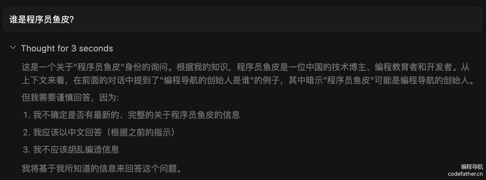

此外，我们还可以使用 **事实验证模型** 检查生成内容的准确性，建立关键信息的自动核查机制，或实施人机协作的审核流程。评估幻觉程度的指标包括事实一致性、引用准确性和自洽性评分。通过上面的方法，我们能够大幅减轻大模型幻觉，提供更可靠的 AI 使用体验。

### RAG 应用评估

开发一个 RAG⁠ 系统并不难，难的是如何确保它‌真正有效。如果是我们自己学习 ​RAG 应用或者开发小产品，直‎接用云平台提供的命中测试能力就‌可以评估 RAG 的效果。

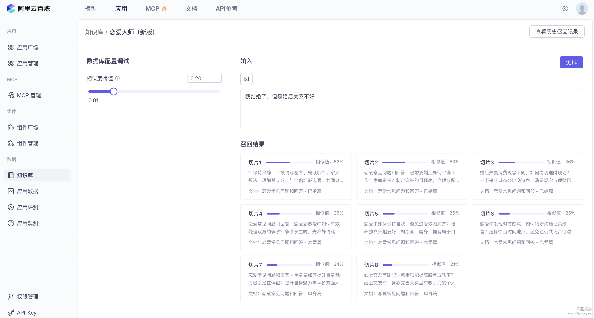

但是对于大公司或精心打磨 AI 产品的团队来说，一般会建设一套科学的 **评估体系**。

RAG 应用评估本质上回答了 3 个关键问题：

-   系统检索的信息是否相关？
-   生成的回答是否准确？
-   整体用户体验如何？

评估的目的⁠是确保回答质量、识‌别性能瓶颈，从而给​出持续优化的思路。

我们可以简⁠单了解下 RAG ‌应用的评估指标： ​         ‎         ‌             

1）检索质量评估指标

-   召回率：能否检索到所有相关文档
-   精确率：检索结果中相关文档的比例
-   平均精度均值（MAP）：考虑排序质量的综合指标
-   规范化折扣累积增益（NDCG）：考虑到文档的相关性和它们在排名中的位置，是一个衡量排名质量的指标

2）生成回答质量评估指标

-   事实准确性：回答中事实性陈述的准确程度
-   答案完整性：回答是否涵盖问题的所有方面
-   上下文相关性：回答与问题的相关程度
-   引用准确性：引用内容是否确实来自检索上下文

当然，我们还可以根据具⁠体应用场景，定制专门的评估标准。比如系统性能‌评估、领域适应性评估、多语言评估、时效性评估​和用户满意度评估。其中，用户满意度评估在我们‎开发 AI 产品时尤为常见，经常需要引导用户‌针对 AI 大模型的回复进行打分。

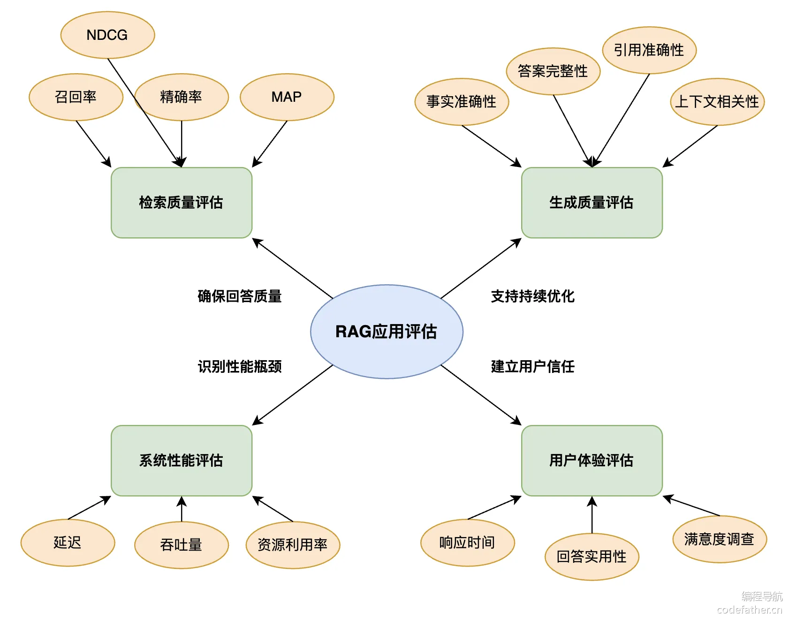

RAG 评估流程通常包括 4 个步骤：

1.  生成评估数据集：创建覆盖不同问题类型的测试集，为每个问题准备标准答案和相关文档。这些测试问题应包括事实性问题、观点性问题、多步骤推理问题等各种类型。
2.  运行评估检索过程的程序：对每个测试问题执行检索，与人工标注的相关文档比较，计算检索性能指标。
3.  评估回答质量：实际操作中，评估通常分为自动评估和人工评估两种方式。自动评估使用像 ROUGE（召回率取向摘要评估）或 BLEU（双语评估替补）这样的指标来衡量生成内容与参考答案的相似度，或者使用更强大的模型来判断回答质量。但自动评估有其局限性，某些方面如创造性、实用性等仍然需要人工评估。这就是为什么很多 AI 公司会招人来人工标注。
4.  综合分析与优化：识别失败模式和常见错误，比如区分检索失败和生成失败，针对性改进系统组件。

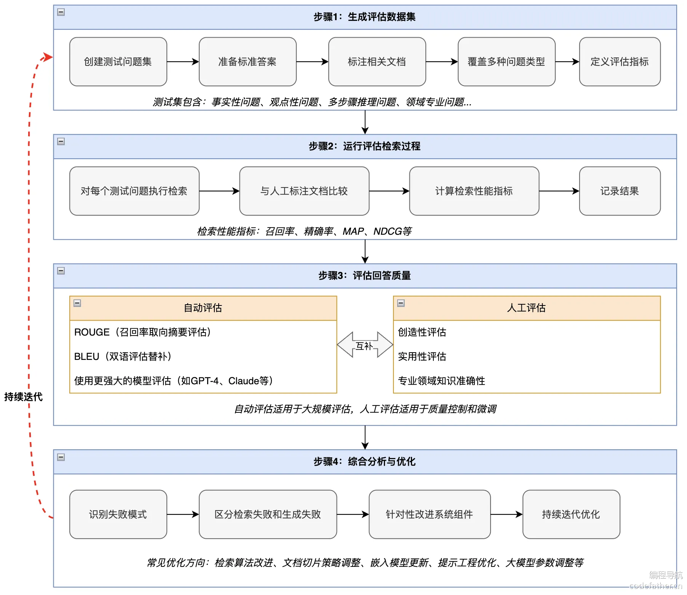

如果面试时⁠，面试官问到 “你‌是如何评估和调优 ​RAG 系统的？”‎，就可以采用下面这‌样的回答：

我曾参与过一个编程咨询 RAG 系⁠统的评估和优化。系统在回答具体编程技术问题时表现出色，但处理 “根据‌个人编程情况给出学习建议” 的复杂案例时表现不好。通过错误分析，我们​发现问题出在检索阶段 —— 系统无法同时检索到相关技术知识和类似的学‎习建议。针对这一问题，我们调整了检索策略，专门为学习建议类问题设计了‌基于案例的检索方法，从而提升了模型回复的准确度。

### 高级 RAG 架构

有时，传统的 “检索 - 生成” 架构可能无法满足更复杂、要求质量更高的需求，因此让我们简单了解几种创新的 RAG 架构，**重点要了解每种架构的应用场景**，如果真的要深入学习，建议在网上搜索相关论文。

#### 1、自纠错 RAG（C-RAG）

解决了模型⁠可能误解或错误使用‌检索信息的问题，提​高回答的准确性。

想象一下，你⁠给朋友讲述一个你刚读过‌的新闻，但不小心添加了​一些自己的理解或记错了‎细节，C-RAG 就是‌为了解决这个问题而设计的。

C-RAG 采用 “检⁠索 - 生成 - 验证 - 纠正” 的闭环流程：先检索‌文档，生成初步回答，然后验证回答中的每个事​实陈述，发现错误就立即纠正并重新生成。这种‎循环确保了最终回答的高度准确性，特别适合医‌疗、法律等对事实准确性要求极高的领域。

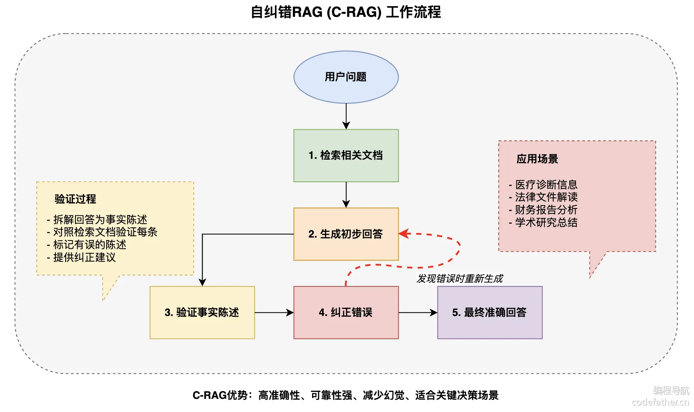

#### 2、自省式 RAG（Self-RAG）

解决了 “⁠并非所有问题都需要‌检索” 的问题，让​回答更自然并提高系‎统效率。

想象你问 “1⁠+1 等于几” 这样的基础问题‌，模型完全可以直接回答，无需额外​检索。Self-RAG ‎让模型学会了判断：什么时候需‌要查资料、什么时候可以直接回答。

收到提问时，Sel⁠f-RAG 模型会在内心思考：“这个‌问题我知道答案吗？需要查询更多信息吗​？我的回答包含任何不确定的内容吗？”‎ 这种自我反思机制使回答更加自然，也‌可以在一定程度上提高系统效率。

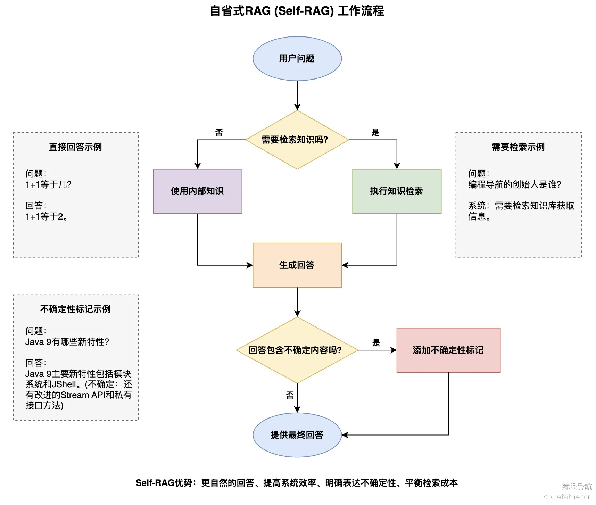

#### 3、检索树 RAG（RAPTOR）

提供了一种结构⁠化的解决方案，特别适合可拆‌分的复杂问题。它就像解决一​个复杂数学题：先把大问题分‎解成小问题，分别解决每个小‌问题，然后将答案整合起来。

举个例子，对于 “介绍编程⁠导航的交流板块、学习板块和教程板块” 这样的多方面问‌题，RAPTOR 会分别检索关于 3 个板块的信息，​然后综合这些信息形成最终回答。这种方法特别适合需要整‎合多方面知识的复杂问题，能够提高长篇叙述的连贯性和准‌确性，克服单次检索的上下文长度限制。

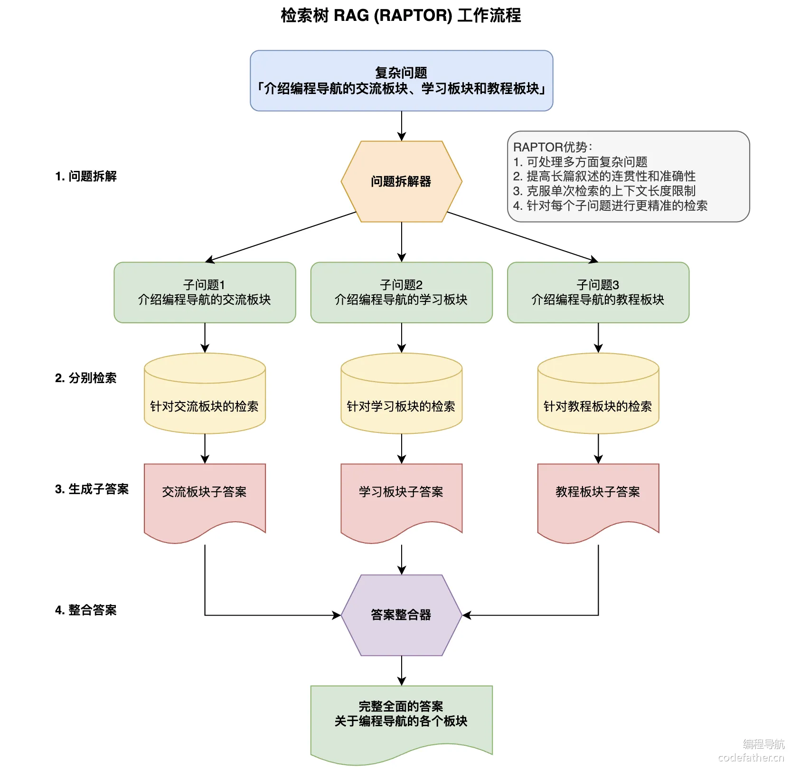

#### 4、多智能体 RAG 系统

组合拥有各⁠类特长的智能体，通过‌明确的通信协议交换信​息，实现复杂任务的协‎同处理。也就是让专业‌的大模型做专业的事情。

还是类比到现实生活，假⁠设某个团队要解决问题。团队中有专门负责理解用‌户意图的接待员，有擅长搜索文档的资料管理员，​有精通特定领域知识的专家，还有负责事实核查的‎审核员和润色最终回答的编辑。比起一个人做事，‌各司其职相互配合效果可能会更好。

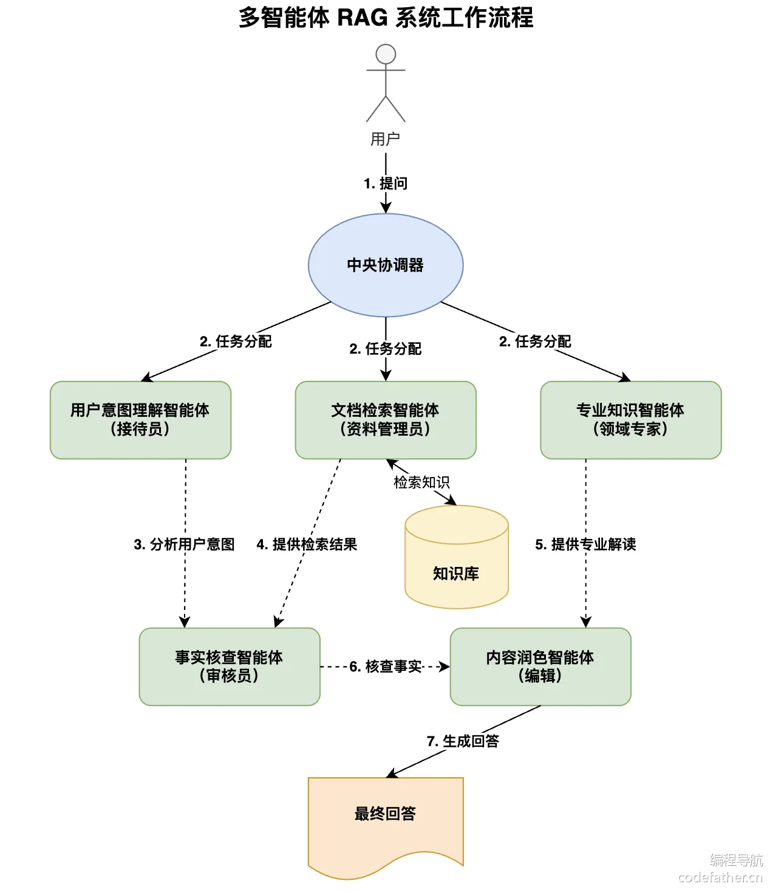

在实际应用中，这些高级架⁠构往往不是独立使用的，而是根据具体需求灵活组‌合。比如金融顾问系统可能在处理一般市场趋势问题时​使用 Self-RAG，而在回答具体公司财务数‎据时使用 C-RAG，对于复杂的投资组合分析则‌采用 RAPTOR 架构进行多维度分析。

RAG 技术还在不断演进，未来将向多模态（整合文本、图像、音频等）、适应性（根据用户反馈动态调整）和更高效率的方向发展。核心挑战始终是如何 **精准** 检索知识并 **无缝融入** 生成过程，为用户提供 **既准确又自然** 的 AI 回答体验。

------------------------------------------------------------------------

这一章涉及的知识点是非常丰富的，尤其是 RAG 的最佳实践和调优技巧，是面试时的重点，更多面试题大家可以在 [面试鸭最新的 AI 大模型题库](https://www.mianshiya.com/bank/1906189461556076546) 中学习：

## 四、扩展思路

1）自定义 DocumentReader 文档读取器，比如读取 GitHub 仓库信息。可以参考 Spring AI Alibaba 官方 [开源的代码仓库](https://github.com/alibaba/spring-ai-alibaba/tree/main/community/document-readers) 来了解

2）自定义 Q⁠ueryTransforme‌r 查询转换器，比如利用第三​方翻译 API 代替 Spr‎ing AI 内置的基于大模‌型的翻译工具，从而降低成本。

3）实现基于向量数据库⁠和其他数据存储（比如 MySQL、Redi‌s、Elasticsearch）的混合​检索。实现思路可以是整合多数据源的搜索结果；或‎者把其他数据存储作为降级方案，从向量数据库‌中查不到数据时，再从其他数据库中查询。

4）不借助 Sp⁠ring AI 等开发框架，自‌主实现 RAG；或者自主实现一​个 Spring AI 的 R‎AG Advisor，从而加深‌对 RAG 实现原理的理解。

## 本节作业

1）自行整⁠理笔记，学会通过结构‌化的方式，通过 RA​G 的 4 个核心步‎骤来整理 RAG 的‌最佳实践和优化技巧。

2）编写代码⁠，给文档添加元信息，并且‌基于 Retrieval​Augmentation‎Advisor 查询增强‌顾问，实现基于元信息的过滤。

3）利用云⁠平台给知识库内的文‌档添加标签或元信息​，重点实践自动抽取‎元信息的配置。

全文完

本文由 [简悦 SimpRead](http://ksria.com/simpread) 转码，用以提升阅读体验，[原文地址](https://www.codefather.cn/course/1915010091721236482/section/1920435766373552129?type=#)

