# 9 - AI 服务化 - AI 超级智能体项目教程

 本节重点 AI 服务化是指将原本只能本地运行的 AI 能力转化为可远程调用的接口服务，使更多人能够便捷地访问 AI 能力。

## 本节重点

AI 服务化是指将原本只能⁠本地运行的 AI 能力转化为可远程调用的接口服务，‌使更多人能够便捷地访问 AI 能力。通过本节学习，​你将掌握如何将 AI 智能体转变为可供他人调用的服‎务、利用 AI 生成对应的前端项目，并且将项目的前‌后端通过 Serverless 部署上线。

具体内容包括：

-   AI 应用接口开发
-   AI 智能体接口开发
-   AI 生成前端项目
-   AI 服务 Serverless 部署（前后端）

在开始之前，先给大家提个醒，Spring AI 版本更新飞快，有些代码的写法随时可能失效，尽量以 [官方文档](https://docs.spring.io/spring-ai/reference/upgrade-notes.html) 为准。

## 一、AI 应用接口开发

我们平时开发的大多数接口都⁠是同步接口，也就是等后端处理完再返回。但是对于 A‌I 应用，特别是响应时间较长的对话类应用，可能会让​用户失去耐心等待，因此推荐使用 SSE（Serve‎r-Sent Events）技术实现实时流式输出，‌类似打字机效果，大幅提升用户体验。

接下来我们⁠会同时提供同步接口‌（一次性完整返回）​和基于 SSE 的‎流式输出接口。

### 开发

#### 1、支持流式调用

首先，我们⁠需要为 LoveAp‌p 添加流式调用方法​，通过 stream‎ 方法就可以返回 F‌lux 响应式对象了：

    public Flux<String> doChatByStream(String message, String chatId) {
        return chatClient
                .prompt()
                .user(message)
                .advisors(spec -> spec.param(CHAT_MEMORY_CONVERSATION_ID_KEY, chatId)
                        .param(CHAT_MEMORY_RETRIEVE_SIZE_KEY, 10))
                .stream()
                .content();
    }

💡 建议不要直接⁠使用 ChatResponse 作‌为返回类型，因为这会导致返回内容膨​胀，影响传输效率。所以上述代码中我‎们使用 content 方法，只返‌回 AI 输出的文本信息。

#### ⁠2、开发同步接口 ‌         ​         ‎         ‌    

在 controller 包下新建 `AiController`，将所有的接口都写在这个文件内。

先编写一个同步接口：

    @RestController
    @RequestMapping("/ai")
    public class AiController {
    
        @Resource
        private LoveApp loveApp;
    
        @Resource
        private ToolCallback[] allTools;
    
        @Resource
        private ChatModel dashscopeChatModel;
    
        @GetMapping("/love_app/chat/sync")
        public String doChatWithLoveAppSync(String message, String chatId) {
            return loveApp.doChat(message, chatId);
        }
    }

#### 3、开发 SSE 流式接口

然后编写基于⁠ SSE 的流式输出接‌口，有几种常见的实现方​式：         ‎           ‌            

1） 返回⁠ Flux 响应式‌对象，并且添加 S​SE 对应的 Me‎diaType：

    @GetMapping(value = "/love_app/chat/sse", produces = MediaType.TEXT_EVENT_STREAM_VALUE)
    public Flux<String> doChatWithLoveAppSSE(String message, String chatId) {
        return loveApp.doChatByStream(message, chatId);
    }

2）返回 ⁠Flux 对象，并且‌设置泛型为 Serv​erSentEv‎ent。使用这种方式可以‌省略 MediaType：

    @GetMapping(value = "/love_app/chat/sse")
    public Flux<ServerSentEvent<String>> doChatWithLoveAppSSE(String message, String chatId) {
        return loveApp.doChatByStream(message, chatId)
                .map(chunk -> ServerSentEvent.<String>builder()
                        .data(chunk)
                        .build());
    }

3）使用 ⁠SSEEmiter，‌通过 send 方法​持续向 SseEmi‎tter 发送消息（‌有点像 IO 操作）：

    @GetMapping("/love_app/chat/sse/emitter")
    public SseEmitter doChatWithLoveAppSseEmitter(String message, String chatId) {
        
        SseEmitter emitter = new SseEmitter(180000L); 
        
        loveApp.doChatByStream(message, chatId)
                .subscribe(
                        
                        chunk -> {
                            try {
                                emitter.send(chunk);
                            } catch (IOException e) {
                                emitter.completeWithError(e);
                            }
                        },
                        
                        emitter::completeWithError,
                        
                        emitter::complete
                );
        
        return emitter;
    }

### 测试接口

开发完成后，我们可⁠以通过 Swagger 接口文档来测‌试接口功能、验证会话上下文是否正常​工作。但是，浏览器控制台可能无法实时查‎看 SSE 返回的内容，这时我们不妨‌使用 CURL 工具进行测试。

一般 Li⁠nux 和 Mac‌ 系统自带了 CU​RL 工具，打开终‎端，输入下列命令：

    curl 'http://localhost:8123/api/ai/love_app/chat/sse?message=hello&chatId=1'

效果如图，控制台会持续不断地输出文本片段，接口验证成功！

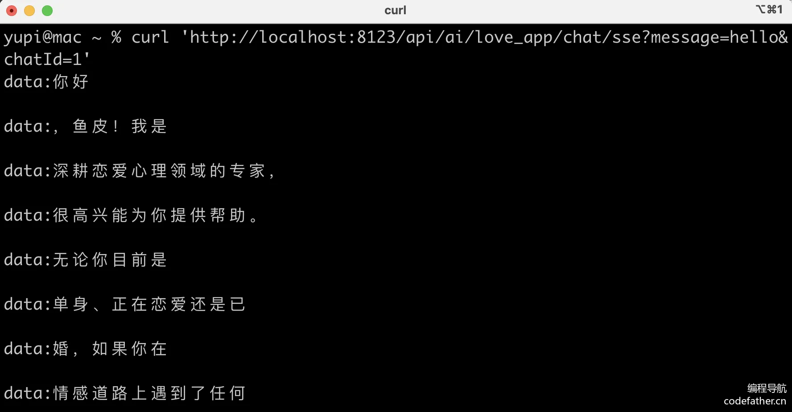

💡 在浏⁠览器 F12 控制‌台中，可以直接选中​网络请求来复制 C‎URL 命令，非常‌便于测试：

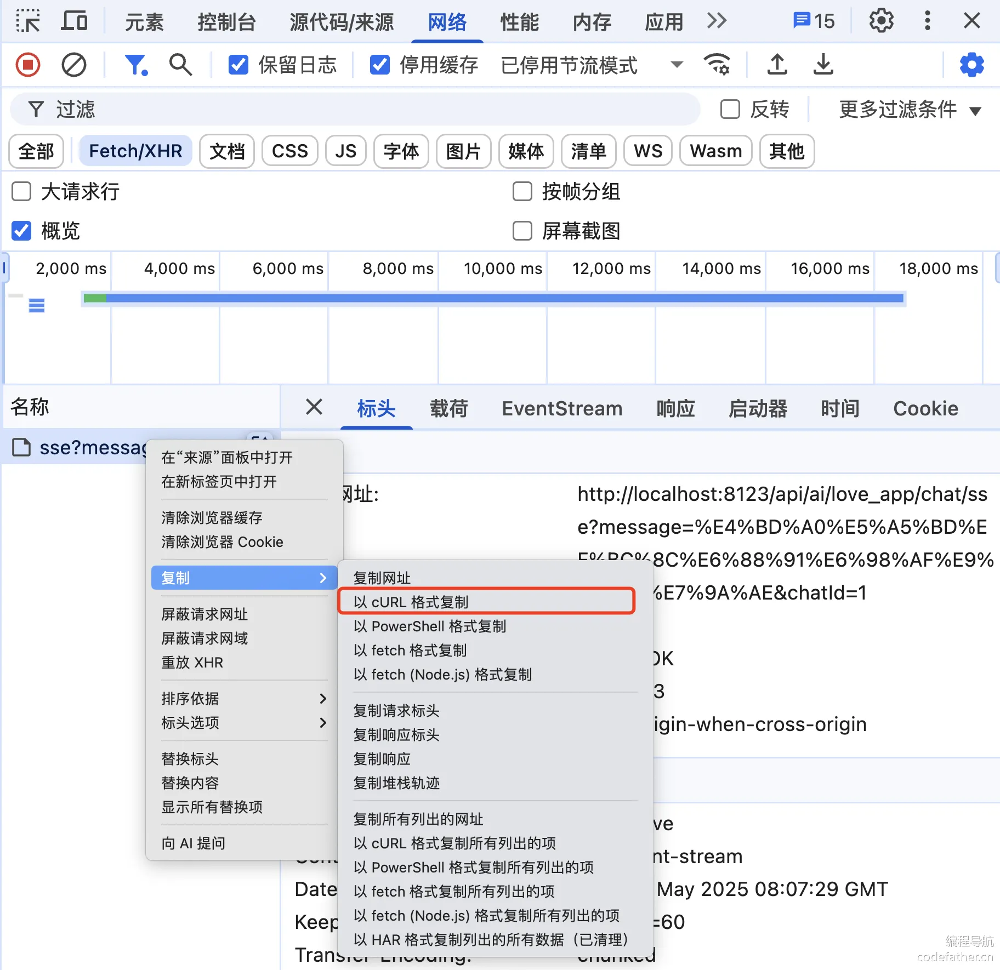

当然，如果你无⁠法使用 CURL，也可以使‌用 IDEA 自带的 HT​TP Client 工具进‎行测试。点击接口旁边的绿豆‌就能自动生成测试代码：

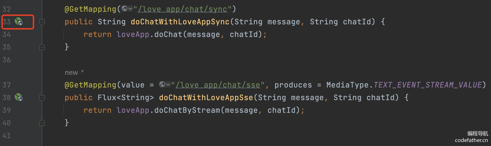

还可以手动编辑测试代码：

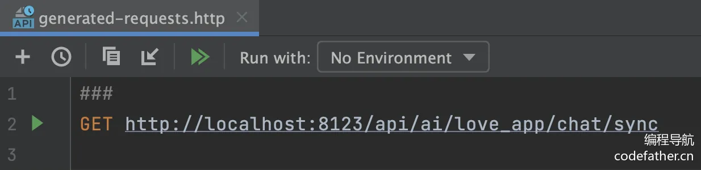

在实际项目上线前，建议对接口返回值进行封装、并且添加全局异常处理机制来完善整个项目，提高系统的健壮性。可以参考 [编程导航的智能协同云图库项目](https://www.codefather.cn/course/1864210260732116994)，有从 0 到 1 的后端项目初始化讲解。

## 二、AI 智能体接口开发

由于智能体执行⁠过程通常包含多个步骤，执行‌时间较长，使用同步方法会导​致用户体验不佳。因此，我们‎采用 SSE 技术将智能体‌的推理过程实时分步输出给用户。

### 开发

1）首先在 BaseAgent 类中添加流式输出方法：

    public SseEmitter runStream(String userPrompt) {
        
        SseEmitter emitter = new SseEmitter(300000L); 

​        
        CompletableFuture.runAsync(() -> {
            try {
                if (this.state != AgentState.IDLE) {
                    emitter.send("错误：无法从状态运行代理: " + this.state);
                    emitter.complete();
                    return;
                }
                if (StringUtil.isBlank(userPrompt)) {
                    emitter.send("错误：不能使用空提示词运行代理");
                    emitter.complete();
                    return;
                }

​                
                state = AgentState.RUNNING;
                
                messageList.add(new UserMessage(userPrompt));
    
                try {
                    for (int i = 0; i < maxSteps && state != AgentState.FINISHED; i++) {
                        int stepNumber = i + 1;
                        currentStep = stepNumber;
                        log.info("Executing step " + stepNumber + "/" + maxSteps);

​                        
                        String stepResult = step();
                        String result = "Step " + stepNumber + ": " + stepResult;

​                        
                        emitter.send(result);
                    }
                    
                    if (currentStep >= maxSteps) {
                        state = AgentState.FINISHED;
                        emitter.send("执行结束: 达到最大步骤 (" + maxSteps + ")");
                    }
                    
                    emitter.complete();
                } catch (Exception e) {
                    state = AgentState.ERROR;
                    log.error("执行智能体失败", e);
                    try {
                        emitter.send("执行错误: " + e.getMessage());
                        emitter.complete();
                    } catch (Exception ex) {
                        emitter.completeWithError(ex);
                    }
                } finally {
                    
                    this.cleanup();
                }
            } catch (Exception e) {
                emitter.completeWithError(e);
            }
        });

​        
        emitter.onTimeout(() -> {
            this.state = AgentState.ERROR;
            this.cleanup();
            log.warn("SSE connection timed out");
        });
    
        emitter.onCompletion(() -> {
            if (this.state == AgentState.RUNNING) {
                this.state = AgentState.FINISHED;
            }
            this.cleanup();
            log.info("SSE connection completed");
        });
    
        return emitter;
    }

上述代码虽然⁠看着很复杂，但是大部分‌都是在原有 run 方​法的基础上进行改造，补‎充给 SseEmitt‌er 推送消息的代码。

注意，上述代码中使用 `CompletableFuture.runAsync()` 实现非阻塞式异步执行，否则会长时间占用 Web 服务器线程池资源。

2）在 `AiController` 中编写新的接口，注意每次对话都要创建一个新的实例：

    @Resource
    private ToolCallback[] allTools;
    
    @Resource
    private ChatModel dashscopeChatModel;

    @GetMapping("/manus/chat")
    public SseEmitter doChatWithManus(String message) {
        YuManus yuManus = new YuManus(allTools, dashscopeChatModel);
        return yuManus.runStream(message);
    }

### 测试接口

跟前面一样，使用 CURL 工具进行测试，效果如图：

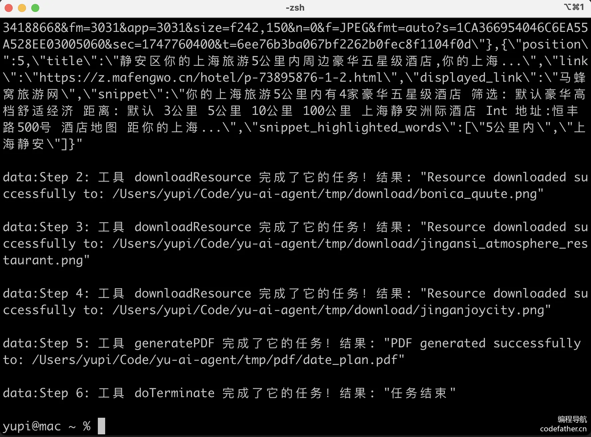

### 后端支持跨域

为了让前端⁠项目能够顺利调用后端‌接口，我们需要在后端​配置跨域支持。在 c‎onfig 包下创建‌跨域配置类，代码如下：

    @Configuration
    public class CorsConfig implements WebMvcConfigurer {
    
        @Override
        public void addCorsMappings(CorsRegistry registry) {
            
            registry.addMapping("/**")
                    
                    .allowCredentials(true)
                    
                    .allowedOriginPatterns("*")
                    .allowedMethods("GET", "POST", "PUT", "DELETE", "OPTIONS")
                    .allowedHeaders("*")
                    .exposedHeaders("*");
        }
    }

注意，如果 `.allowedOrigins("*")` 与 `.allowCredentials(true)` 同时配置会导致冲突，因为出于安全考虑，跨域请求不能同时允许所有域名访问和发送认证信息（比如 Cookie）。

## 三、AI 生成前端项目

由于这个项目不需要很复杂的页面，我们可以利用 AI 来快速生成前端代码，极大提高开发效率。这里梁哥使用 [主流 AI 开发工具 Cursor](https://www.cursor.com/)，挑战不写一行代码，生成符合要求的前端项目。

### 提示词

首先准备一⁠段详细的 Prom‌pt，一般要包括需​求、技术选型、后端‎接口信息，还可以提‌供一些原型图、后端代码等。

梁哥使用的 prompt 如下：

    你是一位专业的前端开发，请帮我根据下列信息来生成对应的前端项目代码。
    
    ## 需求
    
    1）主页：用于切换不同的应用
    
    2）页面 1：AI 药品智能监管系统。页面风格为聊天室，上方是聊天记录（用户信息在右边，AI 信息在左边），下方是输入框，进入页面后自动生成一个聊天室 id，用于区分不同的会话。通过 SSE 的方式调用 doChatWithLoveAppSse 接口，实时显示对话内容。
    
    3）页面 2：AI 超级智能体应用。页面风格同页面 1，但是调用 doChatWithManus 接口，也是实时显示对话内容。
    
    ## 技术选型
    
    1. Vue3 项目
    2. Axios 请求库
    
    ## 后端接口信息
    
    接口地址前缀：http://localhost:8123/api
    
    ## SpringBoot 后端接口代码
    
    @RestController
    @RequestMapping("/ai")
    public class AiController {
    
        @GetMapping(value = "/love_app/chat/sse", produces = MediaType.TEXT_EVENT_STREAM_VALUE)
        public Flux<String> doChatWithLoveAppSse(String message, String chatId) {
            return loveApp.doChatByStream(message, chatId);
        }
    
        @GetMapping("/manus/chat")
        public SseEmitter doChatWithManus(String message) {
            YuManus yuManus = new YuManus(allTools, dashscopeChatModel);
            return yuManus.runStream(message);
        }
    }

注意，如果使⁠用的是 Windows‌ 系统，最好在 pro​mpt 中补充 “你应该‎使用 Windows ‌支持的命令来完成任务”。

### 开发

1）在项目根目录下创建新的前端项目文件夹 `yu-ai-agent-frontend`，使用 Cursor 工具打开该目录，输入 Prompt 执行。注意要选择 Agent 模式、开启 Thinking 深度思考：

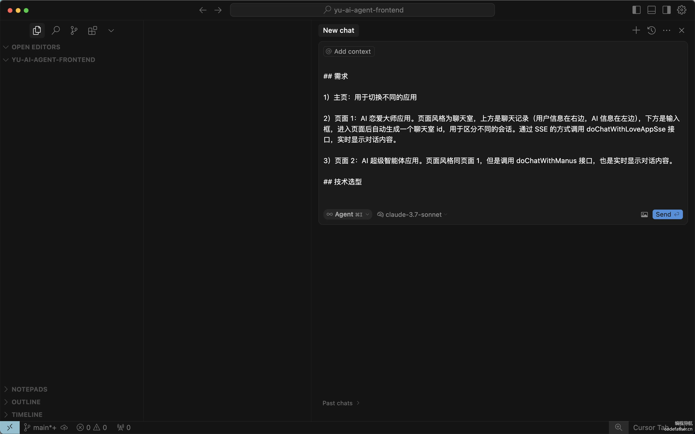

AI 会创⁠建项目、安装依赖、‌生成代码，我们只需​一路点击下一步即可‎：

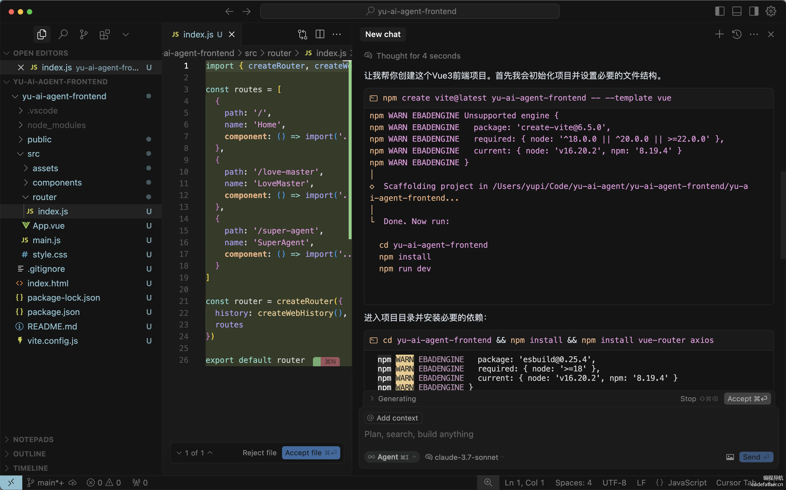

注意，如果⁠ AI 在我们创建的‌目录下又生成了一个子​目录，也没有关系，等‎代码生成完我们手动整‌体移动一下代码位置即可。

2）生成完代码后，打开终端执行 `npm run dev` 命令启动项目：

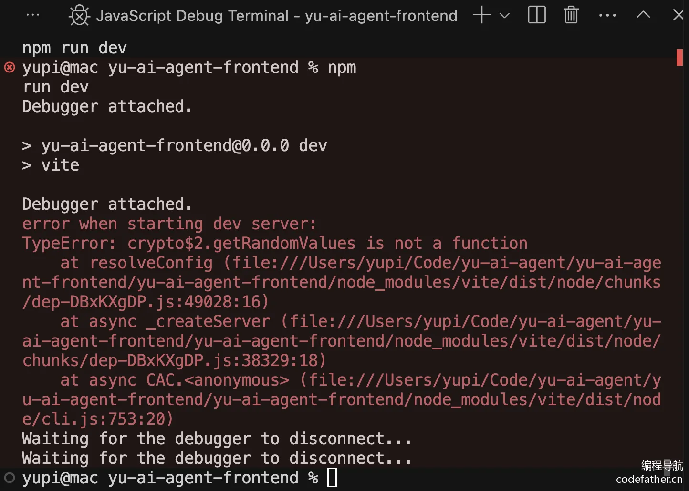

如果遇到报⁠错也没关系，可以选‌中错误信息并添加到​聊天中，让 AI ‎帮忙解决问题：

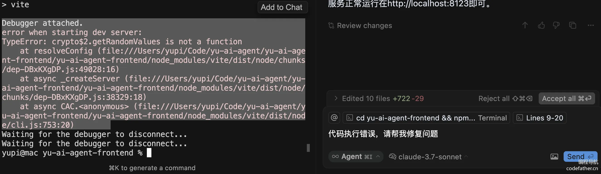

前端项目启动错误常常与 Node.js 版本有关，梁哥遇到的这个问题便是如此，所以要确保你使用的 Node.js 版本与项目兼容。不过 AI 也可以帮忙解决：

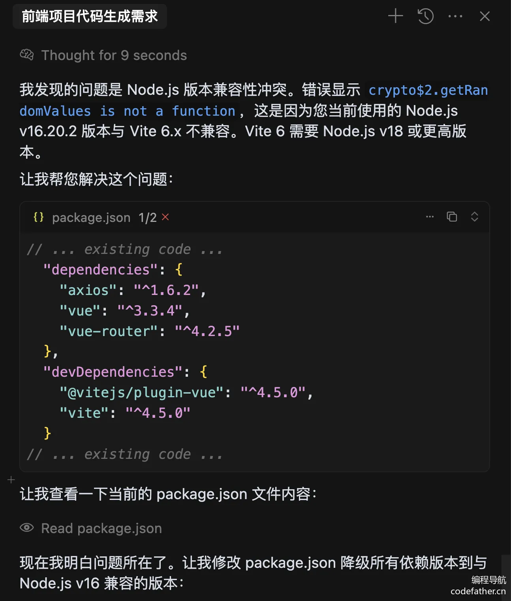

3）经过一⁠番调试，项目成功启‌动之后，点击接受 ​AI 生成的全部代‎码：

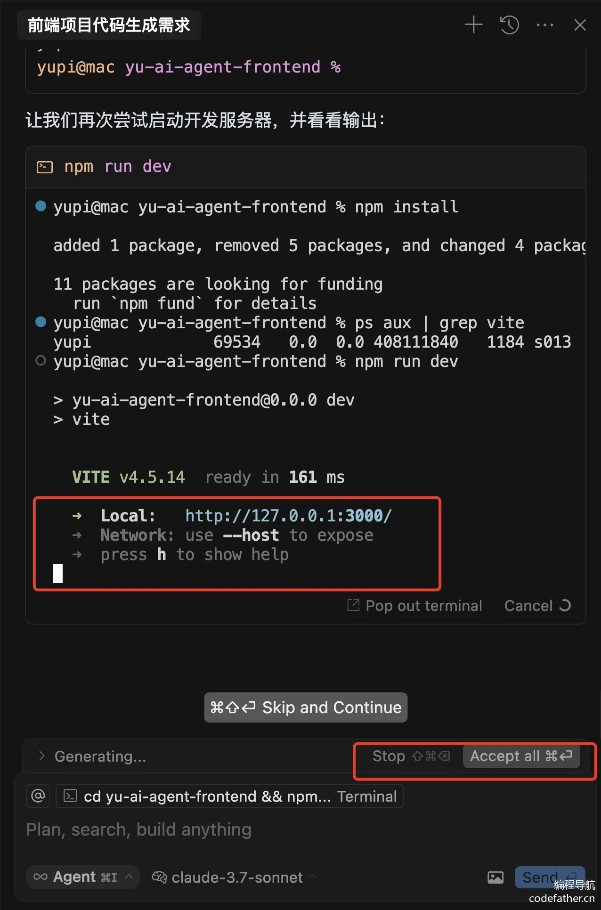

除了源代码外，梁哥这里连项目介绍文档 `README.md` 都生成了，确实很爽！

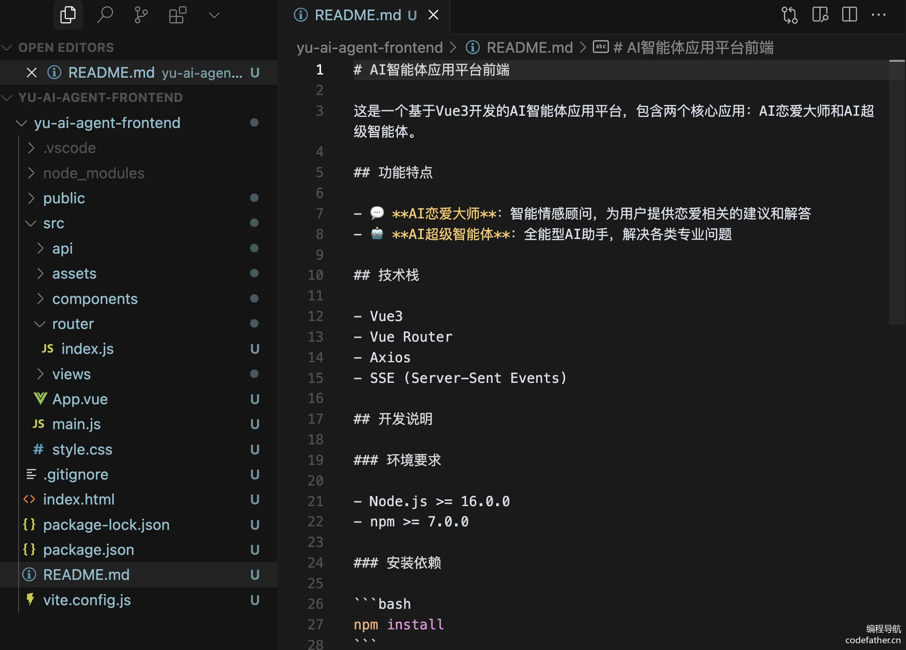

### 测试前端功能

运行前端项目后，首先验证功能是否正常，再验证样式。如果发现功能不可用（比如发送消息后没有回复），可以按 F12 打开浏览器控制台查看错误信息，具体报错信息具体分析。这块就会涉及到一些前端相关的知识了，不懂前端的同学尽量多问 AI。\*\* 如果实在搞不定，也别瞎折腾了！\*\* 用梁哥的代码就好。

比如梁哥遇到的这个报错，是因为没有配置后端跨域：

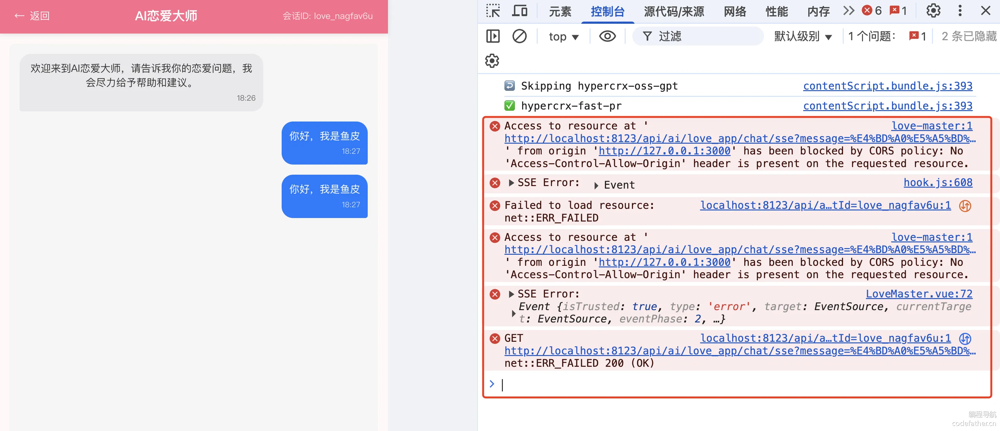

如果你也出⁠现了这个问题，肯定‌是没有认真看教程，​倒回去好好看看吧\~

AI 生成的项⁠目中有 Bug 是很正常的，‌这时我们要尽可能发挥专业性，​给 AI 提供尽可能详细的信‎息，让 AI 帮忙修复问题，‌比如下面这个消息输出错误的问题：

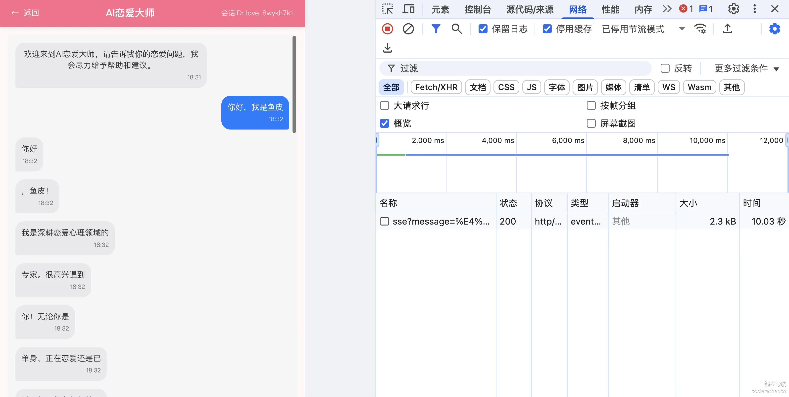

直接跟 AI 讲就行，别跟它客气！

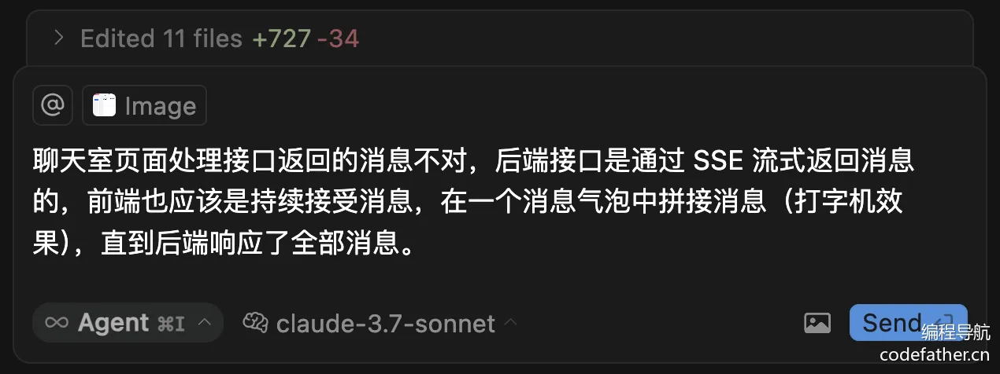

问题修复后，再次验证页面功能是否正常，这次好多了\~

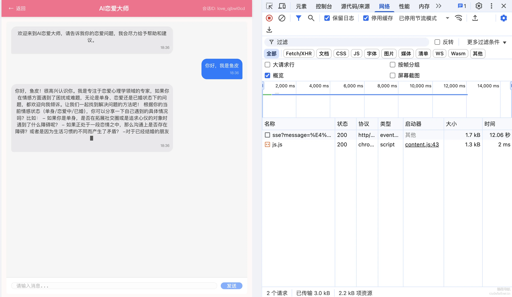

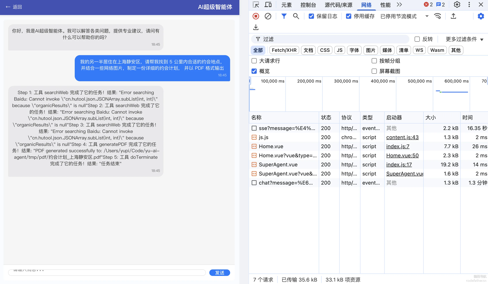

### 优化页面样式

功能验证没问题之后，我们就可以优化页面的样式和细节啦\~ 这个过程中建议多用 Git 版本控制工具来管理代码，**遵循最小改动原则**，每个改动单独进行提问，每次关键改动及时提交，防止代码丢失。

不过如果是⁠项目初期的多个小改‌动，也可以合并在一​起，像梁哥这里就简‎单粗暴，直接把多个‌优化需求一起提！

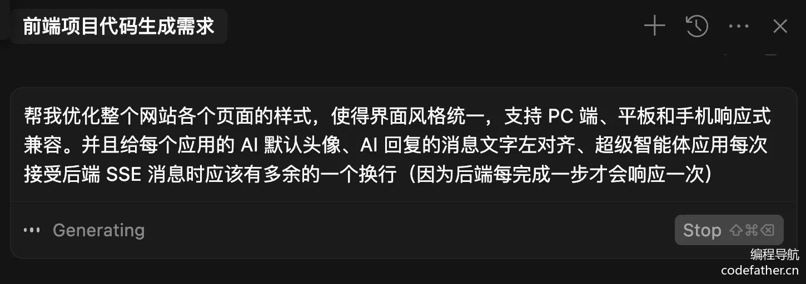

功能和页面样⁠式都没问题后，你还可以‌ “得寸进尺”，让 A​I 帮你进一步优化页面‎，比如优化 SEO、增‌加版权信息、增加监控等。

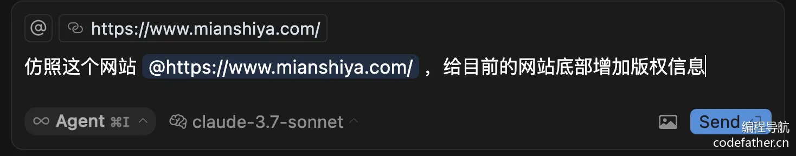

最终运行效果如下，先看看主页，贼拉炫酷：

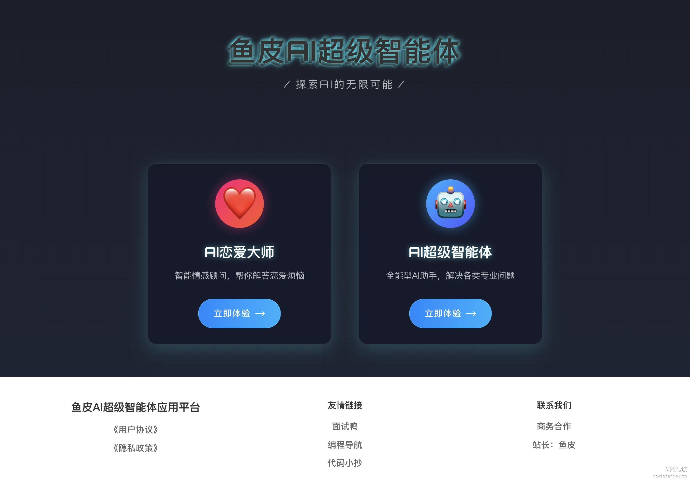

AI 药品智能监管系统页面，初恋的感觉：

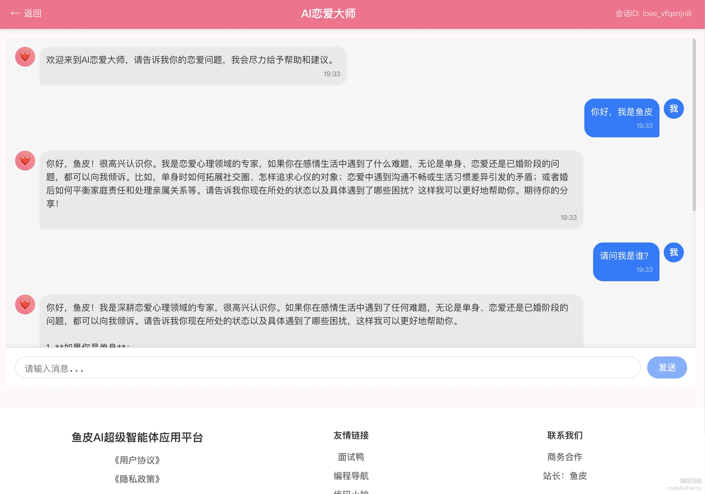

AI 超级智能体对话页面，极客蓝简约风格\~

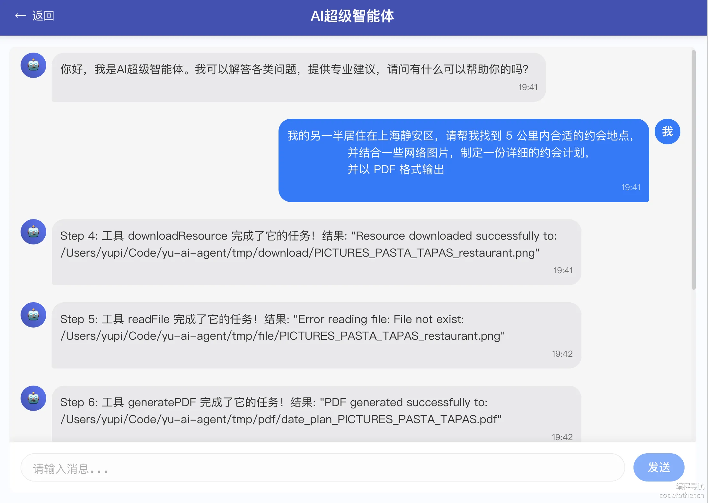

而且还支持响应式，多屏幕尺寸适配\~

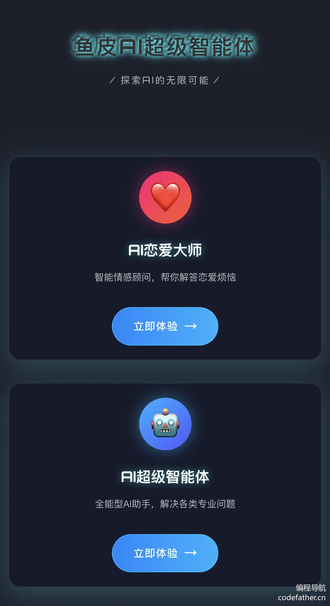

## 四、AI 服务 Serverless 部署

### 什么是 Serverless？

在本项目教程中，我们曾经⁠提到过部署 MCP 服务可以使用 Server‌less。使用 Serverless 平台，开​发者只需关注业务代码的编写，无需管理服务器等基‎础设施，系统会根据实际使用量自动扩容并按使用付‌费，从而显著降低运维成本和开发复杂度。

因此，Serv⁠erless 很适合业务规模‌不确定的、流量波动大的场景，​也很适合我们学习时快速部署一‎些小型项目，不用买服务器、不‌用的时候就停掉，可谓多快好省。

有很多不错的 Serverless 服务平台，比如 [微信云托管](https://cloud.weixin.qq.com/cloudrun)、[腾讯云 serverless 容器服务](https://cloud.tencent.com/product/tkeserverless)、[腾讯云托管](https://cloud.tencent.com/product/tcbr)、[阿里云 serverless](https://serverless.aliyun.com/)、[Railway](https://railway.com/) 等，我们只需要把自己的项目打包成 Docker 容器镜像（理解为安装包），就能快速在平台上启动和扩缩容了。

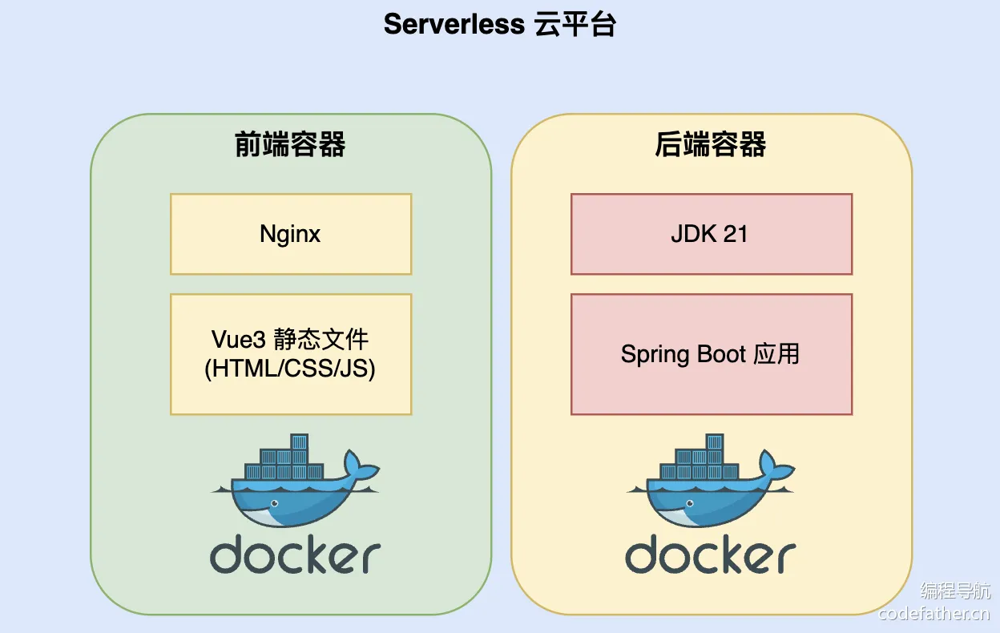

这里我们就以⁠国内的、使用比较方便的微‌信云托管平台为例，给大家​演示如何使用 Serve‎rless 平台来快速部‌署本项目的后端和前端。

💡 之前梁哥已经给大家分享了很多种快速上线项目的方法，可以看 [这篇文章](https://www.codefather.cn/post/1808578179510697986) 学习。此外，编程导航的 [代码生成器共享平台项目](https://www.codefather.cn/course/1790980795074654209)、[AI 答题应用平台项目](https://www.codefather.cn/course/1790274408835506178)、[智能面试刷题项目](https://www.codefather.cn/course/1826803928691945473)、[智能协同云图库项目](https://www.codefather.cn/course/1864210260732116994) 都有从 0 到 1 的上线视频教程，可以学习。

### 后端部署

无论是什么⁠ Serverle‌ss 平台，部署项​目的方法基本都是‎一致的。

#### 1、编写生产环境配置文件

可以复制原有配置文件并在此基础上进行修改，得到 `application-prod.yml`，注意开源时不要将这个文件提交到代码仓库，除非脱敏。

这里建议可⁠以临时注释掉 MC‌P 相关配置，这样​就省去了多部署一个‎ jar 包的麻烦‌：

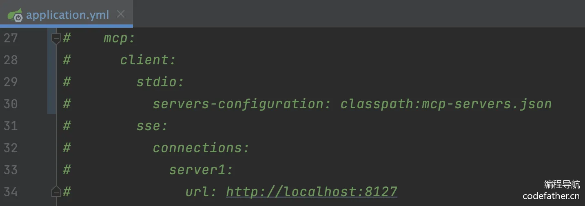

#### 2、构建 Docker 容器镜像

我们需要编⁠写 Dockerf‌ile，将后端项目​打包为 Docke‎r 容器镜像。

Dockerf⁠ile 是一个文本配置文件‌，包含一系列指令，用于自动​化构建 Docker 容‎器镜像。我们需要在 Dock‌erfile 中定义：

-   基础环境（比如预装 JDK 的 Linux 系统）
-   有哪些原始文件？（比如项目源代码）
-   如何构建项目？（比如 maven package 命令打包）
-   如何启动项目？（比如 java -jar 命令）

这里我们有⁠ 2 种编写 Do‌ckerfile ​的方式，各有优缺点‎：

1）运行时打包⁠。只把源代码复‌制到 Docker​ 工作空间中，在构‎造镜像时执行 Mave‌n 打包。

Dockerfile 代码如下：

    FROM maven:3.9-amazoncorretto-21
    WORKDIR /app

    COPY pom.xml .
    COPY src ./src

    RUN mvn clean package -DskipTests

    EXPOSE 8123

    CMD ["java", "-jar", "/app/target/yu-ai-agent-0.0.1-SNAPSHOT.jar", "--spring.profiles.active=prod"]

不会自己写⁠ Dockerfi‌le 也完全没关系​，可以用 AI 生‎成或者找其他开源项‌目的文件即可，比如：

-   [梁哥的 AI 答题应用平台后端 Dockerfile](https://github.com/liliang/yudada/blob/master/yudada-backend/Dockerfile)
-   [梁哥的 AI 答题应用平台前端 Dockerfile](https://github.com/liliang/yudada/blob/master/yudada-frontend/Dockerfile)

2）预打包⁠。提前在自己的电脑上把 jar ‌包构建好，直接把得到的 ta​rget 目录下的 jar ‎包复制到 Docker 工作‌空间中，无需在构造镜像时打包。

Dockerfile 代码如下：

    FROM openjdk:21-slim

    WORKDIR /app

    COPY target/yu-ai-agent-0.0.1-SNAPSHOT.jar app.jar

    EXPOSE 8123

    CMD ["java", "-jar", "app.jar", "--spring.profiles.active=prod"]

显然，第一种方式的优点是更加⁠自动化，不用每次部署项目都手动打 jar 包，减少人工部‌署的成本和误差；但缺点是每次构建镜像时都要拉取 Mave​n 依赖，耗时更长。梁哥建议大家优先选择第一种方式，如果‎ Serverless 平台在构建镜像的过程中耗时过长、‌或者无法拉取依赖，那么再选择第二种方式。

💡 小知识：我们可能在 Java 后端项目中看到 Maven Wrapper 相关的文件（.mvn 目录和 mvnw/mvnw.cmd 文件），它们的作用是让项目能在没有预装 Maven 的环境中构建，确保构建的一致性。

-   mvnw 是 Unix/Linux/macOS 系统的 shell 脚本，mvnw.cmd 是 Windows 系统的批处理脚本。这些脚本会自动下载和使用指定版本的 Maven，无需手动安装。
-   .mvn 目录包含 Maven Wrapper 的配置和 JAR 文件，maven-wrapper.properties 指定使用的 Maven 版本，maven-wrapper.jar 用于下载指定 Maven 版本的程序。

#### 3、使用平台部署容器

1）进入云托管平台，先创建环境，然后新建服务：

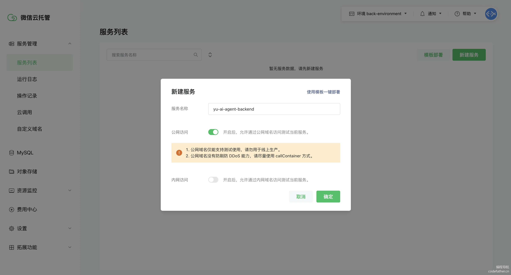

2）上传代码

如果代码已开源，可以选择⁠开源项目仓库上传代码。对于我们的项目，目前先以‌压缩包的方式上传。进入我们的项目根目录，选择后​端需要的文件打成压缩包（包含源代码和 Dock‎erfile 等文件），然后上传即可。注意修改‌端口号为自己后端项目运行的端口：

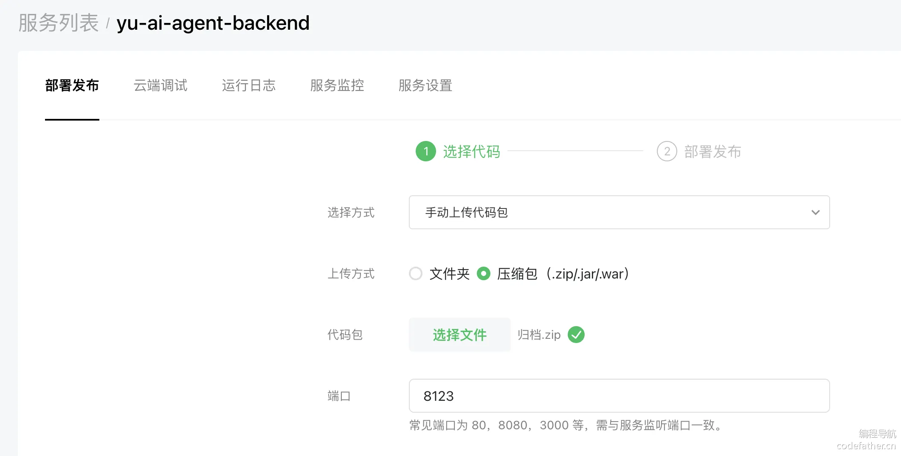

高级设置一般不用修改，包含 Dockerfile 即可：

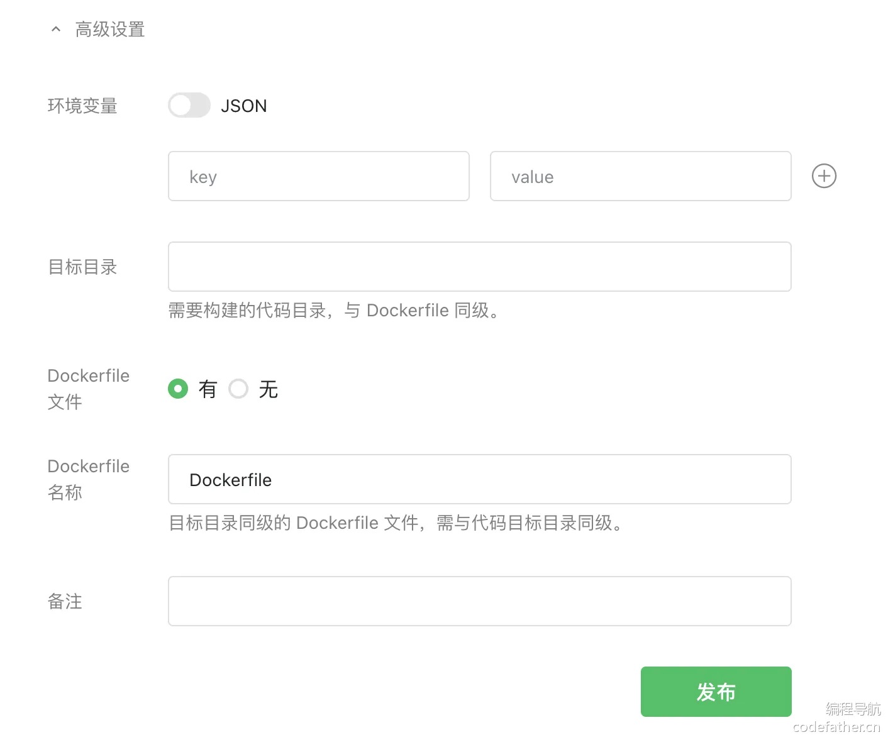

3）点击发布后，等待部署即可。

由于需要安装 Maven 依赖，部署过程可能会比较慢：

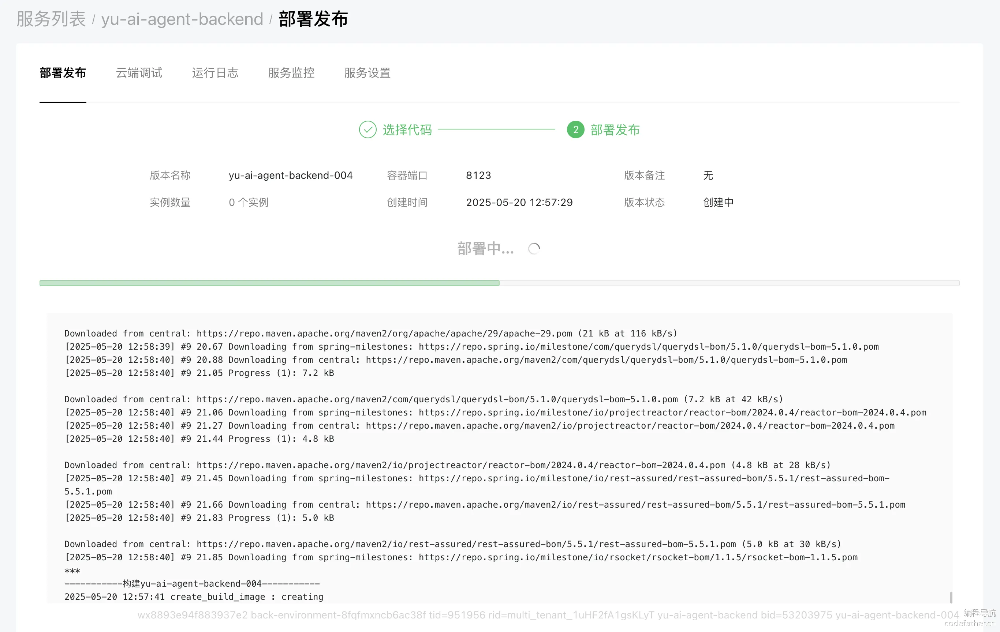

\*\* 如果部署失败，一定要认真查看日志来解决问题！\*\* 不仅仅是部署日志，还可以查看运行日志，有时可能你的 Dockerfile 是正确的，但是项目本身就无法启动，导致部署失败！

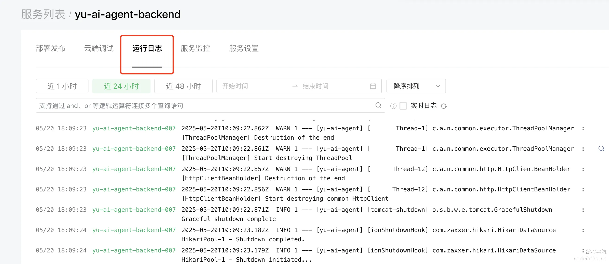

💡 建议⁠本地有 Docke‌r 环境的同学先尝​试本地构建镜像，成‎功后再发布到 Se‌rverless 平台。

4）部署完⁠成后，可以在服务设‌置中获取到公网地址​，这个地址就是让前‎端调用的地址。

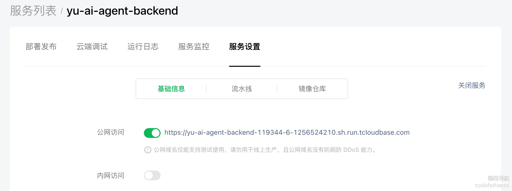

不过这只是⁠云托管平台提供给我‌们的默认域名，建议​有自己域名的同学绑‎定自己的自定义域名‌：

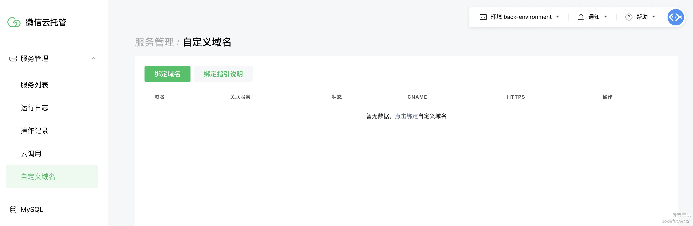

访问公网地址的接口文档，应该能够顺利调通接口：

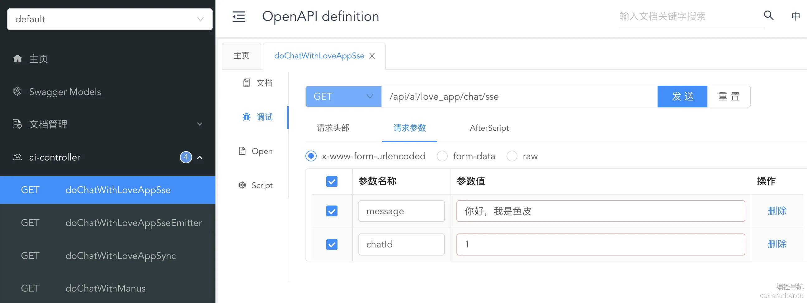

### 前端部署

前端部署可以使用专门的前端 Serverless 平台，比如 [Vercel](https://vercel.com/)、[腾讯云 Web 应用托管](https://cloud.tencent.com/document/product/1450) 等，这些平台往往能够自动识别出项目使用的前端框架和运行方式，无需打包 Docker 镜像，部署成本更低。

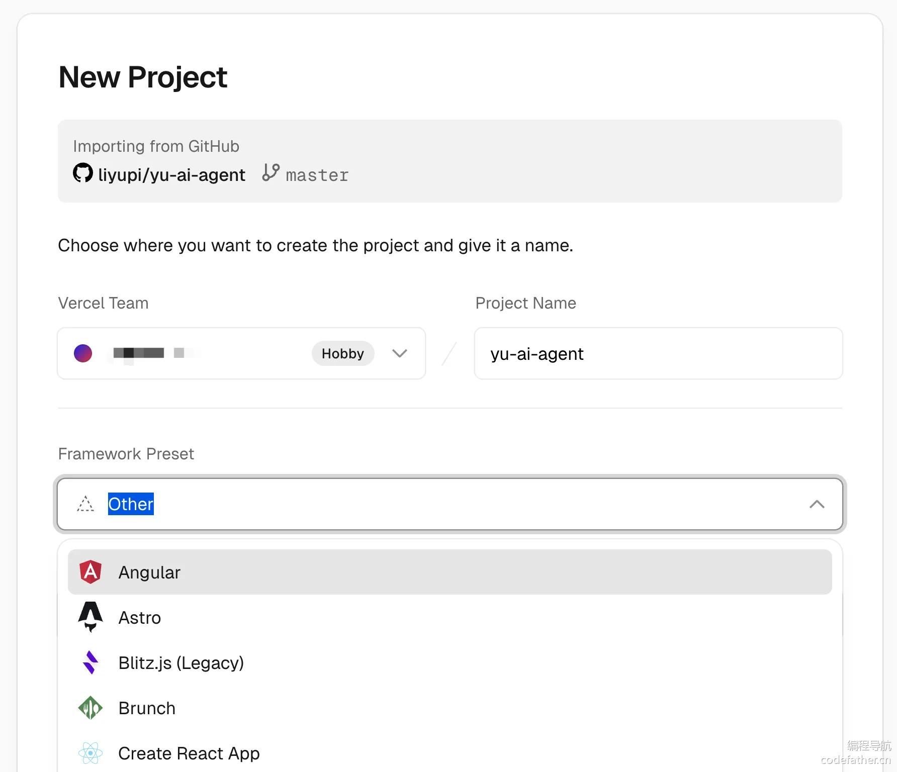

感兴趣的同⁠学可以尝试一下，完全‌傻瓜式操作，下面我们​继续用云托管平台来演‎示如何使用 Dock‌er 部署前端项目。

#### 1、部署规划

我们需要在容器中添加 Nginx 来提供网站资源的访问能力；并且为了解决跨域问题，可以采用 Nginx 配置反向代理，将前端请求中的 `/api` 路径自动转发到后端地址。在 [编程导航](https://www.codefather.cn/) 的很多项目中，都讲过这种部署方式，这也是解决跨域问题的常用手段。

举个例子，前端地址：[https://www.codefather.cn，后端地址：https://mianshiya.com](https://www.codefather.cn%EF%BC%8C%E5%90%8E%E7%AB%AF%E5%9C%B0%E5%9D%80%EF%BC%9Ahttps://mianshiya.com)

本来会出现跨域，我们可以配置反向代理，前端还是请求 [https://www.codefather.cn/api/xxx，通过](https://www.codefather.cn/api/xxx%EF%BC%8C%E9%80%9A%E8%BF%87) Nginx 转发到 <https://mianshiya.com/api/xxx>

#### 2、前端生产环境配置

需要修改前端代码中的请求地址（一般在 `api/index.js` 文件内）：

    const API_BASE_URL = process.env.NODE_ENV === 'production' 
     ? '/api' 
     : 'http://localhost:8123/api' 

在前端项目中，`process.env.NODE_ENV` 环境变量会在运行或打包时自动设置，无需手动配置。

-   执行 npm run dev 命令，值为 development
-   执行 npm run build 命令，值为 production

#### 3、编写 Nginx 配置

在前端项目目录下新建 `nginx.conf` 文件，填写下列配置，包括静态资源访问和反向代理配置。

注意把 `proxy_pass` 和 `proxy_set_header` 改成你的后端地址！`proxy_pass` 地址要包含 `/api/`，`proxy_set_header` 只需要包含域名（不需要 http 前缀）即可，千万别搞错了！

    server {
        listen       80;
        server_name  localhost;

​        
        root   /usr/share/nginx/html;

​        
        location / {
            index  index.html index.htm;
            try_files $uri $uri/ /index.html;
        }

​        
        location ^~ /api/ {
            
            proxy_pass https://yu-ai-agent-backend-119344-6-1256524210.sh.run.tcloudbase.com/api/;

​            
            proxy_set_header Host yu-ai-agent-backend-119344-6-1256524210.sh.run.tcloudbase.com;
            proxy_set_header X-Real-IP $remote_addr;
            proxy_set_header X-Forwarded-For $proxy_add_x_forwarded_for;
            proxy_set_header X-Forwarded-Proto $scheme;

​            
            proxy_set_header Connection ""; 
            proxy_http_version 1.1;
            proxy_buffering off;
            proxy_cache off;
            chunked_transfer_encoding off;
            proxy_read_timeout 600s;

​            
            proxy_intercept_errors off;
        }

​        
        location ~* \.(js|css|png|jpg|jpeg|gif|ico|svg|woff|woff2|ttf|eot)$ {
            expires 1y;
            access_log off;
            add_header Cache-Control "public";
        }

​        
        error_page   500 502 503 504  /50x.html;
        location = /50x.html {
            root   /usr/share/nginx/html;
        }
    }

其实上述代⁠码也是梁哥用 AI‌ 生成的，这种配置​一般不用自己写，能看‎懂即可。

#### 4、构建 Docker 容器镜像

编写前端 ⁠Dockerfil‌e 文件，定义了打​包构建和 Ngin‎x 配置的流程：

    FROM node:20-alpine AS build
    WORKDIR /app
    COPY . .
    RUN npm install
    RUN npm run build

    FROM nginx:alpine
    
    COPY --from=build /app/dist /usr/share/nginx/html
    
    COPY nginx.conf /etc/nginx/conf.d/default.conf
    
    EXPOSE 80
    
    CMD ["nginx", "-g", "daemon off;"]

此外，为了打包方便，可以创建 `.dockerignore` 文件忽略不必要的文件，防止 Docker 将 `node_modules` 等部署时用不到的文件拷贝到工作空间。

    # 依赖目录
    node_modules
    npm-debug.log
    yarn-debug.log
    yarn-error.log
    
    # 编译输出
    /dist
    /build
    
    # 本地环境文件
    .env
    .env.local
    .env.development.local
    .env.test.local
    .env.production.local
    
    # 编辑器目录和配置
    /.idea
    /.vscode
    *.suo
    *.ntvs*
    *.njsproj
    *.sln
    *.sw?
    
    # 操作系统文件
    .DS_Store
    Thumbs.db
    
    # 测试覆盖率报告
    /coverage
    
    # 缓存
    .npm
    .eslintcache
    
    # 日志
    logs
    *.log

#### 5、使用平台部署容器

1）在云托管平台创建前端项目：

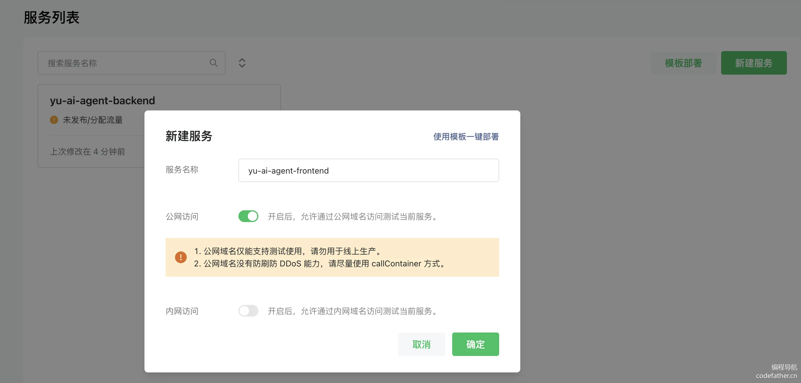

2）打包上传前端代码，注意不需要把 `node_modules` 等无用文件添加到压缩包中。端口选择 80（Nginx 的默认端口）：

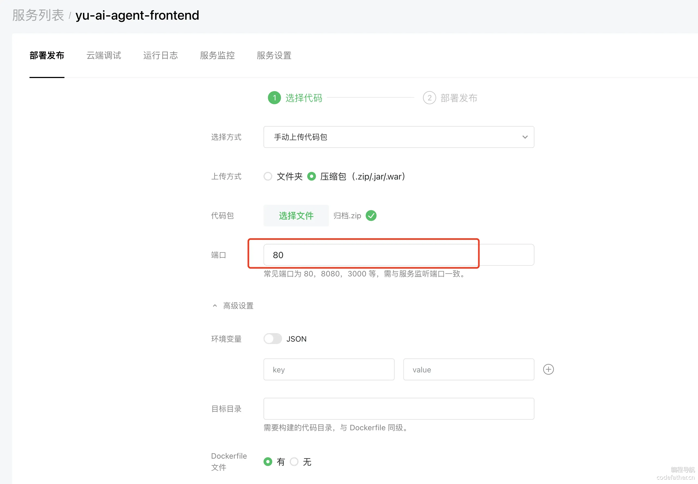

3）点击发布，然后等待部署：

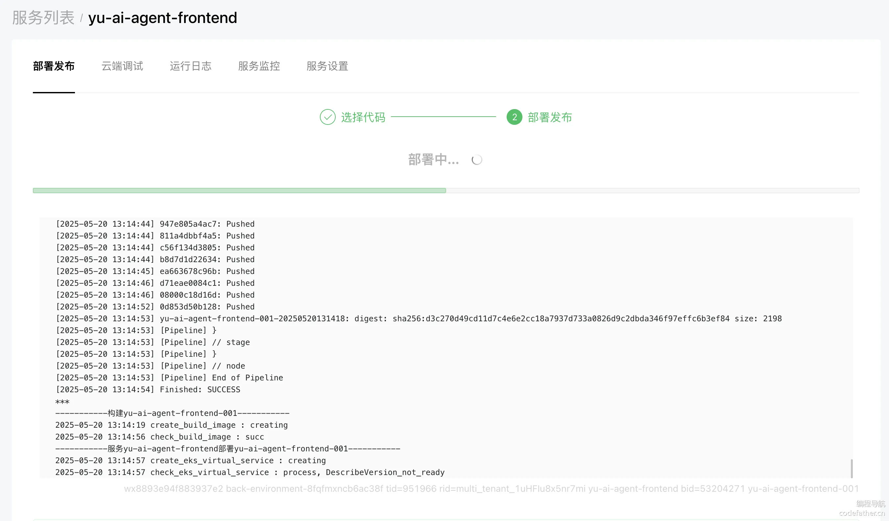

4）部署成功后，查看效果即可：

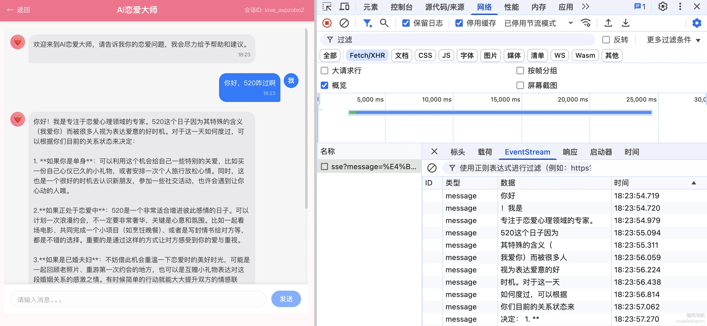

注意，因为⁠使用了反向代理，请‌求会通过当前网页的​前端域名转发，这样‎就不会出现跨域问题‌\~

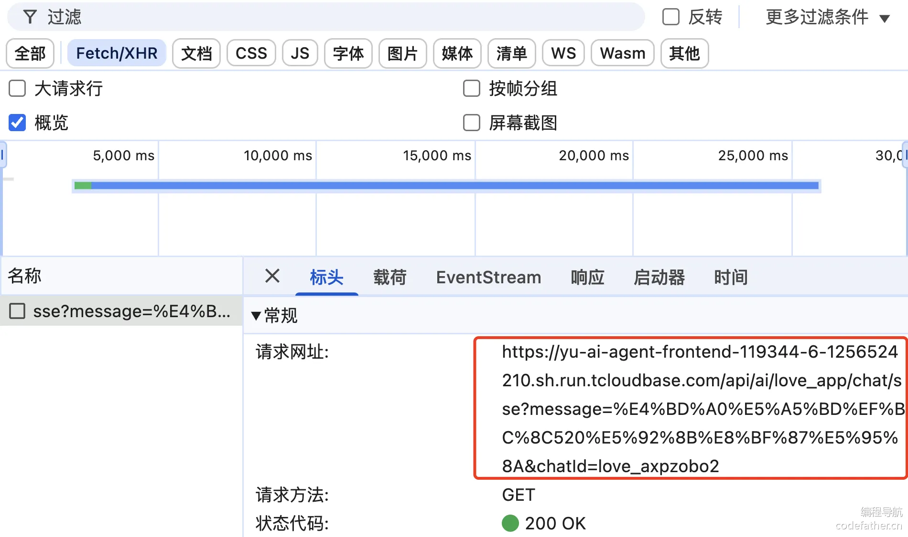

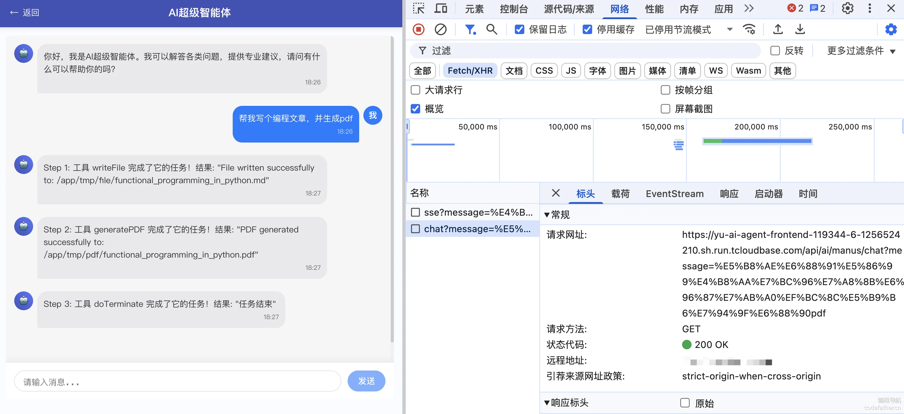

至此，我们的项⁠目前后端都部署完成了，建议把‌实例副本数的最小值调整为 0​，这样在项目没有访问量的时候‎就会自动缩容，减少扣费。不用‌的服务也记得及时删除掉。

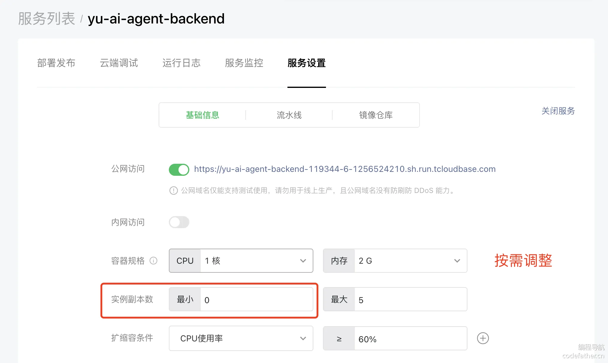

## 五、扩展思路

1）利用所学后端知识完善整个项目，比如封装接口响应值（BaseResponse）和异常处理机制，提高项目健壮性。不会做的同学可以参考梁哥在 [编程导航的智能协同云图库项目](https://www.codefather.cn/course/1864210260732116994)。

2）提高 API 接口的安全性，有 2 种方式：

1.  增加用户登录功能，只允许登录用户调用 AI 服务
2.  增加 API Key 调用机制，支持按照 API Key 计费，允许第三方应用接入。可以参考梁哥在 [编程导航的 API 开放平台项目](https://www.codefather.cn/course/1790979723916521474)。

3）将 AI 超级智能体的推理任务异步化，并且通过数据库记录任务状态，从而提高系统响应速度和可观测性。可以参考梁哥在 [编程导航的智能 BI 平台项目](https://www.codefather.cn/course/1790980531403927553)。

4）优化各个提供给 AI 的工具的健壮性，比如增加重试机制（使用 [Guava Retrying 库](https://github.com/rholder/guava-retrying)）

5）支持手⁠动停止 AI 回‌复。需要前端发送停止​命令，后端配合中断‎ SSE 输出。

6）优化前⁠端智能体输出内容的‌展示效果，比如区分​思考和回答的样式、‎优化每一个步骤的展‌示效果，让用户体验更好。

现在后端其⁠实已经把思考内容作‌为日志打印出来了，​只要通过 SSE ‎返回给前端即可：

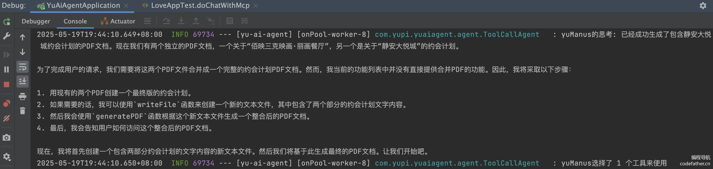

## 本节作业

1.  完成 AI 服务的 SSE 接口开发，理解 SSEEmiter 的用法
2.  使用 AI 生成前端代码并进行调试优化
3.  将项目部署到 Serverless 平台，理解 Serverless 和 Docker 的作用
4.  实现扩展思路中的至少一个功能

## 结语

通过本节学习，⁠大家已经掌握了如何将 AI ‌能力服务化的核心技术。这些技​能不仅适用于本项目，也是构建‎任何 AI 服务的基础，也是‌前后端程序员必须掌握的部署能力。

至此，本项目就⁠完结了，梁哥已经把自己学到‌的 AI 知识尽心尽力地分​享给了大家，希望能够学‎以致用。如果想要继续深入学习 ‌AI 开发，可以通过以下途径：

-   各大 AI 模型提供商的官方文档（比如 [anthropic 官方文档](https://docs.anthropic.com/en/docs/overview)）
-   AI 云服务平台的技术文档（比如 [百炼官方文档](https://bailian.console.aliyun.com/?tab=doc#/doc)）
-   优质 AI 博主的博客和教程（比如 [程序员梁哥](https://github.com/liliang)，大家可以微信搜索程序员梁哥，梁哥的公众号会第一时间给大家分享热门 AI 动态和干货）
-   [梁哥开源的 AI 知识库](https://github.com/liliang/ai-guide)，里面有很多值得学习的 AI 干货，持续更新\~

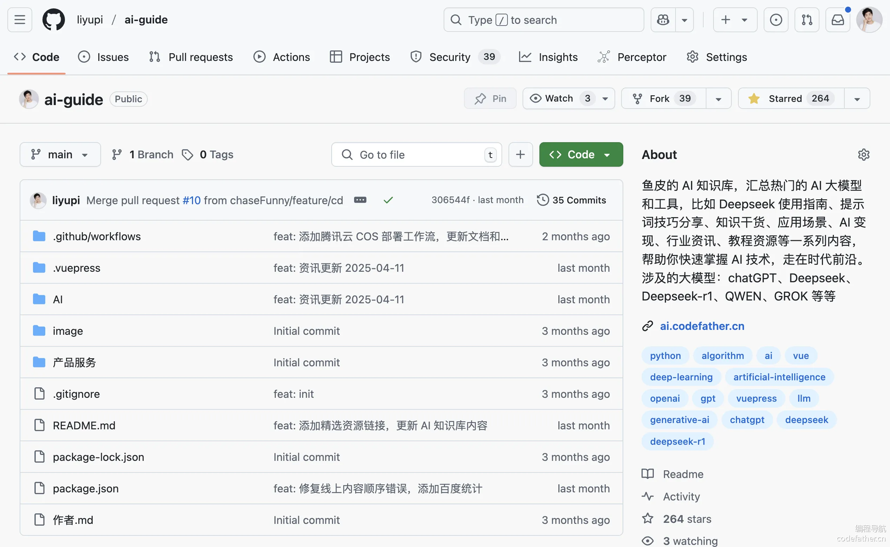

当然，在咱们 [编程导航](https://www.codefather.cn/) 也能获取到很多 AI 相关的知识，学编程的同学们都在这里交流讨论；在 [面试鸭](https://www.mianshiya.com/) 也能获取到大量企业常问的 AI 面试题，也很适合补充知识。

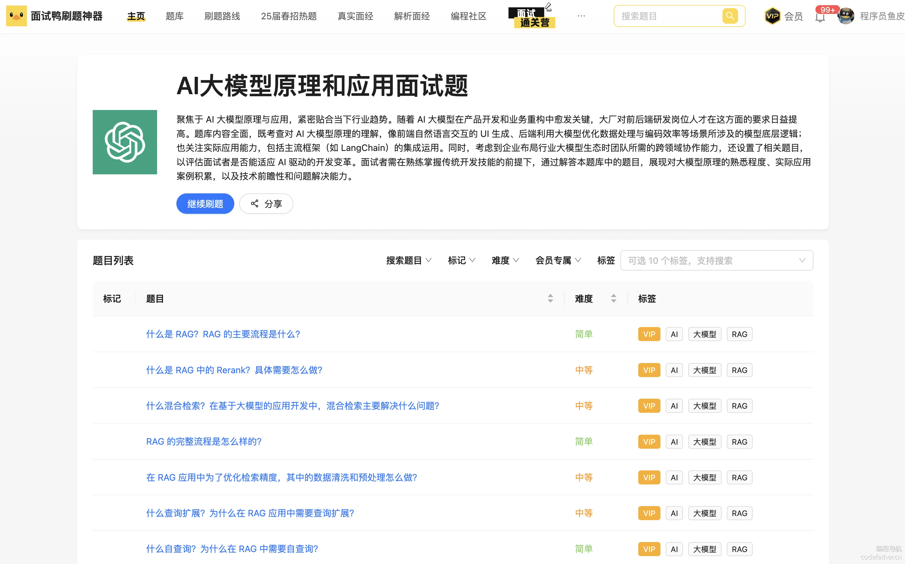

最后，希望大家学完本项目后⁠，不仅仅是学完了 1 个项目，而是掌握了 AI 应用‌开发技能。你只需要把本项目教程中的 “AI 药品智能监管系统​应用” 的提示词、知识库等相关内容进行略微的修改，就‎能得到各种各样有趣实用的应用，比如 “AI 编程大师‌”，简历就能直接跟其他同学拉开区分度！

全文完

本文由 [简悦 SimpRead](http://ksria.com/simpread) 转码，用以提升阅读体验，[原文地址](https://www.codefather.cn/course/1915010091721236482/section/1925506761184067586?type=#heading-1)

